## Target

1. 能够说出事件监听三要素
2. 能够说出常见的鼠标键盘失去和获取焦点事件
3. 能够说出什么是事件对象, 以及书写的位置
4. 能够说出什么是环境对象, 以及this指向粗略的规则
5. 能够说出什么是回调函数, 并说出回调函数的常见使用场景
6. 能够完成今日案例- tab栏切换案例

💡🚀🤟👉👇☀️🍉🍍🍇🍓🥕🍭🎖️🎁☘️🍀💯🔆❗🔥🚩

🚩: 代码

🔥: 重点, 背下来

#### 🚩 Code 01 

```js
// 需求 给每个div修改字体颜色 ? 
const lis = document.querySelectorAll('.item')
// lis[0].classList.add('active')
console.log(lis)
for (let i = 0; i < lis.length; i++) {
  // 改变字体颜色
  lis[i].style.color = 'red'
  // 修改内容
  lis[i].innerHTML = 'wahha'
}

// querySelectorAll 获取到的是一堆，返回的是伪书组， 不能直接使用。
// 要修改元素的样式或内容， 需要用下标取出元素。

// querySelector 获取到的就是一个DOM对象（元素）， 可以直接使用
```


## 1. 事件监听

### 1.1 基本简介

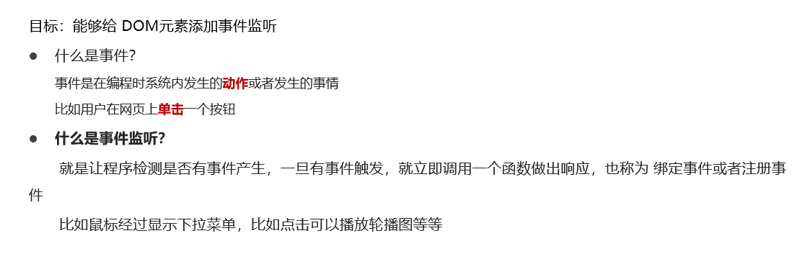

### 1.2 语法

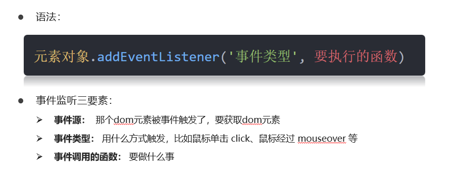

### 1.3 举例

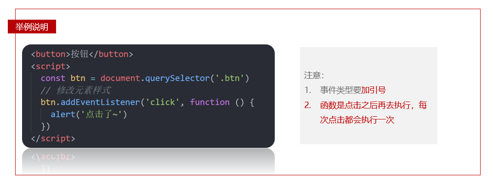

### 1.4 总结

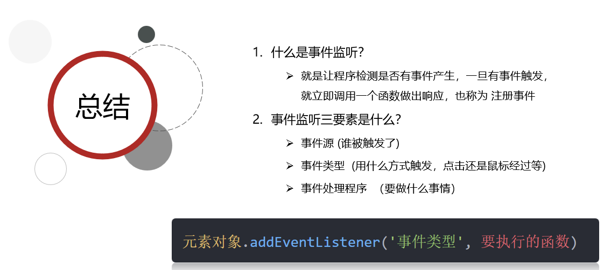

### 1.5 练习

#### 🚩 Code 02 

```js
// 需求： 点击了按钮，弹出一个对话框
// 1. 事件源   按钮  
// 2. 事件类型 点击鼠标   click 字符串
// 3. 事件处理程序 弹出对话框
const btn = document.querySelector('button')
btn.addEventListener('click', function () {
  alert('早上好呀~吃早饭了吗')
})
```

#### 🚩 Code 03 

```js
// 需求：点击关闭按钮， 关闭父盒子
// 核心：利用样式的显示和隐藏完成， display:none 隐藏元素 display:block 显示元素 
// 1. 获取事件源
const closeBtn = document.querySelector('.box1')
//  关闭的是大盒子
const box = document.querySelector('.box')
// 2. 事件侦听
closeBtn.addEventListener('click', function () {
  box.style.display = 'none'
})
```

#### 🚩 Code 04 

> 随机点名案例

```js
// 随机点名案例
// 数据
const arr = ['马超', '黄忠', '赵云', '关羽', '张飞']

// 1.开始按钮模块
const person = document.querySelector('.qs')
// 1.1 获取开始按钮对象
const start = document.querySelector('.start')
// 1.2 添加点击事件
start.addEventListener('click', function () {
    // 随机下标
    const i = parseInt(Math.random() * arr.length)
    console.log(arr[i])
    person.innerHTML = arr[i]
})
    
```

```js
// 数据
const arr = ['马超', '黄忠', '赵云', '关羽', '张飞']
// 定时器的全局变量
let timerId = 0  // todo 02
let i = 0 // 随机下标要全局

// 1.开始按钮模块
const person = document.querySelector('.qs')
// 1.1 获取开始按钮对象
const start = document.querySelector('.start')
// 1.2 添加点击事件
start.addEventListener('click', function () {
   
   timerId = setInterval(function(){
        // 随机下标
        i = parseInt(Math.random() * arr.length)
        console.log(arr[i])
        person.innerHTML = arr[i]
    }, 30)

    // 如果数组只有一个值, 还需要抽取嘛? 让两个按钮禁用 // todo 02 
    if (arr.length === 1) {
        // start.disabled = true
        // end.disabled = true
        start.disabled = end.disabled = true
        clearInterval(timerId)
    }
})

// 2. 关闭按钮模块
const end = document.querySelector('.end')
end.addEventListener('click', function () {
  clearInterval(timerId)
  // 结束了，可以删除掉当前抽取的那个数组元素 // todo 01 
  arr.splice(i, 1)
  console.log(arr)
})

// Bug 左边点击多次, 就停止不了了. 知道就好了哈..暂时不忙解决
```

#### 🚩 Code 05 

```js
// 疑问: 在这个函数里面, 每次点击, 多次声明num 不会报错嘛? 
// const num = 10 
const btn = document.querySelector('button')
btn.addEventListener('click', function () {
 
  // 不会的, 这个function函数中的变量, 执行完后不再使用了, 会销毁掉(垃圾回收)
  const num = Math.random()
  console.log(num)
})
// 点击之后, 函数执行完, 变量没有再使用, 当做垃圾回收掉
// 之后再点击, 又会创建新的num变量
```

#### 🚩 **Code 06**  

> 事件监听方法

```js
const btn = document.querySelector('button')
// old版本:on --> 缺陷: 给同一个元素,绑定同一个事件, 后一个会覆盖前一个
btn.onclick = function () {
  console.log(1111)
}
btn.onclick = function () {
  console.log(2222)
}
// 像
// let num = 10
// num = 20   因为采取赋值的形式

// new版本 : addEventListener() 同一个元素可以绑定多次相同事件, 依次执行
btn.addEventListener('click', function () {
  console.log(1111)
})
btn.addEventListener('click', function () {
  console.log(2222)
})
```

## 2. 事件类型

### 2.1 常见事件类型

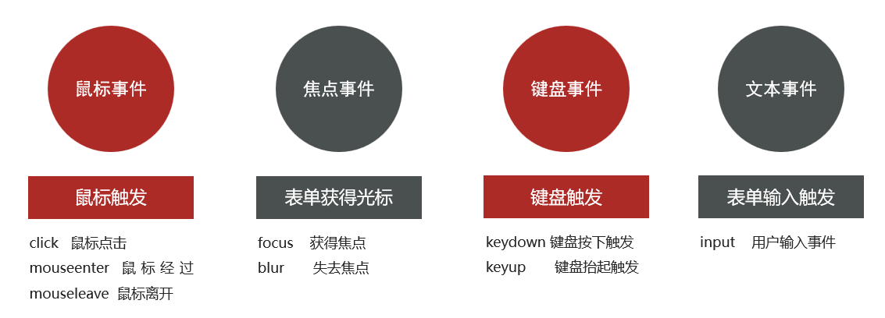

- 鼠标经过 / 离开 ,  没有事件冒泡
  - mouseenter / mouseleave
- 鼠标离开 / 离开 , 有事件冒泡
  - mouseover / mouseout

#### 🚩 Code 07 

> 鼠标经过 mouseenter  /  鼠标离开  mouseleave

```js
// 07 事件类型
const div = document.querySelector('div')
// 鼠标经过
div.addEventListener('mouseenter', function () {
  console.log(`轻轻的我来了`)
})
// 鼠标离开
div.addEventListener('mouseleave', function () {
  console.log(`轻轻的我走了`)
})
```

### 2.2 Eg. 轮播图点击切换

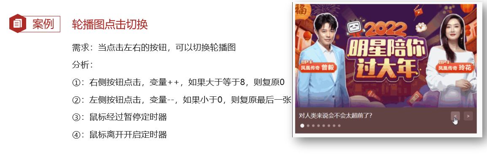

 

```js
// 初始数据
const data = [
    { url: './images/slider01.jpg', title: '对人类来说会不会太超前了？', color: 'rgb(100, 67, 68)' },
    { url: './images/slider02.jpg', title: '开启剑与雪的黑暗传说！', color: 'rgb(43, 35, 26)' },
    { url: './images/slider03.jpg', title: '真正的jo厨出现了！', color: 'rgb(36, 31, 33)' },
    { url: './images/slider04.jpg', title: '李玉刚：让世界通过B站看到东方大国文化', color: 'rgb(139, 98, 66)' },
    { url: './images/slider05.jpg', title: '快来分享你的寒假日常吧~', color: 'rgb(67, 90, 92)' },
    { url: './images/slider06.jpg', title: '哔哩哔哩小年YEAH', color: 'rgb(166, 131, 143)' },
    { url: './images/slider07.jpg', title: '一站式解决你的电脑配置问题！！！', color: 'rgb(53, 29, 25)' },
    { url: './images/slider08.jpg', title: '谁不想和小猫咪贴贴呢！', color: 'rgb(99, 72, 114)' },
]
```

#### 🚩 Code 08 

```js
// 获取元素
const img = document.querySelector('.slider-wrapper img')
const p = document.querySelector('.slider-footer p')
const footer = document.querySelector('.slider-footer')
// 1. 右侧按钮业务
// 1.1 获取右侧按钮 
const next = document.querySelector('.next')
let i = 0  // 信号量 控制播放图片张数
// 1.2 注册点击事件

next.addEventListener('click', function () {
  // console.log(11)
  i++
  // 1.6判断条件  如果大于8 就复原为 0
  // if (i >= 8) {
  //   i = 0
  // }
  i = i >= data.length ? 0 : i
  // 1.3 得到对应的对象
  // console.log(data[i])
  // 调用函数
  toggle()
})

// 2. 左侧按钮业务
// 2.1 获取左侧按钮 
const prev = document.querySelector('.prev')
// 1.2 注册点击事件
prev.addEventListener('click', function () {
  i--
  // 判断条件  如果小于0  则爬到最后一张图片索引号是 7
  // if (i < 0) {
  //   i = 7
  // }
  i = i < 0 ? data.length - 1 : i
  // 1.3 得到对应的对象
  // console.log(data[i])
  // 调用函数
  toggle()
})

// 声明一个渲染的函数作为复用
function toggle() {
  // 1.4 渲染对应的数据
  img.src = data[i].url
  p.innerHTML = data[i].title
  footer.style.backgroundColor = data[i].color
  // 1.5 更换小圆点    先移除原来的类名， 当前li再添加 这个 类名
  document.querySelector('.slider-indicator .active').classList.remove('active')
  document.querySelector(`.slider-indicator li:nth-child(${i + 1})`).classList.add('active')
}


// 3. 自动播放模块
let timerId = setInterval(function () {
  // 利用js自动调用点击事件  click()  一定加小括号调用函数
  next.click()
}, 1000)


// 4. 鼠标经过大盒子，停止定时器
const slider = document.querySelector('.slider')
// 注册事件
slider.addEventListener('mouseenter', function () {
  // 停止定时器
  clearInterval(timerId)
})

// 5. 鼠标离开大盒子，开启定时器
// 注册事件
slider.addEventListener('mouseleave', function () {
  // 停止定时器
  clearInterval(timerId)
  // 开启定时器
  timerId = setInterval(function () {
    // 利用js自动调用点击事件  click()  一定加小括号调用函数
    next.click()
  }, 1000)
})
```

### 2.3 表单焦点事件

#### 🚩 Code 09 

> 获取焦点 focus  / 失去焦点 blur

```js
const input = document.querySelector('input')
input.addEventListener('focus', function () {
  console.log('有焦点触发')
})
input.addEventListener('blur', function () {
  console.log('失去焦点触发')
})
```

#### 🚩 Code 10

> 小米搜索框

```js
// 1. 获取元素
const input = document.querySelector('[type=search]') // 属性选择器
const ul = document.querySelector('.result-list')
// console.log(input)
// 2. 监听事件 获得焦点
input.addEventListener('focus', function () {
  // ul显示
  ul.style.display = 'block'
  // 添加一个带有颜色边框的类名
  input.classList.add('search')
})
// 3. 监听事件 失去焦点
input.addEventListener('blur', function () {
  ul.style.display = 'none'
  input.classList.remove('search')
})
```

### 2.4 键盘事件

#### 🚩 Code 11

```js
const input = document.querySelector('input')
// 1. 键盘事件
// input.addEventListener('keydown', function () {
//   console.log('键盘按下了')
// })
// input.addEventListener('keyup', function () {
//   console.log('键盘谈起了')
// })
// 2. 用户输入文本事件  input
// 只要用户输入内容就会触发
input.addEventListener('input', function () {
  console.log(input.value)
})
```

### 2.5 Eg. 评论字数统计

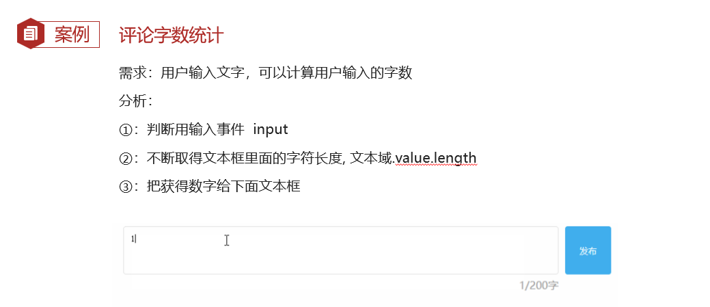

```js
// 看一下就好了
input {
    width: 200px;
    transition: all .3s;
}
/* focus伪类选择器  获得焦点 */
input:focus {
    width: 300px;
} 
// height: 40px;   height: 80px;
```

#### 🚩 Code 13 

```js
const tx = document.querySelector('#tx')
const total = document.querySelector('.total')
// 1. 当我们文本域获得了焦点，就让 total 显示出来
tx.addEventListener('focus', function () {
  total.style.opacity = 1
})
// 2. 当我们文本域失去了焦点，就让 total 隐藏出来
tx.addEventListener('blur', function () {
  total.style.opacity = 0
})
// 3. 检测用户输入
tx.addEventListener('input', function () {
  // console.log(tx.value.length)  得到输入的长度
  total.innerHTML = `${tx.value.length}/200字`
})

// const str = 'skyblue'  // 字符串是有长度的
// console.log(str.length)
```


## 3. 事件对象

### 3.1 基本概念

> 当事件发生的时候, 和这个事件相关的所有信息, 都存在这个对象中. 这个对象就叫做事件对象

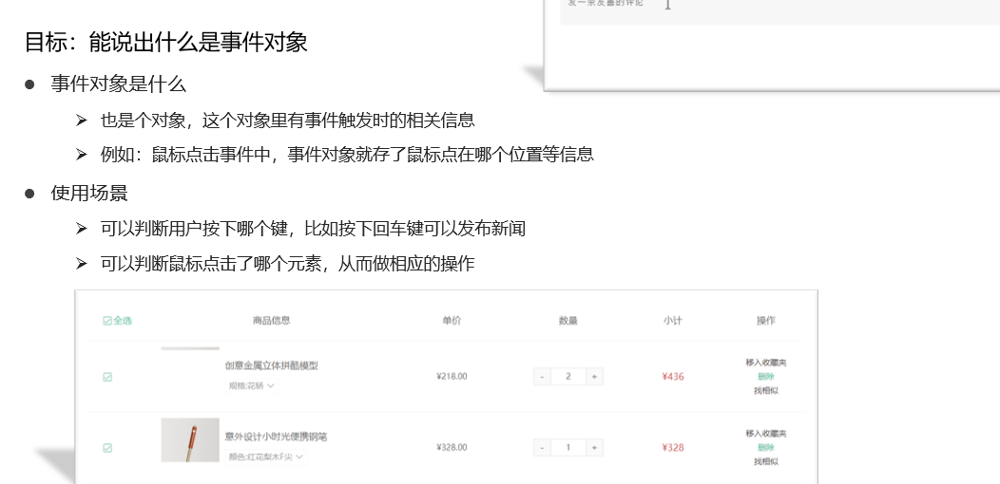

### 3.2 语法

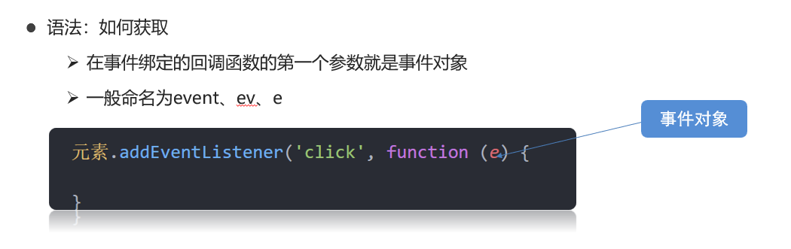

### 3.3 小结

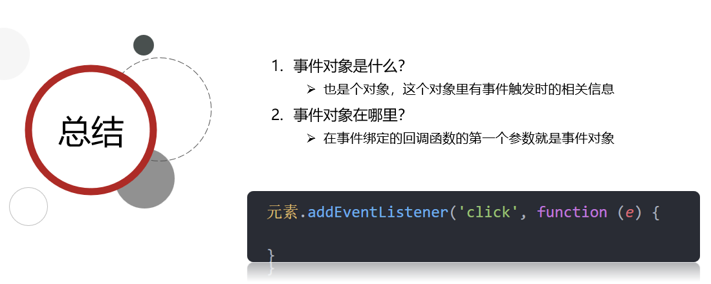

###  3.4 事件对象常用属性

- **e.type**  当前的事件类型
-  **e.key**  用户按下了哪个键

#### 🚩 Code 14 

```js
// const btn = document.querySelector('button')
// btn.addEventListener('click', function (e) {
//   console.log(e)
// })

const input = document.querySelector('input')
input.addEventListener('keyup', function (e) {
  // console.log(11)
  // console.log(e.key)
  if (e.key === 'Enter') {
    console.log('我按下了回车键')
  }
})
```

#### 3.5 Eg. 评论回车发布

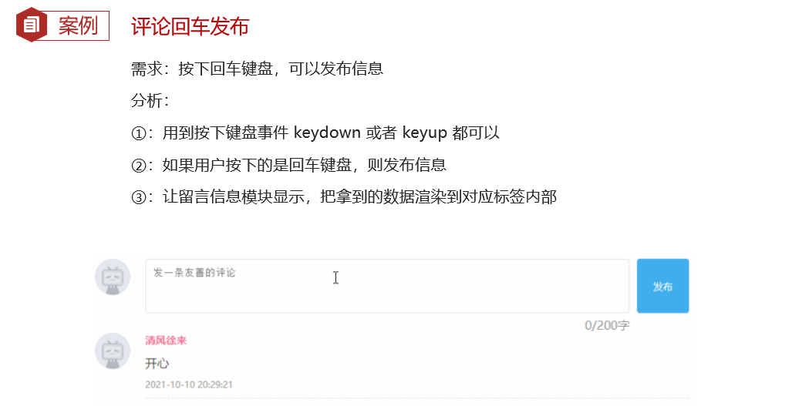

#### 🚩 Code 15 

```js
const tx = document.querySelector('#tx')
const total = document.querySelector('.total')
const item = document.querySelector('.item') // new
const text = document.querySelector('.text')  // new
// 1. 当我们文本域获得了焦点，就让 total 显示出来
tx.addEventListener('focus', function () {
  total.style.opacity = 1
})
// 2. 当我们文本域失去了焦点，就让 total 隐藏出来
tx.addEventListener('blur', function () {
  total.style.opacity = 0
})
// 3. 检测用户输入
tx.addEventListener('input', function () {
  // console.log(tx.value.length)  得到输入的长度
  total.innerHTML = `${tx.value.length}/200字`
})
//=================================== new Code
// 4. 按下回车发布评论
tx.addEventListener('keyup', function (e) {
  // 只有按下的是回车键，才会触发
  // console.log(e.key)
  if (e.key === 'Enter') {
    // 如果用户输入的不为空就显示和打印
    if (tx.value.trim()) {
      // console.log(11)
      item.style.display = 'block'
      // console.log(tx.value)  // 用户输入的内容
      text.innerHTML = tx.value

    }
    // 等我们按下回车，结束，清空文本域
    tx.value = ''
    // 按下回车之后，就要把 字符统计 复原
    total.innerHTML = '0/200字'
  }
})
```

#### 🚩 Code 16

> trim（）方法

```js
const str = '          im a teacher  '
// console.log(str.trim())  // 去除字符串左右的空格
```

## 4. 环境对象

### 4.1 简介

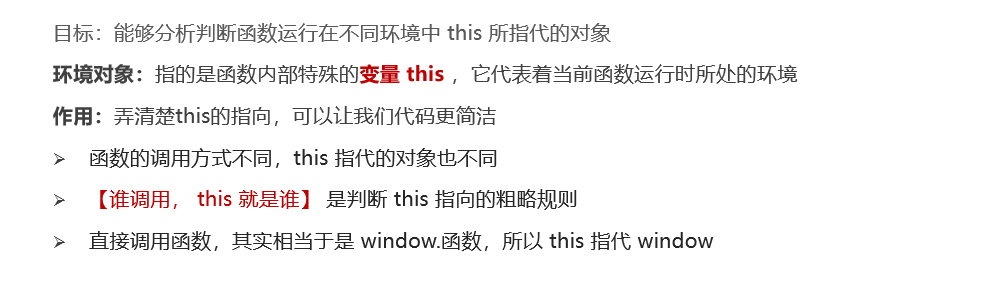

#### 🚩 Code 17 

```js
// 每个函数里面都有this 环境对象  
// function fn() {
//   console.log(this)
// }
// window.fn()  普通函数里面this指向的是window

const btn = document.querySelector('button')
btn.addEventListener('click', function () {
  // console.log(this)  // btn 对象
  // btn.style.color = 'red'
  this.style.color = 'red'
})
```

### 4.2 小结

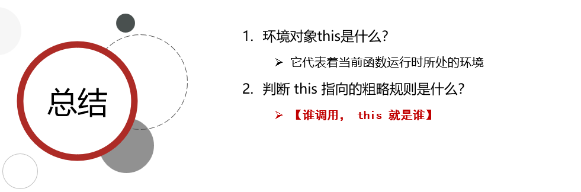

## 5. 回调函数

### 5.1 简介

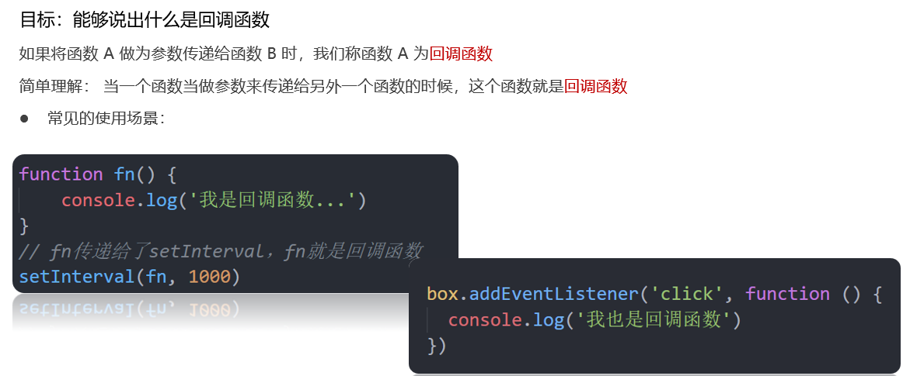

> 回调函数：回头再调用的函数。

#### 🚩 Code 17 

```js
// 回调函数： 作为函数的参数，一开始不执行，回头再调用的函数。 
// 本质 ： 就是函数，只是作为函数的参数来使用
// 应用场景

// 1. 定时器  callback， 简写cb
const callback = function(){
  console.log('我是回调函数')
}
setInterval(callback, 1000)

// 2. 事件监听
const btn = document.querySelector('button')
btn.addEventListener('click', callback)
```


### 5.2 小结

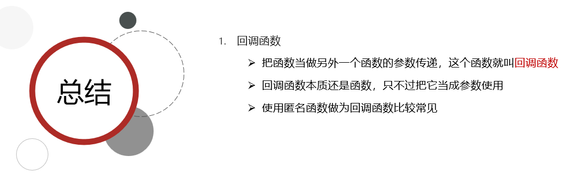

## 6. Eg. Tab栏切换

### 6.1 效果展示

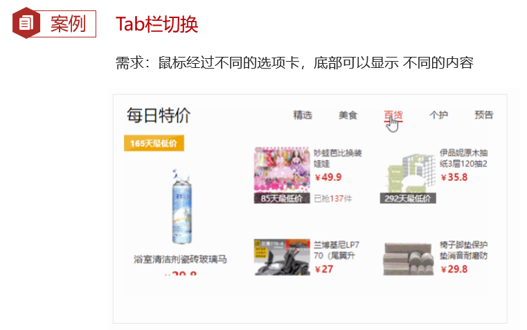

### 6.2 思路步骤

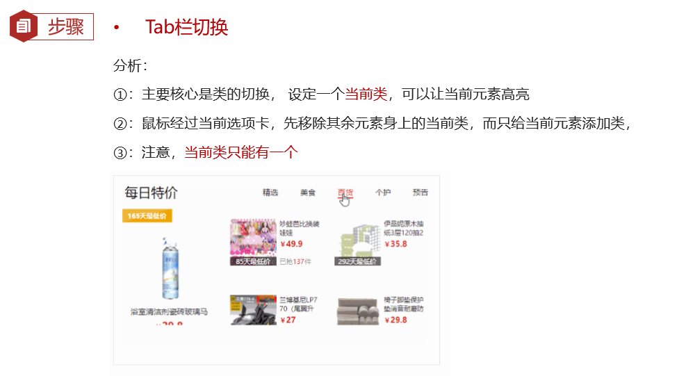

#### 🚩 Code 18

```js
// 1. a 模块制作 要给 5个链接绑定鼠标经过事件
// 1.1 获取 a 元素 
const as = document.querySelectorAll('.tab-nav a')
// console.log(as) 
for (let i = 0; i < as.length; i++) {
  // console.log(as[i])
  // 要给 5个链接绑定鼠标经过事件
  as[i].addEventListener('mouseenter', function () {
    // console.log('鼠标经过')
    // 排他思想  
    // 干掉别人 移除类active
    document.querySelector('.tab-nav .active').classList.remove('active')
    // 我登基 我添加类 active  this 当前的那个 a 
    this.classList.add('active')

    // 下面5个大盒子 一一对应  .item 
    // 干掉别人
    document.querySelector('.tab-content .active').classList.remove('active')
    // 对应序号的那个 item 显示 添加 active 类
    document.querySelector(`.tab-content .item:nth-child(${i + 1})`).classList.add('active')

  })
}
```

