## Target

1. 能过利用setTimeout完æˆ5秒钟之å自动关闭的广告案例
2. 能够利用location.href完æˆ5秒钟跳转页é¢æ¡ˆä¾‹
3. 能够写出localstorageçš„å­˜ã€å–ã€åˆ é™¤çš„代ç 
4. 能够说出localstorage对å¤æ‚æ•°æ®ç±»å‹å­˜å‚¨å’Œè·å–的转æ¢ä»£ç 
5. 能够使用map映射方法，并说出里é¢å‚æ•°çš„å«ä¹‰
6. 能够跟éšè¯¾å ‚代ç å®Œæˆæœ¬åœ°å­˜å‚¨ç‰ˆæœ¬çš„学生信æ¯è¡¨æ¡ˆä¾‹

💡🚀🤟👉👇☀ï¸ğŸ‰ğŸğŸ‡ğŸ“🥕ğŸ­ğŸ–ï¸ğŸâ˜˜ï¸ğŸ€ğŸ’¯ğŸ”†â—🔥🚩

## 1. window对象

### 1. BOM

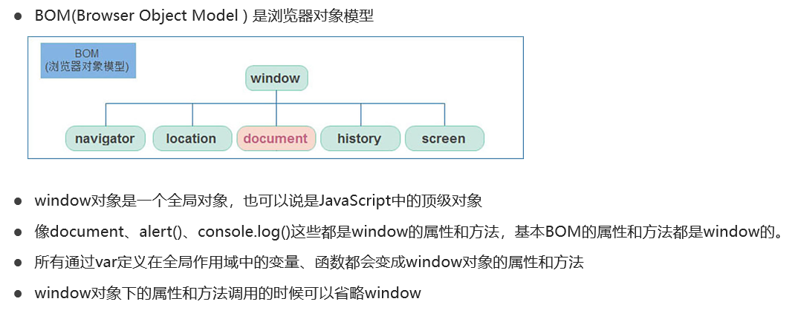

#### 🚩 Code 01 

```js
// BOM browser object model æµè§ˆå™¨å¯¹è±¡æ¨¡å‹
// window是æµè§ˆå™¨çš„顶级对象, Node中顶级对象是global
// document.querySelector()
// window.document.querySelector()
console.log(document === window.document)

// 在全局作用域中, 用var声æ˜çš„å˜é‡ï¼Œä¼šæˆä¸ºwindowçš„å±æ€§
// console.log(window)
var num = 10;
console.log(num);
console.log(window.num);
// const let  ä¸ä¼š!

// 全局作用域中的声æ˜çš„函数æˆä¸ºwindow对象的方法
function fn() {
    console.log(11);
}
fn();
window.fn()
// 定时器 setTimeout() / setInterval() 也是window对象的方法
```


### 2. 定时器-setTimeout 

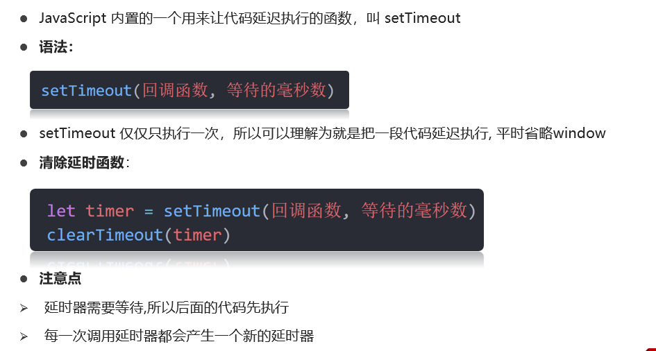

#### 2.1 setTimeout/setInterval

- setTimeout  åªæ‰§è¡Œä¸€æ¬¡
- setInterval æ¯éš”一段时间就执行一次, 除é手动清除.

####  🚩 Code 02 

```js
// 1.ç›´æ¥å†™å‡½æ•°
setTimeout(function(){
  console.log('好好学习,天天å‘上')
}, 3000)

// 2. 写函数å
function fn() {
  console.log('饿了å—')
}
const foo = function () {
  console.log('真的饿了å—')
}
// 写函数å的时候, ä¸å¸¦æ‹¬å·
setTimeout(fn, 3000)
setTimeout(foo, 5000)

// 3.ä¸æ¨è ,  `fn()` , è°å†™è°è¢«é”¤
setTimeout('fn()', 3000)
// 扩展：最å°å»¶æ—¶ >=4ms   MDN
// 在æµè§ˆå™¨ä¸­ï¼ŒsetTimeout()/setInterval() çš„æ¯è°ƒç”¨ä¸€æ¬¡å®šæ—¶å™¨çš„最å°é—´éš”是4ms

// 4. 我们å¯ä»¥ç»™å®šæ—¶å™¨, 加一个å˜é‡æ ‡è®° (当å‰å®šæ—¶å™¨çš„åå­—)
const timer1 = setTimeout(fn, 3000)
const timer2 = setTimeout(foo, 3000)
console.log(timer1)
console.log(timer2)
// number
console.log(typeof timer1)

// 5. 清除定时器 window.clearTimeout(timeoutId)
// windowå¯ä»¥çœç•¥, 传入我们定时器的标记(哪个定时器)

// 让点击的时候清除这个定时器, 在这个延迟事件之å‰, 我们清除它, 它的å›è°ƒå‡½æ•°å°±ä¸ä¼šæ‰§è¡Œäº†
btn.addEventListener('click', function(){
  // 清除哪个定时器,传入哪个定时器的标记
  clearTimeout(timer)
})
```

#### 2.2 Eg. 5så消失的广告

```bash
需求：5秒钟之å，广告自动消失
分æ：
①：设置延时函数
②：éšè—元素
```

#### 🚩 Code 03 

```js
// è·å–元素
const img = document.querySelector('img')
// å¼€å¯å®šæ—¶å™¨, åªæ‰§è¡Œä¸€æ¬¡
setTimeout(function () {
  img.style.display = 'none'
}, 5000)
```

#### 2.3 this指å‘问题

```js
// thisçš„æŒ‡å‘ åœ¨å®šä¹‰çš„æ—¶å€™ä¸èƒ½ç¡®å®š, åªæœ‰æ‰§è¡Œè°ƒç”¨çš„时候æ‰èƒ½ç¡®å®š!

// this指å‘, é¢è¯•é¢˜ 60-80%几ç‡è€ƒ.
// 1. 全局作用域中/ 或者普通函数调用/ æˆ–è€…å®šæ—¶å™¨é‡Œé¢ this æŒ‡å‘ window
// 1.1 全局作用域
console.log(this)

// 1.2 普通函数调用
function fn() {
  console.log(this)
}
fn()
// window.fn() 
// 1.3 定时器中
setTimeout(function(){
  // console.log(this)
}, 1000)
// window.setTimeout()  ,  setInterval() 也是 指å‘window

// 2.1 方法调用中, è°è°ƒç”¨è¿™ä¸ªæ–¹æ³•, this指å‘è°
var obj = {
  name:'å°äº®',
  age:18,
  sayHi:function(){
    console.log(this) // this指å‘的是调用这个方法的对象
  }
}
obj.sayHi() // è°è°ƒç”¨,指å‘è°

// 2.2 事件注册的时候, this指å‘被绑定的元素
var btn = document.querySelector('button')
btn.addEventListener('click', function(e){
  // 指å‘ç»‘å®šçš„è¿™ä¸ªäº‹ä»¶æº  
  // this æŒ‡å‘ btn
  console.log(this)  
  // 指å‘事件绑定的元素
  console.log(e.currentTarget)
})

// 3. æ„造函数中, this 指å‘的是æ„造函数的å®ä¾‹
function Foo(name, age) {
  this.name = name
  this.age = age
  console.log(this) // 这个thisä¸ä¸€å®š
}

// !! this在定义的时候,并ä¸èƒ½ç¡®å®šæŒ‡å‘,åªæœ‰æ‰§è¡Œçš„时候æ‰èƒ½ç¡®å®š

var person1 = new Foo('å°ç‹', 18)
console.log(person1)

var person2 = new Foo('å°çº¢', 19)
console.log(person2)
```


#### 2.4 Question-easy

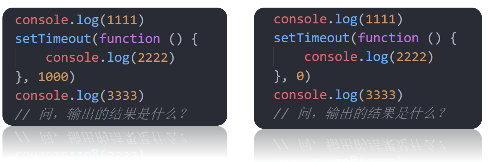

### 3. JS执行机制

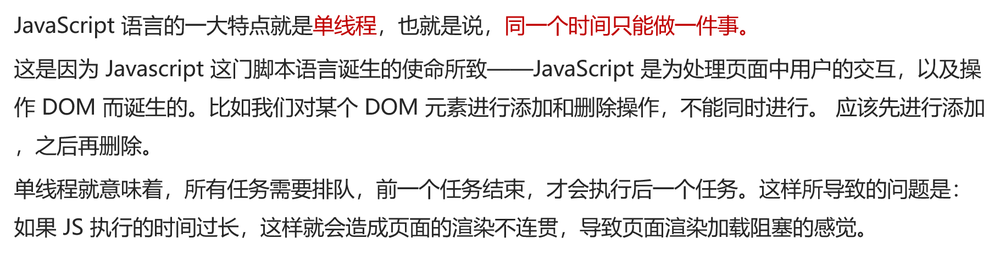


#### 3.1 åŒæ­¥/异步

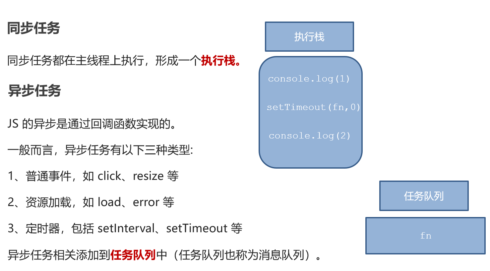

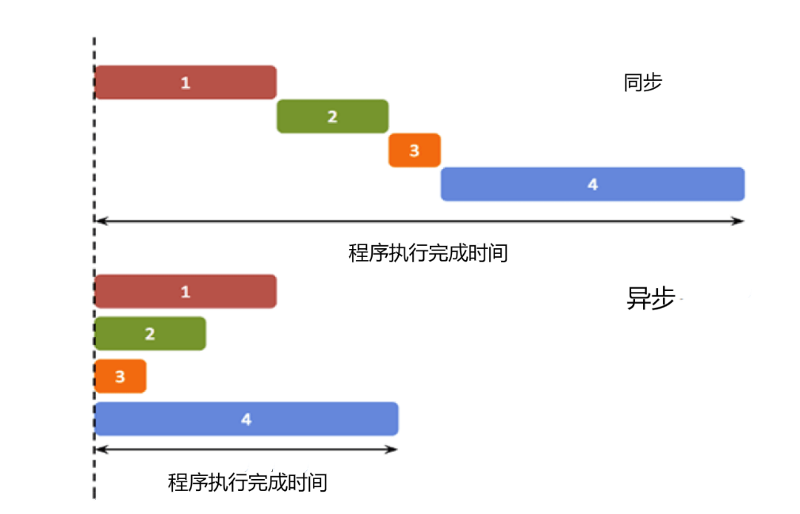

#### 3.2 JS执行机制

#### 🚩 Code 04 

```js
console.log(1)
console.log(2)
setTimeout(function () {
  console.log(3)
}, 0)
console.log(4);
```


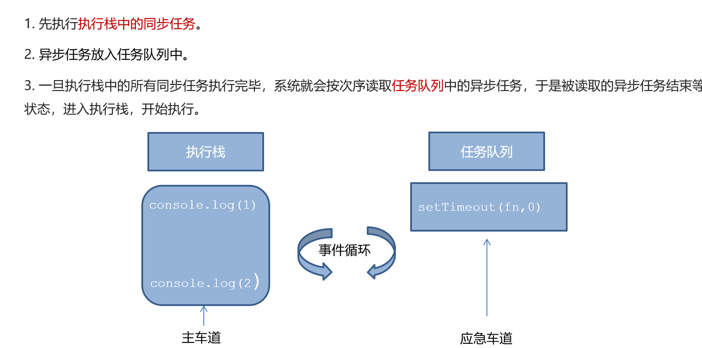

#### 3.3 异步进程

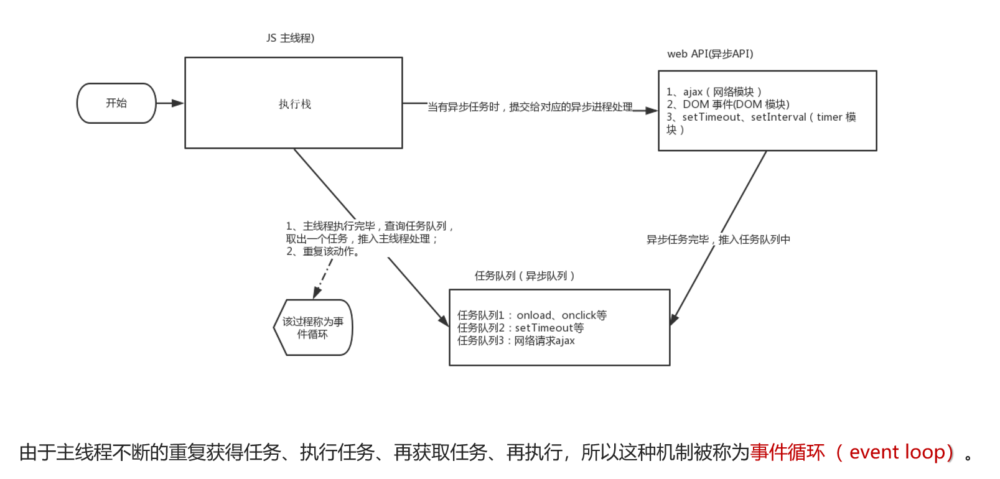

#### 3.4 Eg. æ€è€ƒ

```js
console.log(1)

document.addEventListener('click', function () {
    console.log(4)
})

console.log(2)

setTimeout(function () {
    console.log(3)
}, 3000)
```

### 4. location对象

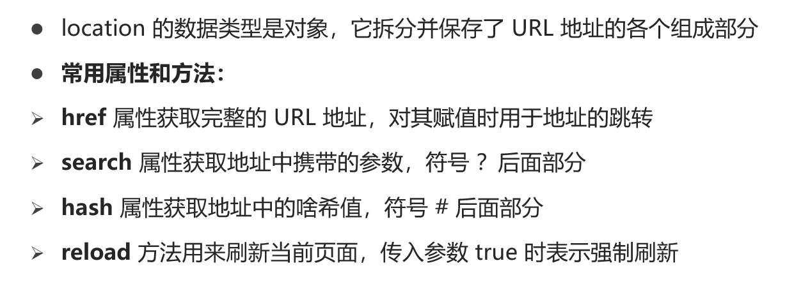

#### 4.1 å±æ€§

##### location.href


#### 🚩 Code 05 

```js
// console.log(window.location)
// console.log(location)
// console.log(location.href)
// 1. location.href ç»å¸¸ç”¨href 利用js的方法å»è·³è½¬é¡µé¢
// location.href = 'http://www.baidu.com'

// 2. location.reload()
const reload = document.querySelector('.reload')
reload.addEventListener('click', function () {
  // f5 刷新页é¢
  // location.reload()
  // 强制刷新  ctrl+f5
  location.reload(true)
})
```


##### 4.2 Eg. 5så跳转页é¢


#### 🚩 Code 06 

```js
// 1. è·å–元素
const a = document.querySelector('a')
// 2.声æ˜å€’计时å˜é‡, å¼€å¯å®šæ—¶å™¨
let num = 5
let timerId = setInterval(function () {
  num--
  a.innerHTML = `支付æˆåŠŸ<span>${num}</span>秒钟之å跳转到首页`
  // 如æœnum === 0 则åœæ­¢å®šæ—¶å™¨ï¼Œå¹¶ä¸”完æˆè·³è½¬åŠŸèƒ½
  if (num === 0) {
    clearInterval(timerId)
    // 4. 跳转  location.href
    location.href = 'http://www.itcast.cn'
  }
}, 1000)
```


##### location.search

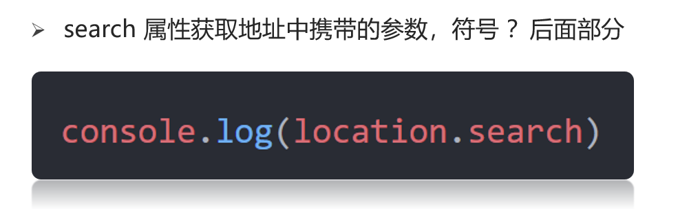

----

##### location.hash


#### 4.2 方法

##### location.reload()

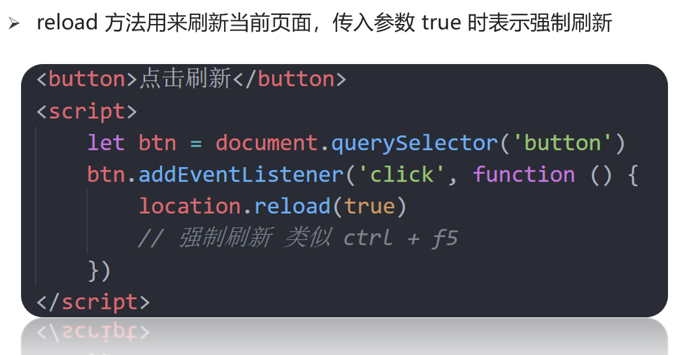

#### 4.3 å°ç»“

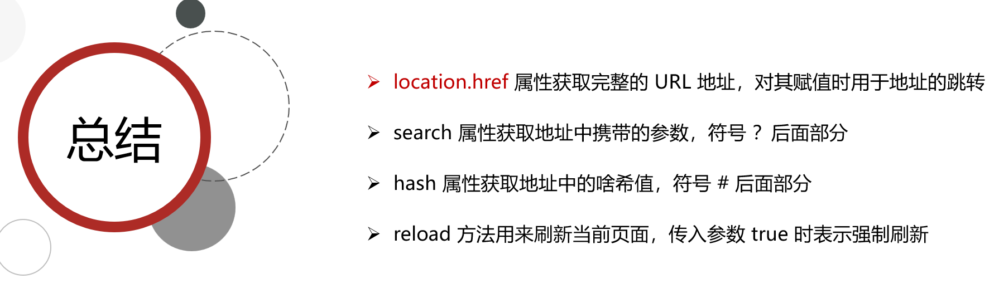

---


### 5. navigator对象

navigatorçš„æ•°æ®ç±»å‹æ˜¯å¯¹è±¡ï¼Œè¯¥å¯¹è±¡ä¸‹è®°å½•äº†æµè§ˆå™¨è‡ªèº«çš„相关信æ¯

#### 5.1 userAgent

- è¿”å›ç”¨æˆ·è®¾å¤‡æ“作系统和æµè§ˆå™¨ä¿¡æ¯

#### 🚩 Code 07

```js
    // 检测 userAgent（æµè§ˆå™¨ä¿¡æ¯ï¼‰
;(function () {
      const userAgent = navigator.userAgent
      // 验è¯æ˜¯å¦ä¸ºAndroid或iPhone
      const android = userAgent.match(/(Android);?[\s\/]+([\d.]+)?/)
      const iphone = userAgent.match(/(iPhone\sOS)\s([\d_]+)/)
      // 如æœæ˜¯Android或iPhone，则跳转至移动站点
      if (android || iphone) {
        location.href = 'http://m.itcast.cn'
      }
})()
```


### 6. history对象

history 对象表示当å‰çª—å£é¦–次使用以æ¥ç”¨æˆ·çš„导航å†å²è®°å½•ã€‚因为 history 是 window çš„å±æ€§ï¼Œæ‰€ä»¥æ¯ä¸ª window 都有自己的 history 对象。出äºå®‰å…¨è€ƒè™‘，这个对象ä¸ä¼šæš´éœ²ç”¨æˆ·è®¿é—®è¿‡çš„ URL，但å¯ä»¥é€šè¿‡å®ƒåœ¨ä¸çŸ¥é“å®é™… URL 的情况下å‰è¿›å’Œå退。

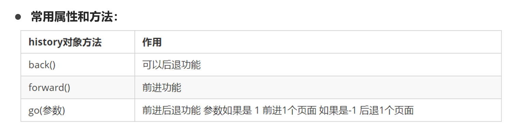

**history.back()** å’Œ **history.forward()** 模拟了æµè§ˆå™¨çš„å退按钮和å‰è¿›æŒ‰é’®.

#### 🚩 Code 08

```js
const back = document.querySelector('button:first-child')
const forward = back.nextElementSibling
back.addEventListener('click', function () {
  // å退一步
  // history.back()
  history.go(-1)
})
forward.addEventListener('click', function () {
  // å‰è¿›ä¸€æ­¥
  // history.forward()
  history.go(1)
})
```


## 2. 本地存储

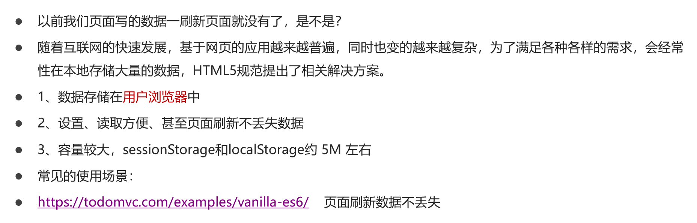

### 2.1 localStorage

1ã€ç”Ÿå‘½å‘¨æœŸæ°¸ä¹…生效，除é手动删除 å¦åˆ™å…³é—­é¡µé¢ä¹Ÿä¼šå­˜åœ¨

2ã€å¯ä»¥å¤šçª—å£ï¼ˆé¡µé¢ï¼‰å…±äº«ï¼ˆåŒä¸€æµè§ˆå™¨å¯ä»¥å…±äº«ï¼‰

3ã€ä»¥é”®å€¼å¯¹çš„å½¢å¼å­˜å‚¨ä½¿ç”¨

> **使用场景**

​	æ•°æ®åˆ·æ–°ä¸ä¸¢å¤±, 关闭窗å£é‡æ–°æ‰“开也ä¸ä¸¢å¤±æ—¶

- Todo https://todomvc.com/examples/vanilla-es6/  

#### 方法

存储数æ®ï¼š

```javascript
localStorage.setItem(key, value)
```

è·å–æ•°æ®ï¼š

```javascript
localStorage.getItem(key)
```

删除数æ®ï¼š

```javascript
localStorage.removeItem(key)
```

清空数æ®ï¼š(所有都清除æ‰)

```javascript
localStorage.clear()
```

PS. 扩展

也å¯ä»¥ä½¿ç”¨å±æ€§çš„æ–¹å¼ç»™localStorage添加数æ®

```js
// 使用方法存储数æ®
localStorage.setItem("name", "Nicholas"); 
// 使用å±æ€§å­˜å‚¨æ•°æ®
localStorage.book = "Professional JavaScript"; 
// 使用方法å–å¾—æ•°æ®
let name = localStorage.getItem("name"); 
// 使用å±æ€§å–å¾—æ•°æ®
let book = localStorage.book;
```

#### 🚩 Code 09 

```js
// 1. è¦å­˜å‚¨ä¸€ä¸ªåå­—  'uname'， 'pinkè€å¸ˆ'
// localStorage.setItem('键'，'值')
localStorage.setItem('uname', 'pinkè€å¸ˆ')
// 2. è·å–æ–¹å¼  都加引å·
console.log(localStorage.getItem('uname'))
// 3. 删除本地存储  åªåˆ é™¤åå­—
// localStorage.removeItem('uname')
// 4. 改  如æœåŸæ¥æœ‰è¿™ä¸ªé”®ï¼Œåˆ™æ˜¯æ”¹ï¼Œå¦‚æœæ²¡æœ‰è¿™ä¸ªé”®æ˜¯å¢
localStorage.setItem('uname', 'redè€å¸ˆ')

// 我è¦å­˜ä¸€ä¸ªå¹´é¾„
// 2. 本地存储åªèƒ½å­˜å‚¨å­—符串数æ®ç±»å‹
localStorage.setItem('age', 18)
console.log(localStorage.getItem('age'))
```


#### 如何查看


> 生命周期 : 一个对象的创建到清除的过程, æ•°æ®å­˜åœ¨çš„周期

存储在 localStorage 中的数æ®ä¼šä¿ç•™åˆ°é€šè¿‡ JavaScript 删除或者用户清除æµè§ˆå™¨ç¼“存。localStorage æ•°æ®ä¸å—页é¢åˆ·æ–°å½±å“，也ä¸ä¼šå› å…³é—­çª—å£ã€æ ‡ç­¾é¡µæˆ–é‡æ–°å¯åŠ¨æµè§ˆå™¨è€Œä¸¢å¤±ã€‚

 **localStorage生命周期是永久的,  除é用户手动删除, å¦åˆ™å…³é—­é¡µé¢ä¹Ÿä¼šå­˜åœ¨**

#### å°ç»“

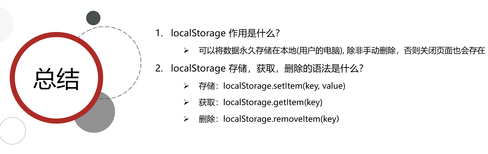

> PS. ä¸åŒæµè§ˆå™¨å¯èƒ½ä¸åŒ, 但基本都是5M大å°

```js
;(function() {
    var test = '0123456789';
    var add = function(num) {
        num += num;
        if(num.length == 10240) {;
            test = num;
            return;
        }
        add(num);
    }
    add(test);
    var sum = test;
    var show = setInterval(function(){
        sum += test;
        try {
            window.localStorage.removeItem('test');
            window.localStorage.setItem('test', sum);
            console.log(sum.length / 1024 + 'KB');
        } catch(e) {
            alert(sum.length / 1024 + 'KB超出最大é™åˆ¶');
            clearInterval(show);
        }
    }, 0.1)
})()

```

### 2.2 sessionStorage

1ã€ç”Ÿå‘½å‘¨æœŸä¸ºå…³é—­æµè§ˆå™¨çª—å£

2ã€åœ¨åŒä¸€ä¸ªçª—å£(页é¢ï¼ŒTab页é¢)下数æ®å¯ä»¥å…±äº«  (å‰æ是åŒä¸€åŸŸå下)

3ã€ä»¥é”®å€¼å¯¹çš„å½¢å¼å­˜å‚¨ä½¿ç”¨

#### 方法

存储数æ®ï¼š

```javascript
sessionStorage.setItem(key, value)
```

è·å–æ•°æ®ï¼š

```javascript
sessionStorage.getItem(key)
```

删除数æ®ï¼š

```javascript
sessionStorage.removeItem(key)
```

清空数æ®ï¼š(所有都清除æ‰)

```javascript
sessionStorage.clear()
```


### 2.3 存储å¤æ‚æ•°æ®ç±»å‹

#### JSON.stringify()

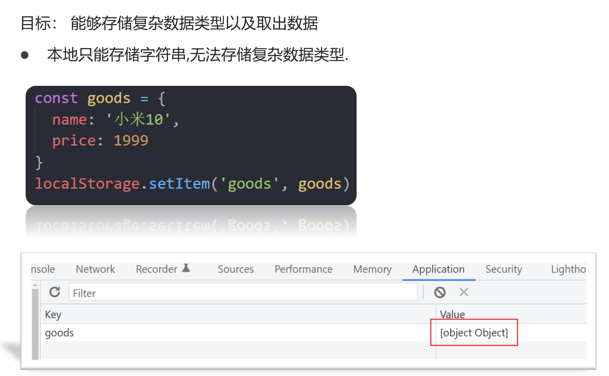


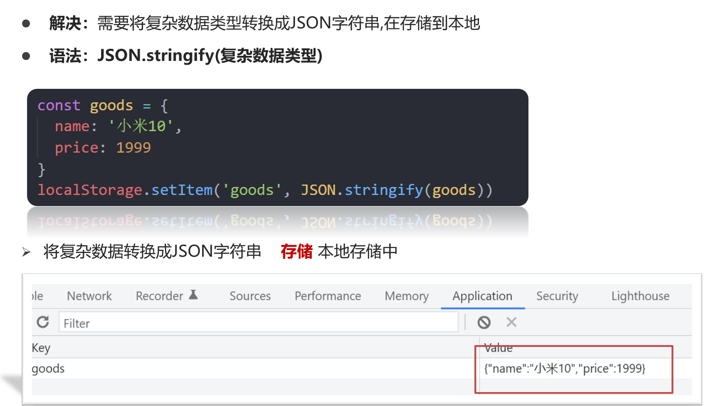


#### 🚩 Code 10

```js
const obj = {
  uname: 'pinkè€å¸ˆ',
  age: 18,
  gender: '女'
}
//  存储 å¤æ‚æ•°æ®ç±»å‹  无法直æ¥ä½¿ç”¨
// localStorage.setItem('obj', obj)  [object object]    
//  å–
// console.log(localStorage.getItem('obj'))

// 1.å¤æ‚æ•°æ®ç±»å‹å­˜å‚¨å¿…须转æ¢ä¸º JSON字符串存储
localStorage.setItem('obj', JSON.stringify(obj))
// JSON æ ¼å¼:  å±æ€§å’Œå€¼æœ‰å¼•å·ï¼Œè€Œä¸”引å·ç»Ÿä¸€æ˜¯åŒå¼•å· (值是numberå¯ä»¥ä¸å¸¦)
// {"uname":"pinkè€å¸ˆ","age":18,"gender":"女"}
// å–
// console.log(typeof localStorage.getItem('obj'))
// 2. 把JSON字符串转æ¢ä¸º 对象
const str = localStorage.getItem('obj') // {"uname":"pinkè€å¸ˆ","age":18,"gender":"女"}
console.log(JSON.parse(str))
```


#### JSON.parse()

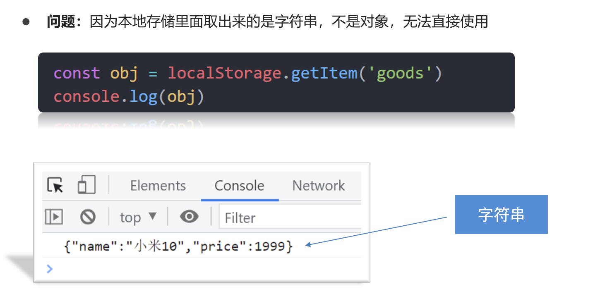

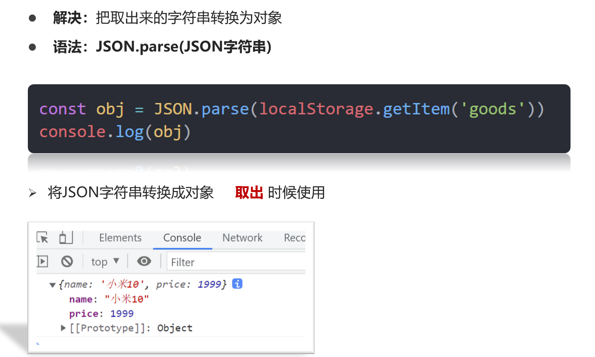

## 3. Eg.学生就业信æ¯è¡¨

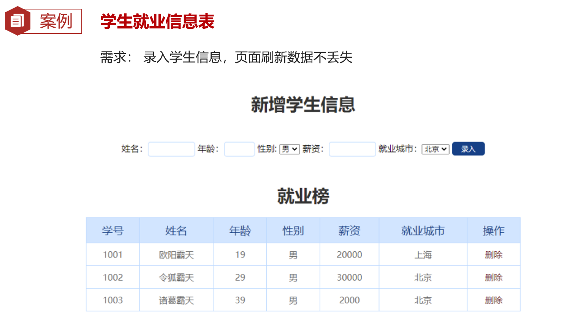

```bash
需求： 录入学生信æ¯ï¼Œé¡µé¢åˆ·æ–°æ•°æ®ä¸ä¸¢å¤±
模å—分æ：
①：新å¢æ¨¡å—， 输入学生信æ¯ï¼Œæ•°æ®ä¼šå­˜å‚¨åˆ°æœ¬åœ°å­˜å‚¨ä¸­
②：渲染模å—，数æ®ä¼šæ¸²æŸ“到页é¢ä¸­
③：删除模å—，点击删除按钮，会删除对应的数æ®

```

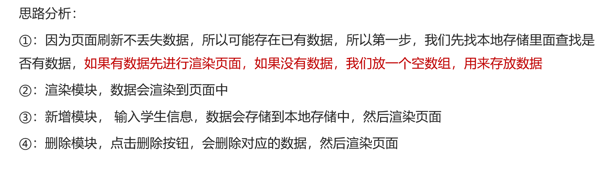

```js
// æ€è·¯åˆ†æ：
// ①：因为页é¢åˆ·æ–°ä¸ä¸¢å¤±æ•°æ®ï¼Œæ‰€ä»¥å¯èƒ½å­˜åœ¨å·²æœ‰æ•°æ®ï¼Œæ‰€ä»¥ç¬¬ä¸€æ­¥ï¼Œæˆ‘们先找本地存储里é¢æŸ¥æ‰¾æ˜¯å¦æœ‰æ•°æ®ï¼Œå¦‚æœæœ‰æ•°æ®å…ˆè¿›è¡Œæ¸²æŸ“页é¢ï¼Œå¦‚æœæ²¡æœ‰æ•°æ®ï¼Œæˆ‘们放一个空数组，用æ¥å­˜æ”¾æ•°æ®
// ②：渲染模å—，数æ®ä¼šæ¸²æŸ“到页é¢ä¸­
// ③：新å¢æ¨¡å—， 输入学生信æ¯ï¼Œæ•°æ®ä¼šå­˜å‚¨åˆ°æœ¬åœ°å­˜å‚¨ä¸­ï¼Œç„¶å渲染页é¢
// ④：删除模å—，点击删除按钮，会删除对应的数æ®ï¼Œç„¶å渲染页é¢
```

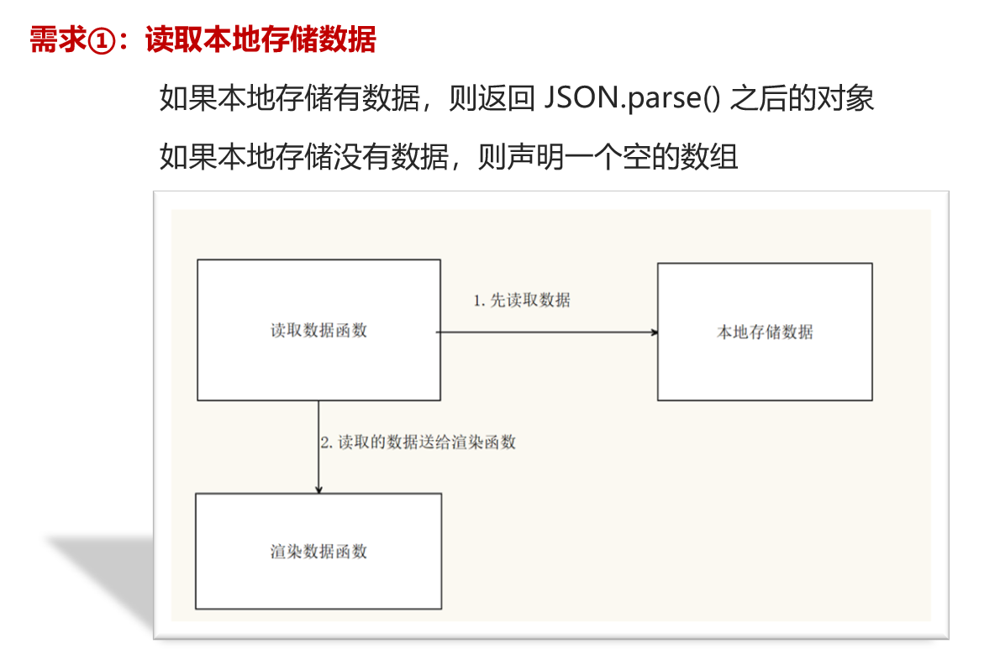

```js
const initData = [
    {
        stuId: 1001,
        uname: '欧阳霸天',
        age: 19,
        gender: 'ç”·',
        salary: '20000',
        city: '上海',
    }
]
```


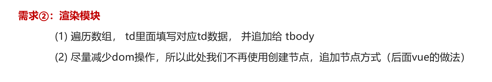

### Array.map()

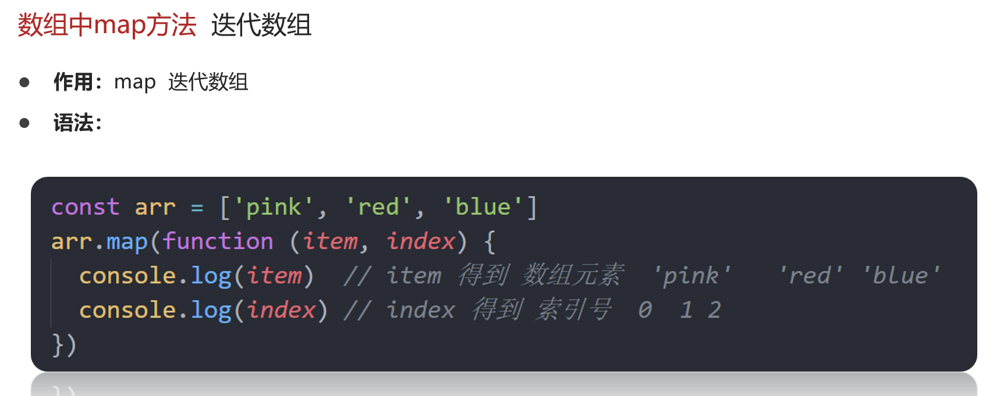

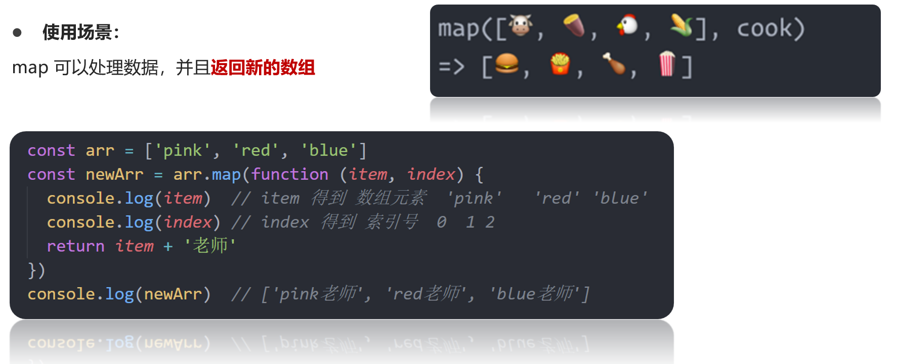

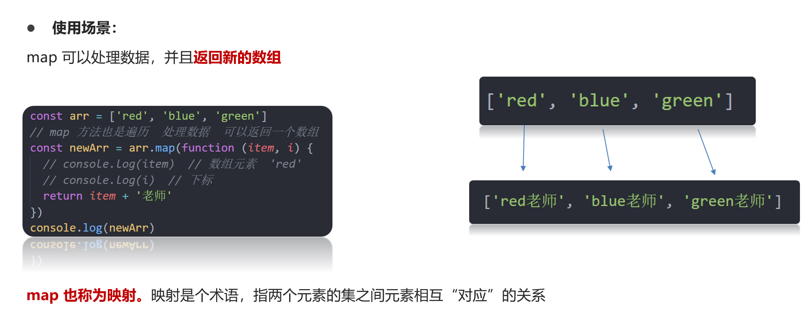

#### 🚩 Code 11

```js
const arr = ['red', 'blue', 'green']
// map 方法也是éå†  处ç†æ•°æ®  å¯ä»¥è¿”å›ä¸€ä¸ªæ•°ç»„
const newArr = arr.map(function (item, i) {
  // console.log(item)  // 数组元素  'red'
  // console.log(i)  // 下标
  return item + 'è€å¸ˆ'
})
console.log(newArr)


['redè€å¸ˆ', 'blueè€å¸ˆ', 'greenè€å¸ˆ']


const arr1 = [10, 20, 30]
const newArr1 = arr1.map(function (item) {
  return item + 10
})
console.log(newArr1)
```


### Array.join()

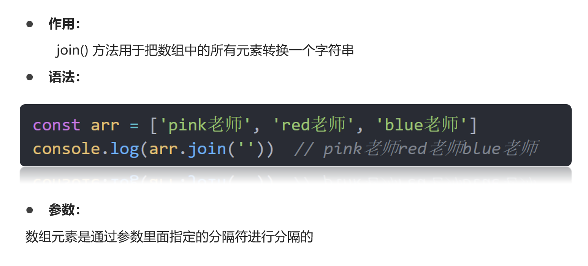

#### 🚩 Code 12

```js
const arr = ['red', 'blue', 'green']
// 把数组元素转æ¢ä¸ºå­—符串
console.log(arr.join()) 
```


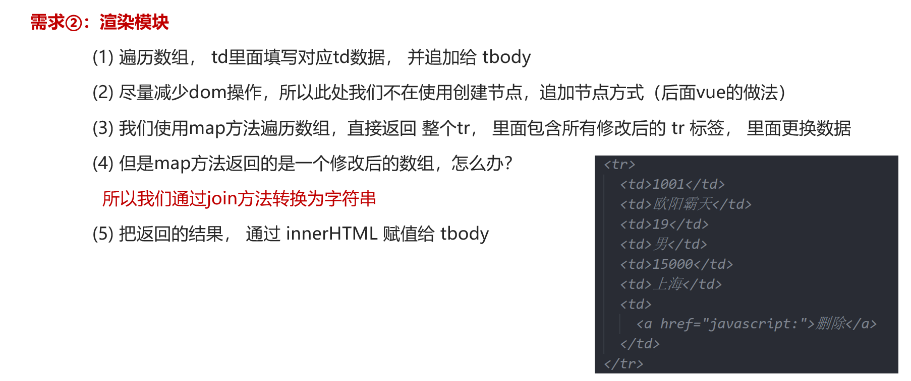

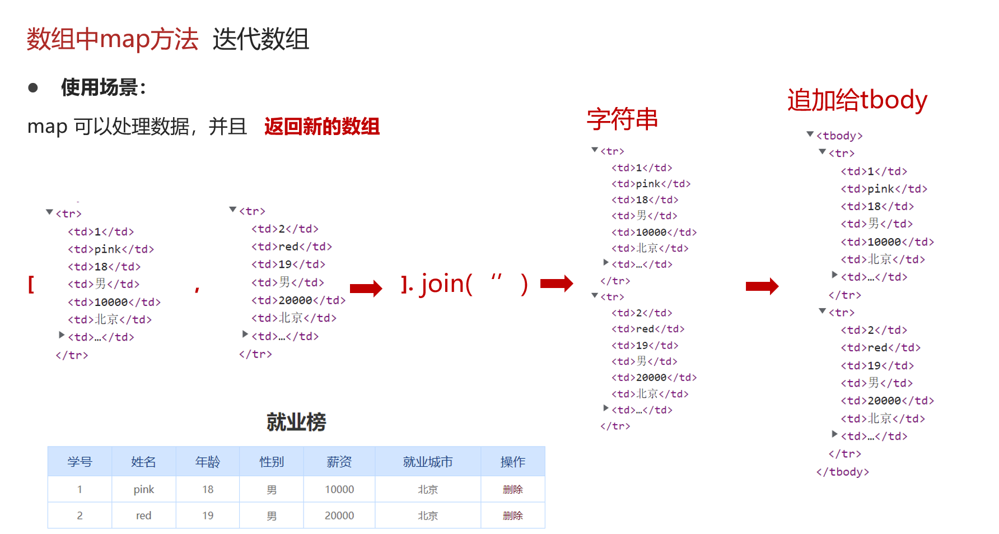

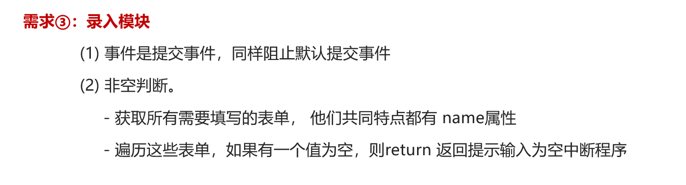

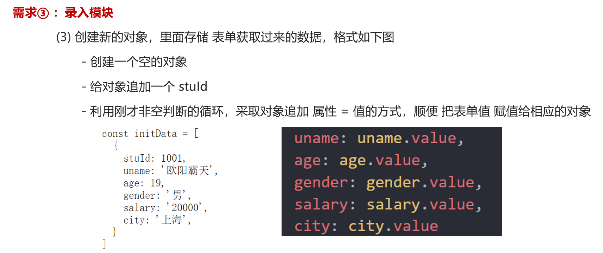

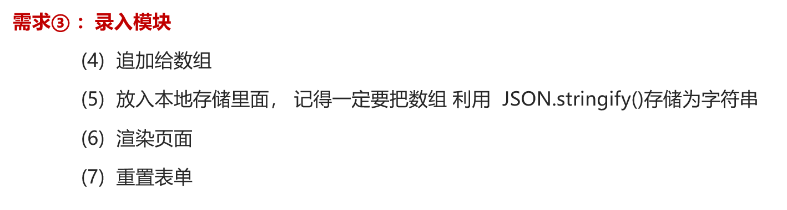

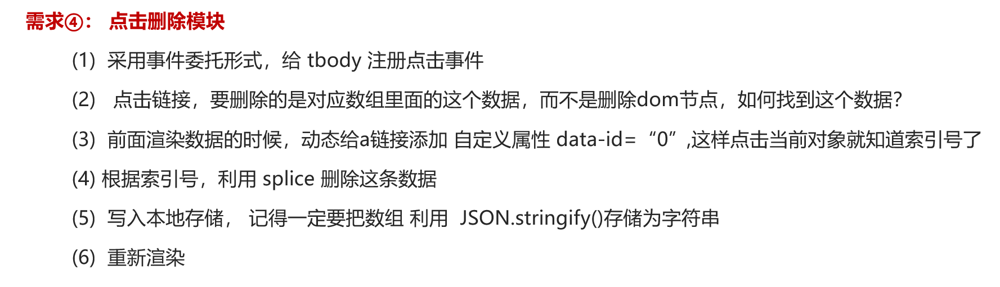

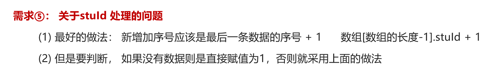

#### Code Eg

```js
    // 1. 读å–æœ¬åœ°å­˜å‚¨çš„æ•°æ®   student-data  本地存储的命å
    const data = localStorage.getItem('student-data')
    // console.log(data)
    // 2. 如æœæœ‰å°±è¿”å›å¯¹è±¡ï¼Œæ²¡æœ‰å°±å£°æ˜ä¸€ä¸ªç©ºçš„数组  arr 一会渲染的时候用的
    const arr = data ? JSON.parse(data) : []

    // console.log(arr)
    // è·å– tbody
    const tbody = document.querySelector('tbody')
    // 3. 渲染模å—函数
    function render() {
      // éå†æ•°ç»„ arr，有几个对象就生æˆå‡ ä¸ª tr，然å追击给tbody
      // map è¿”å›çš„是个数组  [tr, tr]
      const trArr = arr.map(function (item, i) {
        // console.log(item)
        // console.log(item.uname)  // 欧阳霸天
        return `
        <tr>
          <td>${item.stuId}</td>
          <td>${item.uname}</td>
          <td>${item.age}</td>
          <td>${item.gender}</td>
          <td>${item.salary}</td>
          <td>${item.city}</td>
          <td>
            <a href="javascript:" data-id=${i}>删除</a>
          </td>
        </tr> 
        `
      })
      // console.log(trArr)
      // 追加给tbody
      // 因为 trArr 是个数组， 我们ä¸è¦æ•°ç»„，我们è¦çš„是 tr的字符串 join()
      tbody.innerHTML = trArr.join('')
    }
    render()


    // 4. 录入模å—
    const info = document.querySelector('.info')
    // è·å–表å•form 里é¢å¸¦æœ‰ nameå±æ€§çš„元素
    const items = info.querySelectorAll('[name]')
    // console.log(items)
    info.addEventListener('submit', function (e) {
      // 阻止æ交
      e.preventDefault()
      // 声æ˜ç©ºçš„对象
      const obj = {}
      // obj.stuId = arr.length + 1
      // 加入有2æ¡æ•°æ®   2 
      obj.stuId = arr.length ? arr[arr.length - 1].stuId + 1 : 1
      // é空判断
      for (let i = 0; i < items.length; i++) {
        // console.log(items) // 数组里é¢åŒ…å« 5ä¸ªè¡¨å•  name
        // console.log(items[i]) //  æ¯ä¸€ä¸ªè¡¨å• 对象
        // console.log(items[i].name) //  
        // item 是æ¯ä¸€ä¸ªè¡¨å•
        const item = items[i]
        if (items[i].value === '') {
          return alert('输入内容ä¸èƒ½ä¸ºç©º')
        }
        // console.log(item.name)  uname  age gender
        // obj[item.name]   === obj.uname  obj.age 
        obj[item.name] = item.value
      }
      // console.log(obj)
      // 追加给数组
      arr.push(obj)
      //  把数组 arr 存储到本地存储里é¢
      localStorage.setItem('student-data', JSON.stringify(arr))
      // 渲染页é¢
      render()
      // é‡ç½®è¡¨å•
      this.reset()
    })


    // 5. 删除模å—
    tbody.addEventListener('click', function (e) {
      if (e.target.tagName === 'A') {
        // alert(1)
        // console.log(e.target.dataset.id)
        // 删除数组对应的这个数æ®
        arr.splice(e.target.dataset.id, 1)
        // 写入本地存储
        localStorage.setItem('student-data', JSON.stringify(arr))
        // é‡æ–°æ¸²æŸ“
        render()
      }
    })
```


## 作业


- https://ks.wjx.top/vj/eKqRAy8.aspx
