## Target

1. 能够说出正则表达式是什么以及作用
2. 能够说出test和exec的区别
3. 能够跟随课堂代码完成用户注册页面
4. 能够跟随课堂代码完成登录页面tab栏切换效果
5. 能够跟随课堂代码完成登录页判断是否勾选同意协议
6. 能够跟随课堂代码完成首页退出登录模块

💡🚀🤟👉👇☀️🍉🍍🍇🍓🥕🍭🎖️🎁☘️🍀💯🔆❗🔥🚩

---

## 1. 介绍 

### 1. 1 什么是正则表达式


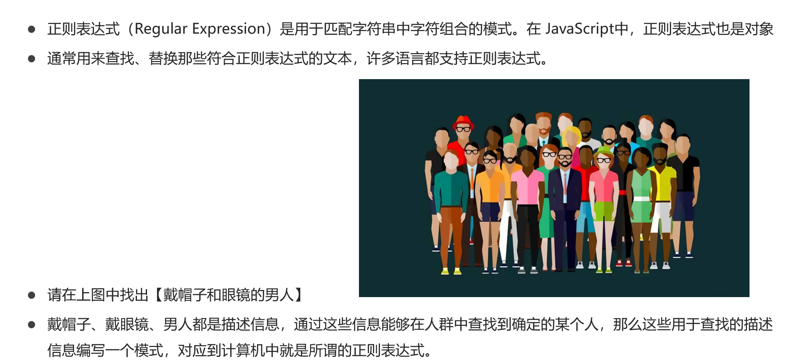

### 1.2 使用场景

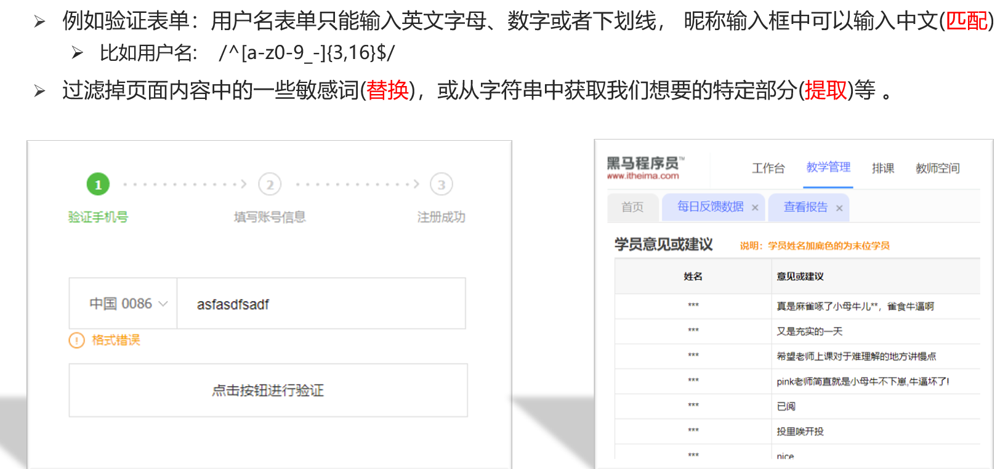

### 1.3 小结


## 2. 语法


### 2.1  /字面量/

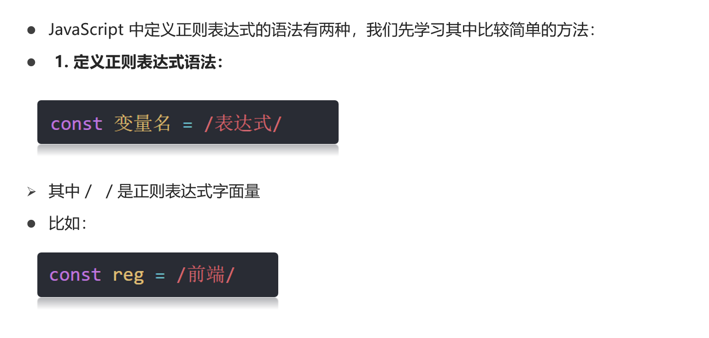

### 2.2 test() 

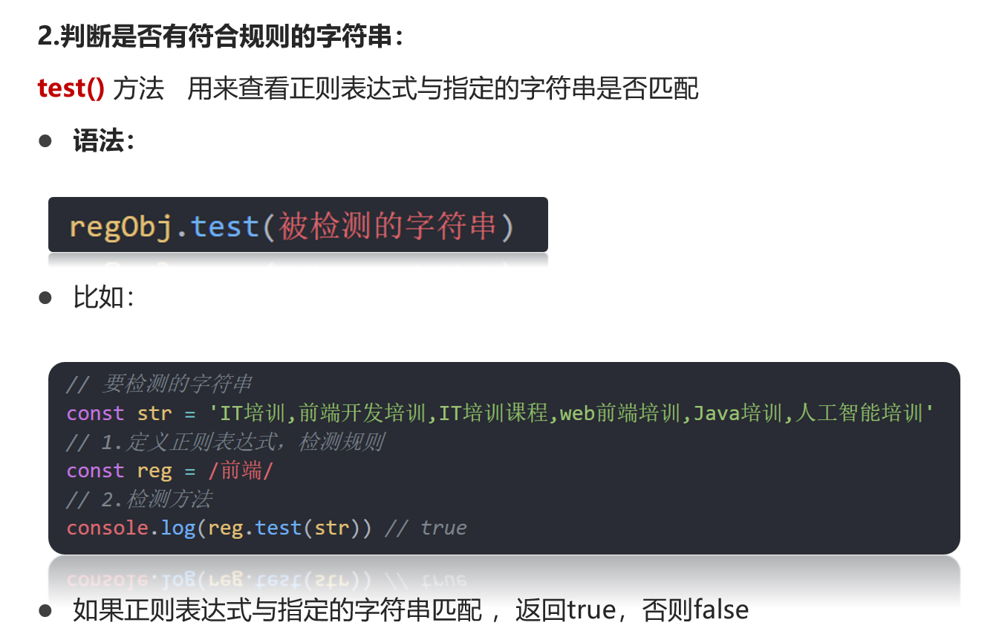

#### 小结

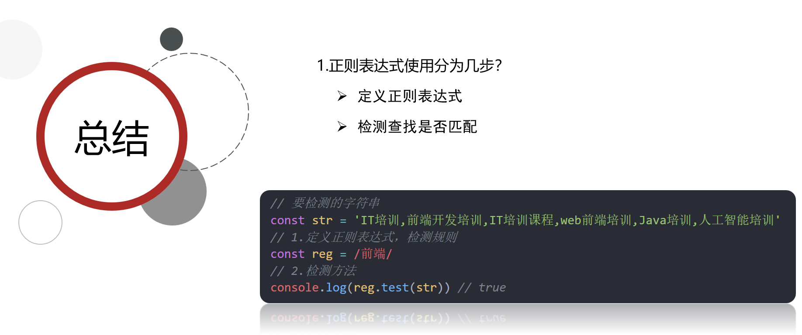

#### 🚩 Code 01 

```js
const str = '我们在学前端'
// 1. reg.test()
// 定义规则
const reg = /前端/ 
console.log(typeof reg) // object
// 看是否匹配
// console.log(reg.test(str))  // true  

// 2. reg.exec()
// exec() 查找符合规则的字符串,找到返回结果数组, 否则为null
console.log(reg.exec(str))  // 返回数组
```


### 2.3 exec()

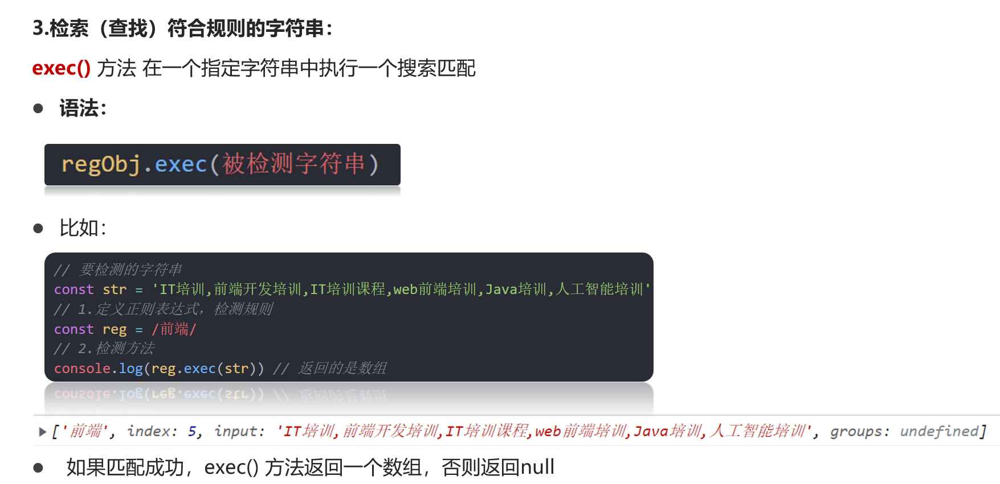

#### 小结


## 3. 元字符

### 3.1 简介

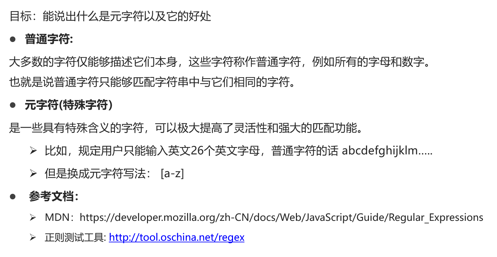

- [MDN - RegExp](https://developer.mozilla.org/zh-CN/docs/Web/JavaScript/Guide/Regular_Expressions
  )
- [测试工具](http://tool.oschina.net/regex
  )

#### 小结

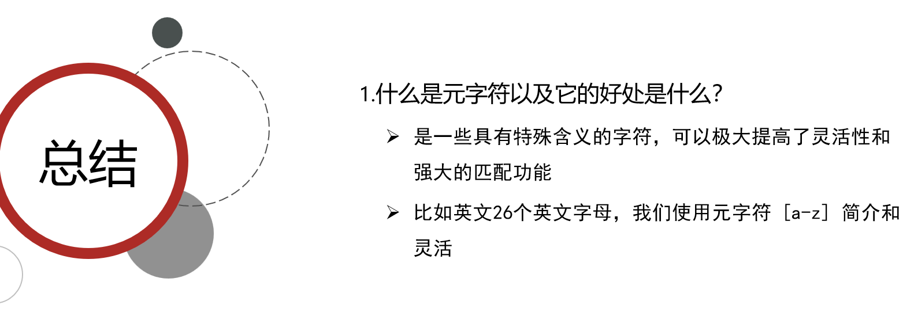

### 3.2 元字符分类


#### 3.2.1 边界符


#### 🚩 Code 02

```js
console.log(/哈/.test('哈'))
console.log(/哈/.test('哈哈'))
console.log(/哈/.test('二哈'))
console.log('------------------')
// 1. 边界符
// ^ 开头
console.log(/^哈/.test('哈'))
console.log(/^哈/.test('哈哈'))
console.log(/^哈/.test('二哈'))
// $ 结尾
console.log(/^哈$/.test('哈'))
console.log(/^哈$/.test('哈哈'))
console.log(/^哈$/.test('二哈'))
console.log('------------------')
```


#### 3.2.2 量词

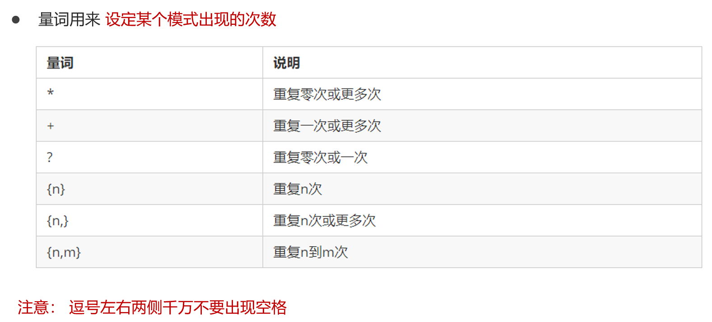


#### 🚩 Code 02 

```js
console.log('------------------')
//  量词 * 类似 >=0 次
console.log(/^哈$/.test('哈'))
console.log(/^哈*$/.test('')) 
console.log(/^哈*$/.test('哈'))
console.log(/^哈*$/.test('哈哈')) 
console.log(/^哈*$/.test('二哈很傻'))
console.log(/^哈*$/.test('哈很傻'))
console.log(/^哈*$/.test('哈很哈')) 
console.log('------------------')
//  量词 + 类似 >=1 次
console.log(/^哈$/.test('哈'))
console.log(/^哈+$/.test(''))
console.log(/^哈+$/.test('哈'))
console.log(/^哈+$/.test('哈哈')) 
console.log(/^哈+$/.test('二哈很傻'))
console.log(/^哈+$/.test('哈很傻'))
console.log(/^哈+$/.test('哈很哈'))
```

#### 🚩 Code 02 

- 6-16位, 能不能改了

```js
// 量词 {n} 写几，就必须出现几次
console.log(/^哈{4}$/.test('哈'))
console.log(/^哈{4}$/.test('哈哈'))
console.log(/^哈{4}$/.test('哈哈哈'))
console.log(/^哈{4}$/.test('哈哈哈哈'))
console.log(/^哈{4}$/.test('哈哈哈哈哈'))
console.log(/^哈{4}$/.test('哈哈哈哈哈哈'))
console.log('------------------')
// 量词 {n,}   >=n
console.log(/^哈{4,}$/.test('哈'))
console.log(/^哈{4,}$/.test('哈哈'))
console.log(/^哈{4,}$/.test('哈哈哈'))
console.log(/^哈{4,}$/.test('哈哈哈哈'))
console.log(/^哈{4,}$/.test('哈哈哈哈哈'))
console.log(/^哈{4,}$/.test('哈哈哈哈哈哈'))
console.log('------------------')
// 量词 {n,m}  逗号左右两侧千万不能有空格    >=n && <= m
console.log(/^哈{4,6}$/.test('哈'))
console.log(/^哈{4,6}$/.test('哈哈'))
console.log(/^哈{4,6}$/.test('哈哈哈'))
console.log(/^哈{4,6}$/.test('哈哈哈哈'))
console.log(/^哈{4,6}$/.test('哈哈哈哈哈'))
console.log(/^哈{4,6}$/.test('哈哈哈哈哈哈'))
console.log(/^哈{4,6}$/.test('哈哈哈哈哈哈哈'))
console.log('------------------')
```


##### 小结

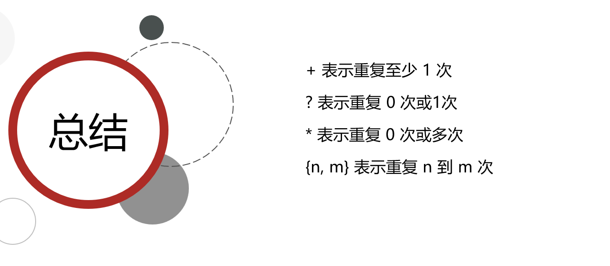


#### 3.2.3 字符类

##### [] 匹配字符集合


##### [] 里面加上- 连字符

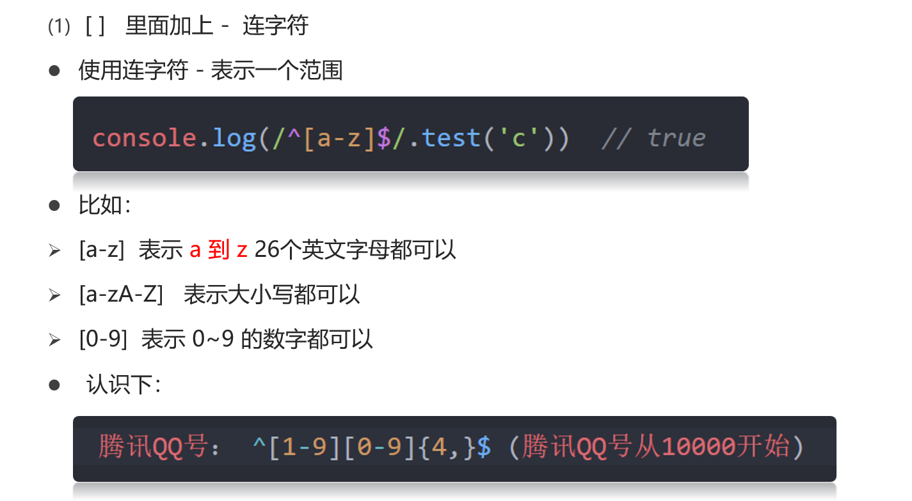

#### 🚩 Code 02

```js
// 字符类   [abc]  只选1个
console.log(/^[abc]$/.test('a'))
console.log(/^[abc]$/.test('b')) 
console.log(/^[abc]$/.test('c')) 
console.log(/^[abc]$/.test('ab'))
console.log(/^[abc]{2}$/.test('ab'))
console.log('------------------')
// 字符类   [a-z]  只选1个
console.log(/^[A-Z]$/.test('p'))
console.log(/^[A-Z]$/.test('P'))
console.log(/^[0-9]$/.test(2))
console.log(/^[a-zA-Z0-9]$/.test(2))
console.log(/^[a-zA-Z0-9]$/.test('p'))
console.log(/^[a-zA-Z0-9]$/.test('P'))
console.log('------------------')
```

##### [] 里面加上 ^ 取反符号


##### `.`匹配除换行符外的任何单个字符

#### 🚩 Code 02

```js
// [^...] 中括号里面加上^, 取反
// .  匹配除换行之外的任何单个字符
```


##### 小结

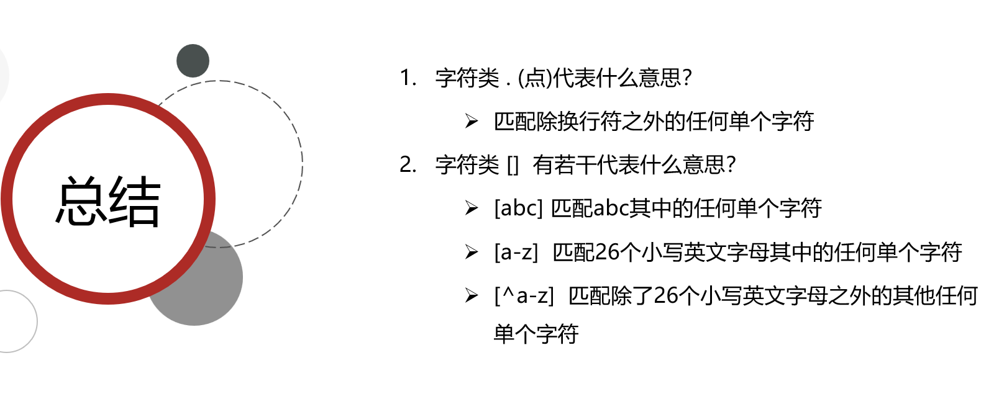

#### eg. 用户名验证案例

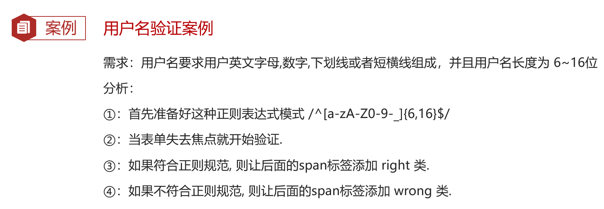

- `/^[a-zA-Z0-9-_]{6,16}$/`

#### eg. 昵称案例

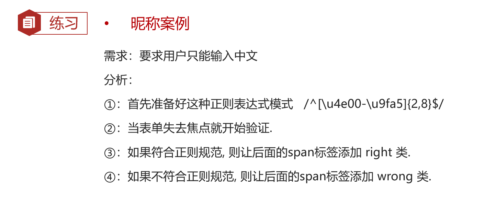

##### 字符组简写


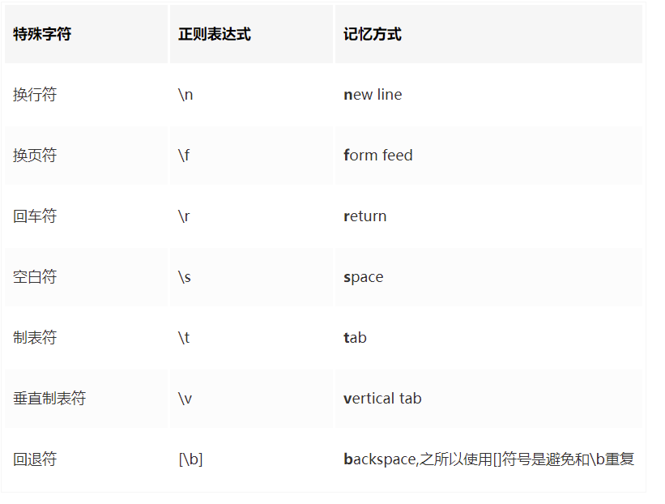

## 4. 修饰符

### 4.1 简介


### replace


##### Eg. 过滤敏感词

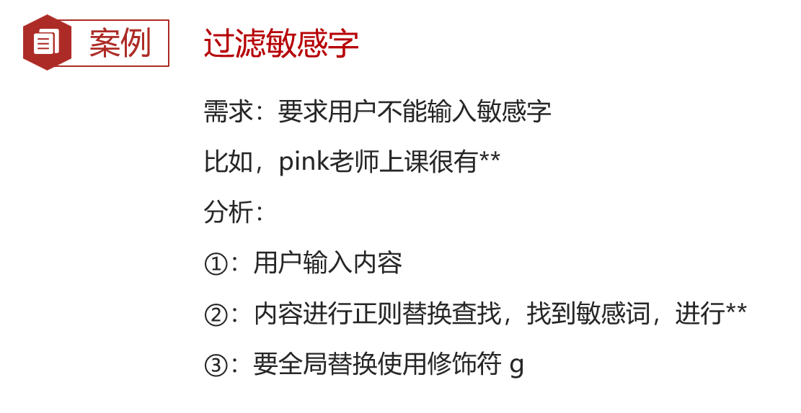

## 5. 综合案例

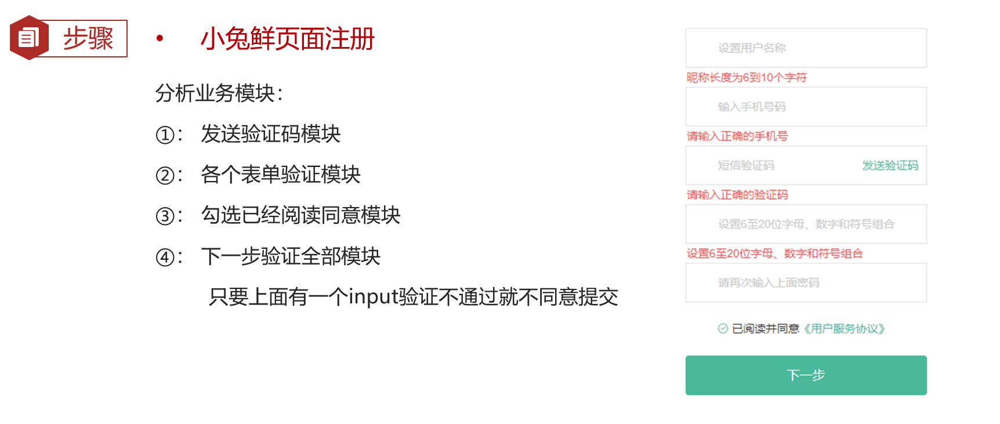


> 正则

- `/^[a-zA-Z0-9-_]{6,10}$/`

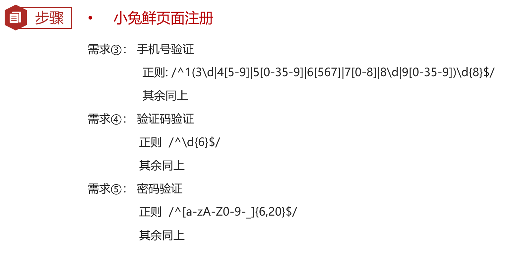

> 正则

- `/^1(3\d|4[5-9]|5[0-35-9]|6[567]|7[0-8]|8\d|9[0-35-9])\d{8}$/`
- `/^\d{6}$/`
- `/^[a-zA-Z0-9-_]{6,20}$/`

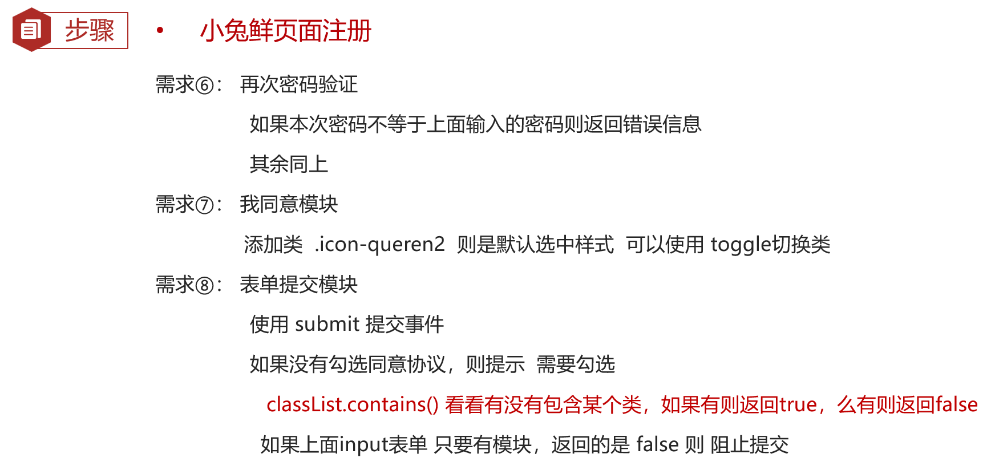

#### 🚩 Code Register

```js
// 1.发送短信验证码模块
// 获取元素
const code = document.querySelector('.code')
// 注册点击事件
code.addEventListener('click', function () {
    let i = 5
    // 点击完毕之后立马触发
    code.innerHTML = `0${i}秒后重新获取`
    // 开启定时器
    let timerId = setInterval(function () {
        i--
        // console.log(this) 不能用this
        code.innerHTML = `0${i}秒后重新获取`
        if (i === 0) {
            // 清除定时器
            clearInterval(timerId)
            // 从新获取
            code.innerHTML = `重新获取`
        }
    }, 1000)
    })

// 2. 用户名验证
// 1 获取元素
const username = document.querySelector('[name=username]')
const span = username.nextElementSibling
// 封装 validateName
const validateName = function(){
    // console.log(11)
    // 定规则  用户名
    const reg = /^[a-zA-Z0-9-_]{6,10}$/
    if (!reg.test(username.value)) {
        // console.log(11)
        span.innerText = '输入不合法,请输入6~10位'
        return false
    }
    // 合法的 就清空span
    span.innerText = ''
    return true
}
// 使用change事件  值发生变化的时候
username.addEventListener('change', validateName)

// 3. 用户名手机号
//  获取元素
const phone = document.querySelector('[name=phone]')
// 封装 validateName
const validatePhone = function(){
    const span = phone.nextElementSibling
    //  定规则  手机号
    const reg = /^1(3\d|4[5-9]|5[0-35-9]|6[567]|7[0-8]|8\d|9[0-35-9])\d{8}$/
    if (!reg.test(phone.value)) {
        // console.log(11)
        span.innerText = '输入不合法,请输入正确的11位手机号码'
        return false
    }
    // 合法的 就清空span
    span.innerText = ''
    return true
}
// 使用change事件  值发生变化的时候
phone.addEventListener('change', validatePhone)

// 4. 用户名手机号
//  获取元素
const codeEl = document.querySelector('[name=code]')
// 封装 validateName
const validateCode = function(){
    const span = codeEl.nextElementSibling
    //  定规则  手机号
    const reg = /^\d{6}$/
    if (!reg.test(codeEl.value)) {
        // console.log(11)
        span.innerText = '输入不合法,请输入6位数字'
        return false
    }
    //  合法的 就清空span
    span.innerText = ''
    return true
}
// 使用change事件  值发生变化的时候
codeEl.addEventListener('change', validateCode)

// 5. 密码验证
//  获取元素
const pwd = document.querySelector('[name=password]')
// 封装 validateName
const validatePwd = function(){
    const span = pwd.nextElementSibling
    //  定规则  手机号
    const reg = /^[a-zA-Z0-9-_]{6,20}$/
    if (!reg.test(pwd.value)) {
        // console.log(11)
        span.innerText = '输入不合法,请输入6-20位'
        return false
    }
    //  合法的 就清空span
    span.innerText = ''
    return true
}
// 使用change事件  值发生变化的时候
pwd.addEventListener('change', validatePwd)

// 6. 密码的再次验证
//  获取元素
const pwdConfirm = document.querySelector('[name=confirm]')
// 封装 validateName
const validateRePwd = function(){
    const span = pwdConfirm.nextElementSibling
    // 判断两次密码输入是否一致
    if (pwdConfirm.value !== pwd.value) {
        span.innerText = '两次密码输入不一致'

        return false
    }
    // 合法的 就清空span
    span.innerText = ''
    return true
}
// 使用change事件  值发生变化的时候
pwdConfirm.addEventListener('change', validateRePwd)

// 7. 阅读并同意模块
const agree = document.querySelector('.icon-queren')
agree.addEventListener('click', function () {
    // 切换类  原来有的就删掉，原来没有就添加
    this.classList.toggle('icon-queren2')
})

// 8. 提交模块
const form = document.querySelector('form')
form.addEventListener('submit', function (e) {
    // 判断是否勾选我同意模块 ，如果有 icon-queren2说明就勾选了，否则没勾选
    if (!agree.classList.contains('icon-queren2')) {
        alert('请勾选同意协议')
        // 阻止提交
        e.preventDefault()
    }
    // 依次判断上面的每个框框 是否通过，只要有一个没有通过的就阻止
    if (!validateName()) e.preventDefault()
    if (!validatePhone()) e.preventDefault()
    if (!validateCode()) e.preventDefault()
    if (!validatePwd()) e.preventDefault()
    if (!validateRePwd()) e.preventDefault()
})
```


## 6. 阶段案例

### 6.1 tab切换

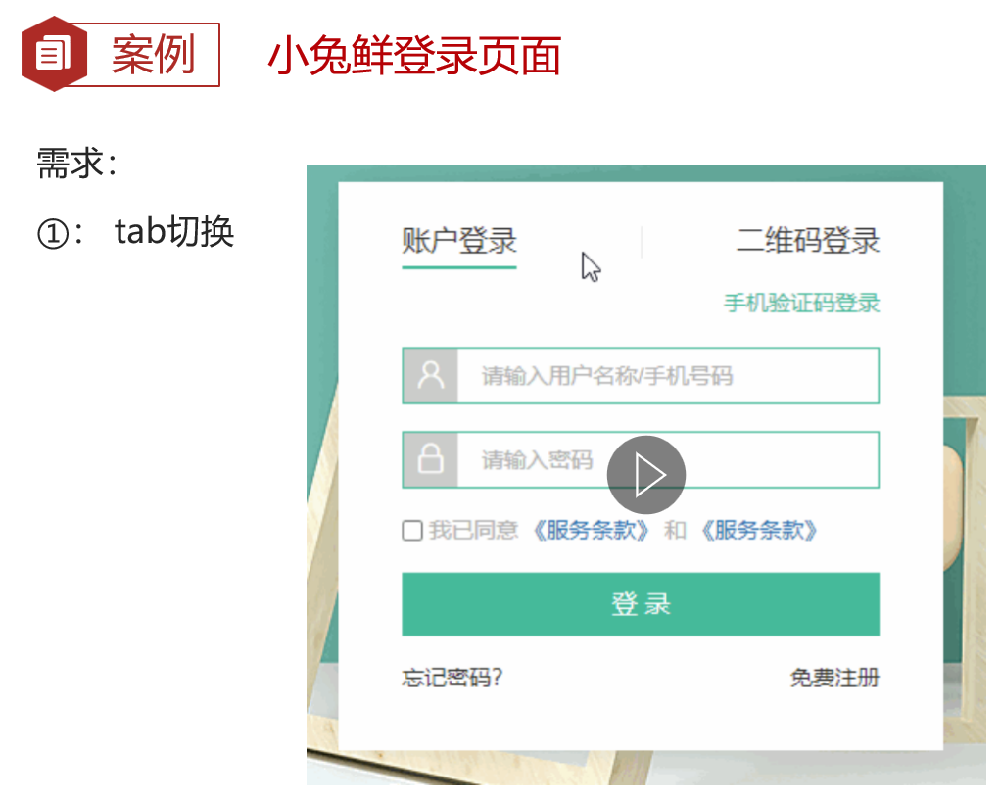

#### 🚩 Code Tab

```js
// login.html
// 1. tab栏切换  事件委托
const tab_nav = document.querySelector('.tab-nav')
const pane = document.querySelectorAll('.tab-pane')
// 1.1 事件监听
tab_nav.addEventListener('click', function (e) {
  if (e.target.tagName === 'A') {
    // 取消上一个active
    tab_nav.querySelector('.active').classList.remove('active')
    // 当前元素添加active
    e.target.classList.add('active')

    // 先干掉所有人  for循环
    for (let i = 0; i < pane.length; i++) {
      pane[i].style.display = 'none'
    }
    // 让对应序号的 大pane 显示 
    pane[e.target.dataset.id].style.display = 'block'
  }
})
```


### 6.2 点击登录跳转

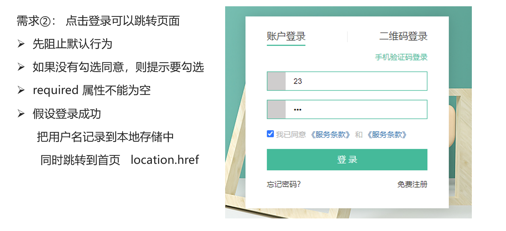

#### 🚩 Code login

```js
// 点击提交模块
const form = document.querySelector('form')
const agree = document.querySelector('[name=agree]')
const username = document.querySelector('[name=username]')
form.addEventListener('submit', function (e) {
  e.preventDefault()
  // 判断是否勾选同意协议
  if (!agree.checked) {
    return alert('请勾选同意协议')
  }
  
  // 记录用户名到本地存储
  localStorage.setItem('xtx-username', username.value)
  // 跳转到首页
  location.href = './index.html'
})
```


### 6.3 从登录页过来自动显示名字


#### 🚩 Code show

```js
// 1、 获取第一个小li
const li1 = document.querySelector('.xtx_navs li:first-child')
const li2 = li1.nextElementSibling
// 2. 最好做个渲染函数 因为退出登录需要重新渲染
function render() {
    // 2.1 读取本地存储的用户名
    const uname = localStorage.getItem('xtx-uname')
    // console.log(uname)
    if (uname) {
        li1.innerHTML = `<a href="javascript:;"><i class="iconfont icon-user">${uname
    }</i></a>
        `
        li2.innerHTML = '<a href="javascript:;">退出登录</a>'
    } else {
        li1.innerHTML = '<a href="./login.html">请先登录</a>'
        li2.innerHTML = '<a href="./register.html">免费注册</a>'
    }
}
render()  // 调用函数

// 2. 点击退出登录模块
li2.addEventListener('click', function () {
    // 删除本地存储的数据
    localStorage.removeItem('xtx-uname')
    // 重新渲染
    render()
})
```


### 6.4 退出登录

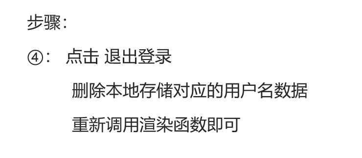


### 6.5 移动端打开

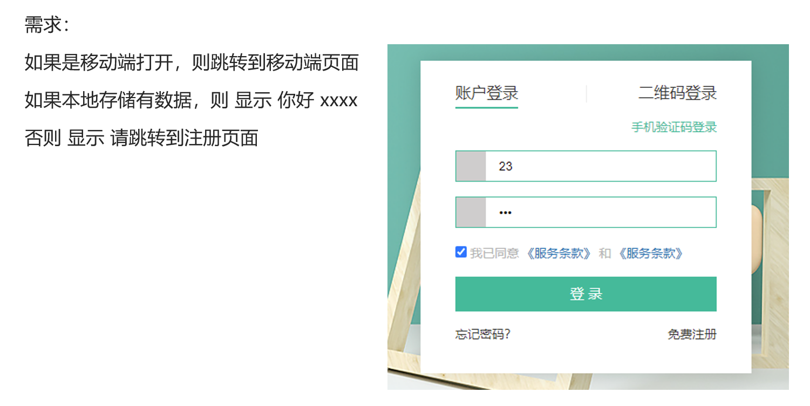

```js
// 检测 userAgent（浏览器信息）
;(function () {
    const userAgent = navigator.userAgent
    // 验证是否为Android或iPhone
    const android = userAgent.match(/(Android);?[\s\/]+([\d.]+)?/)
    const iphone = userAgent.match(/(iPhone\sOS)\s([\d_]+)/)

    // 如果是Android或iPhone，则跳转至移动站点
    if (android || iphone) {
        location.href = 'http://m.itcast.cn'
    }
})()
```


### 作业

1. 用xmind 整理今天的内容, 抽查


### PS. 

1. [常用的20个正则表达式](https://juejin.cn/post/6844903430637486088)
2. [有了这25个正则表达式，代码效率提高80%](https://juejin.cn/post/7016871226899431431)
3. 关闭tab栏, Ctrl + w  /  Cmd + w