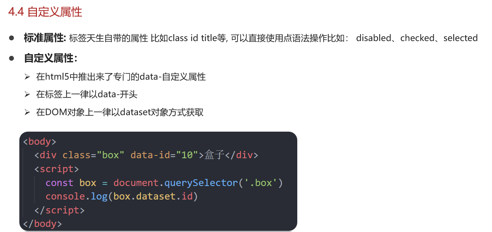
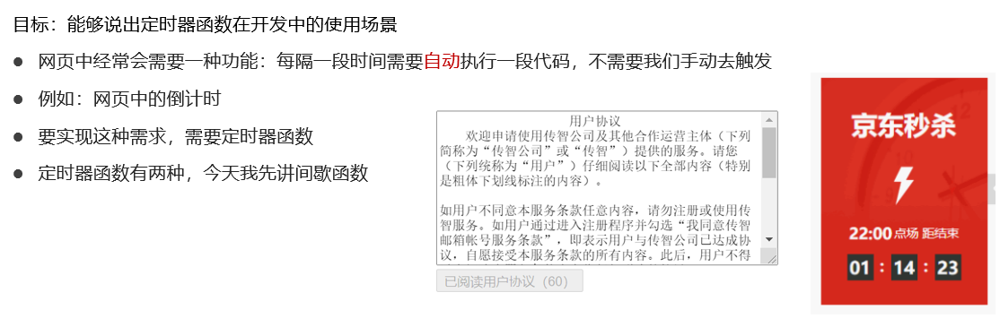
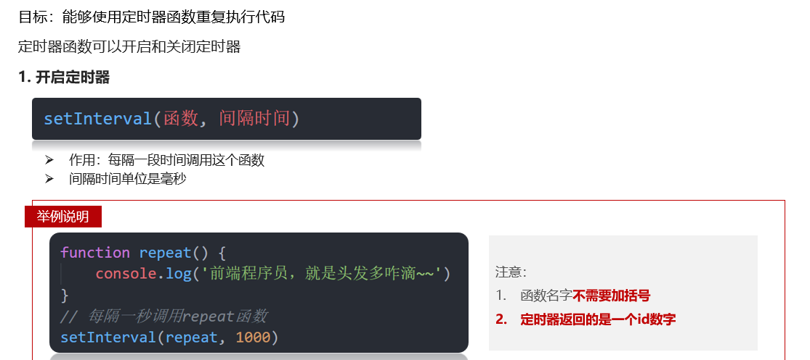
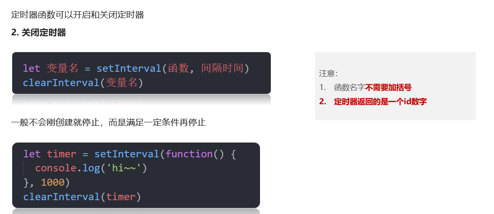
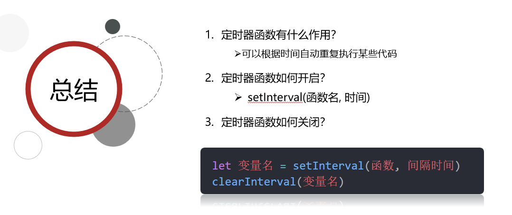
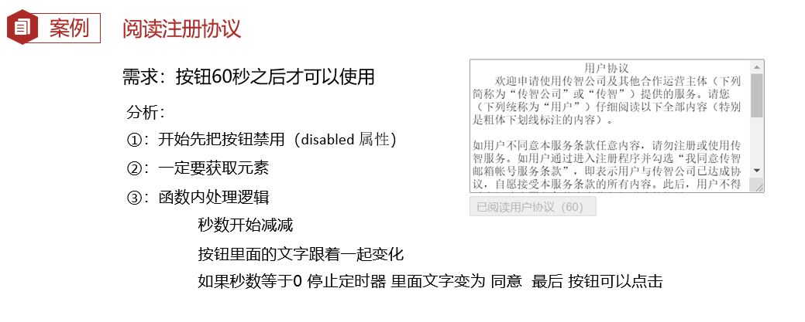
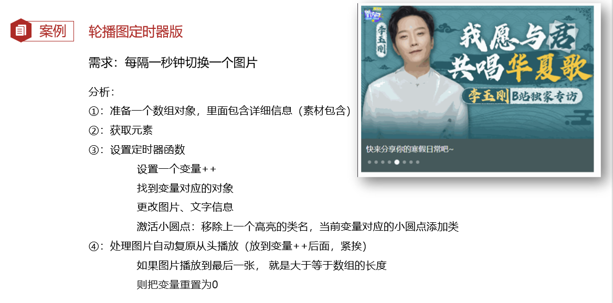

## Target

1. 能够通过data-自定义属性并且获取自定义属性的值
2. 能够定义一个定时器setInterval并说出执行过程
3. 能够完成今日案例- 轮播图定时版

💡🚀🤟👉👇☀️🍉🍍🍇🍓🥕🍭🎖️🎁☘️🍀💯🔆❗🔥🚩

🚩: 代码

🔥: 重点, 背下来

## 1. 自定义属性



#### Code 01 🚩

```html
  <div data-id="1" data-spm="不知道">1</div>
  <div data-id="2">2</div>
  <div data-id="3">3</div>
  <div data-id="4">4</div>
  <div data-id="5">5</div>
```

```js
const div = document.querySelector('div')

console.log(div.dataset)
console.log(typeof div.dataset)  // object

console.log(div.dataset.id)
console.log(div.dataset['id'])

// 如果自定义属性里面有多个-链接的单词，我们获取的时候采取 驼峰命名法
console.log(div.dataset['listName'])
console.log(div.dataset.listName)

// H5 新增 获取自定义属性的方法 element.dataset 
// 1. 只能获取到以  data-  开头的属性
// 2. 获取到的是一个对象, 存放了所有以data开头的自定义属性
//    element.dataset.属性名
//    element.dataset['属性名']
// 3. dataset对象内,属性名从短横线变为驼峰
```


## 2. 定时器 - 间歇函数

### 2.1 定时器函数的介绍



### 2.2 开启定时器



#### Code 02 🚩

```js
// setInterval(函数, 间隔时间)
// window.setInterval(fn, wait)
// 每隔一段时间, 就会执行一次, 会重复执行这个定时器,一直执行

// 1. 直接把函数写在 setInterval() 里面
setInterval(function(){
  // console.log('全世界最好的班长~')
}, 1000)

// 2. 先声明一个函数, 再传入
const cb = function() {
  console.log('wa~ 一秒执行一次')
}
setInterval(cb, 1000)   // 函数名不要加小括号!

// 3. 看到谁这么写，默默给他一个鄙视的眼神， 极为少见，容易被锤
setInterval('cb()', 2000)
```


### 2.3 关闭定时器



#### Code 03 🚩

```js
// 定时器函数有一个返回值，是一个数字, 是当前定时器的唯一标识
let timer1 = setInterval(function() {
    console.log('hi~~~1')
}, 1000)
console.log(timer1)  // 1

let timer2 = setInterval(function() {
    console.log('hi~~~2')
}, 1000)
console.log(timer2) // 2 每一个定时器的id独一无二

// 关闭定时器
clearInterval(timer1)
clearInterval(timer2)
```

#### Code 04 🚩

```js
// 为什么用let ? 

// const 声明的变量, 不能被修改(重新赋值)
// const num = 10
// num = 10
// console.log(num) // Error

// 为什么用let?

// 声明待会儿要执行的函数
// 回调函数: 回头再调用的函数
const fn = function(){
  console.log('玛卡巴卡')
}
// 1.开启定时器
let n = setInterval(fn, 1000)
// 2.关闭定时器
clearInterval(n)
// 3. 重新开启定时器
n = setInterval(fn, 1000)
console.log(n)    
```


### 2.4 总结



### 2.5 案例 - 阅读注册协议



#### Code 05 🚩

```js
// 1. 获取元素
const btn = document.querySelector('.btn')
// console.log(btn.innerHTML)  button内容 用innerHTML  

// 2. 开启定时器
let i = 5  // 声明变量倒计时
let timer = setInterval(function () {
  i--
  btn.innerHTML = `我已经阅读用户协议(${i})`
 
  if (i === 0) {
    clearInterval(timer)  // 关闭定时器
    // 定时器停了，我就可以开按钮
    btn.disabled = false
    btn.innerHTML = '同意'
  }
}, 1000)
```

---

## 3. 轮播图定时版

### 案例分析



#### Code 06 🚩

```js
    // 初始数据
    const sliderData = [
      { url: './images/slider01.jpg', title: '对人类来说会不会太超前了？', color: 'rgb(100, 67, 68)' },
      { url: './images/slider02.jpg', title: '开启剑与雪的黑暗传说！', color: 'rgb(43, 35, 26)' },
      { url: './images/slider03.jpg', title: '真正的jo厨出现了！', color: 'rgb(36, 31, 33)' },
      { url: './images/slider04.jpg', title: '李玉刚：让世界通过B站看到东方大国文化', color: 'rgb(139, 98, 66)' },
      { url: './images/slider05.jpg', title: '快来分享你的寒假日常吧~', color: 'rgb(67, 90, 92)' },
      { url: './images/slider06.jpg', title: '哔哩哔哩小年YEAH', color: 'rgb(166, 131, 143)' },
      { url: './images/slider07.jpg', title: '一站式解决你的电脑配置问题！！！', color: 'rgb(53, 29, 25)' },
      { url: './images/slider08.jpg', title: '谁不想和小猫咪贴贴呢！', color: 'rgb(99, 72, 114)' },
    ]
```

**1. 开定时器**

```js
// 1. 获取元素 
const img = document.querySelector('.slider-wrapper img')
const p = document.querySelector('.slider-footer p')
let i = 0  // 控制图片的张数
// 2. 开启定时器
console.log(sliderData[i])
setInterval(function(){
  i++
  console.log(sliderData[i])
}, 1000)
```

**2. 修改内容**

```js
// 1. 获取元素 
const img = document.querySelector('.slider-wrapper img')
const p = document.querySelector('.slider-footer p')
let i = 0  // 控制图片的张数
// 2. 开启定时器
// console.log(sliderData[i])
setInterval(function(){
  i++
    
  //=========================todo 02 
  // 更换图片路径
  img.src = sliderData[i].url
  // 修改p标签的内容
  p.innerHTML = sliderData[i].title
  
  // 小圆点
  const li_old = document.querySelector('.slider-indicator .active')
  // 先删除以前的active
  li_old.classList.remove('active')

  const li_now = document.querySelector(`.slider-indicator li:nth-child(${i + 1})`)
  // 只让当前li添加active
  li_now.classList.add('active')
  //=================================== 
}, 1000)
```

**3. 无缝衔接**

```js
setInterval(function () {
  i++
  //=========================
  // 无缝衔接位置  一共八张图片，到了最后一张就是 8， 数组的长度就是 8
  if (i >= sliderData.length) {
    i = 0
  } 
  console.log(i)
  //=============================省略
```


## 4. 快捷操作

### 4.1 分屏

	- windows :  win + 方向键
	- mac : 左上角绿色小点, 右击

### 4.2 刷新

- Ctrl + R   /  Cmd + R
- Ctrl + Shift + R  /  Cmd + Shift + R

### 4.3 控制台

#### 打开浏览器控制台

- ctrl  + shift + j
- cmd + shift + j

#### 切换控制台方向

- ctrl + shift + d
- cmd + shift + d