## Target

1. 能够说出事件流的2个阶段执行过程
2. 能够写出阻止事件冒泡和元素默认行为的代码
3. 能够说出事件委托的好处以及原理
4. 能够利用事件委托完成tab栏的改造
5. 能够写出页面滚动事件
6. 能够跟随课堂代码完成电梯导航案例

💡🚀🤟👉👇☀️🍉🍍🍇🍓🥕🍭🎖️🎁☘️🍀💯🔆❗🔥🚩

- https://emojipedia.org/fire/  emoji

## 1. Eg. 案例全选反选

### 1.1 全选

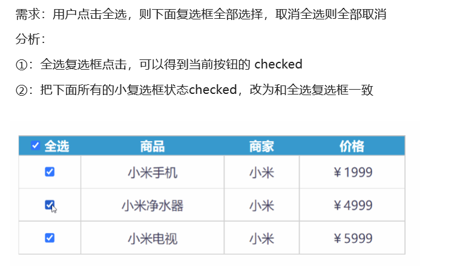

#### Code 01 🚩

```js
// 1. 获取大复选框
const checkAll = document.querySelector('#checkAll')
// 2. 获取所有的小复选框
const cks = document.querySelectorAll('.ck')
// 3. 点击大复选框  注册事件
checkAll.addEventListener('click', function () {
  // 得到当前大复选框的选中状态
  // console.log(checkAll.checked)  // 得到 是 true 或者是 false
  // 4. 遍历所有的小复选框 让小复选框的checked  =  大复选框的 checked
  for (let i = 0; i < cks.length; i++) {
    cks[i].checked = this.checked
  }
})
```

### 1.2 反选

#### Code 02 🚩

> :checked 伪类选择器，选择被勾选的复选框

```html
  <style>
    /* 选择被勾选的复选框 */
    .ck:checked {  
      width: 20px;
      height: 20px;
    }
  </style>

<body>
  <input type="checkbox" name="" id="" class="ck">
  <input type="checkbox" name="" id="" class="ck">
  <input type="checkbox" name="" id="" class="ck">
  <input type="checkbox" name="" id="" class="ck">
</body>
```

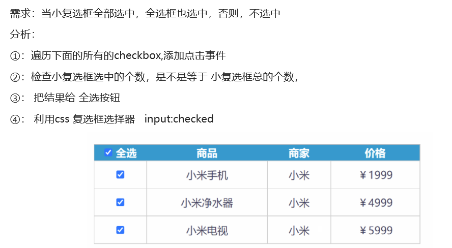

#### Code 01 🚩

> 反选

```js
// todo 02 
// 5. 小复选框控制大复选框
for (let i = 0; i < cks.length; i++) {
  // 5.1 给所有的小复选框添加点击事件
  cks[i].addEventListener('click', function () {
    // 判断选中的小复选框个数 是不是等于  总的小复选框个数
    // 一定要写到点击里面，因为每次要获得最新的个数
    // console.log(document.querySelectorAll('.ck:checked').length)
    // console.log(document.querySelectorAll('.ck:checked').length === cks.length)
    checkAll.checked = document.querySelectorAll('.ck:checked').length === cks.length
  })
}
```

## 2. 事件流 🔥

### 2.1 概念

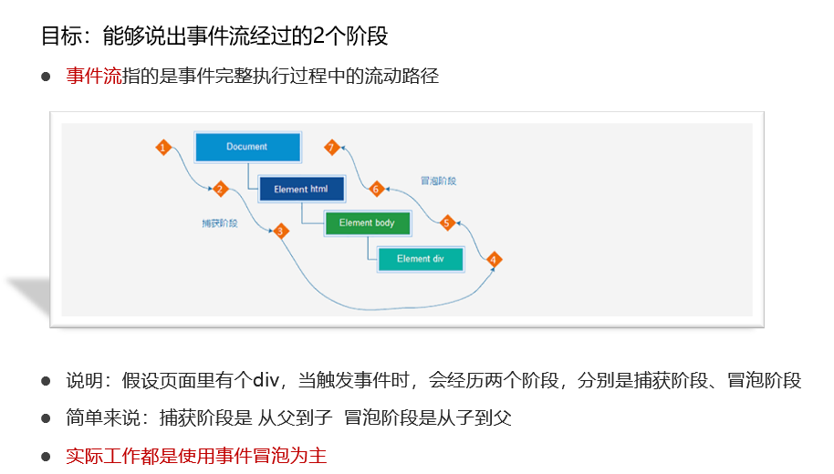

---

> **事件流**描述的是元素在页面中接收事件的顺序。

DOM2 Events 规范规定<span style="color:red">**事件流分为 3 个阶段：**</span>

1. **事件捕获**  (由外到内，下水捕鱼)
2. 到达目标  (抓到鱼了）
3. **事件冒泡**  (由内到外，把鱼抓上来，鱼冒泡泡）

### 2.2 事件捕获（了解）

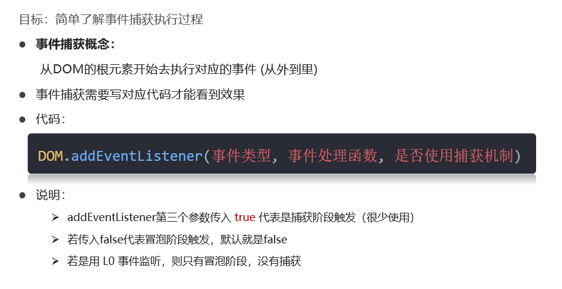

#### Code 03 🚩

- 事件捕获 ： 手指按压手机屏幕， 最外层的钢化膜接收到按压的事件了， 再手机屏幕接受到了，手机内部传感器接收到了
- 到达目标 ： 按压指令到达CPU.
- 事件冒泡 ： 松开手指，最内层先感受不到这个按压事件, 依次往外。

```js
// DOM事件流三个阶段
// 捕获阶段
// 达到目标阶段
// 冒泡阶段

// Eg：北京的朋友来成都请我吃饭。
// 四川 成都 金牛区 目标（我）  捕获阶段  
// 找到目标了   达到目标阶段（处于目标阶段）
// 金牛 成都 四川    （回去了）  冒泡阶段

const son = document.querySelector('.son')
const father = document.querySelector('.father')
const body = document.body
const html = document.documentElement

// 事件捕获：document  ->  html -> body -> father -> son

// 事件捕获：addEventListener第三参数为 true
son.addEventListener('click', function(){
    console.log('我是子盒子,我被点击了')
}, true)

father.addEventListener('click', function(){
    console.log('我是父盒子, 我被点击了')
}, true)

body.addEventListener('click', function(){
    console.log('我是body, 我被点击了')
}, true)

html.addEventListener('click', function(){
    console.log('我是html, 我被点击了')
}, true)

document.addEventListener('click', function(){
    console.log('我是document, 我被点击了')
}, true)
```

###  2.3 事件冒泡 🔥


---

**事件冒泡**： 事件从最具体的元素（文档树中最深的节点）开始触发，然后向上传播至没有那么具体的元素（文档）(---JS高程)

#### Code 04 🚩

```js
// 事件冒泡： son ->  father -> body -> html -> document
const son = document.querySelector('.son')
const father = document.querySelector('.father')
const body = document.body
const html = document.documentElement

// 事件冒泡：addEventListener第三个参数省略，或者为false
son.addEventListener('click', function(){
    console.log('我是子盒子,我被点击了')
})

father.addEventListener('click', function(){
    console.log('我是父盒子, 我被点击了')
})

body.addEventListener('click', function(){
    console.log('我是body, 我被点击了')
})

html.addEventListener('click', function(){
    console.log('我是html, 我被点击了')
})

document.addEventListener('click', function(){
    console.log('我是document, 我被点击了')
})
```

### 2.4 阻止事件冒泡

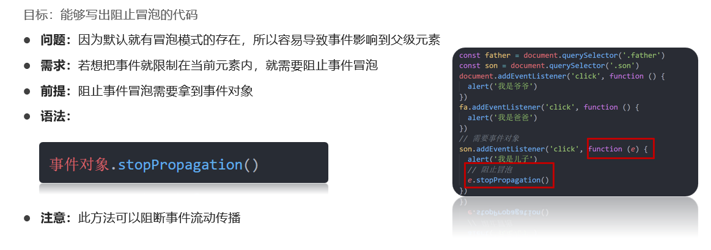

### 2.5 阻止默认行为

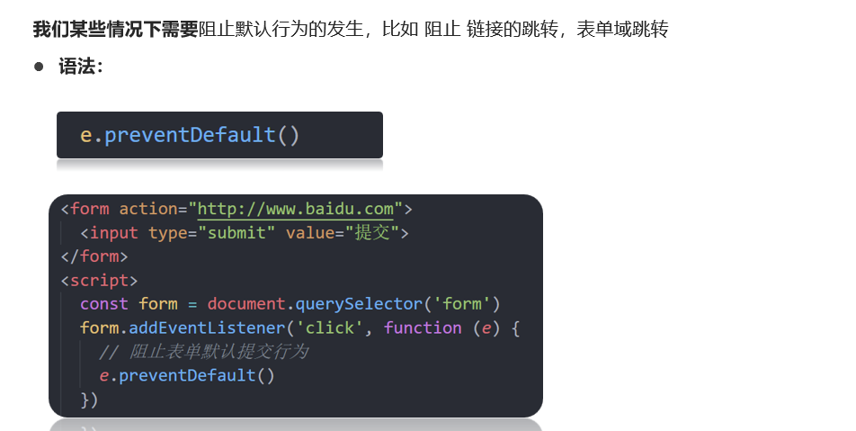

#### Code 10 🚩

```js
const form = document.querySelector('form')
form.addEventListener('submit', function (e) {
  // 阻止默认行为  提交
  e.preventDefault()
})

const a = document.querySelector('a')
a.addEventListener('click', function (e) {
  e.preventDefault()
})
```

### 2.6 小结 🔥

DOM2 Events 规范规定**事件流分为 3 个阶段：**

1. **事件捕获**  (由外到内，下水捕鱼)
2. 到达目标  (抓到鱼了）
3. **事件冒泡**  (由内到外，把鱼抓上来，鱼冒泡泡）

阻止事件冒泡 ：**e.stopPropagation()**

阻止默认行为 ：**e.preventDefault()**

### 2.7 解绑事件

#### 2.7.1 传统方式

```js
eventTarget.onclick = null
```

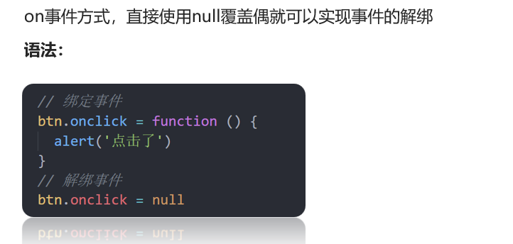

#### 2.7.2 事件监听方式

```js
eventTarget.removeEventListener(type, listener)
```

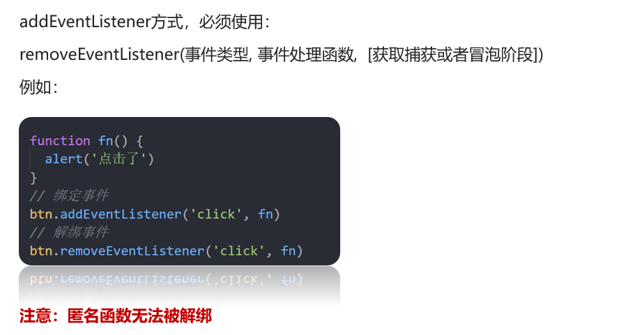

#### Code 05 🚩

```js
const btn = document.querySelector('button')
// btn.onclick = function () {
//   console.log('点击了')
//   // L0 事件移除解绑
//   btn.onclick = null
// }

// 事件监听
function fn() {
  console.log('点击了')
}
btn.addEventListener('click', fn)
// L2 事件移除解绑
btn.removeEventListener('click', fn)
```

### 2.8 鼠标经过

- mouseenter 和 mouseleave 事件不冒泡 

- mouseover  / mouseout  有冒泡效果

#### Code 06  🚩

```js
const dad = document.querySelector('.dad')
const baby = document.querySelector('.baby')
dad.addEventListener('mouseenter', function () {
  console.log('鼠标经过')
})
dad.addEventListener('mouseleave', function () {
  console.log('鼠标离开')
})
```

### 2.8 两种注册事件的区别

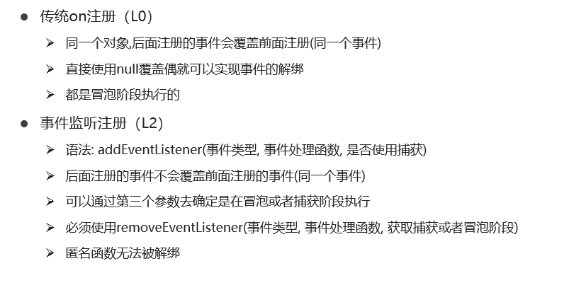

## 3. 事件委托

### 3.1 概念

**事件委托** ：把事件委托给别人，代为处理。

> 说白了就是，不给子元素注册事件，给父元素注册事件，把处理代码在父元素的事件中执行。

```js
生活中的代理：

咱们班有100个学生， 快递员有100个快递， 如果一个个的送花费时间较长。同时每个学生领取的时候，也需 要排队领取，也花费时间较长，何如？

**解决方案：** 快递员把100个快递，委托给班主任，班主任把这些快递放到办公室，同学们下课自行领取即可。

**优势：** 快递员省事，委托给班主任就可以走了。 同学们领取也方便，因为相信班主任。
```

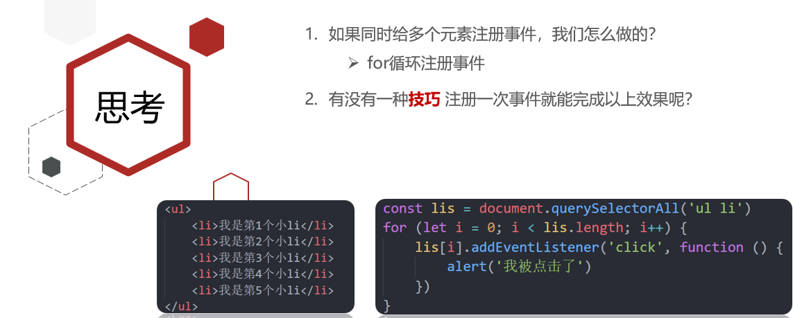

### 3.2 事件委托原理 🔥

> **利用事件冒泡，将事件监听绑定在父节点上，通过父节点来监听子节点的事件**

### 3.3 事件委托的好处 🔥


#### Code 07  🚩

```js
// 需求：点击每个小li 当前li 文字变为橘黄色
// 按照事件委托的方式  委托给父级，事件写到父级身上
// 1. 获得父元素
const ul = document.querySelector('ul')
ul.addEventListener('click', function (e) {
  // alert(11)
  // this.style.color = 'red'
  // console.dir(e.target) // 就是我们点击的那个对象
  // e.target.style.color = 'red'
  // 我的需求，我们只要点击li才会有效果
  if (e.target.tagName === 'LI') {
    e.target.style.color = 'red'
  }
})
```

### 3.4 小结

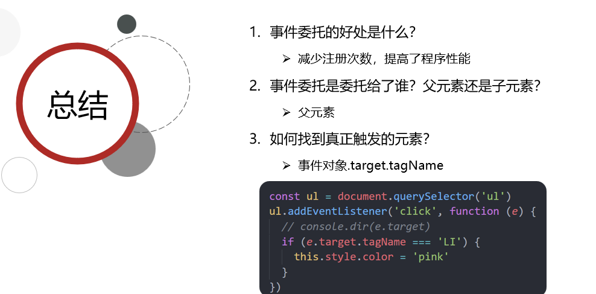

### 3.5 Eg. Tab栏切换


#### Code 08 🚩 

```js
 // 采取事件委托的形式 tab栏切换
// 1. 获取 ul 父元素 因为 ul只有一个
const ul = document.querySelector('.tab-nav ul')
// 获取 5个 item 
const items = document.querySelectorAll('.tab-content .item')
// 2. 添加事件
ul.addEventListener('click', function (e) {
  // console.log(e.target)  // e.target是我们点击的对象
  // 我们只有点击了 a 才会 进行 添加类和删除类操作 
  // console.log(e.target.tagName)  // e.target.tagName 点击那个对象的 标签名
  if (e.target.tagName === 'A') {
    // console.log('我选的是a')
    // 排他思想 ，先移除原来的active  
    document.querySelector('.tab-nav .active').classList.remove('active')
    //当前元素添加 active  是 e.target
    // this 指向ul 不能用this 
    e.target.classList.add('active')

    // 下面大盒子模块
    // console.log(e.target.dataset.id)
    const i = e.target.dataset.id
    // 排他思想 ，先移除原来的active 
    document.querySelector('.tab-content .active').classList.remove('active')
    // 对应的大盒子 添加 active 
    // document.querySelector(`.tab-content .item:nth-child(${i + 1})`).classList.add('active')
    items[i].classList.add('active')
  }
})
```

#### Code 09 🚩

```js
// 自定义属性 ，我们自己定义的一些属性。
const div = document.querySelector('div')
console.log(div)
console.log(div.dataset) // object

console.log(typeof div.dataset)
// 对象获取属性 
// 1. 对象.属性名
// 2. 对象['属性名']
console.log(div.dataset.id)
console.log(div.dataset.spm)
console.log(div.dataset['id'])

console.log(div.dataset.testId)
console.log(div.dataset['testId'])

// 1. H5 新增， 以 data- 来定义自定义属性。
// 2. 要获取自定义属性，通过dataset。
//    它获取到的是一个对象，存放了所有以data开头定义的自定义属性
//  element.dataset.属性名
//  element.dataset['属性名']
// 3. dataset内， 属性名从短横线变为了驼峰。
```


## 4. 其他事件

### 4.1 页面加载事件 🔥

> window.addEventListener('load',  fn)  🔥

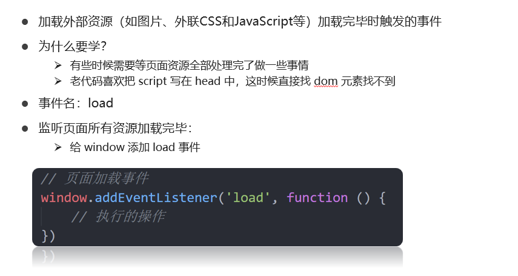

> document.addEventListener('DOMContentLoaded', fn) 🔥


#### Code 11 🚩

```js
// 等待页面所有资源加载完毕，就回去执行回调函数
window.addEventListener('load', function () {
  const btn = document.querySelector('button')
  btn.addEventListener('click', function () {
    console.log('哇哦~')
  })
})

// 当DOM元素加载完成时，不包括样式表，图片等， 执行回调函数
document.addEventListener('DOMContentLoaded', function () {
  const btn = document.querySelector('button')
  btn.addEventListener('click', function () {
    console.log('玛卡巴卡')
  })
})
```

#### 小结

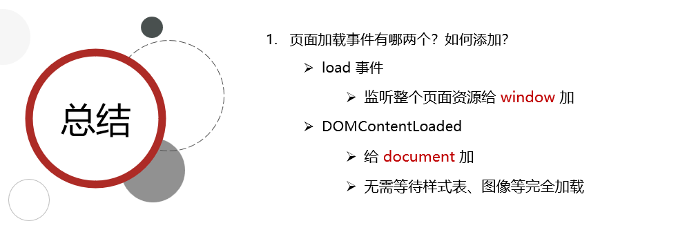

PS. 扩展，感兴趣的同学可以了解下

[w3.org/TR/navigation-timing-2](https://www.w3.org/TR/navigation-timing-2/#processing-model)


### 4.2 元素滚动事件

#### 4.2.1 scroll 事件

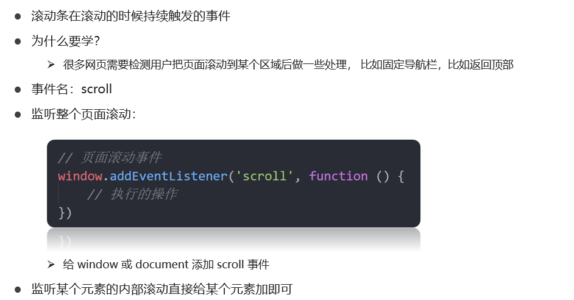

#### 4.2.2 使用场景


#### 4.2.3 被卷去的头部

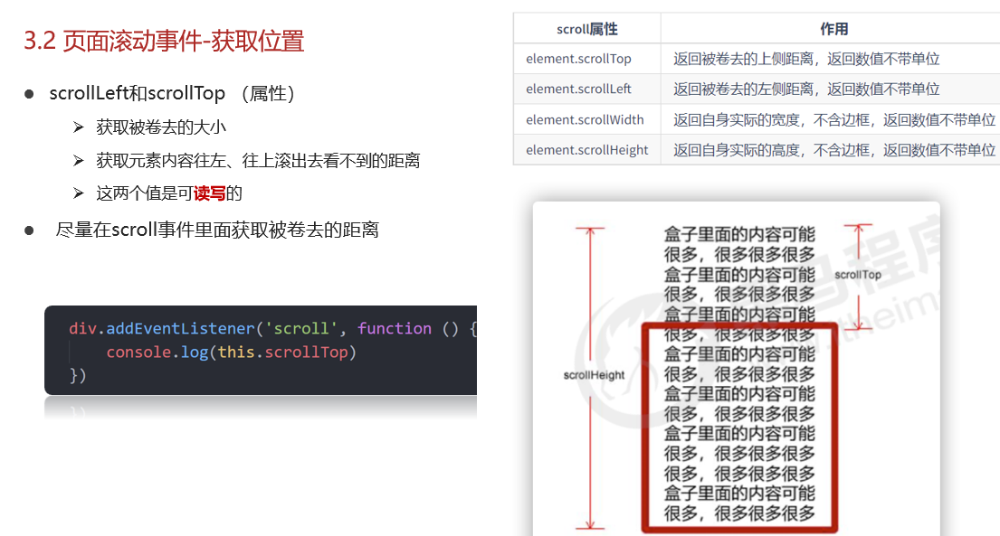


#### 4.2.4 实际开发

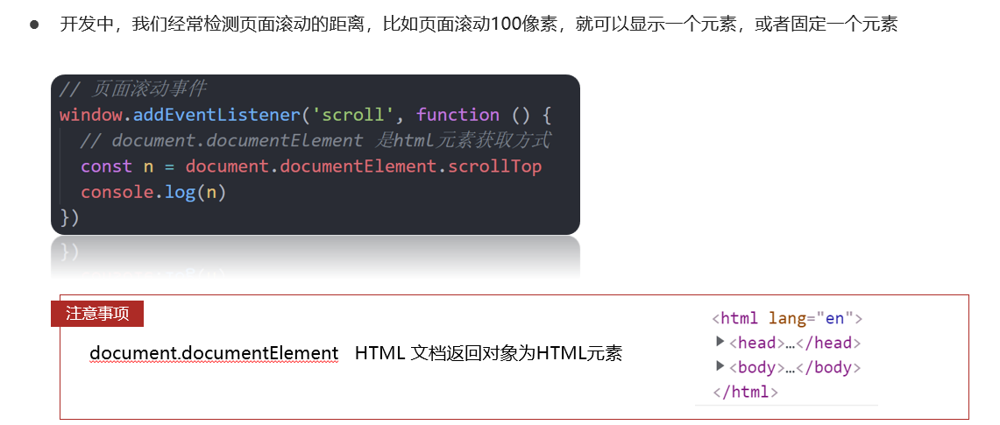

#### Code 12 🚩

```js
// 页面滚动事件
window.addEventListener('scroll', function () {
  // console.log('我滚了')
  // 我想知道页面到底滚动了多少像素， 被卷去了多少  scrollTop
  // 获取html元素写法  
  // document.documentElement  
  // console.log(document.documentElement.scrollTop)
  const n = document.documentElement.scrollTop
  if (n >= 100) {
    div.style.display = 'block'
  } else {
    div.style.display = 'none'
  }
})

// 对元素监听scroll事件
const div = document.querySelector('div')
div.addEventListener('scroll', function () {

  // scrollTop 元素被卷去的头部
  console.log(div.scrollTop)  // 返回的时number 不带单位
})
```

#### Code 13 🚩

```js
window.addEventListener('scroll', function () {
    // 必须写到里面
    const n = document.documentElement.scrollTop
    // 得到是什么数据   数字型 不带单位
    console.log(n)
    console.log(window.pageYOffset)
})

// scrollTop属性时可读写的， 也就是可以获取，可以设置(修改)
document.documentElement.scrollTop = 800


// 1. 页面被卷去的头部 window.pageYOffset  新方法
// 2. document.documentElement.scrollTop html被卷去的头部， 也可以表示页面被卷去的头部
```

#### 4.2.5 小结

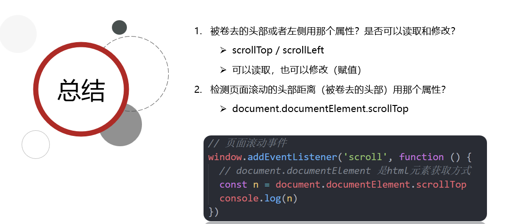

#### 4.2.6 Eg. 页面滚动显示侧边栏

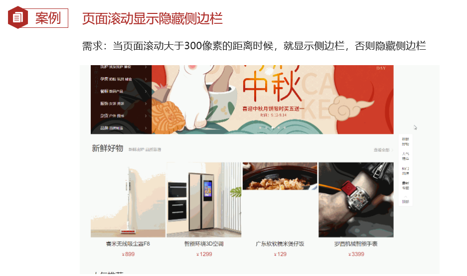

```bash
# 需求 1 ：当页面滚动大于300像素的距离时候，就显示侧边栏，否则隐藏侧边栏
分析：
①：需要用到页面滚动事件
②：检测页面被卷去的头部，如果大于300，就让侧边栏显示
③：显示和隐藏配合css过渡，利用opacity加渐变效果

# 需求 2 ： 点击返回按钮， 页面会返回顶部
分析：
①：绑定点击事件
②：利用scrollTop 让页面返回顶部
```

#### Code 20 🚩

```js
// todo 01
// 获取元素
const elevator = document.querySelector('.xtx-elevator')
// 1. 当页面滚动大于 300像素，就显示 电梯导航
// 2. 给页面添加滚动事件
window.addEventListener('scroll', function () {
  // 被卷去的头部大于 300 
  const n = document.documentElement.scrollTop
  // if (n >= 300) {
  //   elevator.style.opacity = 1
  // } else {
  //   elevator.style.opacity = 0
  // }
  // 简写
  elevator.style.opacity = n >= 300 ? 1 : 0
})

// todo 02 
// 点击返回页面顶部  写在下面
const backTop = document.querySelector('#backTop')
backTop.addEventListener('click', function () {
  // 可读写
  // document.documentElement.scrollTop = 0
  // window.scrollTo(x, y)
  window.scrollTo(0, 0)
})
```

### 4.3 页面尺寸变化事件

#### 4.3.1 resize事件


#### 4.3.2 clientWidth / clientHeight

> clientWidth 获取元素的大小(宽度)   / clientHeight 高度
>
> clientWidth = width + padding     ====> 不包含border， 返回值不带单位


#### Code 14 🚩

- [JS代码什么时候加分号?](https://www.zhihu.com/question/20298345/answer/14670020 JS是否需要加分号) 

```js
// 1. resize 事件
// resize 浏览器窗口大小发生变化的时候触发的事件
window.addEventListener('resize', function () {
  console.log(1)
})

// 2. clientWidth 动态获取元素大小
// clientWidth = width + padding  不包含border， 返回值不带单位
const div = document.querySelector('div')
console.log(div.clientWidth)

```

## 5. 元素的尺寸与位置

### 5.1 使用场景

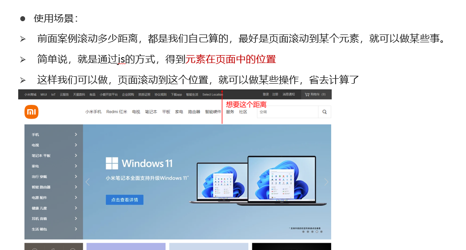

### 5.2 宽高/位置

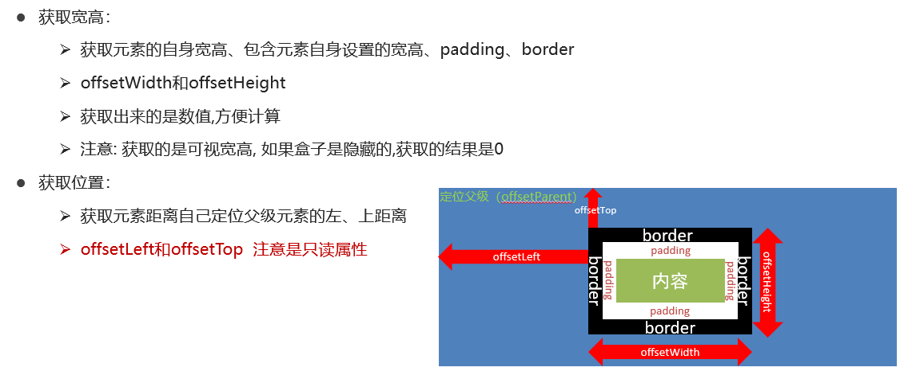

### 5.3 小结


#### Code 15 🚩

```css
.box {
    position: relative;
    width: 300px;
    height: 300px;
    background: pink;
    margin: 300px auto;
}

.son {
    width: 100px;
    height: 100px;
    background-color: palegreen;
}
```

```html
<div class="box">
    <div class="son"></div>
</div>
```

```js
// 获取元素box
var box = document.querySelector('.box')
var son = document.querySelector('.son')
// 1. offsetLeft / offsetTop
console.log(box.offsetLeft)
console.log(box.offsetTop)

console.log(son.offsetLeft)
console.log(son.offsetTop)

// 2. offsetWidth / offsetHeight
// offsetWidth =  width + padding + border
// offsetHeight = height + padding + border
console.log(son.offsetWidth)
console.log(son.offsetHeight)

// ====== change Code 20
  // 获取元素
  const entry = document.querySelector('.xtx_entry')
  const elevator = document.querySelector('.xtx-elevator')
  // 1. 当页面滚动大于 300像素，就显示 电梯导航
  // 2. 给页面添加滚动事件
  window.addEventListener('scroll', function () {
    // 被卷去的头部大于 300 
    const n = document.documentElement.scrollTop
    // if (n >= 300) {
    //   elevator.style.opacity = 1
    // } else {
    //   elevator.style.opacity = 0
    // }
    // 简写
    elevator.style.opacity = n >= entry.offsetTop ? 1 : 0
  })
```

### 5.4 Eg. 放新浪固定头部

#### Code 16 🚩

```js
const sk = document.querySelector('.sk')
const header = document.querySelector('.header')
// 1. 页面滚动事件
window.addEventListener('scroll', function () {
  // 当页面滚动到 秒杀模块的时候，就改变 头部的 top值
  // 页面被卷去的头部 >=  秒杀模块的位置 offsetTop
  const n = document.documentElement.scrollTop
  // if (n >= sk.offsetTop) {
  //     header.style.top = 0
  // } else {
  //     header.style.top = '-80px'
  // }
  header.style.top = n >= sk.offsetTop ? 0 : '-80px'
})
```

### 5.5 getBoundingClientRect()

- element.getBoundingClientRect()  返回一个对象, 提供了元素的大小及其相对于[视口](https://developer.mozilla.org/zh-CN/docs/Glossary/Viewport)的位置。

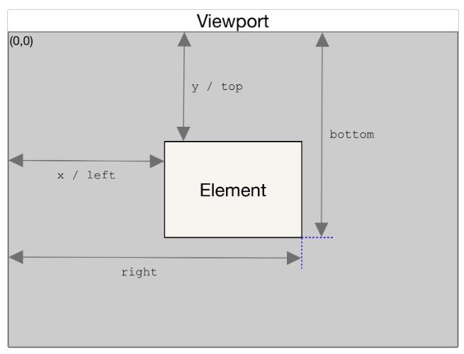

```js
const div = document.querySelector('div')
console.log(div.getBoundingClientRect())
```


### 5.4 Eg. BiliBli点击小滑块移动

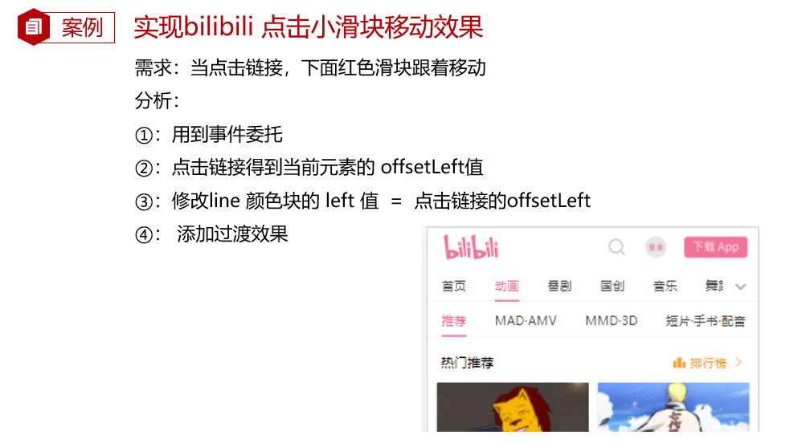

#### Code BiliBli 🚩

```js
// 1. 事件委托的方法 获取父元素 tabs-list
const list = document.querySelector('.tabs-list')
const line = document.querySelector('.line')
// 2. 注册点击事件
list.addEventListener('click', function (e) {
  // 只有点击了A 才有触发效果
  if (e.target.tagName === 'A') {
    // console.log(11)
    // 当前元素是谁 ？  e.target
    // 得到当前点击元素的位置
    // console.log(e.target.offsetLeft)
    // line.style.transform = 'translateX(100px)'
    // 把我们点击的a链接盒子的位置  然后移动
    line.style.transform = `translateX(${e.target.offsetLeft}px)`
  }
})
```

### 5.5 获取元素大小位置（2）

> element.getBoundingClientRect()   返回元素的大小及其相对于视口的位置

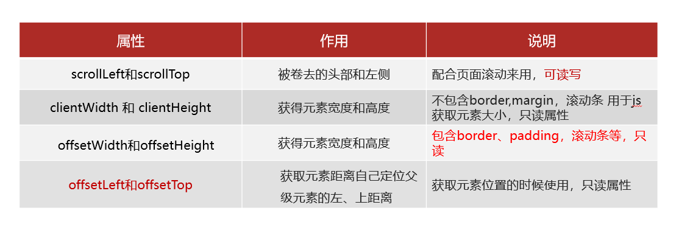

## 6. 电梯导航综合案例

### 6.1 需求分析

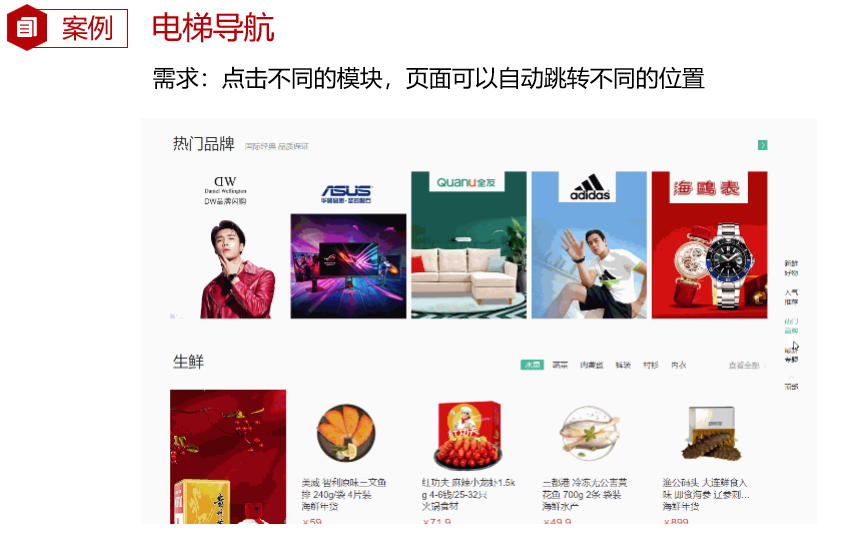

```bash
# 需求：点击不同的模块，页面可以自动跳转不同的位置
模块分析：
①：页面滚动到对应位置，导航显示，否则隐藏模块
②：点击导航对应小模块，页面 会跳到对应大模块位置
③：页面滚动到对应位置，电梯导航对应模块自动发生变化
```

> todo 01 

```js
// 第一大模块，页面滑动可以显示和隐藏
(function () {
  // 获取元素
  const entry = document.querySelector('.xtx_entry')
  const elevator = document.querySelector('.xtx-elevator')
  // 1. 当页面滚动大于 300像素，就显示 电梯导航
  // 2. 给页面添加滚动事件
  window.addEventListener('scroll', function () {
    // 被卷去的头部大于 300 
    const n = document.documentElement.scrollTop
    // if (n >= 300) {
    //   elevator.style.opacity = 1
    // } else {
    //   elevator.style.opacity = 0
    // }
    // 简写
    elevator.style.opacity = n >= entry.offsetTop ? 1 : 0
  })

  // 点击返回页面顶部
  const backTop = document.querySelector('#backTop')
  backTop.addEventListener('click', function () {
    // 可读写
    // document.documentElement.scrollTop = 0
    // window.scrollTo(x, y)
    window.scrollTo(0, 0)
  })
})();
```

>  todo 02 

```bash
模块分析：
①：显示隐藏电梯盒子和返回顶部已经完成，可以放到自执行函数里面，防止变量污染
②：电梯模块单独放到自执行函数里面
# todo02 
③：点击每个模块，页面自动滚动到对应模块，使用事件委托方法更加简单
④：页面滚动到对应位置，电梯导航对应模块自动发生变化

# 模块分析2：点击每个模块，页面自动滚动到对应模块，使用事件委托方法更加简单
①：点击小模块，当前添加 active这个类
②：解决处理初次获取不到active 报错的问题
解决方案：
①： 不能直接获取这个类，然后移除，这样会报错
②： 先获取这个类，然后加个判断
        - 如果有这个类，就移除
        - 如果么有这个类，返回为 null， 就不执行移除，就不报错了
```

```js
;(function(){
    // 2. 点击页面可以滑动 
    const list = document.querySelector('.xtx-elevator-list')
    list.addEventListener('click', function (e) {
    
    if (e.target.tagName === 'A') {
      // 排他思想  
      // 先移除原来的类active 
      // 先获取这个active的对象
      const old = document.querySelector('.xtx-elevator-list .active')
      // console.log(old)
      // 判断 如果原来有active类的对象，就移除类，如果开始就没有对象，就不删除，所以不报错
      if (old) old.classList.remove('active')
      // 当前元素添加 active 
      e.target.classList.add('active')
      
    }
  })
})()
```

> todo 03 

```js
点击小盒子li，页面跳转到对应大盒子位置
核心思想： 把对应大盒子的offfsetTop 给document.documentElement.scrollTop 
①： 我们发现小盒子li 的自定义属性里面值 跟 大盒子 后面一致
②： 利用模板字符串 把点击的 自定义属性值 给 大盒子，就找到对应的大盒子了，
③：然后拿到这个大盒子的 offsetTop 值 给  document.documentElement.scrollTop 即可
```

```js
  // 2. 点击页面可以滑动 
  const list = document.querySelector('.xtx-elevator-list')
  list.addEventListener('click', function (e) {
    if (e.target.tagName === 'A') {
      // 排他思想  
      // 先移除原来的类active 
      // 先获取这个active的对象
      const old = document.querySelector('.xtx-elevator-list .active')
      // console.log(old)
      // 判断 如果原来有active类的对象，就移除类，如果开始就没有对象，就不删除，所以不报错
      if (old) old.classList.remove('active')
      // 当前元素添加 active 
      e.target.classList.add('active')
      // todo new =================================
      // 获得自定义属性  new   topic 
      console.log(e.target.dataset)
      // console.log(e.target.dataset.name) 有了这个是不是就可以选出大盒子
      // 根据小盒子的自定义属性值 去选择 对应的大盒子
      // console.log(document.querySelector(`.xtx_goods_${e.target.dataset.name}`).offsetTop)
      // 获得对应大盒子的 offsetTop
      const top = document.querySelector(`.xtx_goods_${e.target.dataset.name}`).offsetTop
      // 让页面滚动到对应的位置
      document.documentElement.scrollTop = top
	  // todo end =====================================
    }
  })
```

> todo 04 

```js
// index.css
/* 页面滑动 */
html {
  /* 让滚动条丝滑的滚动 */
  scroll-behavior: smooth;
}
```

> todo 05 

```js
# 模块分析3：页面滚动到大盒子位置，电梯导航小盒子对应模块自动处于选中状态
①： 当页面滚动了，先移除所有小li的状态
②： 因为页面滚动需要不断获取大盒子的位置，所以需要把所有的大盒子都获取过来
③： 开始进行滚动判断
        - 如果页面滚动大于 新鲜好物大盒子的offsetTop  并且小于 人气推荐盒子的offsetTop 就把 对应的小盒子先出来添加类
       - 依次类推
       - 最后一个，如果大于等于最新专题模块， 就选出最后一个对应小盒子（更精确）
```

```js
    // 3. 页面滚动，可以根据大盒子选 小盒子 添加 active 类 
  window.addEventListener('scroll', function () {
    //  3.1  先移除类 
    // 先获取这个active的对象
    const old = document.querySelector('.xtx-elevator-list .active')
    // console.log(old)
    // 判断 如果原来有active类的对象，就移除类，如果开始就没有对象，就不删除，所以不报错
    if (old) old.classList.remove('active')  // todo 01 先移除类

  })
```

> todo 06 

```js
  // 获取4个大盒子
  const news = document.querySelector('.xtx_goods_new')
  const popular = document.querySelector('.xtx_goods_popular')
  const brand = document.querySelector('.xtx_goods_brand')
  const topic = document.querySelector('.xtx_goods_topic') 
  // 3. 页面滚动，可以根据大盒子选 小盒子 添加 active 类
  window.addEventListener('scroll', function () {
    //  3.1  先移除类 
    // 先获取这个active的对象
    const old = document.querySelector('.xtx-elevator-list .active')
    // console.log(old)
    // 判断 如果原来有active类的对象，就移除类，如果开始就没有对象，就不删除，所以不报错
    if (old) old.classList.remove('active')  // todo 01 先移除类
    // 3.2 判断页面当前滑动的位置，选择小盒子
    // 这一步, 不能写在外面
    const n = document.documentElement.scrollTop  // window.pageYOffset
    if (n >= news.offsetTop && n < popular.offsetTop) {
      // 选择第一个小盒子
      document.querySelector('[data-name=new]').classList.add('active')
    } else if (n >= popular.offsetTop && n < brand.offsetTop) {
      document.querySelector('[data-name=popular]').classList.add('active')
    } else if (n >= brand.offsetTop && n < topic.offsetTop) {
      document.querySelector('[data-name=brand]').classList.add('active')
    } else if (n >= topic.offsetTop) {
      document.querySelector('[data-name=topic]').classList.add('active')
    }
  })
```


#### Code 20 🚩

```js
// 第一大模块，页面滑动可以显示和隐藏
(function () {
  // 获取元素
  const entry = document.querySelector('.xtx_entry')
  const elevator = document.querySelector('.xtx-elevator')
  // 1. 当页面滚动大于 300像素，就显示 电梯导航
  // 2. 给页面添加滚动事件
  window.addEventListener('scroll', function () {
    // 被卷去的头部大于 300 
    const n = document.documentElement.scrollTop
    // if (n >= 300) {
    //   elevator.style.opacity = 1
    // } else {
    //   elevator.style.opacity = 0
    // }
    // 简写
    elevator.style.opacity = n >= entry.offsetTop ? 1 : 0
  })

  // 点击返回页面顶部
  const backTop = document.querySelector('#backTop')
  backTop.addEventListener('click', function () {
    // 可读写
    // document.documentElement.scrollTop = 0
    // window.scrollTo(x, y)
    window.scrollTo(0, 0)
  })
})();

// 第二第三都放到另外一个执行函数里面
(function () {
  // 2. 点击页面可以滑动 
  const list = document.querySelector('.xtx-elevator-list')
  list.addEventListener('click', function (e) {
    // console.log(11)
    if (e.target.tagName === 'A' && e.target.dataset.name) {
      // 排他思想  
      // 先移除原来的类active 
      // 先获取这个active的对象
      const old = document.querySelector('.xtx-elevator-list .active')
      // console.log(old)
      // 判断 如果原来有active类的对象，就移除类，如果开始就没有对象，就不删除，所以不报错
      if (old) old.classList.remove('active')
      // 当前元素添加 active 
      e.target.classList.add('active')
      // 获得自定义属性  new   topic 
      // console.log(e.target.dataset.name)
      // 根据小盒子的自定义属性值 去选择 对应的大盒子
      // console.log(document.querySelector(`.xtx_goods_${e.target.dataset.name}`).offsetTop)
      // 获得对应大盒子的 offsetTop
      const top = document.querySelector(`.xtx_goods_${e.target.dataset.name}`).offsetTop
      // 让页面滚动到对应的位置
      document.documentElement.scrollTop = top

    }
  })

    
    // 获取4个大盒子
    const news = document.querySelector('.xtx_goods_new')
    const popular = document.querySelector('.xtx_goods_popular')
    const brand = document.querySelector('.xtx_goods_brand')
    const topic = document.querySelector('.xtx_goods_topic')
  // 3. 页面滚动，可以根据大盒子选 小盒子 添加 active 类
  window.addEventListener('scroll', function () {
    //  3.1  先移除类 
    // 先获取这个active的对象
    const old = document.querySelector('.xtx-elevator-list .active')
    // console.log(old)
    // 判断 如果原来有active类的对象，就移除类，如果开始就没有对象，就不删除，所以不报错
    if (old) old.classList.remove('active')
    // 3.2 判断页面当前滑动的位置，选择小盒子

    const n = document.documentElement.scrollTop
    if (n >= news.offsetTop && n < popular.offsetTop) {
      // 选择第一个小盒子
      document.querySelector('[data-name=new]').classList.add('active')
    } else if (n >= popular.offsetTop && n < brand.offsetTop) {
      document.querySelector('[data-name=popular]').classList.add('active')
    } else if (n >= brand.offsetTop && n < topic.offsetTop) {
      document.querySelector('[data-name=brand]').classList.add('active')
    } else if (n >= topic.offsetTop) {
      document.querySelector('[data-name=topic]').classList.add('active')
    }
  })

})();
```

## 7. sublime 激活

```js
https://www.sublimetext.com/download

// 4126 最新版
1、打开浏览器进入网站https://hexed.it
2、打开sublime text4安装目录选择文件sublime_text.exe
3、搜索80 78 05 00 0f 94 c1更改为c6 40 05 01 48 85 c9(第一个匹配到的)
4、保存文件命名为sublime_text.exe并替换原文件
```

