## Target

1. 能够格式化日期对象
2. 能够利用日期对象完成倒计时效果案例
3. 能够创建和追加DOM节点
4. 能够利用swiper插件制作一个移动端轮播图
5. 能够跟随课堂代码完成学生信息表案例

💡🚀🤟👉👇☀️🍉🍍🍇🍓🥕🍭🎖️🎁☘️🍀💯🔆❗🔥🚩

```bash
# 每日反馈如何写：
可以是搞笑的，励志的，但不能是抱怨的
- bad : 我觉得我太笨了，我人废了， 我不行了， 我要摆烂了。
- good : 今天进步了一点点， 明天继续努力，欧里给！
1. 可以是给自己加油打气的一句话
2. 可以是给大家加油鼓励的一句话
	Eg: ⛽️⛽️⛽️明天会更好
3. 可以是实名举报某位同学上课睡觉， 好让我关注到那位同学
	（满满的都是爱，我觉得被举报的同学内心肯定充满感动）
	Eg.陈金民: 我实名举报何文平今天早上网课睡着了
	Eg.作为反击 ==> 何文平：我实名举报陈金民上课玩游戏
4. 可以是每日知识点的总结。Good！
5. 可以是夸我的话， 但不能是骂我的， 首先我们要相互尊重。
6. 可以第一天全是C， 第二天全是C， 但不允许每天都是C， 希望看到大家每天的进步。
7. 可以是某个知识点不是很理解， 直接在反馈中提出来，我会讲解一下。
8. 可以提出自己学习中出现的问题，我尽量解答...
9. 希望更多的同学参与到每日反馈中来，多多发言，这样我就能多关注到你。

几个选项统计分数
A: 100  B:75   C: 50   D:25
```


## 1. 日期对象

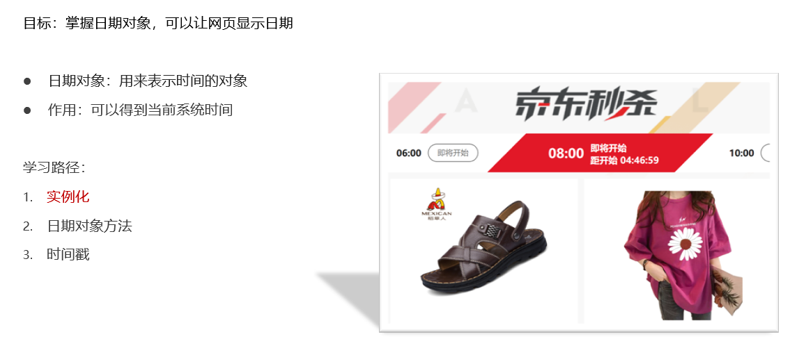

### 1.1 实例化

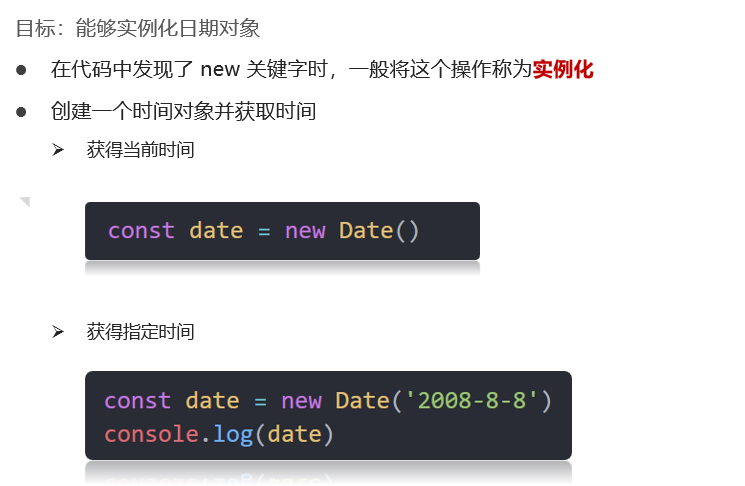

#### Code 01 🚩

```js
// 实例化  new Date()
// 1. 得到当前时间 
const date = new Date()
console.log(date)
// 2. 指定时间
const date2 = new Date('2022-5-1 08:30:00')
console.log(date2)
```

### 1.2 时间对象方法

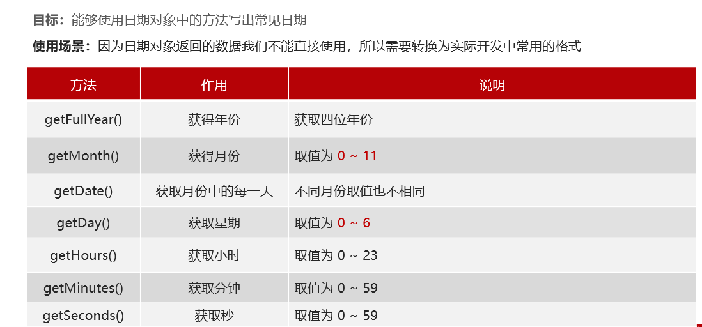

#### Code 02 🚩

```js
// 获得日期对象
const date = new Date()
// 使用里面的方法
console.log(date.getFullYear())
console.log(date.getMonth() + 1)  // 月份要 + 1
console.log(date.getDate())
console.log(date.getDay())  // 星期几
```

#### 

#### Eg.显示格式化时间

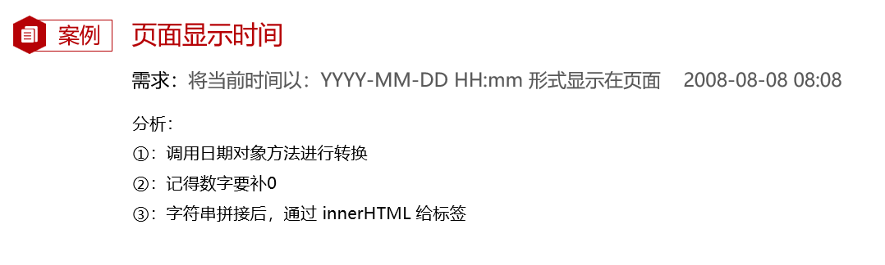

#### Code 03 🚩

```js
const div = document.querySelector('div')
function getMyDate() {
  const date = new Date()
  let h = date.getHours()
  let m = date.getMinutes()
  let s = date.getSeconds()
  h = h < 10 ? '0' + h : h
  m = m < 10 ? '0' + m : m
  s = s < 10 ? '0' + s : s
  return `今天是: ${date.getFullYear()}年${date.getMonth() + 1}月${date.getDate()}号 ${h}:${m}:${s}`
}

div.innerHTML = getMyDate()
setInterval(function () {
  div.innerHTML = getMyDate()
}, 1000)
```

#### Code 04 🚩

> 时间的另一种写法

```js
const div = document.querySelector('div')
// 得到日期对象
const date = new Date()
div.innerHTML = date.toLocaleString()  // 2022/4/1 09:41:21
setInterval(function () {
  const date = new Date()
  div.innerHTML = date.toLocaleString()  // 2022/4/1 09:41:21

}, 1000)
// div.innerHTML = date.toLocaleDateString()  // 2022/4/1
// div.innerHTML = date.toLocaleTimeString()  // 2022/4/1
```

### 1.3 时间戳

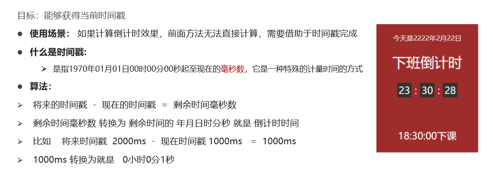

#### 三种方式获取

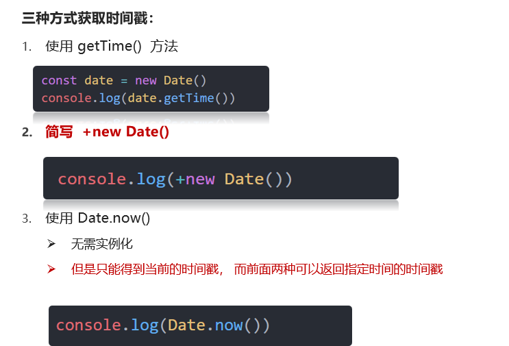

#### Code 05 🚩

```js
// 1. getTime()
const date = new Date()
console.log(date.getTime())
// 2. +new Date()
console.log(+new Date())
// 3. Date.now()
console.log(Date.now());

// 2. +new Date()
console.log(+new Date())
console.log('-----------------');
console.log(+new Date('2022-4-1 18:30:00'))

// 我要根据日期 Day()  0 ~ 6  返回的是 星期一
const arr = ['星期天', '星期一', '星期二', '星期三', '星期四', '星期五', '星期六']
// const date = new Date()
console.log(arr[new Date().getDay()])
```

### 1.4 总结

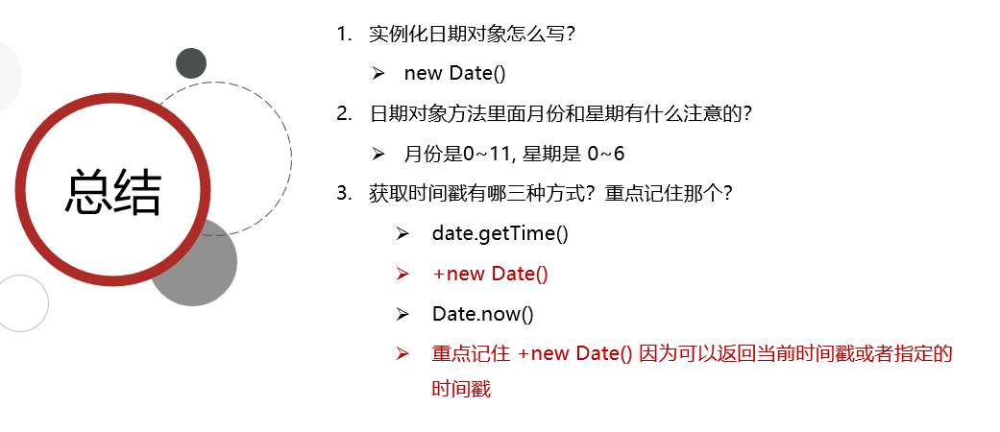

### 1.5 Eg.毕业倒计时效果

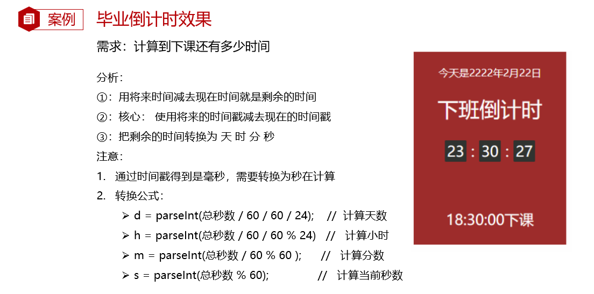

#### Code 06 🚩

```js
// 函数封装 getCountTime
function getCountTime() {
  // 1. 得到当前的时间戳
  const now = +new Date()
  // 2. 得到将来的时间戳
  const last = +new Date('2022-8-8 18:30:00')
  // console.log(now, last)
  // 3. 得到剩余的时间戳 count  记得转换为 秒数
  const count = (last - now) / 1000
  
  // console.log(count)
  // 4. 转换为时分秒
  // h = parseInt(总秒数 / 60 / 60 % 24)   //   计算小时
  // m = parseInt(总秒数 / 60 % 60);     //   计算分数
  // s = parseInt(总秒数 % 60);   
  // let d = parseInt(count / 60 / 60 / 24)               //   计算当前秒数
  let h = parseInt(count / 60 / 60 % 24)
  let m = parseInt(count / 60 % 60)
  let s = parseInt(count % 60)
 
  h = h < 10 ? '0' + h : h
  m = m < 10 ? '0' + m : m
  s = s < 10 ? '0' + s : s
  console.log(h, m, s)
  //  5. 把时分秒写到对应的盒子里面
  document.querySelector('#hour').innerHTML = h
  document.querySelector('#minutes').innerHTML = m
  document.querySelector('#scond').innerHTML = s
}
// 先调用一次
getCountTime()

// 开启定时器
setInterval(getCountTime, 1000)
```

## 2. 节点操作

### 2.1 DOM节点

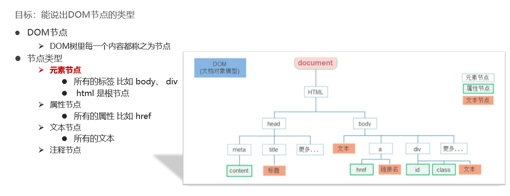

#### 小结

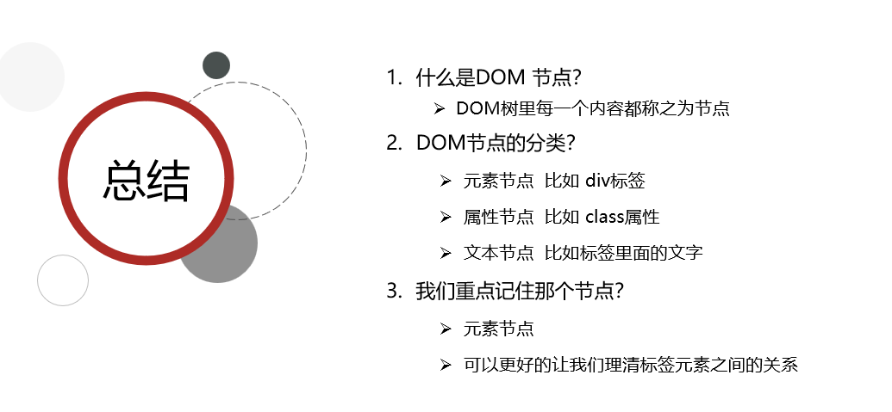

#### 查找节点

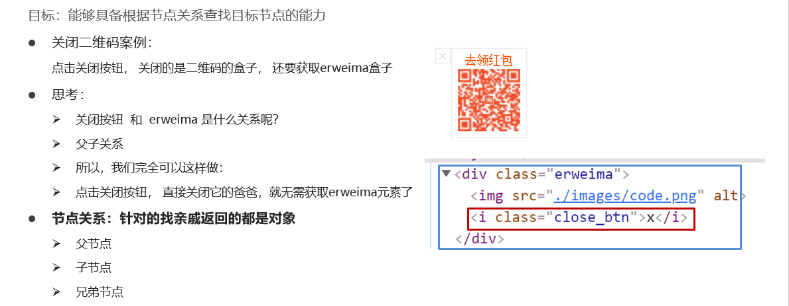


### 2.2 父节点

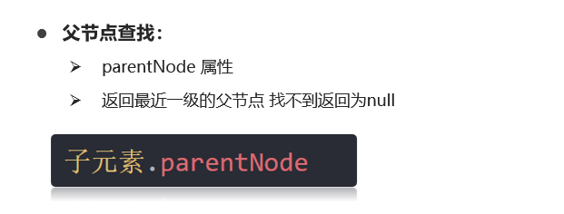

#### Code 07 🚩

```js
const baby = document.querySelector('.baby')
console.log(baby)  // 返回dom对象
console.log(baby.parentNode)  // 返回dom对象
console.log(baby.parentNode.parentNode)  // 返回dom对象
```


#### Code 08 🚩

```js
// 1. 获取事件源
const btn = document.querySelector('.box1')
// 2. 事件侦听
btn.addEventListener('click', function () {
  this.parentNode.style.display = 'none'
})

// 获取三个关闭按钮
const closeBtn = document.querySelectorAll('.box1')
for (let i = 0; i < closeBtn.length; i++) {
  closeBtn[i].addEventListener('click', function () {
    // 关闭我的爸爸 所以只关闭当前的父元素
    this.parentNode.style.display = 'none'
  })
}

// 2. 事件委托方式
const box = document.querySelector('.wrap')
box.addEventListener('click', function(e){
  if (e.target.className ==='box1') {
    e.target.parentNode.style.display = 'none'
  }
})
```

### 2.3 子节点

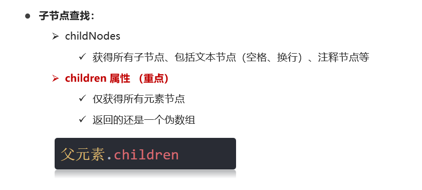

#### Code 09 🚩

```js
// Q：获取ul下的所有li标签  
// DOM 提供的方法（API）获取
var ul = document.querySelector('ul');
var lis = ul.querySelectorAll('li');
// 1. node.childNodes 获取所有的子节点 包含 元素节点 文本节点等等
//  返回的也是一个集合，伪数组 
console.log(ul.childNodes)
console.log(ul.childNodes[0].nodeType)  // 3  文本节点
console.log(ul.childNodes[1].nodeType) //  1  元素节点
// 2. node.children 获取node下的所有的子元素节点
// 返回的是元素集合，伪数数组。
// 我们经常要操作的是元素节点  实际开发中 我们用这个 子元素节点 
// 如果获取它内部某个元素 , 加下标
console.log(ul.children);
// 2.1 获取第一个子元素节点
ul.children[0]
// 2.2 获取最后一个子元素节点
ul.children[ul.children.length - 1]
```


### 2.4 兄弟节点

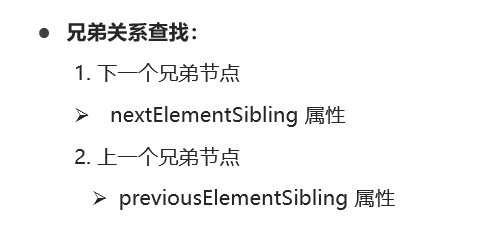

- 注意, 上面获取的准确来说, 是兄弟元素节点.

#### Code 09 🚩

```js
// 3. 兄弟元素节点
const li2 = document.querySelector('ul li:nth-child(2)')
// 重点记单词, 驼峰式的  previous 前一个的意思 Sibling 兄弟的意思
console.log(li2.previousElementSibling)  // 上一个兄弟元素节点
console.log(li2.nextElementSibling)  // 下一个兄弟元素节点
```


#### 小结

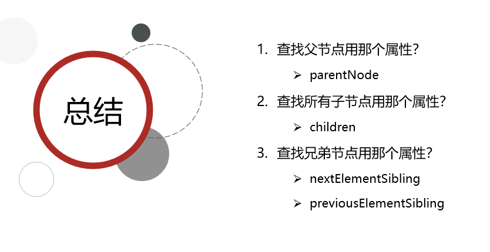

----

### 2.5 创建节点

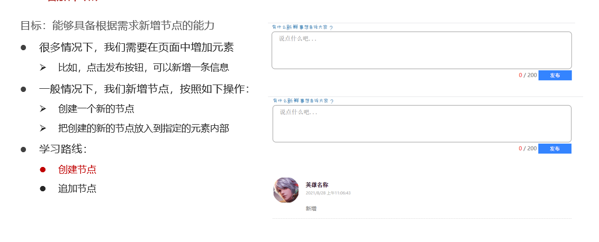

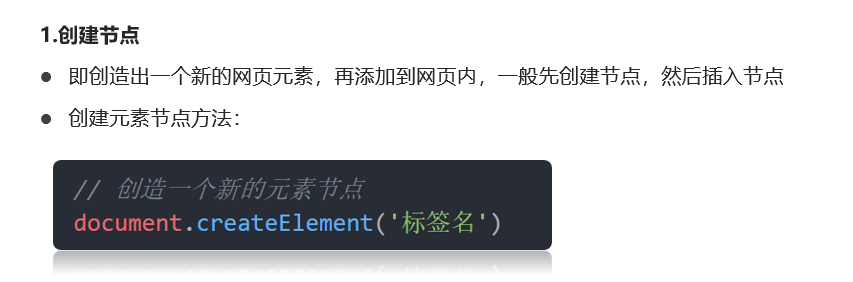

### 2.6 添加节点

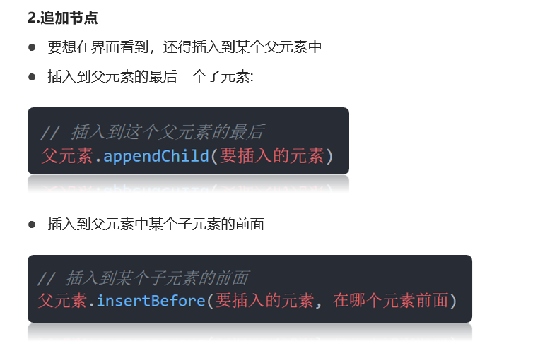

#### Code 10 🚩

```js
// 1. 创建节点
// const div = document.createElement('div')
// // console.log(div)
// 2. 追加节点  作为最后一个子元素
// document.body.appendChild(div)
const ul = document.querySelector('ul')
const li = document.createElement('li')
li.innerHTML = '我是li'
// ul.appendChild(li)
// ul.children
// 3. 追加节点
// insertBefore(插入的元素, 放到哪个元素的前面)
ul.insertBefore(li, ul.children[0])
```


#### Eg.  学成在线数据渲染


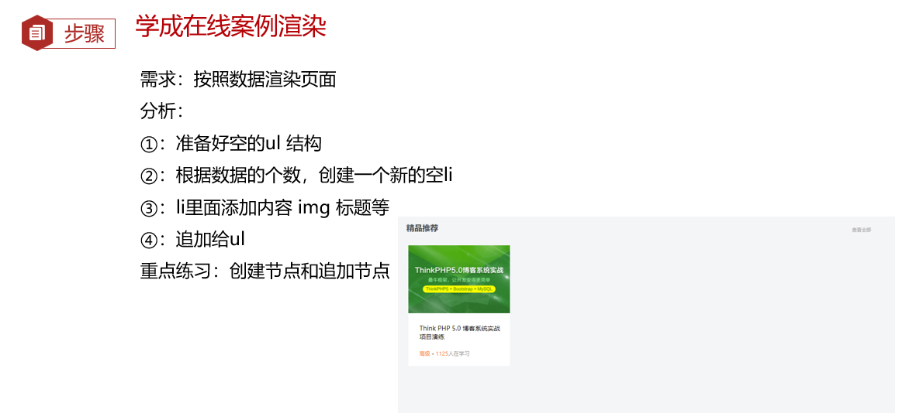

```js
        let data = [
            {
                src: 'images/course01.png',
                title: 'Think PHP 5.0 博客系统实战项目演练',
                num: 1125
            },
            {
                src: 'images/course02.png',
                title: 'Android 网络动态图片加载实战',
                num: 357
            },
            {
                src: 'images/course03.png',
                title: 'Angular2 大前端商城实战项目演练',
                num: 22250
            },
            {
                src: 'images/course04.png',
                title: 'Android APP 实战项目演练',
                num: 389
            },
            {
                src: 'images/course05.png',
                title: 'UGUI 源码深度分析案例',
                num: 124
            },
            {
                src: 'images/course06.png',
                title: 'Kami2首页界面切换效果实战演练',
                num: 432
            },
            {
                src: 'images/course07.png',
                title: 'UNITY 从入门到精通实战案例',
                num: 888
            },
            {
                src: 'images/course08.png',
                title: 'Cocos 深度学习你不会错过的实战',
                num: 590
            },
        ]
```

#### Code Eg1 🚩

```js
const ul = document.querySelector('.box-bd ul')
// 1. 根据数据的个数，创建 对应的小li
for (let i = 0; i < data.length; i++) {
  // 2. 创建新的小li
  const li = document.createElement('li')
  // 把内容给li
  li.innerHTML = `
                <a href="#">
                    
                    <h4>
                        ${data[i].title}
                    </h4>
                    <div class="info">
                        <span>高级</span> • <span>${data[i].num}</span>人在学习
                    </div>
                </a>
            `
  // 3. ul追加小li
  ul.appendChild(li)
}
```

### 2.7 克隆节点

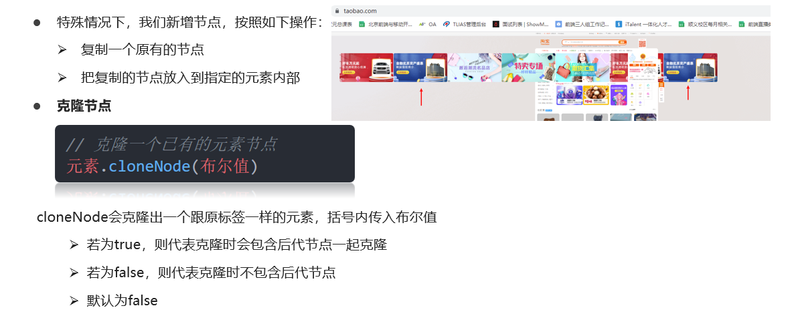

#### Code 11 🚩

```js
const ul = document.querySelector('ul')
// 1 克隆节点  元素.cloneNode(true)
// const li1 = ul.children[0].cloneNode(true)
// console.log(li1)
// 2. 追加
ul.appendChild(ul.children[0].cloneNode(true))
```

### 2.8 删除节点

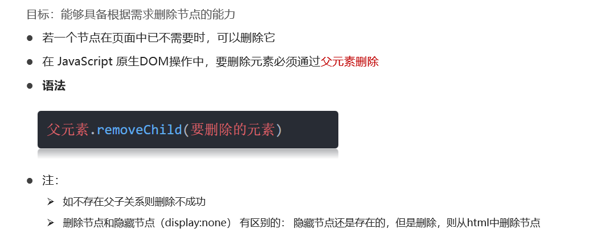

#### Code 12 🚩

```html
<button>删除</button>
<ul>
  <li>熊大</li>
  <li>熊二</li>
  <li>光头强1</li>
  <li>光头强2</li>
  <li>光头强3</li>
  <li>光头强4</li>
</ul>

<ul>
    <li>
        <span>
            <button class="btn">删除</button>
        </span>
    </li>
</ul>
```


```js
const ul = document.querySelector('ul')
// 删除节点  父元素.removeChlid(子元素)
ul.removeChild(ul.children[0])
```

## 3. 移动端事件

### 3.1 触屏事件 touch

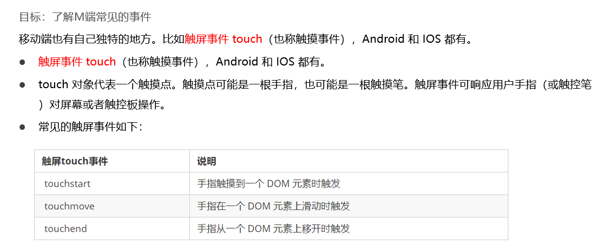

#### Code 13 🚩

```js
// 在pc上模拟移动端事件，一定要切换成移动端的模式才可以!
// 获取元素
var div = document.querySelector('div');
// 1. touchstart: 手指触摸到DOM元素时触发
div.addEventListener('touchstart', function() {
  console.log('我触摸到了这个div----touchstart')
});
// 2. touchmove: 手指在DOM元素身上移动事件
div.addEventListener('touchmove', function() {
  console.log('我在这个dom元素上移动')
});
// 3. touchend: 手指在dom元素上离开时触发
div.addEventListener('touchend', function() {
  console.log('轻轻的我走了')
});
```

## 4. JS插件

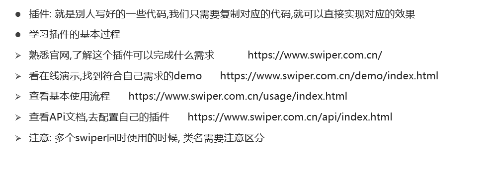

### Swiper相关

#### 下载

- https://www.swiper.com.cn/download/index.html

#### 使用方法

- https://www.swiper.com.cn/usage/index.html

#### Swiper配置

- https://www.swiper.com.cn/api/autoplay/16.html

```js
var swiper = new Swiper(".mySwiper", {
  // 小圆点
  pagination: {
    el: ".swiper-pagination",
  },
  // 自动播放
  autoplay: {
    delay: 1000,//1秒切换一次
    disableOnInteraction: false,  // 鼠标点击 触摸之后，自动继续播放
  },
  // 可以键盘控制
  keyboard: {
    enabled: true,
    onlyInViewport: true,
  },
});
```


### Eg.游乐园轮播图


- 注意， 版本要对应！！

#### 步骤

1. 先在官网找想要的效果， 找到序号
2. 在本地demo中找到对应的文件
3. 将本地demo中的css， js， html结构复制到我们自己的项目中
4. 简单的修改和配置

#### css

```html
  <link rel="stylesheet" href="./css/swiper-bundle.min.css">
  <style>
      html,
      body {
        position: relative;
        height: 100%;
      }

      body {
        background: #eee;
        font-family: Helvetica Neue, Helvetica, Arial, sans-serif;
        font-size: 14px;
        color: #000;
        margin: 0;
        padding: 0;
      }

      .swiper {
        width: 100%;
        height: 100%;
      }

      .swiper-slide {
        text-align: center;
        font-size: 18px;
        background: #fff;

        /* Center slide text vertically */
        display: -webkit-box;
        display: -ms-flexbox;
        display: -webkit-flex;
        display: flex;
        -webkit-box-pack: center;
        -ms-flex-pack: center;
        -webkit-justify-content: center;
        justify-content: center;
        -webkit-box-align: center;
        -ms-flex-align: center;
        -webkit-align-items: center;
        align-items: center;
      }

      .swiper-slide img {
        display: block;
        width: 100%;
        height: 100%;
        object-fit: cover;
      }
	/* new */
    .swiper-pagination-bullet-active {
      background: pink;
    }
  </style>
```

#### html

```html
    <!-- Swiper -->
    <div class="swiper mySwiper">
      <div class="swiper-wrapper">
        <div class="swiper-slide">
          <a href="#"></a>
        </div>
        <div class="swiper-slide">
          <a href="#"></a>
        </div>
        <div class="swiper-slide">
          <a href="#"></a>
        </div>
        <div class="swiper-slide">
          <a href="#"></a>
        </div>
      </div>
      <div class="swiper-pagination"></div>
    </div>
```

#### js

```html
  <script src="./js/swiper-bundle.min.js"></script>
  <!-- Initialize Swiper -->
  <script>
    var swiper = new Swiper(".mySwiper", {
        pagination: {
          el: ".swiper-pagination",
        },
        autoplay: {
          delay: 3000,//3秒切换一次
        },
      });
  </script>
```


## 5. 综合案例

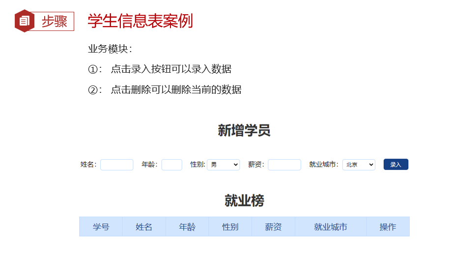

### 5.1 核心思路

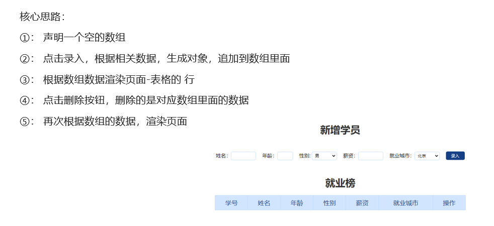

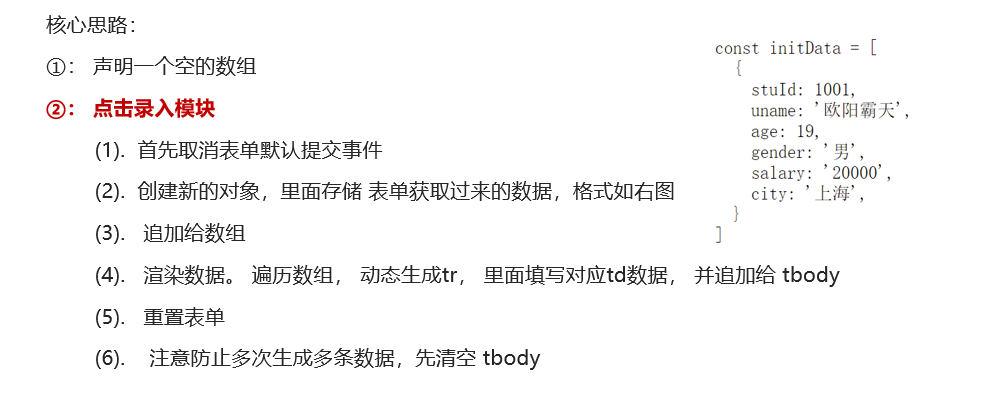

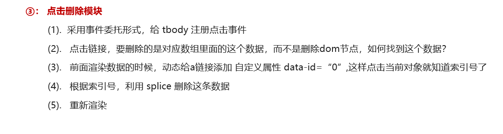

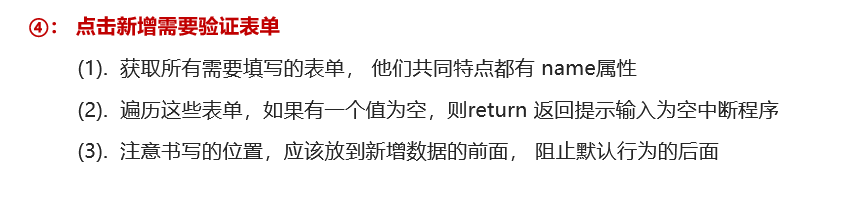

```js
// 获取元素
const uname = document.querySelector('.uname')
const age = document.querySelector('.age')
const gender = document.querySelector('.gender')
const salary = document.querySelector('.salary')
const city = document.querySelector('.city')
```


#### Code 🚩

```js
// 获取元素
const uname = document.querySelector('.uname')
const age = document.querySelector('.age')
const gender = document.querySelector('.gender')
const salary = document.querySelector('.salary')
const city = document.querySelector('.city')
const tbody = document.querySelector('tbody')
// 获取所有带有name属性的 元素
const items = document.querySelectorAll('[name]')
// 声明一个空的数组， 增加和删除都是对这个数组进行操作
const arr = []

// 1. 录入模块
// 1.1 表单提交事件
const info = document.querySelector('.info')
info.addEventListener('submit', function (e) {
  // 阻止默认行为  不跳转
  e.preventDefault()
  // console.log(11)

  // 这里进行表单验证  如果不通过，直接中断，不需要添加数据
  // 先遍历循环
  for (let i = 0; i < items.length; i++) {
    if (items[i].value === '') {
      return alert('输入内容不能为空')
    }
  }
  // 创建新的对象
  const obj = {
    stuId: arr.length + 1,
    uname: uname.value,
    age: age.value,
    gender: gender.value,
    salary: salary.value,
    city: city.value
  }
  // console.log(obj)
  // 追加给数组里面
  arr.push(obj)
  // console.log(arr)
  // 清空表单  重置 
  this.reset()
  // 调用渲染函数
  render()
})


// 2. 渲染函数 因为增加和删除都需要渲染
function render() {
  // 先清空tbody 以前的行 ，把最新数组里面的数据渲染完毕 
  tbody.innerHTML = ''
  // 遍历arr数组
  for (let i = 0; i < arr.length; i++) {
    // 生成 tr 
    const tr = document.createElement('tr')
    tr.innerHTML = `
          <td>${arr[i].stuId}</td>
          <td>${arr[i].uname}</td>
          <td>${arr[i].age}</td>
          <td>${arr[i].gender}</td>
          <td>${arr[i].salary}</td>
          <td>${arr[i].city}</td>
          <td>
            <a href="javascript:" data-id=${i}>删除</a>
          </td>
        `
    // 追加元素  父元素.appendChild(子元素)
    tbody.appendChild(tr)
  }
}


// 3. 删除操作
// 3.1 事件委托 tbody
tbody.addEventListener('click', function (e) {
  if (e.target.tagName === 'A') {
    // 得到当前元素的自定义属性 data-id
    // console.log(e.target.dataset.id)
    // 删除arr 数组里面对应的数据
    arr.splice(e.target.dataset.id, 1)
    console.log(arr)
    // 从新渲染一次
    render()
  }
})
```

