## Target

1. 能过利用setTimeout完成5秒钟之后自动关闭的广告案例
2. 能够利用location.href完成5秒钟跳转页面案例
3. 能够写出localstorage的存、取、删除的代码
4. 能够说出localstorage对复杂数据类型存储和获取的转换代码
5. 能够使用map映射方法，并说出里面参数的含义
6. 能够跟随课堂代码完成本地存储版本的学生信息表案例

💡🚀🤟👉👇☀️🍉🍍🍇🍓🥕🍭🎖️🎁☘️🍀💯🔆❗🔥🚩

## 1. window对象

### 1. BOM

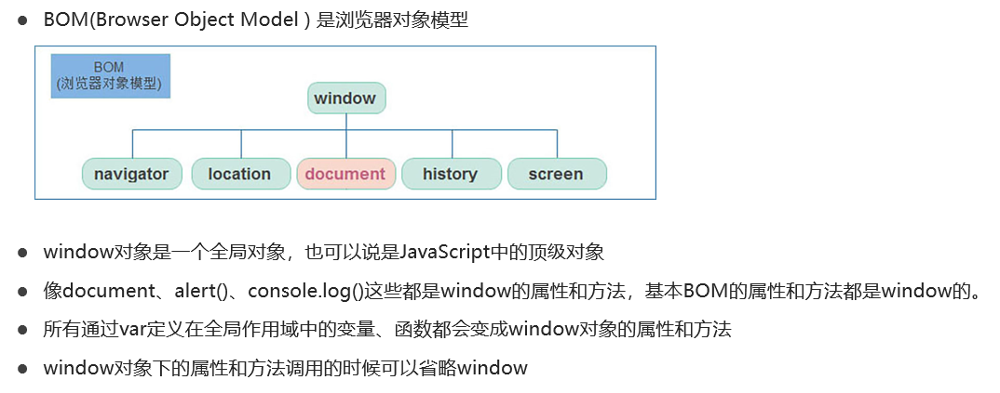

#### 🚩 Code 01 

```js
// BOM browser object model 浏览器对象模型
// window是浏览器的顶级对象, Node中顶级对象是global
// document.querySelector()
// window.document.querySelector()
console.log(document === window.document)

// 在全局作用域中, 用var声明的变量，会成为window的属性
// console.log(window)
var num = 10;
console.log(num);
console.log(window.num);
// const let  不会!

// 全局作用域中的声明的函数成为window对象的方法
function fn() {
    console.log(11);
}
fn();
window.fn()
// 定时器 setTimeout() / setInterval() 也是window对象的方法
```


### 2. 定时器-setTimeout 

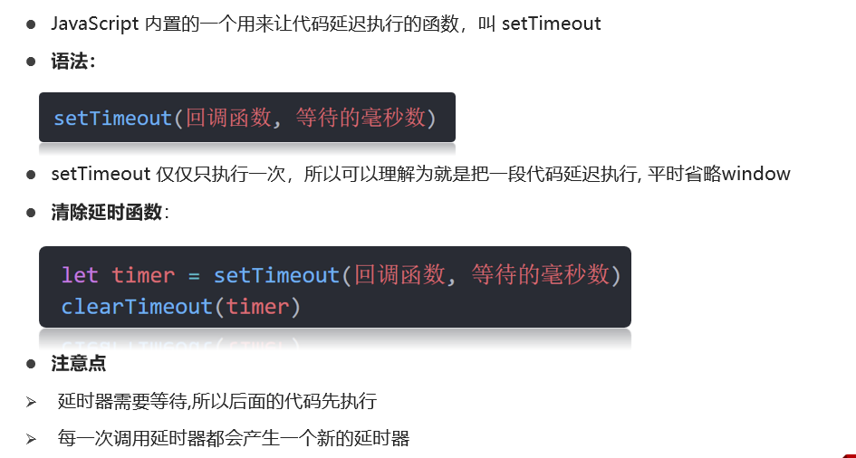

#### 2.1 setTimeout/setInterval

- setTimeout  只执行一次
- setInterval 每隔一段时间就执行一次, 除非手动清除.

####  🚩 Code 02 

```js
// 1.直接写函数
setTimeout(function(){
  console.log('好好学习,天天向上')
}, 3000)

// 2. 写函数名
function fn() {
  console.log('饿了吗')
}
const foo = function () {
  console.log('真的饿了吗')
}
// 写函数名的时候, 不带括号
setTimeout(fn, 3000)
setTimeout(foo, 5000)

// 3.不推荐 ,  `fn()` , 谁写谁被锤
setTimeout('fn()', 3000)
// 扩展：最小延时 >=4ms   MDN
// 在浏览器中，setTimeout()/setInterval() 的每调用一次定时器的最小间隔是4ms

// 4. 我们可以给定时器, 加一个变量标记 (当前定时器的名字)
const timer1 = setTimeout(fn, 3000)
const timer2 = setTimeout(foo, 3000)
console.log(timer1)
console.log(timer2)
// number
console.log(typeof timer1)

// 5. 清除定时器 window.clearTimeout(timeoutId)
// window可以省略, 传入我们定时器的标记(哪个定时器)

// 让点击的时候清除这个定时器, 在这个延迟事件之前, 我们清除它, 它的回调函数就不会执行了
btn.addEventListener('click', function(){
  // 清除哪个定时器,传入哪个定时器的标记
  clearTimeout(timer)
})
```

#### 2.2 Eg. 5s后消失的广告

```bash
需求：5秒钟之后，广告自动消失
分析：
①：设置延时函数
②：隐藏元素
```

#### 🚩 Code 03 

```js
// 获取元素
const img = document.querySelector('img')
// 开启定时器, 只执行一次
setTimeout(function () {
  img.style.display = 'none'
}, 5000)
```

#### 2.3 this指向问题

```js
// this的指向 在定义的时候不能确定, 只有执行调用的时候才能确定!

// this指向, 面试题 60-80%几率考.
// 1. 全局作用域中/ 或者普通函数调用/ 或者定时器里面 this 指向 window
// 1.1 全局作用域
console.log(this)

// 1.2 普通函数调用
function fn() {
  console.log(this)
}
fn()
// window.fn() 
// 1.3 定时器中
setTimeout(function(){
  // console.log(this)
}, 1000)
// window.setTimeout()  ,  setInterval() 也是 指向window

// 2.1 方法调用中, 谁调用这个方法, this指向谁
var obj = {
  name:'小亮',
  age:18,
  sayHi:function(){
    console.log(this) // this指向的是调用这个方法的对象
  }
}
obj.sayHi() // 谁调用,指向谁

// 2.2 事件注册的时候, this指向被绑定的元素
var btn = document.querySelector('button')
btn.addEventListener('click', function(e){
  // 指向绑定的这个事件源  
  // this 指向 btn
  console.log(this)  
  // 指向事件绑定的元素
  console.log(e.currentTarget)
})

// 3. 构造函数中, this 指向的是构造函数的实例
function Foo(name, age) {
  this.name = name
  this.age = age
  console.log(this) // 这个this不一定
}

// !! this在定义的时候,并不能确定指向,只有执行的时候才能确定

var person1 = new Foo('小王', 18)
console.log(person1)

var person2 = new Foo('小红', 19)
console.log(person2)
```


#### 2.4 Question-easy

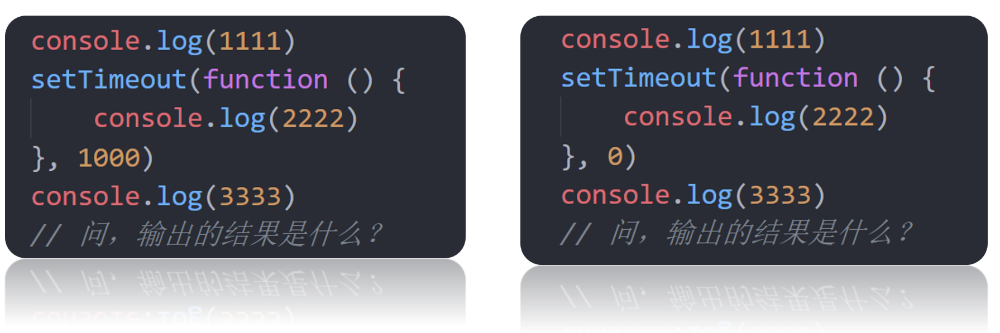

### 3. JS执行机制

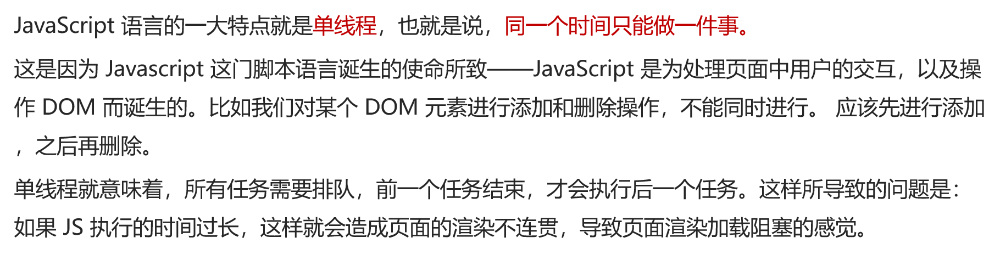

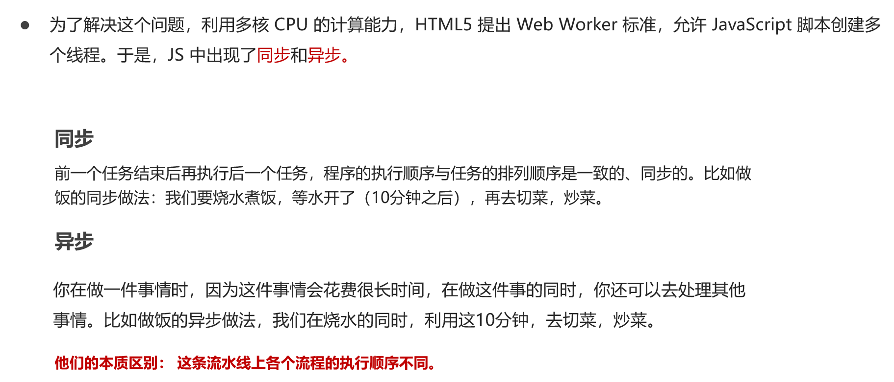

#### 3.1 同步/异步

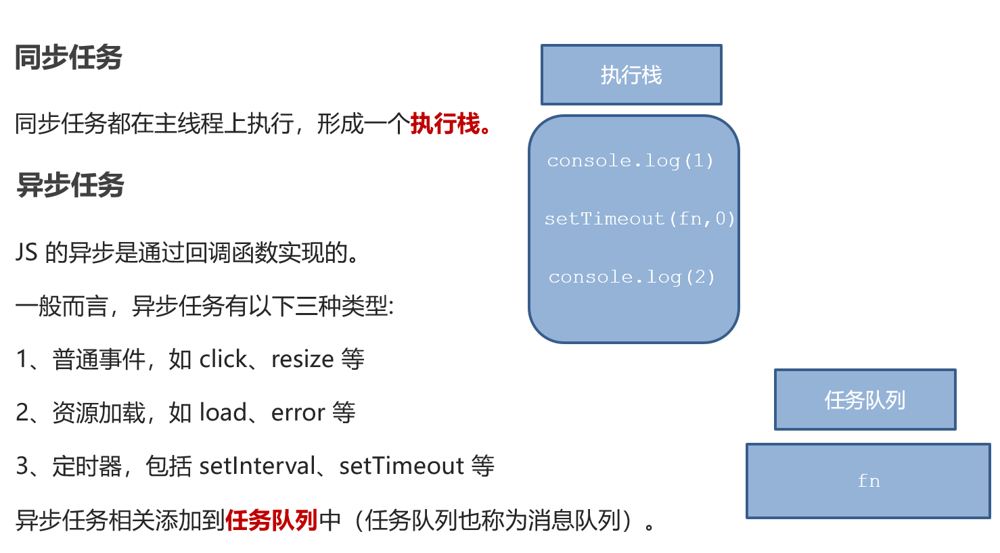

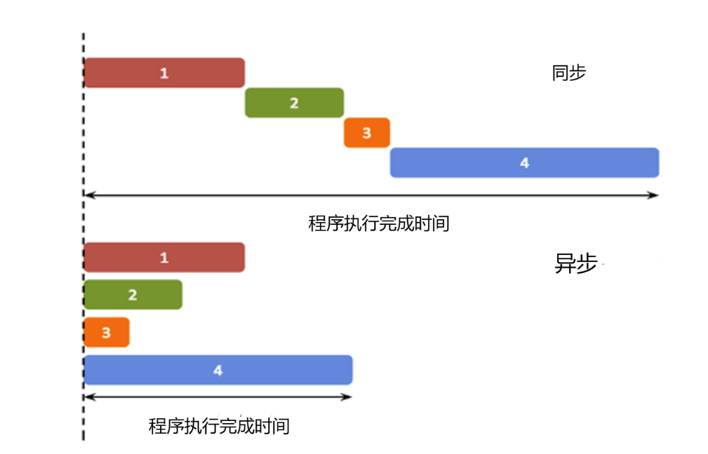

#### 3.2 JS执行机制

#### 🚩 Code 04 

```js
console.log(1)
console.log(2)
setTimeout(function () {
  console.log(3)
}, 0)
console.log(4);
```


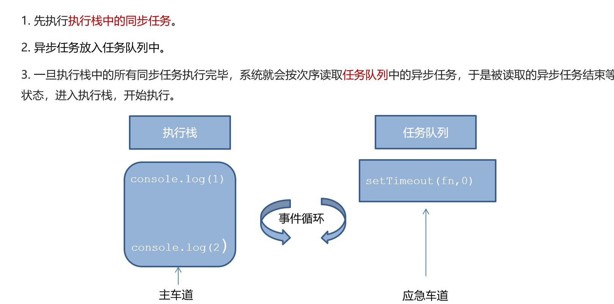

#### 3.3 异步进程

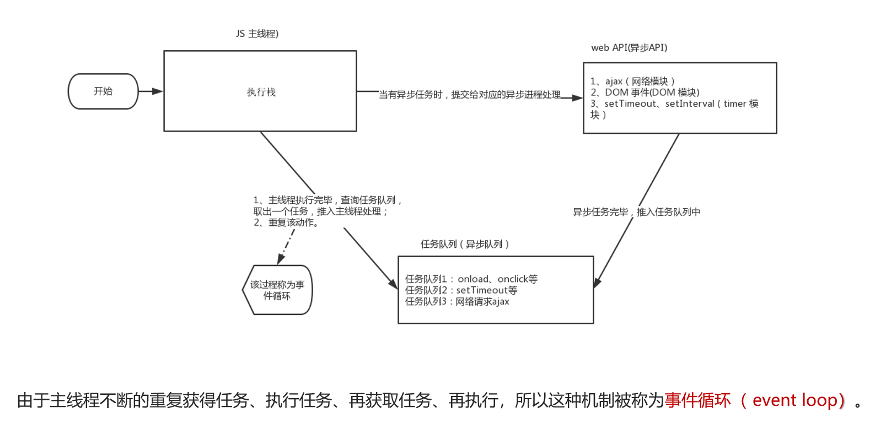

#### 3.4 Eg. 思考

```js
console.log(1)

document.addEventListener('click', function () {
    console.log(4)
})

console.log(2)

setTimeout(function () {
    console.log(3)
}, 3000)
```

### 4. location对象

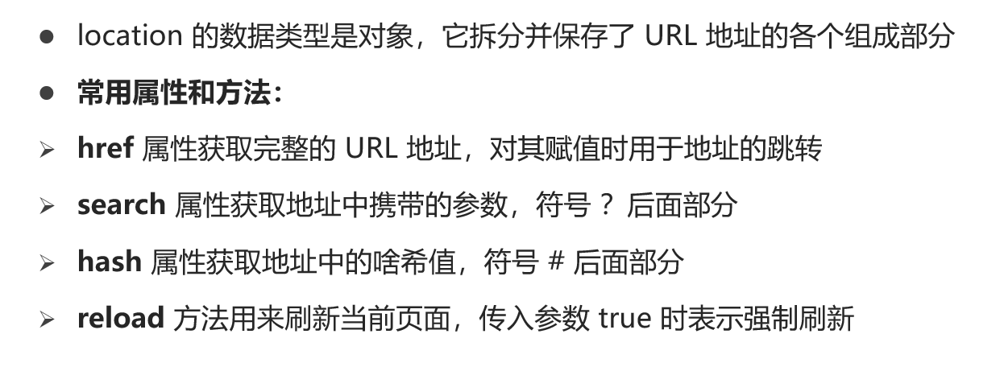

#### 4.1 属性

##### location.href

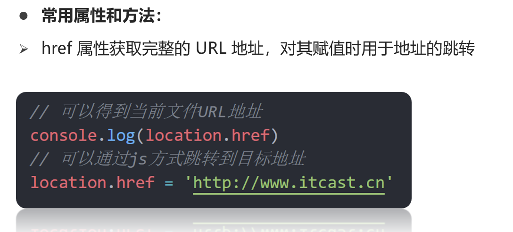

#### 🚩 Code 05 

```js
// console.log(window.location)
// console.log(location)
// console.log(location.href)
// 1. location.href 经常用href 利用js的方法去跳转页面
// location.href = 'http://www.baidu.com'

// 2. location.reload()
const reload = document.querySelector('.reload')
reload.addEventListener('click', function () {
  // f5 刷新页面
  // location.reload()
  // 强制刷新  ctrl+f5
  location.reload(true)
})
```


##### 4.2 Eg. 5s后跳转页面

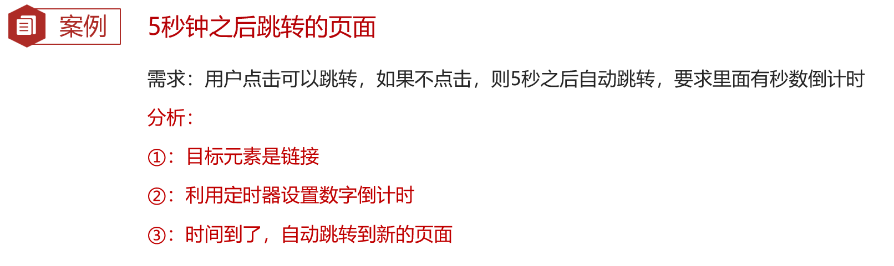

#### 🚩 Code 06 

```js
// 1. 获取元素
const a = document.querySelector('a')
// 2.声明倒计时变量, 开启定时器
let num = 5
let timerId = setInterval(function () {
  num--
  a.innerHTML = `支付成功<span>${num}</span>秒钟之后跳转到首页`
  // 如果num === 0 则停止定时器，并且完成跳转功能
  if (num === 0) {
    clearInterval(timerId)
    // 4. 跳转  location.href
    location.href = 'http://www.itcast.cn'
  }
}, 1000)
```


##### location.search

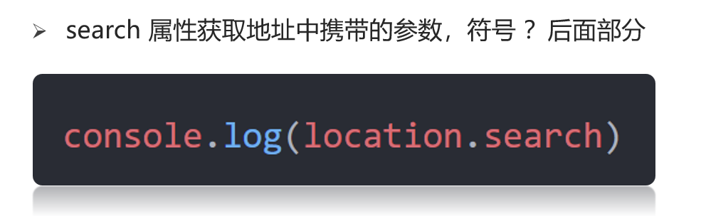

----

##### location.hash

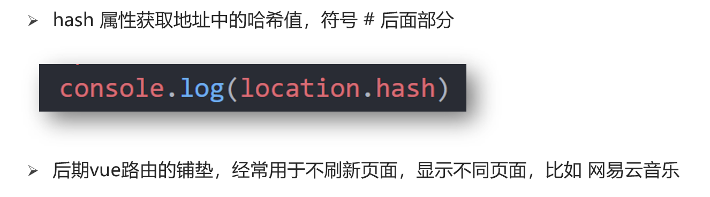

#### 4.2 方法

##### location.reload()

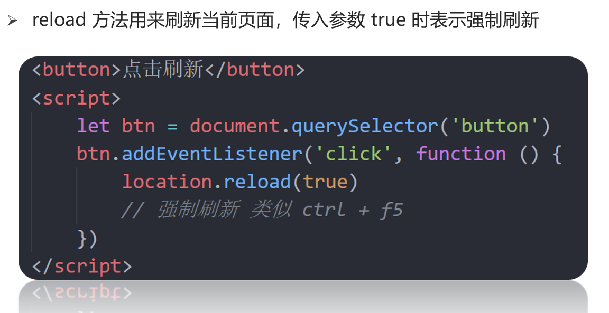

#### 4.3 小结

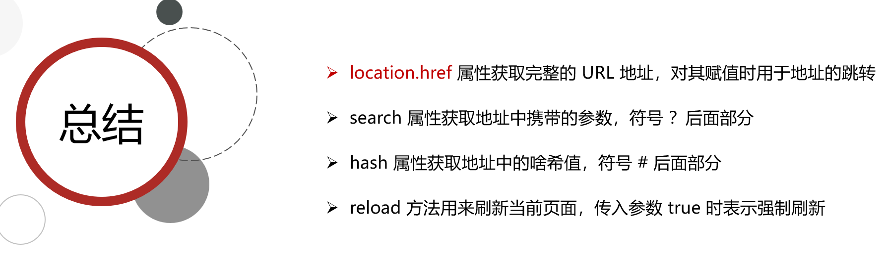

---


### 5. navigator对象

navigator的数据类型是对象，该对象下记录了浏览器自身的相关信息

#### 5.1 userAgent

- 返回用户设备操作系统和浏览器信息

#### 🚩 Code 07

```js
    // 检测 userAgent（浏览器信息）
;(function () {
      const userAgent = navigator.userAgent
      // 验证是否为Android或iPhone
      const android = userAgent.match(/(Android);?[\s\/]+([\d.]+)?/)
      const iphone = userAgent.match(/(iPhone\sOS)\s([\d_]+)/)
      // 如果是Android或iPhone，则跳转至移动站点
      if (android || iphone) {
        location.href = 'http://m.itcast.cn'
      }
})()
```


### 6. history对象

history 对象表示当前窗口首次使用以来用户的导航历史记录。因为 history 是 window 的属性，所以每个 window 都有自己的 history 对象。出于安全考虑，这个对象不会暴露用户访问过的 URL，但可以通过它在不知道实际 URL 的情况下前进和后退。

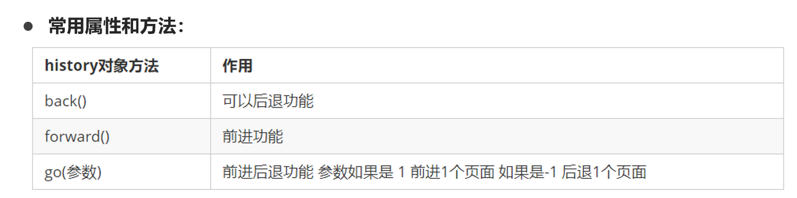

**history.back()** 和 **history.forward()** 模拟了浏览器的后退按钮和前进按钮.

#### 🚩 Code 08

```js
const back = document.querySelector('button:first-child')
const forward = back.nextElementSibling
back.addEventListener('click', function () {
  // 后退一步
  // history.back()
  history.go(-1)
})
forward.addEventListener('click', function () {
  // 前进一步
  // history.forward()
  history.go(1)
})
```


## 2. 本地存储

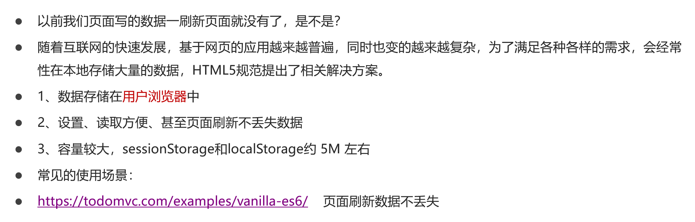

### 2.1 localStorage

1、生命周期永久生效，除非手动删除 否则关闭页面也会存在

2、可以多窗口（页面）共享（同一浏览器可以共享）

3、以键值对的形式存储使用

> **使用场景**

​	数据刷新不丢失, 关闭窗口重新打开也不丢失时

- Todo https://todomvc.com/examples/vanilla-es6/  

#### 方法

存储数据：

```javascript
localStorage.setItem(key, value)
```

获取数据：

```javascript
localStorage.getItem(key)
```

删除数据：

```javascript
localStorage.removeItem(key)
```

清空数据：(所有都清除掉)

```javascript
localStorage.clear()
```

PS. 扩展

也可以使用属性的方式给localStorage添加数据

```js
// 使用方法存储数据
localStorage.setItem("name", "Nicholas"); 
// 使用属性存储数据
localStorage.book = "Professional JavaScript"; 
// 使用方法取得数据
let name = localStorage.getItem("name"); 
// 使用属性取得数据
let book = localStorage.book;
```

#### 🚩 Code 09 

```js
// 1. 要存储一个名字  'uname'， 'pink老师'
// localStorage.setItem('键'，'值')
localStorage.setItem('uname', 'pink老师')
// 2. 获取方式  都加引号
console.log(localStorage.getItem('uname'))
// 3. 删除本地存储  只删除名字
// localStorage.removeItem('uname')
// 4. 改  如果原来有这个键，则是改，如果没有这个键是增
localStorage.setItem('uname', 'red老师')

// 我要存一个年龄
// 2. 本地存储只能存储字符串数据类型
localStorage.setItem('age', 18)
console.log(localStorage.getItem('age'))
```


#### 如何查看

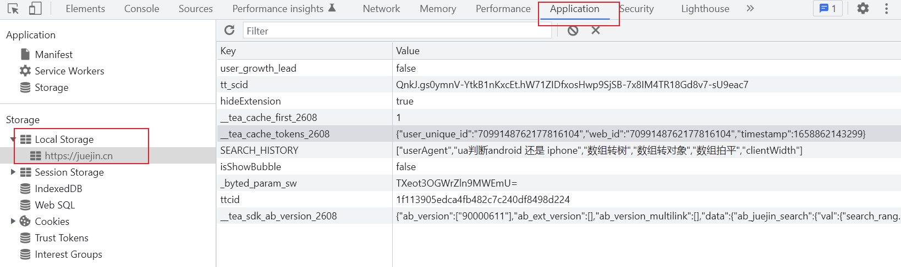

> 生命周期 : 一个对象的创建到清除的过程, 数据存在的周期

存储在 localStorage 中的数据会保留到通过 JavaScript 删除或者用户清除浏览器缓存。localStorage 数据不受页面刷新影响，也不会因关闭窗口、标签页或重新启动浏览器而丢失。

 **localStorage生命周期是永久的,  除非用户手动删除, 否则关闭页面也会存在**

#### 小结

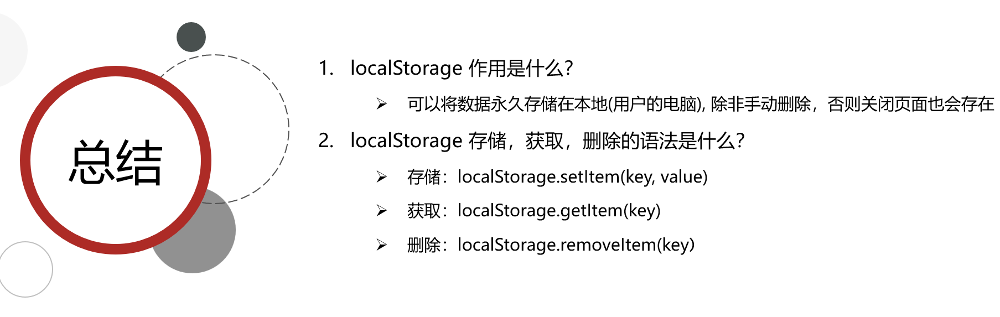

> PS. 不同浏览器可能不同, 但基本都是5M大小

```js
;(function() {
    var test = '0123456789';
    var add = function(num) {
        num += num;
        if(num.length == 10240) {;
            test = num;
            return;
        }
        add(num);
    }
    add(test);
    var sum = test;
    var show = setInterval(function(){
        sum += test;
        try {
            window.localStorage.removeItem('test');
            window.localStorage.setItem('test', sum);
            console.log(sum.length / 1024 + 'KB');
        } catch(e) {
            alert(sum.length / 1024 + 'KB超出最大限制');
            clearInterval(show);
        }
    }, 0.1)
})()

```

### 2.2 sessionStorage

1、生命周期为关闭浏览器窗口

2、在同一个窗口(页面，Tab页面)下数据可以共享  (前提是同一域名下)

3、以键值对的形式存储使用

#### 方法

存储数据：

```javascript
sessionStorage.setItem(key, value)
```

获取数据：

```javascript
sessionStorage.getItem(key)
```

删除数据：

```javascript
sessionStorage.removeItem(key)
```

清空数据：(所有都清除掉)

```javascript
sessionStorage.clear()
```


### 2.3 存储复杂数据类型

#### JSON.stringify()

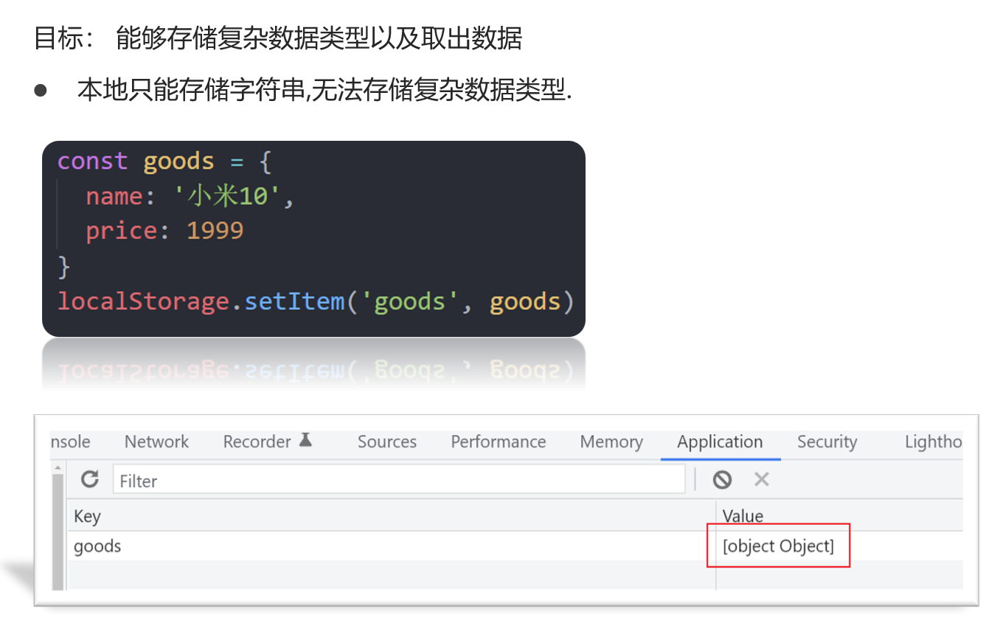


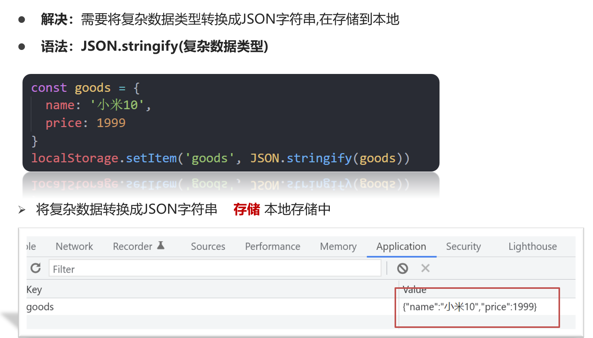


#### 🚩 Code 10

```js
const obj = {
  uname: 'pink老师',
  age: 18,
  gender: '女'
}
//  存储 复杂数据类型  无法直接使用
// localStorage.setItem('obj', obj)  [object object]    
//  取
// console.log(localStorage.getItem('obj'))

// 1.复杂数据类型存储必须转换为 JSON字符串存储
localStorage.setItem('obj', JSON.stringify(obj))
// JSON 格式:  属性和值有引号，而且引号统一是双引号 (值是number可以不带)
// {"uname":"pink老师","age":18,"gender":"女"}
// 取
// console.log(typeof localStorage.getItem('obj'))
// 2. 把JSON字符串转换为 对象
const str = localStorage.getItem('obj') // {"uname":"pink老师","age":18,"gender":"女"}
console.log(JSON.parse(str))
```


#### JSON.parse()

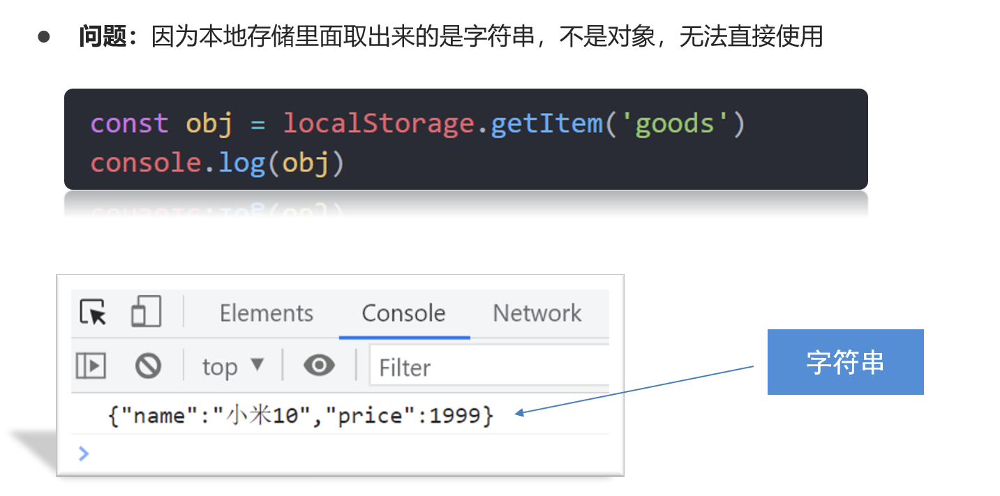

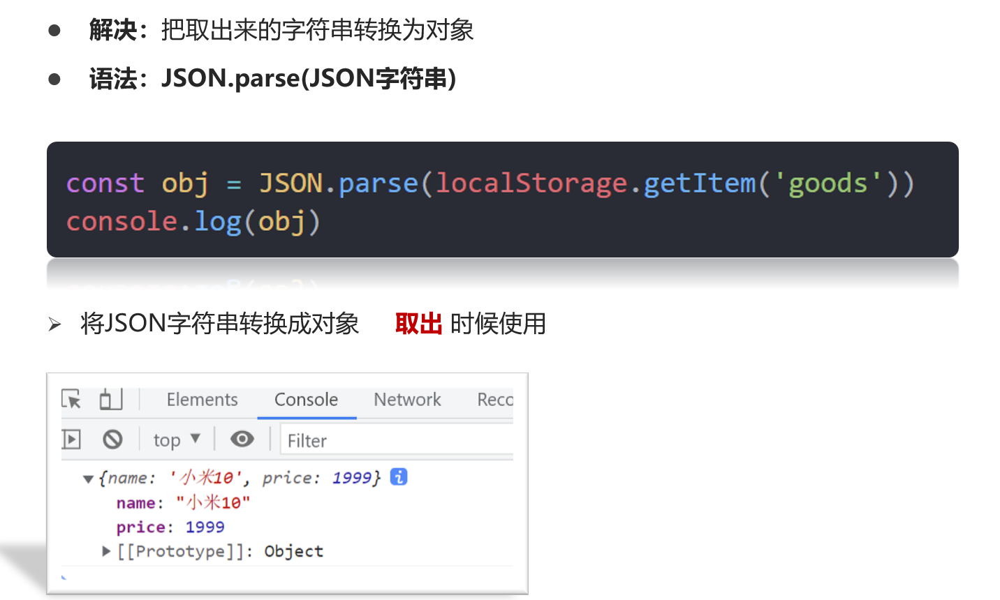

## 3. Eg.学生就业信息表

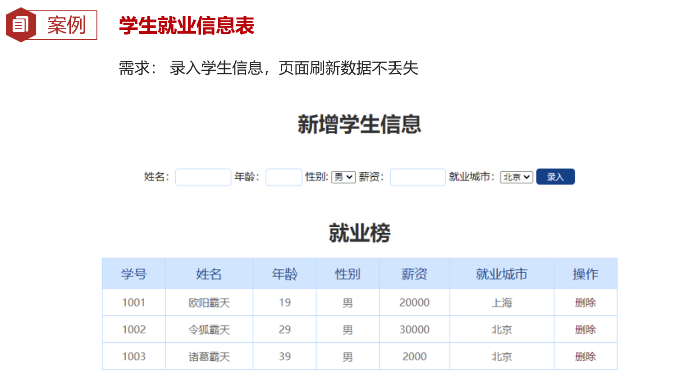

```bash
需求： 录入学生信息，页面刷新数据不丢失
模块分析：
①：新增模块， 输入学生信息，数据会存储到本地存储中
②：渲染模块，数据会渲染到页面中
③：删除模块，点击删除按钮，会删除对应的数据

```

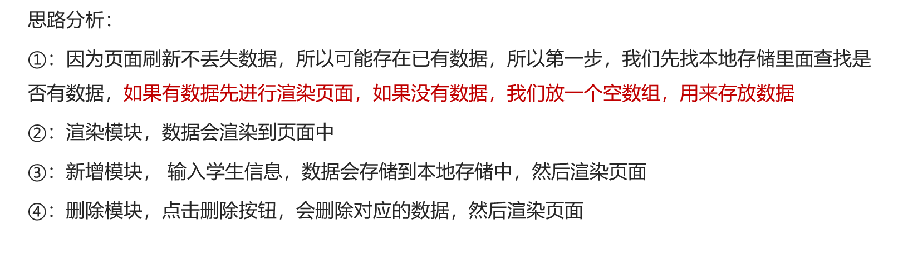

```js
// 思路分析：
// ①：因为页面刷新不丢失数据，所以可能存在已有数据，所以第一步，我们先找本地存储里面查找是否有数据，如果有数据先进行渲染页面，如果没有数据，我们放一个空数组，用来存放数据
// ②：渲染模块，数据会渲染到页面中
// ③：新增模块， 输入学生信息，数据会存储到本地存储中，然后渲染页面
// ④：删除模块，点击删除按钮，会删除对应的数据，然后渲染页面
```

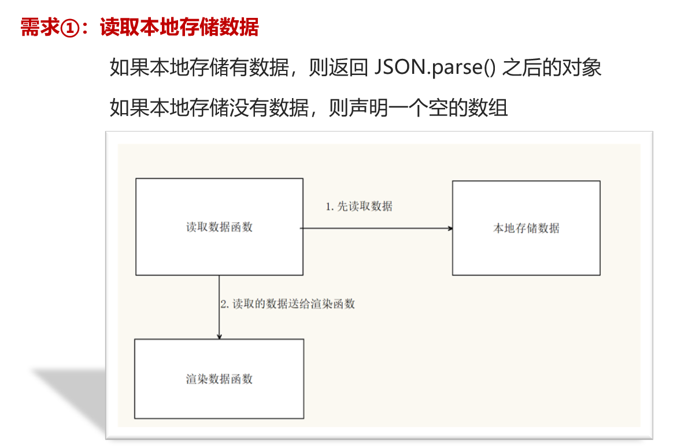

```js
const initData = [
    {
        stuId: 1001,
        uname: '欧阳霸天',
        age: 19,
        gender: '男',
        salary: '20000',
        city: '上海',
    }
]
```


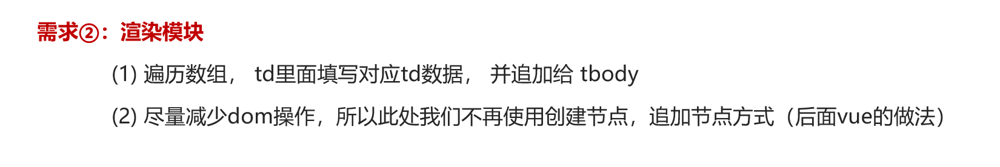

### Array.map()

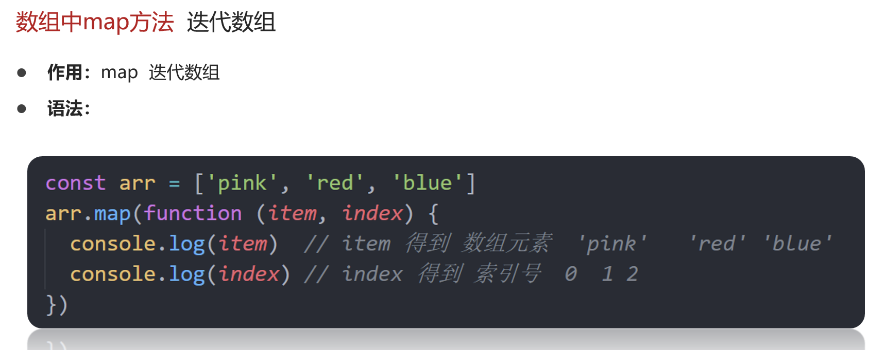

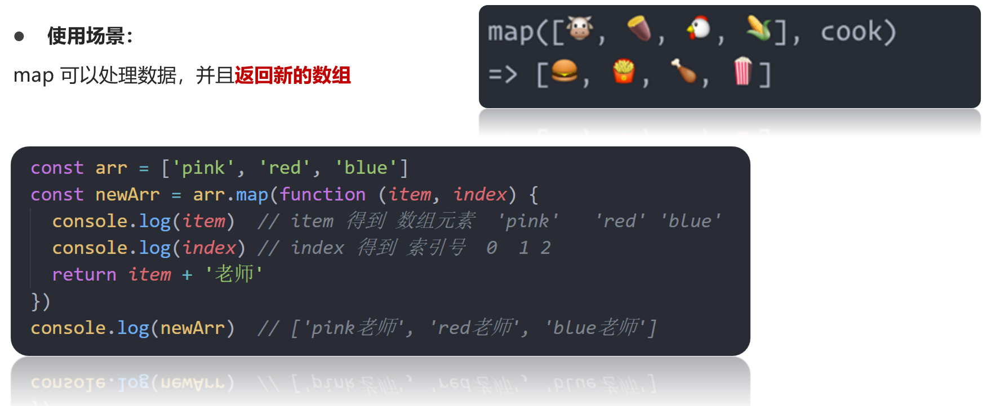

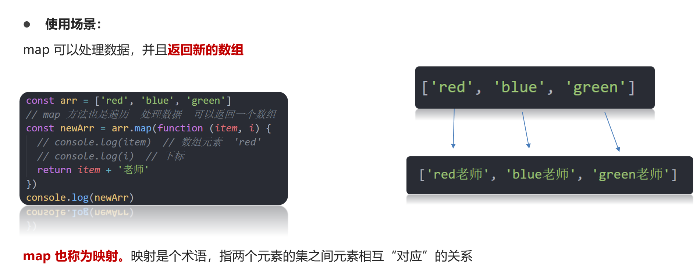

#### 🚩 Code 11

```js
const arr = ['red', 'blue', 'green']
// map 方法也是遍历  处理数据  可以返回一个数组
const newArr = arr.map(function (item, i) {
  // console.log(item)  // 数组元素  'red'
  // console.log(i)  // 下标
  return item + '老师'
})
console.log(newArr)


['red老师', 'blue老师', 'green老师']


const arr1 = [10, 20, 30]
const newArr1 = arr1.map(function (item) {
  return item + 10
})
console.log(newArr1)
```


### Array.join()

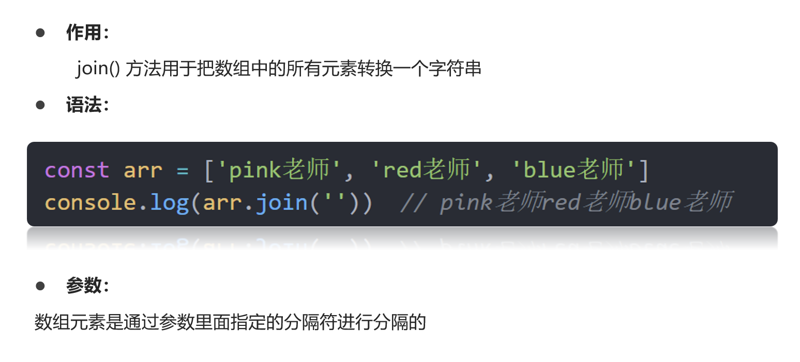

#### 🚩 Code 12

```js
const arr = ['red', 'blue', 'green']
// 把数组元素转换为字符串
console.log(arr.join()) 
```


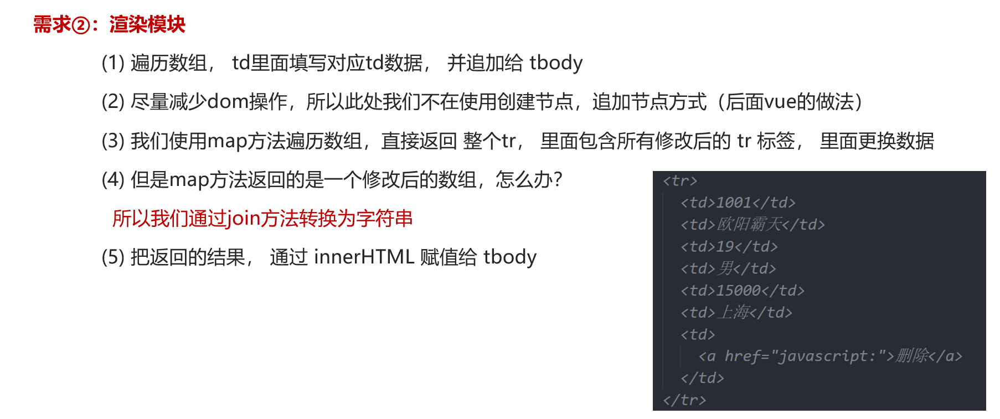

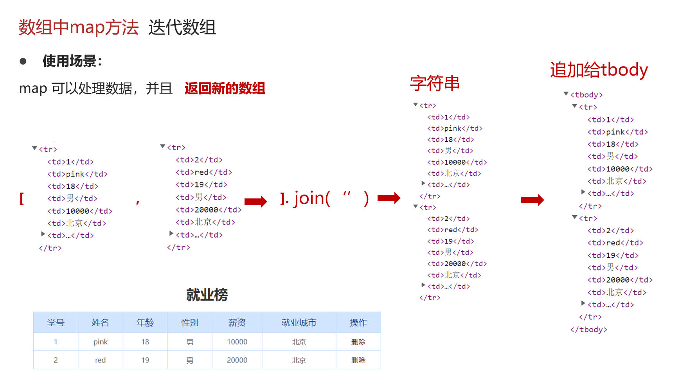

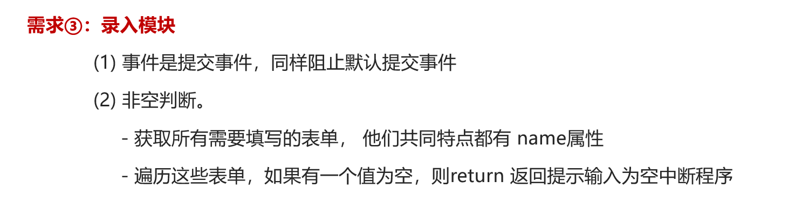

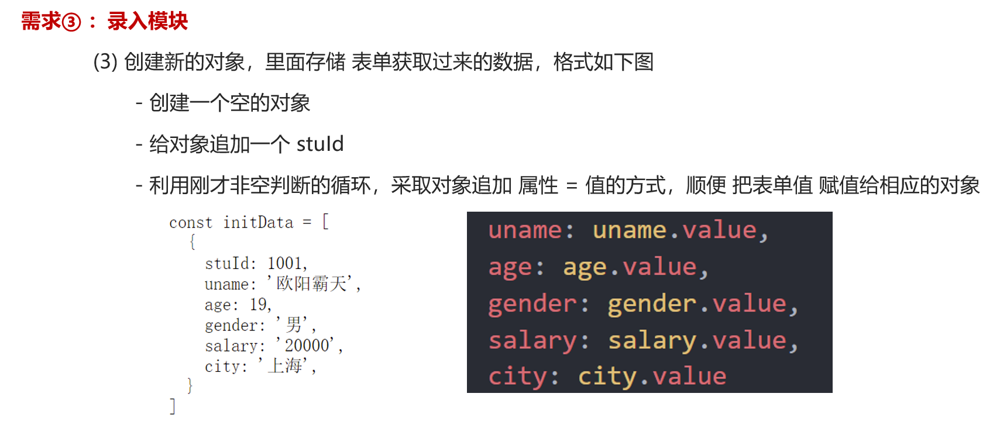

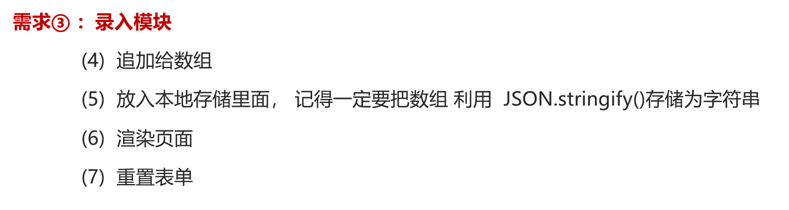

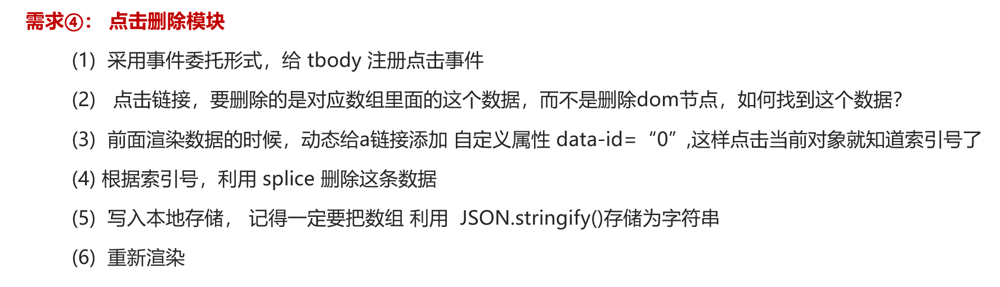

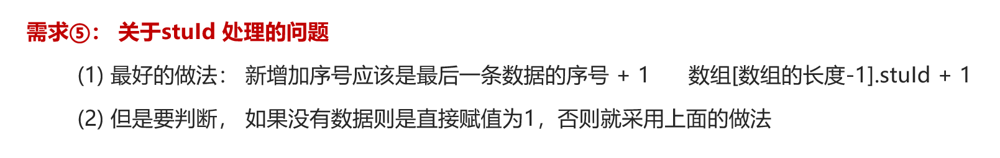

#### Code Eg

```js
    // 1. 读取本地存储的数据   student-data  本地存储的命名
    const data = localStorage.getItem('student-data')
    // console.log(data)
    // 2. 如果有就返回对象，没有就声明一个空的数组  arr 一会渲染的时候用的
    const arr = data ? JSON.parse(data) : []

    // console.log(arr)
    // 获取 tbody
    const tbody = document.querySelector('tbody')
    // 3. 渲染模块函数
    function render() {
      // 遍历数组 arr，有几个对象就生成几个 tr，然后追击给tbody
      // map 返回的是个数组  [tr, tr]
      const trArr = arr.map(function (item, i) {
        // console.log(item)
        // console.log(item.uname)  // 欧阳霸天
        return `
        <tr>
          <td>${item.stuId}</td>
          <td>${item.uname}</td>
          <td>${item.age}</td>
          <td>${item.gender}</td>
          <td>${item.salary}</td>
          <td>${item.city}</td>
          <td>
            <a href="javascript:" data-id=${i}>删除</a>
          </td>
        </tr> 
        `
      })
      // console.log(trArr)
      // 追加给tbody
      // 因为 trArr 是个数组， 我们不要数组，我们要的是 tr的字符串 join()
      tbody.innerHTML = trArr.join('')
    }
    render()


    // 4. 录入模块
    const info = document.querySelector('.info')
    // 获取表单form 里面带有 name属性的元素
    const items = info.querySelectorAll('[name]')
    // console.log(items)
    info.addEventListener('submit', function (e) {
      // 阻止提交
      e.preventDefault()
      // 声明空的对象
      const obj = {}
      // obj.stuId = arr.length + 1
      // 加入有2条数据   2 
      obj.stuId = arr.length ? arr[arr.length - 1].stuId + 1 : 1
      // 非空判断
      for (let i = 0; i < items.length; i++) {
        // console.log(items) // 数组里面包含 5个表单  name
        // console.log(items[i]) //  每一个表单 对象
        // console.log(items[i].name) //  
        // item 是每一个表单
        const item = items[i]
        if (items[i].value === '') {
          return alert('输入内容不能为空')
        }
        // console.log(item.name)  uname  age gender
        // obj[item.name]   === obj.uname  obj.age 
        obj[item.name] = item.value
      }
      // console.log(obj)
      // 追加给数组
      arr.push(obj)
      //  把数组 arr 存储到本地存储里面
      localStorage.setItem('student-data', JSON.stringify(arr))
      // 渲染页面
      render()
      // 重置表单
      this.reset()
    })


    // 5. 删除模块
    tbody.addEventListener('click', function (e) {
      if (e.target.tagName === 'A') {
        // alert(1)
        // console.log(e.target.dataset.id)
        // 删除数组对应的这个数据
        arr.splice(e.target.dataset.id, 1)
        // 写入本地存储
        localStorage.setItem('student-data', JSON.stringify(arr))
        // 重新渲染
        render()
      }
    })
```


## 作业

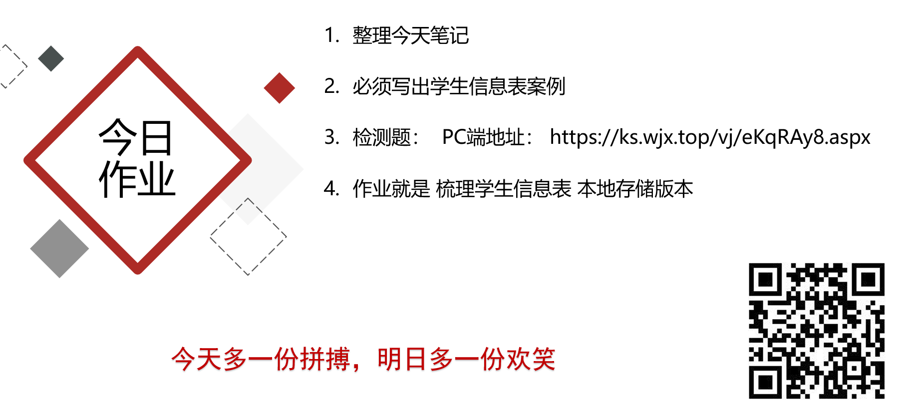

- https://ks.wjx.top/vj/eKqRAy8.aspx
