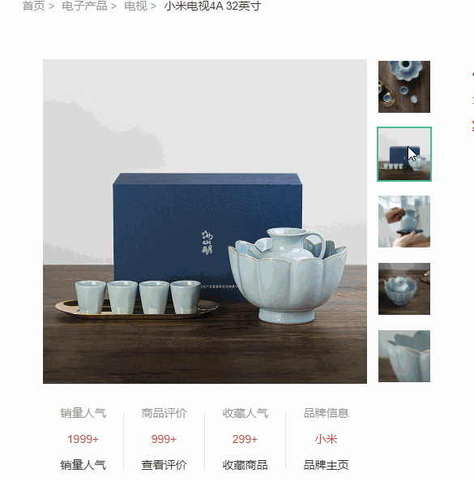
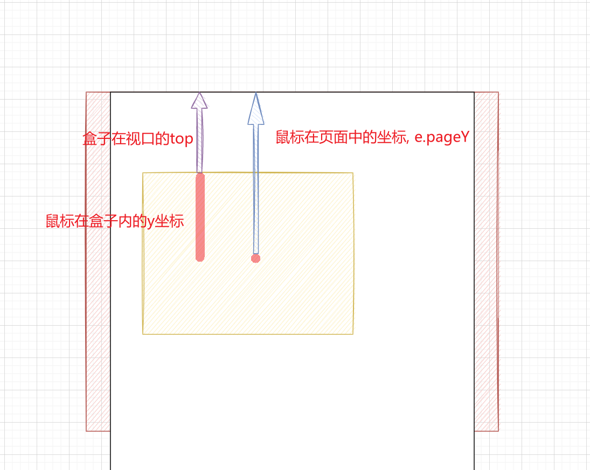
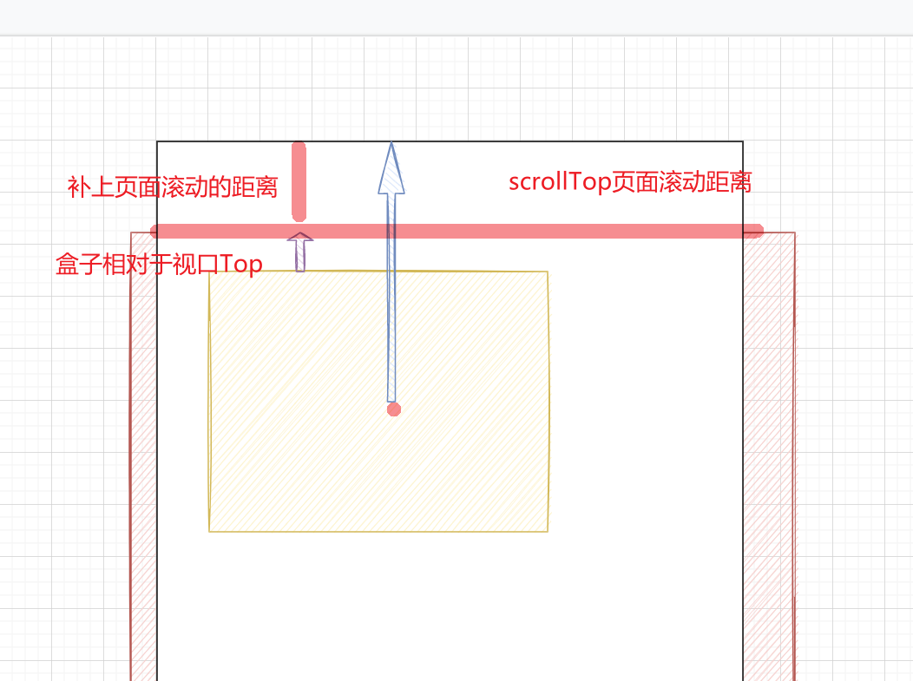
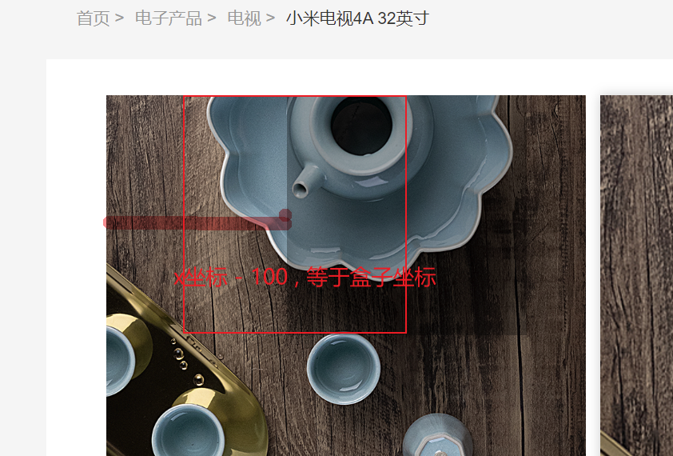
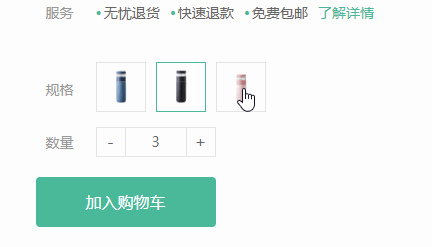
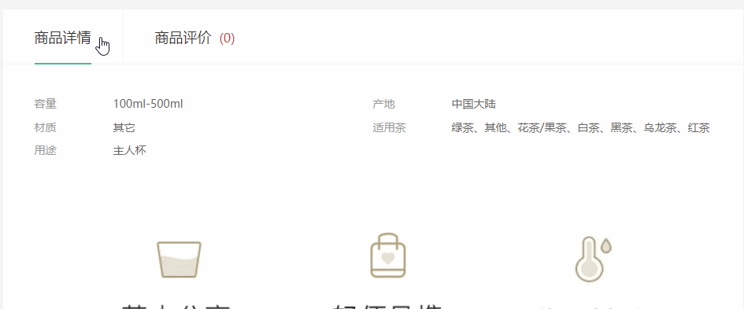

## Target

1. 能够跟随课堂代码完成-鼠标经过小图片模块
2. 能够跟随课堂代码完成-鼠标经过中等盒子显示隐藏大盒子
3. 能够跟随课堂代码完成-鼠标经过中等盒子显示隐藏遮罩盒子
4. 能够跟随课堂代码完成-限定黑色遮罩盒子移动范围
5. 能够跟随课堂代码完成-大图片跟着移动效果

💡🚀🤟👉👇☀️🍉🍍🍇🍓🥕🍭🎖️🎁☘️🍀💯🔆❗🔥🚩

## 1. 个人实战

参考效果如下地址：

http://erabbit.itheima.net/#/product/3995139

本次实战主要分为以下几个模块。

### 1. 顶部导航模块


需求：

1. 顶部导航开始不显示
2. 等页面滑到主导航栏，这个**新顶部导航栏滑动下拉显示**，并且改为固定定位
3. 等页面滑到上面，新顶部导航栏隐藏

### 2. 图片切换模块

 


### 3. 放大镜效果

 


#### 业务分析

- ①： 鼠标经过对应小盒子，左侧中等盒子显示对应中等图片
- ②： 鼠标经过中盒子，右侧会显示放大镜效果的大盒子
- ③： 黑色遮罩盒子跟着鼠标来移动
- ④： 鼠标在中等盒子上移动，大盒子的图片跟着显示对应位置


#### 思路分析

##### todo 01 

> ①：鼠标经过小盒子，左侧中等盒子显示对应中等图片

1. 获取对应的元素

2. 采取事件委托的形式，监听鼠标经过小盒子里面的图片， 注意此时需要使用 `mouseover` 事件，因为需要事件冒泡触发small 

3. 让鼠标经过小图片的爸爸li盒子，添加类，其余的li移除类（注意先移除，后添加）

4. 鼠标经过小图片，可以拿到小图片的src， 可以做两件事

   - 让中等盒子的图片换成这个 这个小图片的src

   - 让大盒子的背景图片，也换成这个小图片的 src （稍后做）

##### todo 02 

> ②： 鼠标经过中等盒子，右侧大盒子显示


1. 用到鼠标经过和离开，鼠标经过中盒子，大盒子 利用 display 来显示和隐藏
2. 显示和隐藏也尽量定义一个函数，因为鼠标经过离开中等盒子，会显示隐藏，同时，**鼠标经过大盒子，也会显示和隐藏**
3. 给大盒子里面的背景图片一个默认的第一张图片


##### todo 03 

> ③： 黑色遮罩盒子跟着鼠标来移动

1. 先做鼠标经过 中等盒子，显示隐藏 黑色遮罩 的盒子

2. 让黑色遮罩跟着鼠标来走, 需要用到鼠标移动事件  mousemove  

3. 让黑色盒子的移动的核心思想：不断把鼠标在中等盒子内的坐标给黑色遮罩层 let  top 值，这样遮罩层就可以跟着移动了

   - 需求

     - 我们要的是 鼠标在 中等盒子内的坐标， 没有办法直接得到
     - 得到1：  鼠标在页面中的坐标
     - 得到2：  中等盒子在页面中的坐标


   - 算法

     - 得到鼠标在页面中的坐标    利用事件对象的  pageX  
     - 得到middle中等盒子在页面中的坐标   middle.getBoundingClientRect()
     - 鼠标在middle 盒子里面的坐标   =   鼠标在页面中的坐标  -   middle 中等盒子的坐标
     - 黑色遮罩层不断得到       鼠标在middle 盒子中的坐标 就可以移动起来了

     


>注意 y坐标特殊，需要减去 页面被卷去的头部 
>
>为什么不用 box.offsetLet 和 box.offsetTop  因为这俩属性跟带有定位的父级有关系，很容被父级影响，而getBoundingClientRect() 不受定位的父元素的影响

4. 限定遮罩的盒子只能在middle 内部移动，需要添加判断

   - 限定水平方向 大于等于0 并且小于等于 400

   - 限定垂直方向 大于等于0 并且小于等于 400

5. 遮罩盒子移动的坐标： 

   - 声明一个 mx 作为移动的距离

   - 水平坐标 x 如果 小于等于100 ，则移动的距离 mx 就是  0  不应该移动

   - 水平坐标 如果 大于等于100 并且小于300，移动的距离就是  mx - 100 （100是遮罩盒子自身宽度的一半）

   - 水平坐标 如果 大于等于300，移动的距离就是  mx   就是200  不应该在移动了

   - 其实我们发现水平移动， 就在 100 ~ 200 之间移动的

   - 垂直同理

~~~javascript
let mx = 0, my = 0;
if (x <= 100) mx = 0
if (x > 100 && x < 300) mx = x - 100
if (x >= 300) mx = 200

if (y <= 100) my = 0
if (y > 100 && y < 300) my = y - 100
if (y >= 300) my = 200
~~~

- 大盒子图片移动的计算方法：
  - 中等盒子是 400px  大盒子 是 800px 的图片
  - 中等盒子移动1px， 大盒子就应该移动2px， 只不过是负值

~~~JavaScript
large.style.backgroundPositionX = - 2 * mx + 'px'
large.style.backgroundPositionY = - 2 * my + 'px'
~~~

#### 图解 01 

> 当没有滚动条是时, 视口top就是盒子到页面顶部的距离



#### 图解 02 

> 当出现滚动条时



#### 图解 03 

> 怎么让鼠标在盒子中间



#### 🚩 Code  EG

```js
    // 1. 获取三个盒子
    // 2. 小盒子 图片切换效果
    const small = document.querySelector('.small')
    //  中盒子
    const middle = document.querySelector('.middle')
    //  大盒子
    const large = document.querySelector('.large')
    // 2. 事件委托
    small.addEventListener('mouseover', function (e) {
      if (e.target.tagName === 'IMG') {
        // console.log(111)
        // 排他 干掉以前的 active  li 上面
        this.querySelector('.active').classList.remove('active')
        // 当前元素的爸爸添加 active
        e.target.parentNode.classList.add('active')
        // 拿到当前小图片的 src
        // console.log(e.target.src)
        // 让中等盒子里面的图片，src 更换为   小图片src
        middle.querySelector('img').src = e.target.src
        // 大盒子更换背景图片
        large.style.backgroundImage = `url(${e.target.src})`
      }
    })


    // 3. 鼠标经过中等盒子， 显示隐藏 大盒子
    middle.addEventListener('mouseenter', show)
    middle.addEventListener('mouseleave', hide)
    // 显示函数 显示大盒子
    function show() {
      large.style.display = 'block'
    }
    // 隐藏函数 隐藏大盒子
    function hide() {
        large.style.display = 'none'
    }


    // 4. 鼠标经过大盒子， 显示隐藏 大盒子
    large.addEventListener('mouseenter', show)
    large.addEventListener('mouseleave', hide)


    // 5. 鼠标经过中等盒子，显示隐藏 黑色遮罩层
    const layer = document.querySelector('.layer')
    middle.addEventListener('mouseenter', function () {
      layer.style.display = 'block'
    })
    middle.addEventListener('mouseleave', function () {
      layer.style.display = 'none'
    })
    // 6.移动黑色遮罩盒子
    middle.addEventListener('mousemove', function (e) {
      // 鼠标在middle 盒子里面的坐标 = 鼠标在页面中的坐标 - middle 中等盒子的坐标
      // console.log(e.pageX)鼠标在页面中的坐标
      // middle 中等盒子的坐标
      // console.log(middle.getBoundingClientRect().left)
      let x = e.pageX - middle.getBoundingClientRect().left
      let y = e.pageY - middle.getBoundingClientRect().top - document.documentElement.scrollTop
      // console.log(x, y)
      // 黑色遮罩移动 在 middle 盒子内 限定移动的距离
      if (x >= 0 && x <= 400 && y >= 0 && y <= 400) {
        // 黑色盒子不是一直移动的
        // 声明2个变量 黑色盒子移动的 mx my变量 
        let mx = 0, my = 0
        if (x < 100) mx = 0
        if (x >= 100 && x <= 300) mx = x - 100
        if (x > 300) mx = 200

        if (y < 100) my = 0
        if (y >= 100 && y <= 300) my = y - 100
        if (y > 300) my = 200

        layer.style.left = mx + 'px'
        layer.style.top = my + 'px'
        // 大盒子的背景图片要跟随 中等盒子移动  存在的关系是 2倍   
        large.style.backgroundPositionX = -2 * mx + 'px'
        large.style.backgroundPositionY = -2 * my + 'px'
      }
    })
```


## 2. 其他模块

此模块可以根据自己时间添加

### 2.1 点击模块




### 2.2 tab栏切换模块




### 2.3 返回顶部模块

页面滚动底部，可以出现一个侧边栏，点击返回顶部，可以返回顶部


