## Target

1. 能够说出完成这个项目需要哪些技术
2. 能够说出Echarts的使用场景
3. 能够引入Echarts到自己的项目中来
4. 能够说出series xAxis, yAxis, grid等配置的作用
5. 能说出数据可视化项目的适配方案
6. 能够说出边框图片的使用步骤
7. 能够完成公共面板模块布局

## 1. 数据可视化

### 1.1 什么是数据可视化

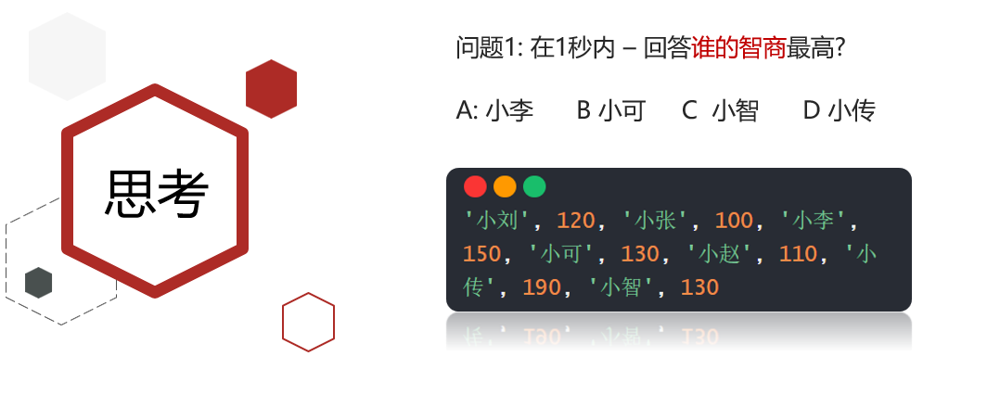

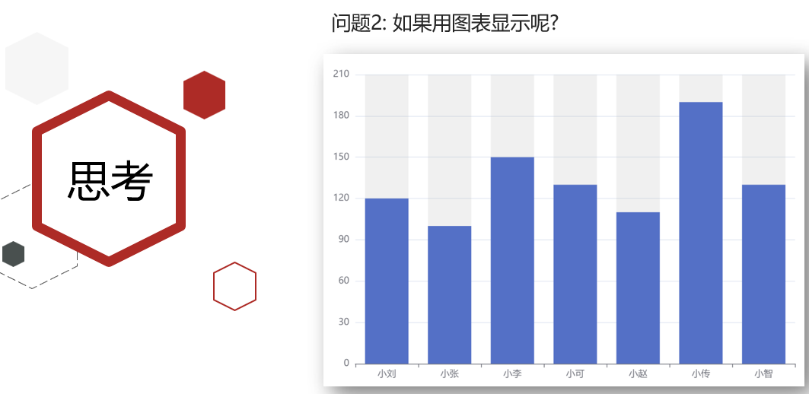

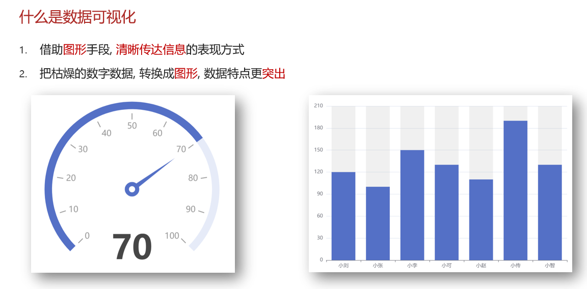

> 用图表的形式来展示数据就是数据可视化.

### 1.1 应用场景

1. 通用报表
2. 移动端图表
3. 大屏可视化
4. 图编辑图分析
5. 地理可视化

> 基本上能使用图表展示的地方都是应用场景

- [疫情最新数据](https://voice.baidu.com/act/newpneumonia/newpneumonia/?from=osari_aladin_banner)

### 1.2 常见的数据可视化库

1. [Echarts](https://echarts.apache.org/zh/index.html)
2. [HighCharts](https://www.highcharts.com.cn/)
3. [D3.js](https://d3js.org/)
4. [AntV](https://antv.vision/zh)


---

## 2. Echarts 

### 2.1 介绍

> 官网 : https://echarts.apache.org/zh/index.html

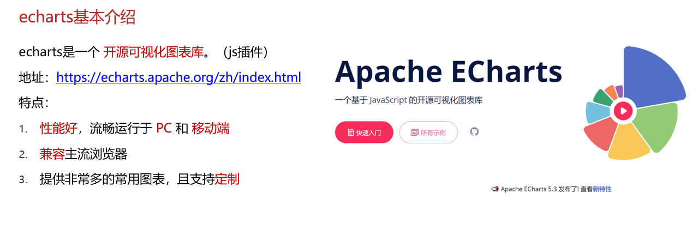

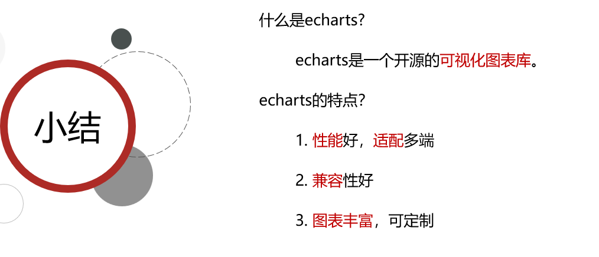

####  访问不了Echarts的同学

- [Echarts 官网](https://echarts.apache.org/zh/index.html) 

**Mac 打开ternimal终端**

```bash
sudo vi /etc/hosts  # 管理员权限 sudo
# hosts中添加
151.101.2.132 echarts.apache.org www.apache.org dlcdn.apache.org
```

**windows**

在 `C:\WINDOWS\system32\drivers\etc`路径下， 找到hosts文件， 记事本打开， 末尾添加这一段，保存

```bash
151.101.2.132 echarts.apache.org www.apache.org dlcdn.apache.org
```

#### 下载

进入官网，点击下载，从github下载

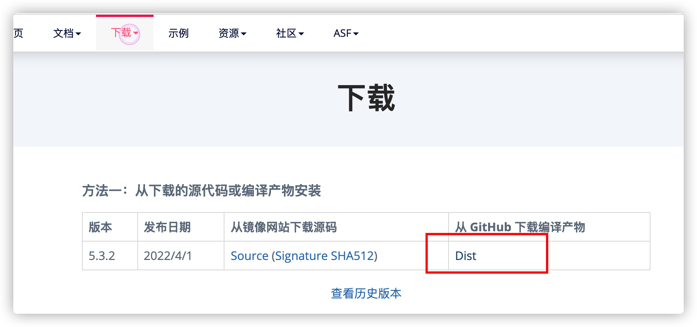

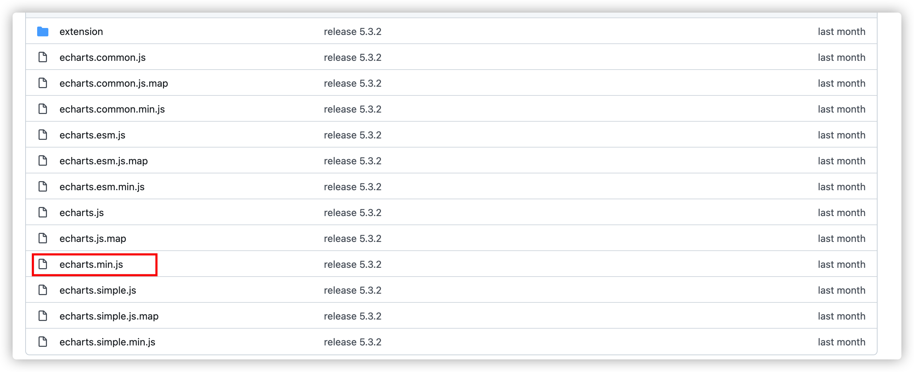

方式二

看文档中

https://echarts.apache.org/handbook/zh/get-started/#%E8%8E%B7%E5%8F%96-apache-echarts

https://www.jsdelivr.com/package/npm/echarts?path=dist

选择下载后，保存到本地

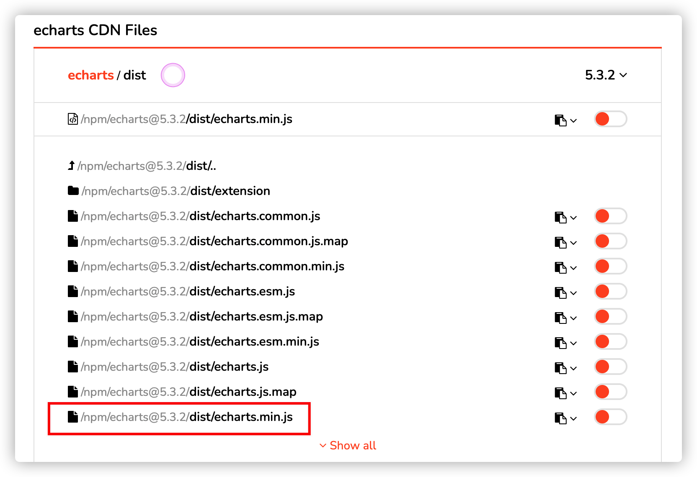


### 2.2 项目介绍

​	应对现在数据可视化的趋势，越来越多企业需要在很多场景(营销数据，生产数据，用户数据)下使用，可视化图表来展示体现数据，让数据更加直观，数据特点更加突出。我们引入 '立可得' 数据可视化项目。

​	该项目除了使用了基础的DIV+CSS布局，还引入了一些C3技术，还引入了各类图表的绘制，以及高级的地图数据可视化案例。主要功能有：饼状图、柱状图、线形图、地图 ...

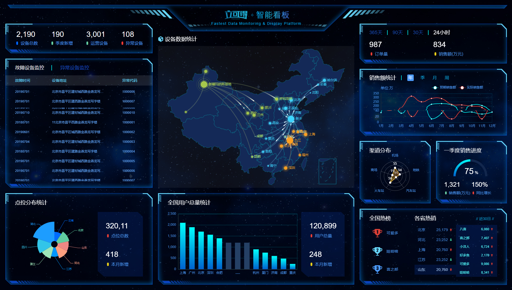

#### 使用技术

完成该项目主要用到的知识点：
1. Echarts + JS
3. flex + rem
4. border-image

### 2.3 Echarts-体验

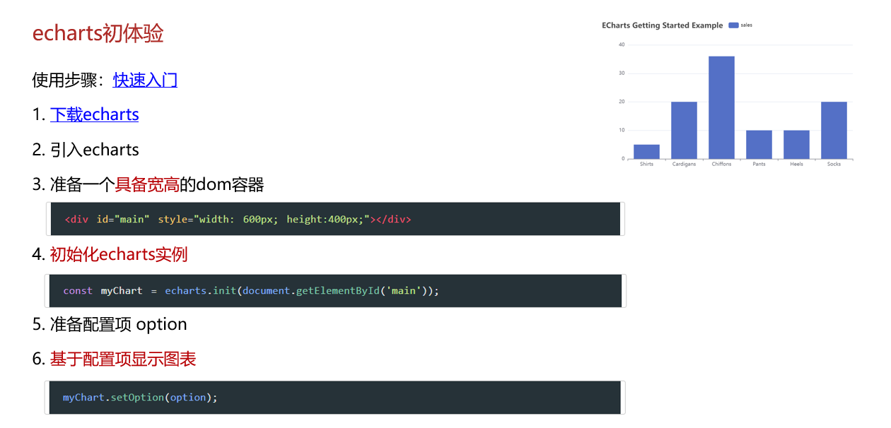

[快速上手](https://echarts.apache.org/handbook/zh/get-started/)

步骤：

```js
// 1. 下载并引入 echarts 文件
// 2. 为 echarts 准备一个定义了宽高的 DOM
// 3. 基于准备好的DOM， 初始化echarts 实例
// 4. 指定图表的配置项和数据
// 5. 将配置项设置给echarts实例对象 （通过setOption）
```

1. 引入echarts  `js/echarts.min.js`

```html
<!-- 1. 引入echarts -->
<script src="./js/echarts.min.js"></script>
```

2. 准备一个定义了宽高的DOM容器

```html
<style>
  .echart-box{
    width: 800px;
    height: 400px;
    margin: 50px auto;
  }
</style>
<!-- 2. 准备一个定义了宽高的DOM -->
<div class="echart-box" id="echart-bar"></div>
```

3. 初始化echarts实例

```js
// 3. 初始化echarts实例
const myChart = echarts.init(document.querySelector('.echart-box'))
```

4. 指定配置项和数据(option)

```js
// 4. 指定图表的配置项和数据
const option = {
  title: {
    text: 'ECharts 入门示例'
  },
  tooltip: {},
  legend: {
    data: ['销量']
  },
  xAxis: {
    data: ['衬衫', '羊毛衫', '雪纺衫', '裤子', '高跟鞋', '袜子']
  },
  yAxis: {},
  series: [
    {
      name: '销量',
      type: 'bar',
      data: [5, 20, 36, 10, 10, 20]
    }
  ]
};
```

5. 将配置项设置给echarts实例对象

```js
// 5. 使用刚指定的配置项和数据显示图表。
myChart.setOption(option);
```

#### 核心三步骤

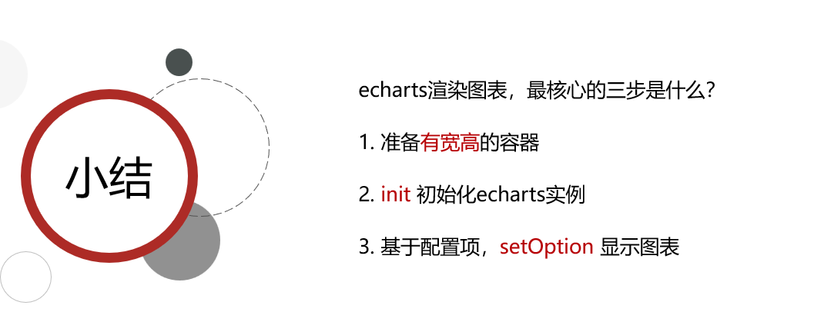

#### 选择不同类型的图表

- 查看示例 https://echarts.apache.org/examples/zh/index.html

```js
// 1. 下载并引入echarts 文件
// 2. 为 echarts 准备一个定义了宽高的 DOM
// 3. 基于准备好的DOM， 初始化echarts 实例
// 4. 指定图表的配置项和数据
// 5. 将配置项设置给echarts实例对象 （通过setOption）
```

- 饼图 - 简单

```js
var option = {
  title: {
    text: 'Referer of a Website',
    subtext: 'Fake Data',
    left: 'center'
  },
  tooltip: {
    trigger: 'item'
  },
  legend: {
    orient: 'vertical',
    left: 'left'
  },
  series: [
    {
      name: 'Access From',
      type: 'pie',
      radius: '50%',
      data: [
        { value: 1048, name: 'Search Engine' },
        { value: 735, name: 'Direct' },
        { value: 580, name: 'Email' },
        { value: 484, name: 'Union Ads' },
        { value: 300, name: 'Video Ads' }
      ],
      emphasis: {
        itemStyle: {
          shadowBlur: 10,
          shadowOffsetX: 0,
          shadowColor: 'rgba(0, 0, 0, 0.5)'
        }
      }
    }
  ]
};
```

### 2.4 基本配置

> 配置项手册 https://echarts.apache.org/zh/option.html

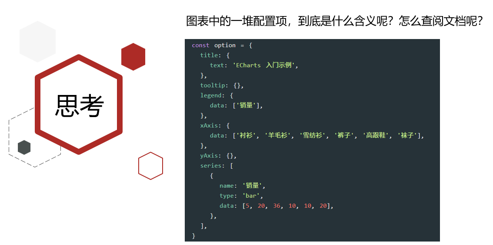

**1. 找到配置项手册**

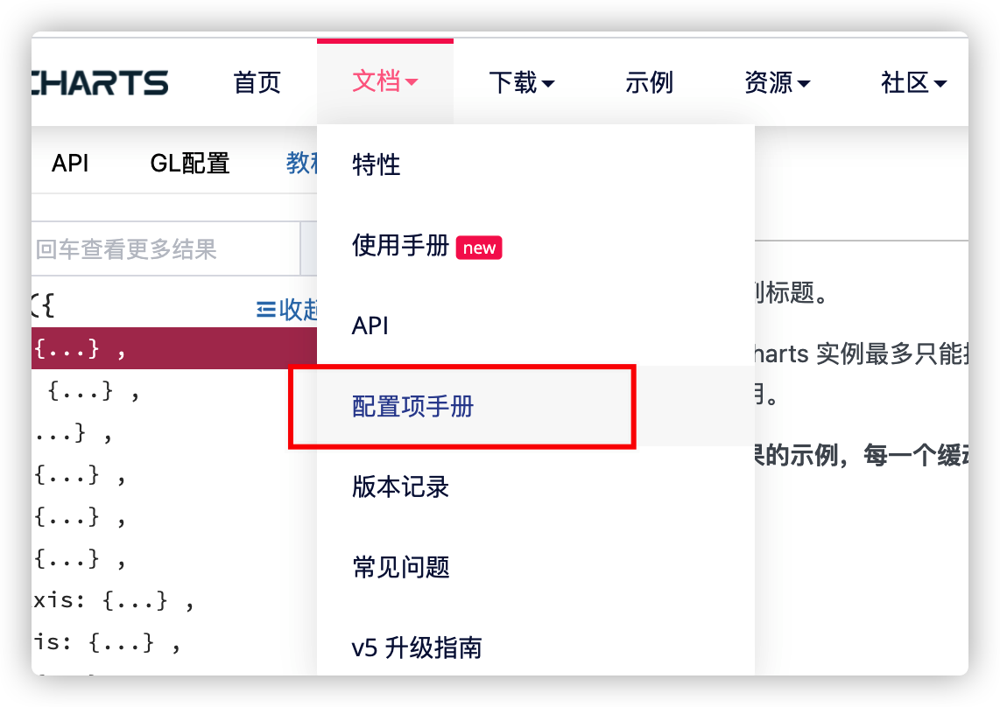

**2. 找到对应配置项**

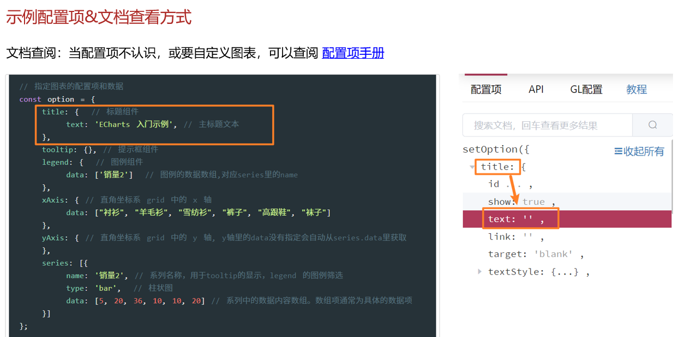

> 当echarts的使用中，如果有不认识的配置项，怎么办？
>
> 查配置项手册！


V4 版本例子 https://echarts.apache.org/v4/examples/zh/editor.html?c=line-stack

```js
option = {
  	// 标题组件
    title: {
        text: '折线图堆叠'
    },
  	// 提示框组件
    tooltip: {
        trigger: 'axis'
    },
  	// 图例组件
    legend: {
        data: ['邮件营销', '联盟广告', '视频广告', '直接访问', '搜索引擎']
    },
  	// 工具栏。内置有导出图片，数据视图，动态类型切换，数据区域缩放，重置五个工具。
    toolbox: {
        feature: {
            saveAsImage: {}
        }
    },
    grid: {
        left: '3%',
        right: '4%',
        bottom: '3%',
        containLabel: true
    },
    xAxis: {
        type: 'category',
        boundaryGap: false,
        data: ['周一', '周二', '周三', '周四', '周五', '周六', '周日']
    },
    yAxis: {
        type: 'value'
    },
    series: [
        {
            name: '邮件营销',
            type: 'line',
            stack: '总量',
            data: [120, 132, 101, 134, 90, 230, 210]
        },
        {
            name: '联盟广告',
            type: 'line',
            stack: '总量',
            data: [220, 182, 191, 234, 290, 330, 310]
        },
        {
            name: '视频广告',
            type: 'line',
            stack: '总量',
            data: [150, 232, 201, 154, 190, 330, 410]
        },
        {
            name: '直接访问',
            type: 'line',
            stack: '总量',
            data: [320, 332, 301, 334, 390, 330, 320]
        },
        {
            name: '搜索引擎',
            type: 'line',
            stack: '总量',
            data: [820, 932, 901, 934, 1290, 1330, 1320]
        }
    ]
};
```

#### 常用基本配置


> https://echarts.apache.org/examples/zh/editor.html?c=line-stack

1. title  :  标题组件
1. tooltip :  提示框组件

```js
    tooltip: {
        trigger: 'axis' // 坐标轴触发
    },
```

3. legend : 图例组件

```js
legend: {
  // 图例项的名称，应等于某系列的name值
  data: ['邮件营销', '联盟广告', '视频广告', '直接访问', '搜索引擎']
},
```

4. toolbox 工具栏

```js
    toolbox: {
        feature: {
            // 数据区域缩放。目前只支持直角坐标系的缩放。
            dataZoom: {},
            // 数据视图工具，可以展现当前图表所用的数据
            dataView: {},
            // 动态类型切换 折线,柱状图转换
            magicType: {
                type: ["line", "bar"]
            },
            // 配置项还原 重置
            restore: {},
            // 保存图片
            saveAsImage: {}
        }
    },
```

5. grid 网格区域

```js
    // 直角坐标系网格区域
    grid: {
        left: '3%',
        right: '4%',
        bottom: '3%',
        // grid 区域是否包含坐标轴的刻度标签。
        containLabel: true
       // 如果全部为0%，整个DOM宽高
        // left: '0%',
        // right: '0%',
        // top:'0%',
        // bottom: '0%',
    },
```

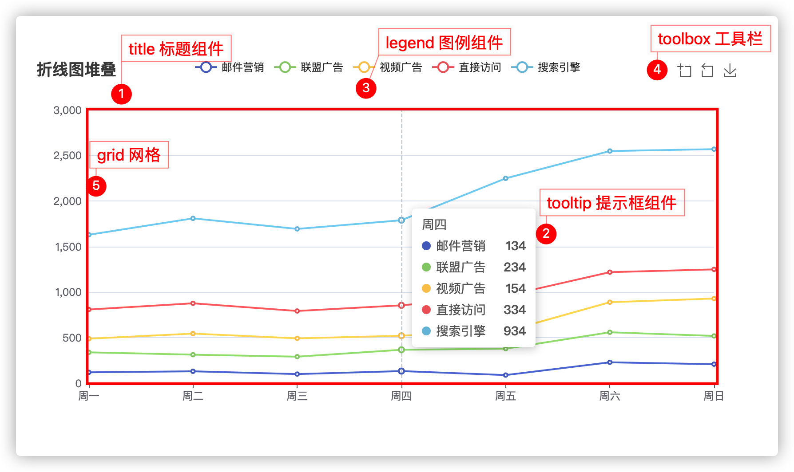

6. xAxis   x轴相关配置

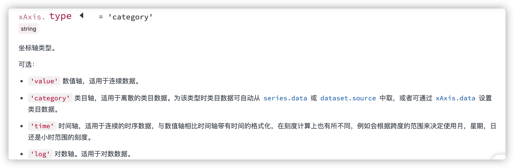

```js
xAxis: {
  // category 类目
  type: 'category',
  boundaryGap: false,
  // 类目数据
  data: ['周一', '周二', '周三', '周四', '周五', '周六', '周日']
},
  
  // 对于type为category, boundaryGap设为true后
  // 标签和数据点都会在两个刻度之间的带(band)中间
  // boundaryGap: true,
```

7. yAxis   y轴相关配置

```js
同x轴  type :' value' 
```

8. color  调色盘颜色列表

```js
['#5470c6', '#91cc75', '#fac858', '#ee6666', '#73c0de', '#3ba272', '#fc8452', '#9a60b4', '#ea7ccc']
```

9. series  系列列表。每个系列通过 `type` 决定自己的图表类型

series 是一个数组，内部又很多个对象

属性

1. type   :   图表类型 type :   ‘line’ / ‘bar’ / ‘pie‘  常用 这三个类型， 折线，柱状图，饼图
2. name :  系列名称，用于[tooltip](https://echarts.apache.org/zh/option.html#tooltip)的显示，[legend](https://echarts.apache.org/zh/option.html#legend) 的图例筛选
3. stack ： 数据堆叠。 转为柱状图查看， 去掉stack。

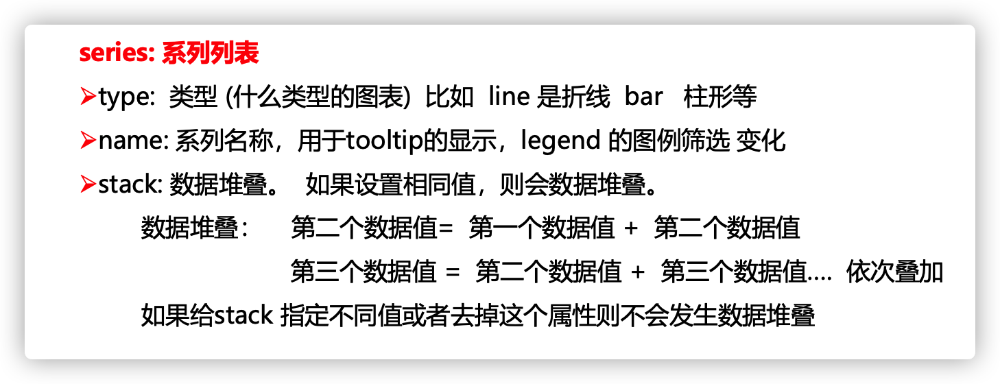

```js
    series: [
        {
            name: '邮件营销',
            type: 'line',
            stack: '总量',
            data: [120, 132, 101, 134, 90, 230, 210]
        },
        {
            name: '联盟广告',
            type: 'line',
            stack: '总量',
            data: [220, 182, 191, 234, 290, 330, 310]
        },
        {
            name: '视频广告',
            type: 'line',
            stack: '总量',
            data: [150, 232, 201, 154, 190, 330, 410]
        },
        {
            name: '直接访问',
            type: 'line',
            stack: '总量',
            data: [320, 332, 301, 334, 390, 330, 320]
        },
        {
            name: '搜索引擎',
            type: 'line',
            stack: '总量',
            data: [820, 932, 901, 934, 1290, 1330, 1320]
        }
    ]
```

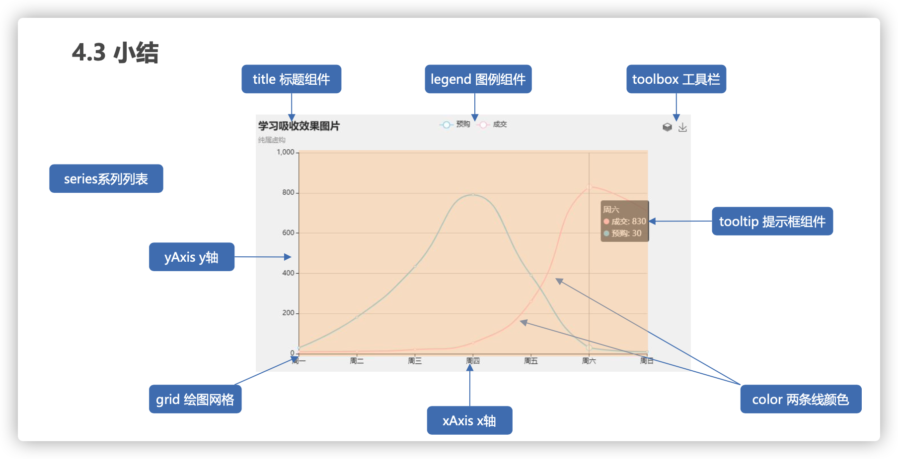

#### 小结

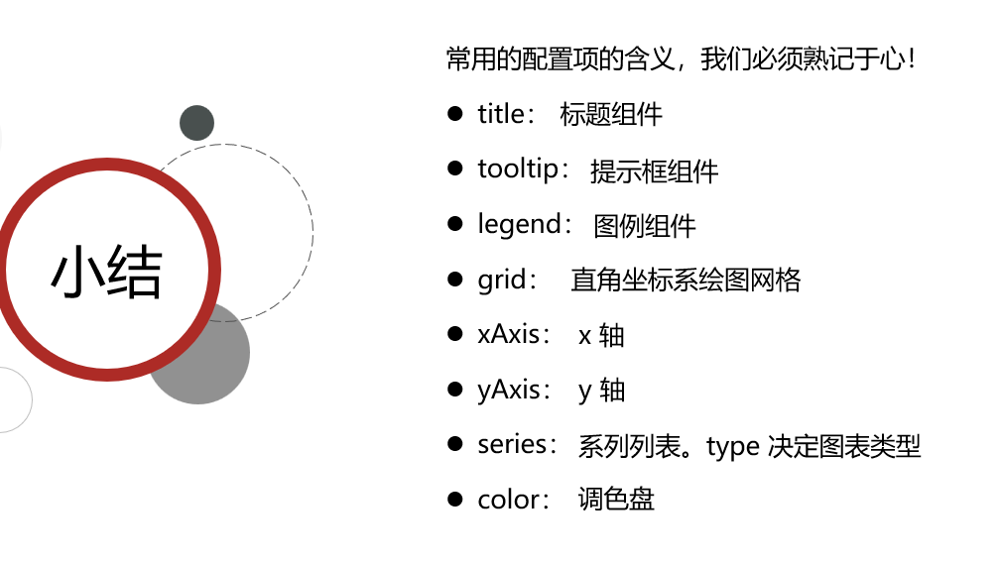

---


> 需要了解的主要配置：`series` `xAxis` `yAxis` `grid` `tooltip` `title` `legend` `color` 

- series
  - 系列列表。每个系列通过 `type` 决定自己的图表类型
  - 大白话：图标数据，指定什么类型的图标，可以多个图表重叠。

- xAxis：直角坐标系 grid 中的 x 轴

  -  boundaryGap: 坐标轴两边留白策略 true，这时候刻度只是作为分隔线，标签和数据点都会在两个刻度之间的带(band)中间。

- yAxis：直角坐标系 grid 中的 y 轴

- grid：直角坐标系内绘图网格。 

- title：标题组件

- tooltip：提示框组件

- legend：图例组件

- toolbox :工具栏

- color：调色盘颜色列表

  数据堆叠，同个类目轴上系列配置相同的`stack`值后 后一个系列的值会在前一个系列的值上相加。

演示代码：

```js
var option = {
            color: ['pink', 'blue', 'green', 'skyblue', 'red'],
            title: {
                text: '我的折线图'
            },
            tooltip: {
                trigger: 'axis'
            },
            legend: {
                data: ['直播营销', '联盟广告', '视频广告', '直接访问']
            },
            grid: {
                left: '3%',
                right: '3%',
                bottom: '3%',
                // 当刻度标签溢出的时候，grid 区域是否包含坐标轴的刻度标签。如果为true，则显示刻度标签
                // 如果left right等设置为 0% 刻度标签就溢出了，此时决定是否显示刻度标签
                containLabel: true
            },
            toolbox: {
                feature: {
                    saveAsImage: {}
                }
            },
            xAxis: {
                type: 'category',
                // 坐标轴两边留白策略 true，这时候刻度只是作为分隔线，标签和数据点都会在两个刻度之间的带(band)中间。
                boundaryGap: false,
                data: ['星期一', '星期二', '周三', '周四', '周五', '周六', '周日']
            },
            yAxis: {
                type: 'value'
            },
            series: [
                {
                    name: '直播营销',
                    // 图表类型是线形图
                    type: 'line',
                    data: [120, 132, 101, 134, 90, 230, 210]
                },
                {
                    name: '联盟广告',
                    type: 'line',

                    data: [220, 182, 191, 234, 290, 330, 310]
                },
                {
                    name: '视频广告',
                    type: 'line',

                    data: [150, 232, 201, 154, 190, 330, 410]
                },
                {
                    name: '直接访问',
                    type: 'line',

                    data: [320, 332, 301, 334, 390, 330, 320]
                }
            ]
        };
```

## 3. 项目

### 3.1 REM适配

- 设计稿是1920px  

- PC端适配： 宽度在 1024~1920之间页面元素宽高自适应

  1. flexible.js 把屏幕分为 24 等份 （更精细）

  2. cssrem 插件的基准值是  80px 

     插件-配置按钮---配置扩展设置--Root Font Size 里面 设置。 

     ```json
         "cssrem.rootFontSize":80,   // settings.json中设置 不用重启
     ```
  
     但是别忘记重启vscode软件保证生效
  
  3. 要把屏幕宽度约束在1024~1920之间有适配，实现代码：
  
  3. 安装自动刷新插件 Preview on Web Server

```js
// 实现rem适配
@media screen and (max-width: 1024px) {
     html {
         font-size: 42.66px !important;
     }
 }

 @media screen and (min-width: 1920px) {
     html {
         font-size: 80px !important;
     }
 }
```


### 3.2 基础布局

html结构：

```html
<body>
  <div class="viewport">
  	<div class="column">
      <!--概览-->                                    
    	<div></div>
			<!--监控-->                                    
    	<div></div> 
			<!--点位-->                                    
    	<div></div>                                           
    </div>
    <div class="column">
      <!--地图-->                                    
    	<div></div>
			<!--用户-->                                    
    	<div></div>                                          
    </div>
    <div class="column">
      <!--订单-->                                    
    	<div></div>
			<!--销售-->                                    
    	<div></div>                                  
    	<div>
      	<!--渠道-->                                    
    		<div></div>
      	<!--季度-->                                    
    		<div></div>
      </div>
			<!--排行-->                                    
    	<div></div>                                     
    </div>                        
  </div>
</body>
```

- 效果图： 1920px *  1078px 
- body 设置背景图 ，行高1.15
- viewport 主体容器，限制最小宽度1024px，与最大宽度1920px，最小高度780px。
  - 需要居中显示
  - 使用logo.png做为背景图，在容器内显示
  - 内间距 88px 20px 0
- column 列容器，分三列，占比 3：4：3
  - 中间容器外间距  32px  20px 0

css样式：

```html
<!DOCTYPE html>
<html lang="en">
<head>
    <meta charset="UTF-8">
    <meta http-equiv="X-UA-Compatible" content="IE=edge">
    <meta name="viewport" content="width=device-width, initial-scale=1.0">
    <title>Document</title>
</head>
<body>
    <!-- 父容器大盒子 -->
    <div class="viewport">
        <div class="column"></div>
        <div class="column"></div>
        <div class="column"></div>
    </div>
    <script src="./js/flexible.js"></script>
    <script src="./js/echarts.min.js"></script>
</body>
</html>
```


```css
  /* // 实现rem适配 */
  @media screen and (max-width: 1024px) {
    html {
      font-size: 42.66px !important;
    }
  }
  
  @media screen and (min-width: 1920px) {
    html {
      font-size: 80px !important;
    }
  }

  body {
    background: url(../imgs/bg.jpg) no-repeat 0 0 / cover;
    // background-size: cover;
  }
 .viewport {
    display: flex;  // 第二步写
    min-width: 1024px;
    max-width: 1920px;
    margin: 0 auto;
    padding: 1.1rem 0.25rem 0;   // 88 20 0
    background: url(../imgs/logo.png) no-repeat;
    /* contain 缩小图片来适应元素尺寸 */
    /* cover 延伸图片来填满 body， 图片太大，超出部分会被隐藏*/
    background-size: contain;
    min-height: 780px;
  }
  .viewport .column {
    flex: 3;
    background-color: pink;
  }
  .viewport .column:nth-child(2) {
    flex: 4;
    margin: 0.4rem 0.25rem 0;
  }
```


### 3.3 边框图片

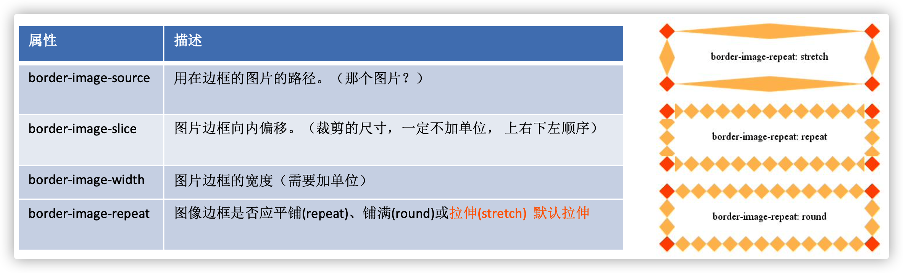

> css3中自适应边框图片运用：


组合写法：

```css
border-image: url("images/border.jpg") 167/20px round;
```

拆分写法：

```css
border-image-source: url("images/border.jpg");
border-image-slice: 167 167 167 167;
border-image-width: 20px;
border-image-repeat: round;
```

解释：

- 边框图片资源地址
- 裁剪尺寸（上 右 下 左）单位默认px，可使用百分百。
- 边框图片的宽度，默认边框的宽度。
- 平铺方式：
  - stretch 拉伸（默认）
  - repeat 平铺，从边框的中心向两侧开始平铺，会出现不完整的图片。
  - round 环绕，是完整的使用切割后的图片进行平铺。

DEMO代码：

```html
<!DOCTYPE html>
<html lang="en">
<head>
    <meta charset="UTF-8">
    <title>边框图片</title>
    <style>
        ul{
            margin: 0;
            padding: 0;
            list-style: none;
        }
        li{
            width: 350px;
            height: 160px;
            border: 20px solid #ccc;
            margin-top: 20px;
        }
        li:nth-child(1){
            /*border-image: url("images/border.jpg") 167/20px round;*/
            border-image-source: url("images/border.jpg");
            border-image-slice: 167 167 167 167;
            border-image-width: 20px;
            /*环绕  是完整的使用切割后的图片进行平铺*/                    
            border-image-repeat: round; 
        }
        li:nth-child(2){
            /*平铺 从边框的中心向两侧开始平铺 会出现不完整的图片*/                                         
          border-image: url("images/border.jpg") 167/20px repeat;
        }
        li:nth-child(3){
            /*默认的平铺方式*/
            border-image: url("images/border.jpg") 167/20px stretch;
        }
    </style>
</head>
<body>
<ul>
    <li></li>
    <li></li>
    <li></li>
</ul>
</body>
</html>
```


### 3.4 公用面板样式

> 所有的面板的基础样式是一致的，提前布局好。

切割示例图：


- 面板 .panel 
  - 容器 .inner   内边距是 上下24px  左右 36px

```css

/* 公共面板样式  */
.panel {
    position: relative;
    border: 15px solid transparent;
    border-width: .6375rem .475rem .25rem 1.65rem;
    border-image-source: url(../images/border.png);
    border-image-slice: 51 38 20 132;
    margin-bottom: .25rem;
}
.inner {
    position: absolute;
    top: -0.6375rem;
    left: -1.65rem;
    right: -0.475rem;
    bottom: -0.25rem;
    padding: .3rem .45rem;
   
}
.panel h3 {
  font-size: 0.25rem;
  color: #fff;
  font-weight: 400;
}
```


### 01 概览区域(overview)-布局

html结构：

```html
      <div class="overview panel">
        <div class="inner">
          <ul>
            <li>
              <h4>2,190</h4>
              <span>
                <i class="icon-dot" style="color: #006cff"></i>
                设备总数
              </span>
            </li>
            <li class="item">
              <h4>190</h4>
              <span>
                <i class="icon-dot" style="color: #6acca3"></i>
                季度新增
              </span>
            </li>
            <li>
              <h4>3,001</h4>
              <span>
                <i class="icon-dot" style="color: #6acca3"></i>
                运营设备
              </span>
            </li>
            <li>
              <h4>108</h4>
              <span>
                <i class="icon-dot" style="color: #ed3f35"></i>
                异常设备
              </span>
            </li>
            </ul>
        </div>
      </div>
```

样式描述：

- 容器高度 110px
- h4字体  28px   #fff   左边距 4.8px   下间隙 8px
- span字体  16px  #4c9bfd

```css
/* 概览区域 */

.overview {
    height: 1.375rem;
}
.overview ul {
    display: flex;
    justify-content: space-between;
}
.overview ul li h4 {
    font-size: .35rem;
    color: #fff;
    margin: 0 0 .1rem .06rem;
}
.overview ul li span {
    font-size: .2rem;
    color: #4c9bfd;
}
```


### 02 监控区域(monitor)-布局

html结构：

```html
      <!--监控-->
      <div class="monitor panel">
        <div class="inner">
          <div class="tabs">
            <a href="javascript:;" class="active">故障设备监控</a>
            <a href="javascript:;" >异常设备监控</a>
          </div>
          <div class="content">
            <div class="head">
              <span class="col">故障时间</span>
              <span class="col">设备地址</span>
              <span class="col">异常代码</span>
            </div>
            <div class="marquee-view">
              <div class="marquee">
                <div class="row">
                  <span class="col">20180701</span>
                  <span class="col">11北京市昌平西路金燕龙写字楼</span>
                  <span class="col">1000001</span>
                  <span class="icon-dot"></span>
                </div>
                <div class="row">
                  <span class="col">20190601</span>
                  <span class="col">北京市昌平区城西路金燕龙写字楼</span>
                  <span class="col">1000002</span>
                  <span class="icon-dot"></span>
                </div>
                <div class="row">
                  <span class="col">20190704</span>
                  <span class="col">北京市昌平区建材城西路金燕龙写字楼</span>
                  <span class="col">1000003</span>
                  <span class="icon-dot"></span>
                </div>
                <div class="row">
                  <span class="col">20180701</span>
                  <span class="col">北京市昌平区建路金燕龙写字楼</span>
                  <span class="col">1000004</span>
                  <span class="icon-dot"></span>
                </div>
                <div class="row">
                  <span class="col">20190701</span>
                  <span class="col">北京市昌平区建材城西路金燕龙写字楼</span>
                  <span class="col">1000005</span>
                  <span class="icon-dot"></span>
                </div>
                <div class="row">
                  <span class="col">20190701</span>
                  <span class="col">北京市昌平区建材城西路金燕龙写字楼</span>
                  <span class="col">1000006</span>
                  <span class="icon-dot"></span>
                </div>
                <div class="row">
                  <span class="col">20190701</span>
                  <span class="col">北京市昌平区建西路金燕龙写字楼</span>
                  <span class="col">1000007</span>
                  <span class="icon-dot"></span>
                </div>
                <div class="row">
                  <span class="col">20190701</span>
                  <span class="col">北京市昌平区建材城西路金燕龙写字楼</span>
                  <span class="col">1000008</span>
                  <span class="icon-dot"></span>
                </div>
                <div class="row">
                  <span class="col">20190701</span>
                  <span class="col">北京市昌平区建材城西路金燕龙写字楼</span>
                  <span class="col">1000009</span>
                  <span class="icon-dot"></span>
                </div>
                <div class="row">
                  <span class="col">20190710</span>
                  <span class="col">北京市昌平区建材城西路金燕龙写字楼</span>
                  <span class="col">1000010</span>
                  <span class="icon-dot"></span>
                </div>
              </div>
            </div>
          </div>
          <div class="content">
            <div class="head">
              <span class="col">异常时间</span>
              <span class="col">设备地址</span>
              <span class="col">异常代码</span>
            </div>
            <div class="marquee-view">
              <div class="marquee">
                <div class="row">
                  <span class="col">20190701</span>
                  <span class="col">北京市昌平区建材城西路金燕龙写字楼</span>
                  <span class="col">1000001</span>
                  <span class="icon-dot"></span>
                </div>
                <div class="row">
                  <span class="col">20190701</span>
                  <span class="col">北京市昌平区建材城西路金燕龙写字楼</span>
                  <span class="col">1000002</span>
                  <span class="icon-dot"></span>
                </div>
                <div class="row">
                  <span class="col">20190703</span>
                  <span class="col">北京市昌平区建材城西路金燕龙写字楼</span>
                  <span class="col">1000002</span>
                  <span class="icon-dot"></span>
                </div>
                <div class="row">
                  <span class="col">20190704</span>
                  <span class="col">北京市昌平区建材城西路金燕龙写字楼</span>
                  <span class="col">1000002</span>
                  <span class="icon-dot"></span>
                </div>
                <div class="row">
                  <span class="col">20190705</span>
                  <span class="col">北京市昌平区建材城西路金燕龙写字楼</span>
                  <span class="col">1000002</span>
                  <span class="icon-dot"></span>
                </div>
                <div class="row">
                  <span class="col">20190706</span>
                  <span class="col">北京市昌平区建材城西路金燕龙写字楼</span>
                  <span class="col">1000002</span>
                  <span class="icon-dot"></span>
                </div>
                <div class="row">
                  <span class="col">20190707</span>
                  <span class="col">北京市昌平区建材城西路金燕龙写字楼</span>
                  <span class="col">1000002</span>
                  <span class="icon-dot"></span>
                </div>
                <div class="row">
                  <span class="col">20190708</span>
                  <span class="col">北京市昌平区建材城西路金燕龙写字楼</span>
                  <span class="col">1000002</span>
                  <span class="icon-dot"></span>
                </div>
                <div class="row">
                  <span class="col">20190709</span>
                  <span class="col">北京市昌平区建材城西路金燕龙写字楼</span>
                  <span class="col">1000002</span>
                  <span class="icon-dot"></span>
                </div>
                <div class="row">
                  <span class="col">20190710</span>
                  <span class="col">北京市昌平区建材城西路金燕龙写字楼</span>
                  <span class="col">1000002</span>
                  <span class="icon-dot"></span>
                </div>
              </div>
            </div>
          </div>
        </div>
      </div>
```

**监控区域 monitor 大盒子的高度是 480px**

结构解释：

- .tabs  标签选项   加上active激活选项  默认激活第一个选项
- .content  切换内容  加上`style="display: block;"`显示内容   默认激活第一个内容

样式描述：

- .inner 容器内间距  24px  0
- .tabs 容器内间距 0 36px
  - a 容器  颜色： #1950c4  内间距：0 27px  字体：18px
  - 第一个a容器  去除左侧内间距   加上右侧2px宽度边框#00f2f1
  - 激活的时候  颜色白色
- .content容器
  - 占满剩余高度  flex:1
  - 默认隐藏
- .head 容器
  - 行高 1.05  背景 rgba(255, 255, 255, 0.1)  内间距  12px 36px  颜色 #68d8fe 字体大小 14px
- row 容器
  - 行高 1.05  内间距  12px 36px  颜色 #68d8ff 字体大小 12px
  - .icon-dot 字体图标   绝对定位  左边0.2rem  透明度0
  - 鼠标经过后：背景 rgba(255, 255, 255, 0.1)  透明度1
- col容器
  - 宽度：1rem   2.5rem    1rem
  - 第二个col   一行不换行  溢出  省略

```css
/* 监控区域 */
.monitor{
  height: 6rem;
}
.monitor .inner{
  padding: .3rem 0;
  display: flex;
  flex-direction: column;
}
.monitor .tabs{
  padding: 0 .45rem;
  margin-bottom: 0.225rem;
  display: flex;
}
.monitor .tabs a{
  color:#1950c4;
  font-size: 0.225rem;
  padding: 0 .3375rem;
}
.monitor .tabs a:first-child{
  padding-left: 0;
  border-right: 0.025rem solid #00f2f1;
}
.monitor .tabs a.active{
  color: #fff;
}
.monitor .content{
  flex: 1;
  position: relative;
  display: none;
}
.monitor .head{
  display: flex;
  justify-content: space-between;
  line-height: 1.05;
  background-color: rgba(255, 255, 255, 0.1);
  padding: 0.15rem 0.45rem;
  color: #68d8fe;
  font-size: 0.175rem;
}
.monitor .marquee-view {
  position: absolute;
  top: 0.5rem;
  bottom: 0;
  width: 100%;
  overflow: hidden;
}
.monitor .row{
  display: flex;
  justify-content: space-between;
  line-height: 1.05;
  font-size: 0.15rem;
  color: #61a8ff;
  padding: 0.15rem 0.45rem;
}
.monitor .row .icon-dot{
  position: absolute;
  left: 0.2rem;
  opacity: 0;
}
.monitor .row:hover {
  background-color: rgba(255, 255, 255, 0.1);
  color: #68d8fe;
}
.monitor .row:hover .icon-dot{
  opacity: 1;
}
.monitor .col:first-child{
  width: 1rem;
}
.monitor .col:nth-child(2){
  width: 2.5rem;
  white-space: nowrap;
  text-overflow: ellipsis;
  overflow: hidden;
}
.monitor .col:nth-child(3){
  width: 1rem;
}
```


