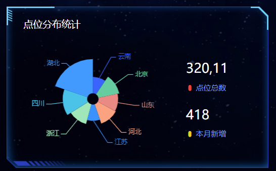
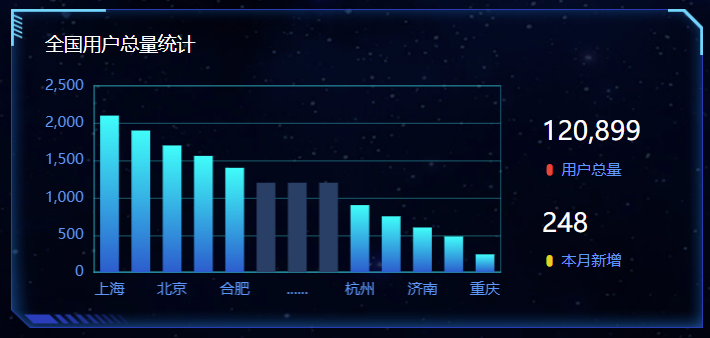
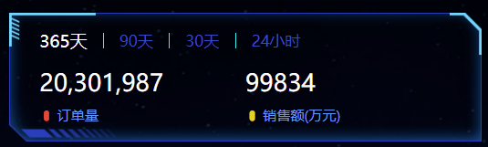
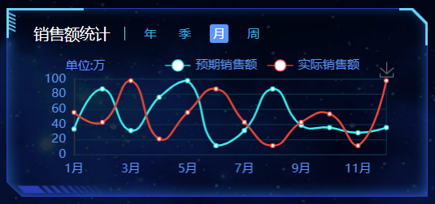
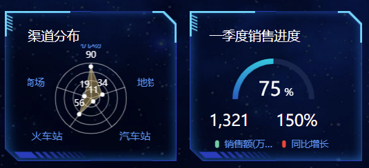
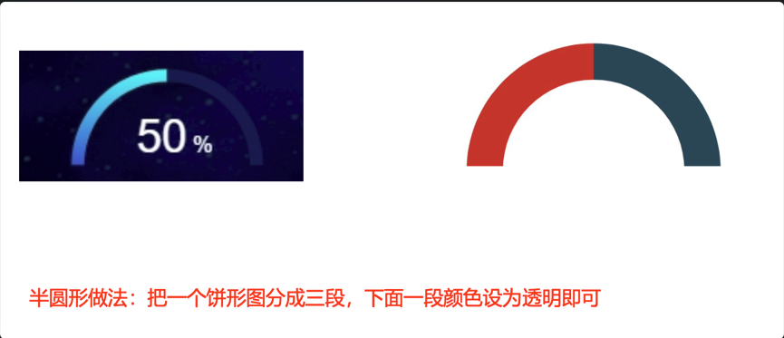
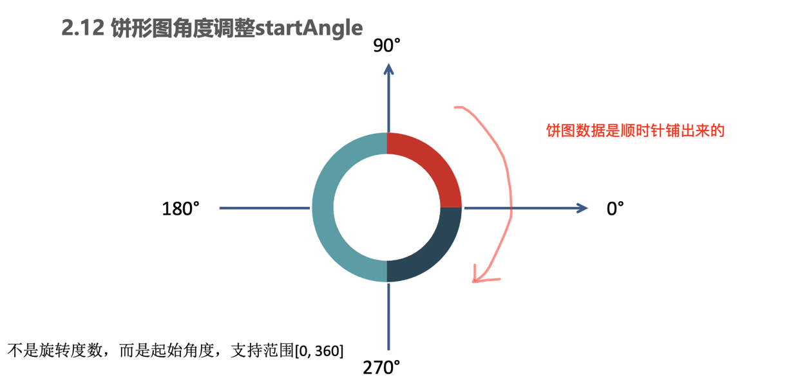
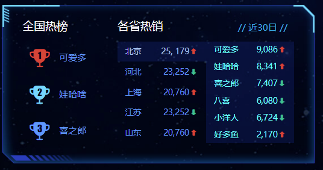
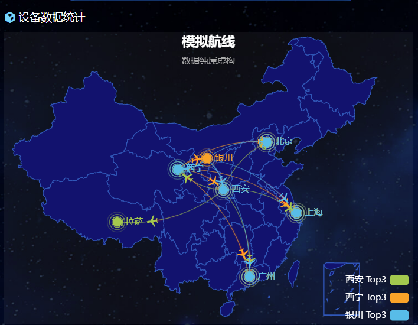

### Target

1. 能够跟随视频定制点位分布模块图表

2. 能够写出Echarts图表适配浏览器缩放代码

3. 能够跟随视频完成柱形图基本定制

4. 能够说出如何在柱形图中单独定制某个柱形

5. 能够完成销售统计模块 - 定制折线图表

   

### 01 监控区域-效果

切换功能：

- 绑定 标签页点击 事件
- 当前容器加active其他容器移除active
- index对应的内容容器显示其他容器隐藏

```js
  // 切换
 $(".monitor .tabs").on("click", "a", function() {
    $(this).addClass("active").siblings("a").removeClass("active");
    // console.log($(this).index());
    //   选取对应索引号的content
    $(".monitor .content").eq($(this).index()).show().siblings(".content").hide();
  });
---------------------------------------------------------
// tab切换
// 1. 获取元素
const tabs = document.querySelector('.monitor .tabs')
const boxs = document.querySelectorAll('.monitor .content')
tabs.addEventListener('click', function(e){
  if (e.target.tagName === 'A') {
    // 2. 上面a标签加上active类名
    // 先干掉别人 
    tabs.querySelector('.active').classList.remove('active')
    // 给自己添加
    e.target.classList.add('active')
    // 3. 下面对应盒子显示内容
    //  排他
    for (let i = 0; i < boxs.length; i++) {
      boxs[i].style.display = 'none'
    }
    boxs[e.target.dataset.id].style.display = 'block'
  } // end if 
})
```

动画功能：

- 实现思路：
  - 先克隆列表，追加在后面
  - marquee-view 占满剩余高度，溢出隐藏
    - 绝对定位，top 1.6rem bottom 0 
    - 宽度100%，溢出隐藏
  - 使用animation实现动画
  - 使用 translateY 向上位移 50%
  - 动画时间15s，匀速播放，循环执行。

js代码：

```js
 // 动画
const boxWraps = document.querySelectorAll('.marquee-view .marquee')
boxWraps.forEach(function(item,index){
  console.log(item)
  console.log(index)
  // item.appendChild(item.cloneNode(true))
  item.innerHTML = item.innerHTML + item.innerHTML
})
```

css代码：

```css
/* 通过CSS3动画滚动marquee */
.marquee-view .marquee {
  animation: move 15s linear infinite;
}
@keyframes move {
  0% {
  }
  100% {
    transform: translateY(-50%);
  }
}
/* 3.鼠标经过marquee 就停止动画 */
.marquee-view .marquee:hover {
  animation-play-state: paused;
}
```


### 02 点位分布模块



#### 1. html结构：

```html
      <!-- 点位 -->
      <div class="point panel">
        <div class="inner">
          <h3>点位分布统计</h3>
          <div class="chart">
            <div class="pie"></div>
            <div class="data">
              <div class="item">
                <h4>320,11</h4>
                <span>
                  <i class="icon-dot" style="color: #ed3f35"></i>
                  点位总数
                </span>
              </div>
              <div class="item">
                <h4>418</h4>
                <span>
                  <i class="icon-dot" style="color: #eacf19"></i>
                  本月新增
                </span>
              </div>
            </div>
          </div>
        </div>
      </div>
```

#### 2. css样式：

point 盒子高度为 340px


```css
/* 点位 */
.point {
  height: 4.25rem;
}
.point .chart {
  display: flex;
  margin-top: 0.3rem;
  justify-content: space-between;
}
.point .pie {
  width: 3.9rem;
  height: 3rem;
  margin-left: -0.125rem;
  background-color: pink;
}
.point .data {
  display: flex;
  flex-direction: column;
  justify-content: space-between;
  width: 2.1rem;
  padding: .45rem .375rem;
  box-sizing: border-box;
  background-image: url(../images/rect.png);
  background-size: cover;
}
.point h4 {
  margin-bottom: 0.15rem;
  font-size: .35rem;
  color: #fff;
}
.point span {
  display: block;
  color: #4c9bfd;
  font-size: .2rem;
}
```

#### 3. 引入JS - 点位区域-饼图

ECharts图表实现步骤：

- 从官方示例中找到类似图表，适当修改，引入到HTML页面中。
- 按照产品需求，来定制图表。

##### 1. 找到相似的 图表引入

```js
// 点位分布统计模块
(function() {
  // 1. 实例化对象
  var myChart = echarts.init(document.querySelector(".pie"));
  // 2. 指定配置项和数据
  var option = {
    tooltip: {
      trigger: "item",
      formatter: "{a} <br/>{b} : {c} ({d}%)"
    },

    series: [
      {
        name: "面积模式",
        type: "pie",
        radius: [30, 110],
        center: ["75%", "50%"],
        roseType: "area",
        data: [
          { value: 10, name: "rose1" },
          { value: 5, name: "rose2" },
          { value: 15, name: "rose3" },
          { value: 25, name: "rose4" },
          { value: 20, name: "rose5" },
          { value: 35, name: "rose6" },
          { value: 30, name: "rose7" },
          { value: 40, name: "rose8" }
        ]
      }
    ]
  };

  // 3. 配置项和数据给我们的实例化对象
  myChart.setOption(option);
})();
```


##### 2. 定制需求

第一步：参考官方例子，熟悉里面参数具体含义

```js
var option =  {
    // 提示框组件
    tooltip: {
      // trigger 触发方式。  非轴图形，使用item的意思是放到数据对应图形上触发提示
      trigger: 'item',
      // 格式化提示内容：
      // a 代表series系列图表名称  
      // b 代表series数据名称 data 里面的name    
      // c 代表series数据值 data 里面的value   
      // d代表  当前数据/总数据的比例
      formatter: "{a} <br/>{b} : {c} ({d}%)"
    },
    // 控制图表
    series: [
      {
        // 图表名称
        name: '点位统计',
        // 图表类型
        type: 'pie',
        // 南丁格尔玫瑰图 有两个圆  内圆半径10%  外圆半径70%
        // 饼形图半径。 可以是像素。也可以是百分比（ 基于DOM容器大小）第一项是内半径，第二项是外半径（通过它可以实现饼形图大小）
        radius: ['10%', '70%'],
        // 图表中心位置 left 50%  top 50%  距离图表DOM容器
        center: ['50%', '50%'],
        // radius 半径模式，另外一种是 area 面积模式
        roseType: 'radius',
        // 数据集 value 数据的值 name 数据的名称
        data: [
                {value:10, name:'rose1'},
                {value:5, name:'rose2'},
                {value:15, name:'rose3'},
                {value:25, name:'rose4'},
                {value:20, name:'rose5'},
                {value:35, name:'rose6'},
                {value:30, name:'rose7'},
                {value:40, name:'rose8'}
            ]
        }
    ]
};

```

第二步：按照需求定制

- 需求1：颜色设置


```js
color: ['#006cff', '#60cda0', '#ed8884', '#ff9f7f', '#0096ff', '#9fe6b8', '#32c5e9', '#1d9dff'],
```

- 需求2：修改饼形图大小 ( series对象)

```javascript
radius: ['10%', '70%'],
```

- 需求3： 把饼形图的显示模式改为 半径模式

```javascript
 roseType: "radius",
```

- 需求4：数据使用更换（series对象 里面 data对象）

```js
          { value: 20, name: '云南' },
          { value: 26, name: '北京' },
          { value: 24, name: '山东' },
          { value: 25, name: '河北' },
          { value: 20, name: '江苏' },
          { value: 25, name: '浙江' },
          { value: 30, name: '四川' },
          { value: 42, name: '湖北' }
```

- 需求5：字体略小些  10 px ( series对象里面设置 )

  饼图图形上的文本标签可以控制饼形图的文字的一些样式。   label 对象设置

```javascript
series: [
      {
        name: "面积模式",
        type: "pie",
        radius: [30, 110],
        center: ["50%", "50%"],
        roseType: "radius",
        // 文本标签控制饼形图文字的相关样式， 注意它是一个对象
        label: {
          fontSize: 10
        },
      }
    ]
  };
```

- 需求6：防止缩放的时候，引导线过长。引导线略短些   (series对象里面的  labelLine  对象设置  ) 
  - 连接图表 6 px
  - 连接文字 8 px

```js
    // 文本标签 修改 文字大小
    label: {
        fontSize: 10
    },
    // 引导线
    labelLine:{
        // 连接扇形的线长
        length: 6,
        // 连接文字线长
        length2:8
    },
```

- 需求6：浏览器缩放的时候，图表跟着自动适配。

```js
// 监听浏览器缩放，图表对象调用缩放resize函数
window.addEventListener("resize", function() {
    myChart.resize();
  });
```

点位统计完整JavaScript代码：

```javascript
// 点位分布统计模块
(function() {
  // 1. 实例化对象
  var myChart = echarts.init(document.querySelector(".pie"));
  // 2. 指定配置项和数据
  var option = {
    tooltip: {
      trigger: "item",
      formatter: "{a} <br/>{b} : {c} ({d}%)"
    },
    // 注意颜色写的位置
    color: [
      "#006cff",
      "#60cda0",
      "#ed8884",
      "#ff9f7f",
      "#0096ff",
      "#9fe6b8",
      "#32c5e9",
      "#1d9dff"
    ],
    series: [
      {
        name: "点位统计",
        type: "pie",
        // 如果radius是百分比则必须加引号
        radius: ["10%", "70%"],
        center: ["50%", "50%"],
        roseType: "radius",
        data: [
          { value: 20, name: "云南" },
          { value: 26, name: "北京" },
          { value: 24, name: "山东" },
          { value: 25, name: "河北" },
          { value: 20, name: "江苏" },
          { value: 25, name: "浙江" },
          { value: 30, name: "四川" },
          { value: 42, name: "湖北" }
        ],
        // 修饰饼形图文字相关的样式 label对象
        label: {
          fontSize: 10
        },
        // 修饰引导线样式
        labelLine: {
          // 连接到图形的线长度
          length: 6,
          // 连接到文字的线长度
          length2: 8
        }
      }
    ]
  };

  // 3. 配置项和数据给我们的实例化对象
  myChart.setOption(option);
  // 4. 当我们浏览器缩放的时候，图表也等比例缩放
  window.addEventListener("resize", function() {
    // 让我们的图表调用 resize这个方法
    myChart.resize();
  });
})();
```


### 03 地图区域 (map) -预留布局

#### 1. html结构：

```html
      <!-- 地图 -->
      <div class="map">
        <h3>
          <span class="icon-cube"></span>
          设备数据统计
        </h3>
        <div class="chart">
          <div class="geo"></div>
        </div>
      </div>
```

#### 2. css样式：

```css
/* 地图  */
.map {
  height: 7.225rem;
  margin-bottom: 0.25rem;
  display: flex;
  flex-direction: column;
}
.map h3 {
  line-height: 1;
  padding: 0.2rem 0;
  margin: 0;
  font-size: 0.25rem;
  color: #fff;
  font-weight: 400;
}
.map .icon-cube {
  color: #68d8fe;
}
.map .chart {
  flex: 1;
  background-color: rgba(255, 255, 255, 0.05);
}
.map .geo {
  width: 100%;
  height: 100%;
}
```

注意第二列（column)  有个外边距（上面 32px 左右 20px  下是 0）

```css
.viewport .column:nth-child(2) {
    flex: 4;
    margin: .4rem .25rem 0;
}
```


### 04 用户统计 (users) -布局



#### 1. html结构：

```html
      <!-- 用户 -->
      <div class="users panel">
        <div class="inner">
          <h3>全国用户总量统计</h3>
          <div class="chart">
            <div class="bar"></div>
            <div class="data">
              <div class="item">
                <h4>120,899</h4>
                <span>
                  <i class="icon-dot" style="color: #ed3f35"></i>
                  用户总量
                </span>
              </div>
              <div class="item">
                <h4>248</h4>
                <span>
                  <i class="icon-dot" style="color: #eacf19"></i>
                  本月新增
                </span>
              </div>
            </div>
          </div>
        </div>
      </div>
```

#### 2 css样式：

```css
/* 用户模块 */
.users {
  height: 4.25rem;
  display: flex;
}
.users .chart {
  display: flex;
  margin-top: .3rem;
}
.users .bar {
  width: 7.35rem;
  height: 3rem;
}
.users .data {
  display: flex;
  flex-direction: column;
  justify-content: space-between;
  width: 2.1rem;
  padding: .45rem .375rem;
  box-sizing: border-box;
  background-image: url(../images/rect.png);
  background-size: cover;
}
.users h4 {
  margin-bottom: .15rem;
  font-size: .35rem;
  color: #fff;
}
.users span {
  display: block;
  color: #4c9bfd;
  font-size: 0.2rem;
}
```


#### 3 js - 用户统计 (users) -柱状图

实现步骤：

- 从官方示例中找到最接近项目需求的例子，适当修改, 引入到HTML页面中
- 按照产品需求，来定制图表。

##### 1 参考官方示例 + 分析

```js
;(function () {
// 1. 实例化对象
var myChart = echarts.init(document.querySelector(".bar"));
// 2. 指定配置和数据
var option = {
    // 工具提示
    tooltip: {
      // 触发类型  经过轴触发axis  经过轴触发item
      trigger: 'axis',
      // 轴触发提示才有效
      axisPointer: {    
        // 默认为直线，可选为：'line' 线效果 | 'shadow' 阴影效果       
        type: 'shadow'        
      }
    },
    // 图表边界控制
    grid: {
      // 距离 上右下左 的距离
      left: '3%',
      right: '4%',
      bottom: '3%',
      // 是否包含文本
      containLabel: true
    },
    // 控制x轴
    xAxis: [
      {
        // 使用类目，必须有data属性
        type: 'category',
        // 使用 data 中的数据设为刻度文字
        data: ['Mon', 'Tue', 'Wed', 'Thu', 'Fri', 'Sat', 'Sun'],
        // 刻度设置
        axisTick: {
          // true意思：图形在刻度中间
          // false意思：图形在刻度之间
          alignWithLabel: true
        }
      }
    ],
    // 控制y轴
    yAxis: [
      {
        // 使用数据的值设为刻度文字
        type: 'value'
      }
    ],
    // 控制x轴
    series: [
      {
        // 图表数据名称
        name: '用户统计',
        // 图表类型
        type: 'bar',
        // 柱子宽度
        barWidth: '60%',
        // 数据
        data: [10, 52, 200, 334, 390, 330, 220]
      }
    ]
  };
    
  // 3. 把配置给实例对象
  myChart.setOption(option);
})();
```

##### 2 按照需求修改

- 需求1： 修改柱子的颜色

```javascript
// 修改线性渐变色方式 1
color: new echarts.graphic.LinearGradient(
     // (x1,y2) 点到点 (x2,y2) 之间进行渐变
     0, 0, 0, 1,
     [
          { offset: 0, color: '#00fffb' }, // 0 起始颜色
          { offset: 1, color: '#0061ce' }  // 1 结束颜色
    ]
 ),
// 修改线性渐变色方式 2
color: {
    type: 'linear',
    x: 0,
    y: 0,
    x2: 0,
    y2: 1,
    colorStops: [{
        offset: 0, color: 'red' // 0% 处的颜色
    }, {
        offset: 1, color: 'blue' // 100% 处的颜色
    }],
    globalCoord: false // 缺省为 false
},
```


- 需求2： 提示框组件放到柱子上触发， 没有阴影等效果

```javascript
//提示框组件
tooltip: {
    trigger: 'item',
   // axisPointer: {            // 坐标轴指示器，坐标轴触发有效  这个模块我们此时不需要删掉即可
       // type: 'shadow'        // 默认为直线，可选为：'line' | 'shadow'
   // }
},
```

- 需求3： 修改柱形图表大小，   以及相关网格。
  - 饼形图修改图表大小是通过  series 对象里面的 radius 
  - 柱形图修改图标大小是通过  series 对象里面的 grid 对象  left  right 等
  - 显示网格  show: true，网格颜色是  borderColor

```javascript
// 直角坐标系内绘图网格（区域）
grid: {
   top: '3%',
   right: '3%',
   bottom: '3%',
   left: '0%',
   //  图表位置紧贴画布边缘是否显示刻度以及label文字 防止坐标轴标签溢出跟grid 区域有关系
   containLabel: true,
   // 是否显示直角坐标系网格
   show: true,
   //grid 四条边框的颜色
   borderColor: 'rgba(0, 240, 255, 0.3)'
},

```


- 需求4： X 轴调整
  - 柱子在刻度之间
  - 剔除刻度不显示
  - 刻度标签文字颜色  #4c9bfd   通过 axisLabel 对象设置
  - 修改x轴线的颜色    axisLine  里面的   lineStyle

```javascript
xAxis: [
    {
        // 使用类目，必须有data属性
        type: 'category',
        // 使用 data 中的数据设为刻度文字
        data: ['Mon', 'Tue', 'Wed', 'Thu', 'Fri', 'Sat', 'Sun'],
        // 刻度设置
        axisTick: {
            // true意思：图形和刻度居中中间
            // false意思：图形在刻度之间
            alignWithLabel: false,
            // 不显示刻度
            show: false
        },        
        // x坐标轴文字标签样式设置
        axisLabel: {
            color: '#4c9bfd'
        },
        // x坐标轴颜色设置
        axisLine:{
            lineStyle:{
                color:'rgba(0, 240, 255, 0.3)',
                // width:8,  x轴线的粗细
                // opcity: 0,   如果不想显示x轴线 则改为 0
            }
        }
    }
],
```

- 需求5： Y 轴调整
  - 剔除刻度不显示
  - Y轴文字颜色  #4c9bfd   通过 axisLabel 对象设置
  - Y轴分割线颜色   splitLine 对象里面 lineStyle 对象设置

```javascript
yAxis: {
    type: 'value',
    // 刻度设置
    axisTick: {
        // 不显示刻度
        show: false
    },        
    // y坐标轴文字标签样式设置
    axisLabel: {
        color: '#4c9bfd'
    },
    // y坐标轴颜色设置
    axisLine:{
        lineStyle:{
                color:'rgba(0, 240, 255, 0.3)',
            // width:8,  x轴线的粗细
            // opcity: 0,   如果不想显示x轴线 则改为 0
            }
        },
    // y轴 分割线的样式 
    splitLine: {
        lineStyle: {
            color: 'rgba(0, 240, 255, 0.3)'
        }
    }  
  },
```

- 需求6：调整数据，与省略图形定制

```js
// series
data: [2100,1900,1700,1560,1400,1200,1200,1200,900,750,600,480,240],
```

```js
// xAxis
data: ['上海', '广州', '北京', '深圳', '合肥', '', '......', '', '杭州', '厦门', '济南', '成都', '重庆'],
```

- 省略图形

  - 经过图形才显示提示，且省略的柱子不需要提示
  - 图形单独设置颜色

  ```js
  // 初始化barChart之后
  // 中间省略的数据  准备三项
      var item = {
          name:'',
          value: 1200,
          // 柱子颜色
          itemStyle: {
              color: '#254065'
          },
          // 鼠标经过柱子颜色
          emphasis: {
              itemStyle: {
                  color: '#254065'
              }
          },
          // 单个柱子的提示框提示隐藏
          tooltip: {
              extraCssText: 'opacity:0'
          },
      }
  ```

```diff
  // series配置data选项在中使用
  data: [2100,1900,1700,1560,1400,item,item,item,900,750,600,480,240],
```
---

```javascript
  // 4. 当我们浏览器缩放的时候，图表也等比例缩放
  window.addEventListener("resize", function() {
    // 让我们的图表调用 resize这个方法
    myChart.resize();
  });
```


### 05 订单区域（order）-布局



#### 1. html结构：

```html
      <!-- 订单 -->
      <div class="order panel">
        <div class="inner">
          <!-- 筛选 -->
          <div class="filter">
            <a href="javascript:;"  class="active">365天</a>
            <a href="javascript:;" >90天</a>
            <a href="javascript:;" >30天</a>
            <a href="javascript:;" >24小时</a>
          </div>
          <!-- 数据 -->
          <div class="data">
            <div class="item">
              <h4>20,301,987</h4>
              <span>
                <i class="icon-dot" style="color: #ed3f35;"></i>
                订单量
              </span>
            </div>
            <div class="item">
              <h4>99834</h4>
              <span>
                <i class="icon-dot" style="color: #eacf19;"></i>
                销售额(万元)
              </span>
            </div>
          </div>
        </div>
      </div>
```

#### 2. css样式：

```css
/* 订单 */
.order {
  height: 1.875rem;
}
.order .filter {
  display: flex;
}
.order .filter a {
  display: block;
  height: 0.225rem;
  line-height: 1;
  padding: 0 0.225rem;
  color: #1950c4;
  font-size: 0.225rem;
  border-right: 0.025rem solid #00f2f1;
}
.order .filter a:first-child {
  padding-left: 0;
}
.order .filter a:last-child {
  border-right: none;
}
.order .filter a.active {
  color: #fff;
  font-size: 0.25rem;
}
.order .data {
  display: flex;
  margin-top: 0.25rem;
}
.order .item {
  width: 50%;
}
.order h4 {
  font-size: 0.35rem;
  color: #fff;
  margin-bottom: 0.125rem;
}
.order span {
  display: block;
  color: #4c9bfd;
  font-size: 0.2rem;
}
```


#### 3. 订单区域-效果 ( 课后作业 )

实现步骤：

- 提前准备数据
- 点击后切tab激活样式
- 点击后切换数据内容
- 开启定时器动态切换数据

```js
// 订单功能
(function(){
  // 1. 准备数据
  var data = {
    day365: { orders: '20,301,987', amount: '99834' },
    day90: { orders: '301,987', amount: '9834' },
    day30: { orders: '1,987', amount: '3834' },
    day1: { orders: '987', amount: '834' }
  }
  // 获取显示 订单数量 容器
  var $h4Orders = $('.order h4:eq(0)')
  // 获取显示 金额数量 容器
  var $h4Amount = $('.order h4:eq(1)')
  $('.order').on('click','.filter a',function(){
    // 2. 点击切换激活样式
    $(this).addClass('active').siblings().removeClass('active')
    // 3. 点击切换数据
    var currdata = data[this.dataset.key]
    $h4Orders.html(currdata.orders)
    $h4Amount.html(currdata.amount)
  })
  // 4. 开启定时器切换数据
  var index = 0
  var $allTab = $('.order .filter a')
  setInterval(function(){
    index ++ 
    if (index >= 4) index = 0
    $allTab.eq(index).click()
  },5000)
})();

// 同学们可以选择使用原生JS实现...作为练习
```


### 06 销售统计( sales )-布局



#### 1. html结构：

```html
      <!-- 销售额 -->
      <div class="sales panel">
        <div class="inner">
          <div class="caption">
            <h3>销售额统计</h3>
            <a href="javascript:;" class="active" >年</a>
            <a href="javascript:;" >季</a>
            <a href="javascript:;" >月</a>
            <a href="javascript:;" >周</a>
          </div>
          <div class="chart">
            <div class="label">单位:万</div>
            <div class="line"></div>
          </div>
        </div>
      </div>
```

#### 2. css样式：

```css
/* 销售区域 */
.sales {
  height: 3.1rem;
}
.sales .caption {
  display: flex;
  line-height: 1;
}
.sales h3 {
  height: 0.225rem;
  padding-right: 0.225rem;
  border-right: 0.025rem solid #00f2f1;
}
.sales a {
  padding: 0.05rem;
  font-size: 0.2rem;
  margin: -0.0375rem 0 0 0.2625rem;
  border-radius: 0.0375rem;
  color: #0bace6;
}
.sales a.active {
  background-color: #4c9bfd;
  color: #fff;
}
.sales .inner {
  display: flex;
  flex-direction: column;
}
.sales .chart {
  flex: 1;
  padding-top: 0.1875rem;
  position: relative;
}
.sales .label {
  position: absolute;
  left: 0.525rem;
  top: 0.225rem;
  color: #4996f5;
  font-size: 0.175rem;
}
.sales .line {
  width: 100%;
  height: 100%;
}
```


#### 3.  销售统计( sales )-线形图

实现步骤：

- 寻找官方的类似示例，给予分析, 引入到HTML页面中
- 按照需求来定制它。

**第一步：**寻找官方的类似示例，给予分析。

官方参考示例：<https://www.echartsjs.com/examples/zh/editor.html?c=line-stack>

```js
// 销售统计模块
(function() {
  // 1. 实例化对象
  var myChart = echarts.init(document.querySelector(".line"));
  // 2. 指定配置和数据
  var option = {
    tooltip: {
      trigger: "axis"
    },
    legend: {
      data: ["邮件营销", "联盟广告"]
    },
    grid: {
      left: "3%",
      right: "4%",
      bottom: "3%",
      containLabel: true
    },

    xAxis: {
      type: "category",
      boundaryGap: false,
      data: ["周一", "周二"]
    },
    yAxis: {
      type: "value"
    },
    series: [
      {
        name: "邮件营销",
        type: "line",
        stack: "总量",
        data: [120, 132, 101, 134, 90, 230, 210]
      },
      {
        name: "联盟广告",
        type: "line",
        stack: "总量",
        data: [220, 182, 191, 234, 290, 330, 310]
      }
    ]
  };

  // 3. 把配置和数据给实例对象
  myChart.setOption(option);
})();
```

**第二步：**按照需求来定制它。

- 需求1： 修改折线图大小，显示边框设置颜色：#012f4a，并且显示刻度标签。

```js
    // 设置网格样式
    grid: { 
      top: '20%',
      left: '3%',
      right: '4%',
      bottom: '3%',
      show: true,// 显示边框
      borderColor: '#012f4a',// 边框颜色
      containLabel: true // 包含刻度文字在内
    },
```

- 需求2： 修改图例组件中的文字颜色 #4c9bfd， 距离右侧 right 为 10%

```javascript
 // 图例组件
    legend: {
      textStyle: {
        color: '#4c9bfd' // 图例文字颜色
      },
      right: '10%' // 距离右边10%
    },
```

- 需求3： x轴相关配置
  - 刻度去除
  - x轴刻度标签字体颜色：#4c9bfd
  - 剔除坐标轴线颜色（将来使用Y轴分割线)
  - 轴两端是不需要内间距 boundaryGap

```JavaScript
    xAxis: {
      type: 'category',
      data: ["周一", "周二"],
	  axisTick: {
         show: false // 去除刻度线
       },
       axisLabel: {
         color: '#4c9bfd' // 文本颜色
       },
       axisLine: {
         show: false // 去除轴线
       },
       boundaryGap: false  // 去除轴内间距
    },
```

- 需求4： y轴的定制
  - 刻度去除
  - 字体颜色：#4c9bfd
  - 分割线颜色：#012f4a

```javascript
    yAxis: {
      type: 'value',
      axisTick: {
        show: false  // 去除刻度
      },
      axisLabel: {
        color: '#4c9bfd' // 文字颜色
      },
      splitLine: {
        lineStyle: {
          color: '#012f4a' // 分割线颜色
        }
      }
    },
```

- 需求5： 两条线形图定制
  - 颜色分别：#00f2f1  #ed3f35
  - 把折线修饰为圆滑 series 数据中添加 smooth 为 true

```js
    color: ['#00f2f1', '#ed3f35'],
	series: [{
      name:'预期销售额',
      data: [820, 932, 901, 934, 1290, 1330, 1320],
      type: 'line',
      // 折线修饰为圆滑
      smooth: true,
      },{
      name:'实际销售额',
      data: [100, 331, 200, 123, 233, 543, 400],
      type: 'line',
      smooth: true,
    }]
```

- 需求6： 配置数据

```js
// x轴的文字
xAxis: {
  type: 'category',
  data: ['1月', '2月', '3月', '4月', '5月', '6月', '7月', '8月', '9月', '10月', '11月', '12月'],
```

```js
// 图标数据
    series: [{
      name:'预期销售额',
      data:  [24, 40, 101, 134, 90, 230, 210, 230, 120, 230, 210, 120],
      type: 'line',
      smooth: true
    },{
      name:'实际销售额',
      data: [40, 64, 191, 324, 290, 330, 310, 213, 180, 200, 180, 79],     
      type: 'line',
      smooth: true
      }]
```

总结：现在给的是年份数据，还需要切换效果。


#### 4. 销售统计( sales )-切换效果

实现步骤：

- 1. 准备切换需要依赖的数据 4组

- 2. 绑定点击事件

  - 切换激活  tab  的样式
  - 切换图表依赖的数据（重新渲染图表）

- 3. 开启定时器，进行切换， 鼠标经过sales停止定时器，离开开启定时器

第一步：准备数据，使用数据

```js
  var data = {
    year: [
      [24, 40, 101, 134, 90, 230, 210, 230, 120, 230, 210, 120],
      [40, 64, 191, 324, 290, 330, 310, 213, 180, 200, 180, 79]
    ],
    quarter: [
      [23, 75, 12, 97, 21, 67, 98, 21, 43, 64, 76, 38],
      [43, 31, 65, 23, 78, 21, 82, 64, 43, 60, 19, 34]
    ],
    month: [
      [34, 87, 32, 76, 98, 12, 32, 87, 39, 36, 29, 36],
      [56, 43, 98, 21, 56, 87, 43, 12, 43, 54, 12, 98]
    ],
    week: [
      [43, 73, 62, 54, 91, 54, 84, 43, 86, 43, 54, 53],
      [32, 54, 34, 87, 32, 45, 62, 68, 93, 54, 54, 24]
    ]
  }
```

```javascript
    series: [{
      name:'预期销售额',
      data: data.year[0],
      type: 'line',
      smooth: true,
      itemStyle: {
        color: '#00f2f1'
      }
    },{
      name:'实际销售额',
      data: data.year[1],
      type: 'line',
      smooth: true,
      itemStyle: {
        color: '#ed3f35'
      }
    }]
```

第二步：点击后切换

```js
// tab栏点击切换 激活active
const box = document.querySelector('.sales .caption')
box.addEventListener('click', function(e){
  if (e.target.tagName === 'A') {
      
    box.querySelector('.active').classList.remove('active')
    e.target.classList.add('active')
      
    // key ==>  year  quarter  month week
    const key = e.target.dataset.type
    const arr = data[key]
    // 第一条折线
    option.series[0].data = arr[0]
    // 第二条折线
    option.series[1].data = arr[1]
    // 重新渲染echarts
    myChart.setOption(option)
  }
})
```

第三步：tab栏自动切换效果

 - 开启定时器每隔3s，自动让a触发点击事件即可
 - 鼠标经过sales，关闭定时器，离开开启定时器

```js
  // 开启定时器 每隔3s 自动让a触发点击事件
const btns = document.querySelectorAll('.sales .caption a')
console.log(btns)

let index = 0
let timer = setInterval(function(){
  index++
  
  if (index >=4) index = 0
  btns[index].click()
}, 3000)

// 鼠标经过离开
const sales = document.querySelector('.sales')
sales.addEventListener('mouseenter', function(){
  clearInterval(timer)
})
sales.addEventListener('mouseleave', function(){
  timer = setInterval(function(){
    index++
    if (index >=4) index = 0
    // console.log($btns[index])
    btns[index].click()
  }, 1000)
})
```

自动缩放

```js
 // 当我们浏览器缩放的时候，图表也等比例缩放
  window.addEventListener("resize", function() {
    // 让我们的图表调用 resize这个方法
    myChart.resize();
  });
```

#### 5. 完整版

```js
//! 3. 销售额统计模块
;(function(){

    var data = {
        year: [
          [24, 40, 101, 134, 90, 230, 210, 230, 120, 230, 210, 120],
          [40, 64, 191, 324, 290, 330, 310, 213, 180, 200, 180, 79]
        ],
        quarter: [
          [23, 75, 12, 97, 21, 67, 98, 21, 43, 64, 76, 38],
          [43, 31, 65, 23, 78, 21, 82, 64, 43, 60, 19, 34]
        ],
        month: [
          [34, 87, 32, 76, 98, 12, 32, 87, 39, 36, 29, 36],
          [56, 43, 98, 21, 56, 87, 43, 12, 43, 54, 12, 98]
        ],
        week: [
          [43, 73, 62, 54, 91, 54, 84, 43, 86, 43, 54, 53],
          [32, 54, 34, 87, 32, 45, 62, 68, 93, 54, 54, 24]
        ]
      }    
    // 1. 实例化echarts
    var lineChart = echarts.init(document.querySelector('.line'))
    // 2. 写配置和数据
    var option = {
        color: ['#00f2f1', '#ed3f35'],
        tooltip: {
          trigger: 'axis'
        },
        // 修改图例组件
        legend: {
            // 这里的data 如果和 series name不一致, 不显示
          data: ['预期销售额', '实际销售额'],
          textStyle: {
            color: '#4c9bfd' // 图例文字颜色
          },
          right: '10%' // 距离右边10%
        },
        grid: { 
            top: '20%',
            left: '3%',
            right: '4%',
            bottom: '3%',
            show: true,// 显示边框
            borderColor: '#012f4a',// 边框颜色
            containLabel: true // 包含刻度文字在内
          },
        toolbox: {
          feature: {
            saveAsImage: {}
          }
        },
        // x轴
        xAxis: {
          type: 'category',
          boundaryGap: false,
          data: ['1月', '2月', '3月', '4月', '5月', '6月', '7月', '8月', '9月', '10月', '11月', '12月'],
          axisTick: {
            show: false // 去除刻度线
          },
          axisLabel: {
            color: '#4c9bfd' // 文本颜色
          },
          axisLine: {
            show: false // 去除轴线
          },
        },
        // y轴
        yAxis: {
          type: 'value',
          axisTick: {
            show: false  // 去除刻度
          },
          axisLabel: {
            color: '#4c9bfd' // 文字颜色
          },
          splitLine: {
            lineStyle: {
              color: '#012f4a' // 分割线颜色
            }
          }
        },
        // 图标数据
        series: [{
            name:'预期销售额',
            data:  data.year[0],
            type: 'line',
            smooth: true
        },{
            name:'实际销售额',
            data: data.year[1],     
            type: 'line',
            smooth: true
            }]

    };
    // 3. 将配置和数据传给实例化的echarts对象
    lineChart.setOption(option)
    // 4. 浏览器缩放, echarts图表也缩放
    window.addEventListener('resize', function(){
        lineChart.resize()
    })

    // tab栏点击切换 激活active
    $('.sales .caption').on('click', 'a', function(){
        // 排他思想
        $(this).addClass('active').siblings('a').removeClass('active')

        index = $(this).index() - 1
        // console.log(this)

        var type = this.dataset['type']
        var arr = data[type]
        // 替换 series里面的data数据
        option.series[0].data = arr[0]
        option.series[1].data = arr[1]
        // 重新渲染 
        lineChart.setOption(option)
    })

    // 自动触发点击事件
    var btns = $('.sales .caption a')
    var index = 0
    var timer = setInterval(function(){
        index++
        // 当定时器一直执行, 大于等于4时, 重新归0
        if (index >= 4) index = 0
        btns.eq(index).click()
    }, 1000)

    // 鼠标经过或离开,触发事件
    $('.sales ').hover( function(){
        clearInterval(timer)
    }, function(){
        // 鼠标离开, 重新执行定时器
        clearInterval(timer)
        timer = setInterval(function(){
            index++
            if (index >= 4) index = 0
            btns.eq(index).click()
        }, 1000)
    })

})()
```


---

### day03 target

1. 能够完成渠道分布模块- 雷达图定制
2. 能够完成季度进度模块- 饼形图定制
3. 能够使用ES6模板字符拼接字符串
4. 能够完成全国热榜模块制作
5. 能够利用Echarts社区引入自己需要的图表

### 01 渠道分布&销售进度



#### 1. html结构：

```html
     <!-- 渠道 季度 -->
     <div class="wrap">
          <div class="channel panel">
            <div class="inner">
              <h3>渠道分布</h3>
              <div class="data">
                <div class="radar"></div>
              </div>
            </div>
          </div>
          <div class="quarter panel">
            <div class="inner">
              <h3>一季度销售进度</h3>
              <div class="chart">
                <div class="box">
                  <div class="gauge"></div>
                  <div class="label">75<small> %</small></div>
                </div>
                <div class="data">
                  <div class="item">
                    <h4>1,321</h4>
                    <span>
                      <i class="icon-dot" style="color: #6acca3"></i>
                      销售额(万元)
                    </span>
                  </div>
                  <div class="item">
                    <h4>150%</h4>
                    <span>
                      <i class="icon-dot" style="color: #ed3f35"></i>
                      同比增长
                    </span>
                  </div>
                </div>
              </div>
            </div>
          </div>
        </div>

```

#### 2. css样式：

```css
/* 渠道区块 */
.wrap {
  display: flex;
}
.channel,
.quarter {
  flex: 1;
  height: 2.9rem;
}
.channel {
  margin-right: 0.25rem;
}
.channel .data {
  overflow: hidden;
}
.channel .data .radar {
  height: 2.1rem;
  width: 100%;
  background-color: pink;
}
.channel h4 {
  color: #fff;
  font-size: 0.4rem;
  margin-bottom: 0.0625rem;
}
.channel small {
  font-size: 50%;
}
.channel span {
  display: block;
  color: #4c9bfd;
  font-size: 0.175rem;
}
/* 季度区块 */
.quarter .inner {
  display: flex;
  flex-direction: column;
  margin: 0 -0.075rem;
}
.quarter .chart {
  flex: 1;
  padding-top: 0.225rem;
}
.quarter .box {
  position: relative;
}
.quarter .label {
  transform: translate(-50%, -30%);
  color: #fff;
  font-size: 0.375rem;
  position: absolute;
  left: 50%;
  top: 50%;
}
.quarter .label small {
  font-size: 50%;
}
.quarter .gauge {
  height: 1.05rem;
}
.quarter .data {
  display: flex;
  justify-content: space-between;
}
.quarter .item {
  width: 50%;
}
.quarter h4 {
  color: #fff;
  font-size: 0.3rem;
  margin-bottom: 0.125rem;
}
.quarter span {
  display: block;
  width: 100%;
  white-space: nowrap;
  text-overflow: ellipsis;
  overflow: hidden;
  color: #4c9bfd;
  font-size: 0.175rem;
}
```

#### 3. 渠道分布(channel)-雷达图

实现步骤：

- 寻找官方的类似示例，给予分析，并引入到HTML页面中
- 按照需求来定制它

第一步： 参考类似实例： <https://www.echartsjs.com/examples/zh/editor.html?c=radar-aqi>

```javascript
(function() {
  // 1. 实例化对象
  var myChart = echarts.init(document.querySelector(".radar"));
  // 2.指定配置
  var dataBJ = [[55, 9, 56, 0.46, 18, 6, 1]];
  var lineStyle = {
    normal: {
      width: 1,
      opacity: 0.5
    }
  };
  var option = {
    backgroundColor: "#161627",
    radar: {
      indicator: [
        { name: "AQI", max: 300 },
        { name: "PM2.5", max: 250 },
        { name: "PM10", max: 300 },
        { name: "CO", max: 5 },
        { name: "NO2", max: 200 },
        { name: "SO2", max: 100 }
      ],
      shape: "circle",
      splitNumber: 5,
      name: {
        textStyle: {
          color: "rgb(238, 197, 102)"
        }
      },
      splitLine: {
        lineStyle: {
          color: [
            "rgba(238, 197, 102, 0.1)",
            "rgba(238, 197, 102, 0.2)",
            "rgba(238, 197, 102, 0.4)",
            "rgba(238, 197, 102, 0.6)",
            "rgba(238, 197, 102, 0.8)",
            "rgba(238, 197, 102, 1)"
          ].reverse()
        }
      },
      splitArea: {
        show: false
      },
      axisLine: {
        lineStyle: {
          color: "rgba(238, 197, 102, 0.5)"
        }
      }
    },
    series: [
      {
        name: "北京",
        type: "radar",
        lineStyle: lineStyle,
        data: dataBJ,
        symbol: "none",
        itemStyle: {
          color: "#F9713C"
        },
        areaStyle: {
          opacity: 0.1
        }
      }
    ]
  };
  // 3.把配置和数据给对象
  myChart.setOption(option);
})();
```

第二步： 按照需求来定制它

- 需求1： 去掉背景颜色，调整雷达图大小 65%

```javascript
radar:{
    center: ['50%', '50%'],
    // 外半径占据容器大小
    radius: '65%',
}  
```

需求2： 指示器轴的分割段数为4条（4个圆圈）  

```javascript
radar:{
    center: ['50%', '50%'],
    // 外半径占据容器大小
    radius: '65%',
    // 指示器轴的分割段数
    splitNumber: 4,
}  
```

需求3： 雷达图分割线设为白色半透明 0.5

```javascript
 // 坐标轴在 grid 区域中的分隔线（圆圈）
   splitLine: {
        lineStyle: {
           color: 'rgba(255, 255, 255, 0.5)',
           // width: 2,
           // type: 'dashed'
           }
   },
```

需求4： 雷达图 坐标轴轴线相关设置(竖线) axisLine 

```javascript
// 坐标轴轴线相关设置(竖线)axisLine
axisLine: {
       show: true,
            lineStyle: {
                color: 'rgba(255, 255, 255, 0.5)'
                // width: 1,
                // type: 'solid'
             }
 },
```


需求5： 修饰雷达图文字颜色为 #4c9bfd

```javascript
name: {
    // 修饰雷达图文本颜色
     textStyle: {
       color: '#4c9bfd'
     }
},
```

需求6： 修饰 区域填充样式   series 对象

-  区域填充的背景颜色设置为：  rgba(238, 197, 102, 0.6)

```javascript
 areaStyle: {
     color: 'rgba(238, 197, 102, 0.6)',
},
```

- 区域填充的线条颜色为白色

```javascript
// 线条样式
  lineStyle: {
         normal: {
              color: '#fff',
              // width: 1
         }
},
```

需求7： 标记的图形(拐点）设置  注意 series 里面设置

- 用圆点显示， 拐点的大小设置为 5
- 小圆点设置为白色
- 在小圆点上显示相关数据，颜色设置为白色，10像素

```javascript
// symbol 标记的样式(拐点），还可以取值'rect' 方块 ,'arrow' 三角等
symbol: 'circle', 
// 拐点的大小  
symbolSize: 5, 
// 小圆点（拐点）设置为白色
itemStyle: {
       color: '#fff'
},
// 在圆点上显示相关数据
label: {
     show: true,
     color: '#fff',
     fontSize: 10
},    
```

需求8： 鼠标经过显示提示框组件

```javascript
tooltip: {
    show: true,
    // 控制提示框组件的显示位置
    position: ['60%', '10%'],
},
```


需求9： 更换数据

```javascript
 // 雷达图的指示器 内部填充数据
  indicator: [
        { name: '机场', max: 100 },
        { name: '商场', max: 100 },
        { name: '火车站', max: 100 },
        { name: '汽车站', max: 100 },
        { name: '地铁', max: 100 }
 ],
```

```javascript
data: [[90, 19, 56, 11, 34]],
```

整个代码

```javascript
;(function() {
    // 1. 实例化对象
    var myChart = echarts.init(document.querySelector(".radar"));
    // 2.指定配置
    var option = {
      tooltip: {
        show: true,
        // 控制提示框组件的显示位置
        position: ["60%", "10%"]
      },
      radar: {
        indicator: [
          { name: "机场", max: 100 },
          { name: "商场", max: 100 },
          { name: "火车站", max: 100 },
          { name: "汽车站", max: 100 },
          { name: "地铁", max: 100 }
        ],
        // 修改雷达图的大小 圆环半径
        radius: "65%",
          // polygon circle 雷达图绘制类型
        shape: "circle",
        // 分割的圆圈个数
        splitNumber: 4,
        name: {
          // 修饰雷达图文字的颜色
          textStyle: {
            color: "#4c9bfd"
            // color:'orange'
          }
        },
        // 分割的圆圈线条的样式
        splitLine: {
          lineStyle: {
            color: "rgba(255,255,255, 0.5)"
            // color:"orange"
          }
        },
        // 是否显示分割区域(每一个环间的区域)
        splitArea: {
          show: false
        },
        // 轴线(半径线)修改为白色半透明, 
        axisLine: {
          lineStyle: {
            color: "rgba(255, 255, 255, 0.5)"
            // color:'pink'
          }
        }
      },
      series: [
        {
          name: "北京",
          type: "radar",
          // 填充区域的线条颜色
          lineStyle: {
            normal: {
              color: "#fff",
              width: 1,
              opacity: 0.5
            }
          },
          data: [[90, 19, 56, 11, 34]],
          // 设置图形标记 （拐点）
          symbol: "circle",
          // 这个是设置小圆点大小
          symbolSize: 5,
          // 设置小圆点颜色
          itemStyle: {
            color: "#fff"
          },
          // 让小圆点显示数据
          label: {
            show: true,
            fontSize: 10
          },
          // 修饰我们区域填充的背景颜色
          areaStyle: {
            color: "rgba(238, 197, 102, 0.6)"
          }
        }
      ]
    };
    // 3.把配置和数据给对象
    myChart.setOption(option);
    // 当我们浏览器缩放的时候，图表也等比例缩放
    window.addEventListener("resize", function() {
      // 让我们的图表调用 resize这个方法
      myChart.resize();
    });
})();

```


#### 4. 销售进度 (quarter) -饼状图

实现步骤：

- 寻找官方的类似示例，给予分析,引入到HTML页面中
- 按照需求来定制它。

**第一步**：参考官方示例：https://www.echartsjs.com/examples/zh/editor.html?c=pie-doughnut

```javascript
// 销售模块 饼形图 半圆形 设置方式
(function() {
  // 1. 实例化对象
  var myChart = echarts.init(document.querySelector(".gauge"));
  // 2. 指定数据和配置
  var option = {
    series: [
      {
        name: "销售进度",
        type: "pie",
        radius: ["50%", "70%"],
        //是否启用防止标签重叠策略
        // avoidLabelOverlap: false,
        labelLine: {
          normal: {
            show: false
          }
        },
        data: [{ value: 100 }, { value: 100 }, { value: 200 }]
      }
    ]
  };
  // 3. 把数据和配置给实例对象
  myChart.setOption(option);
})();
```

**第二步**：进行定制

需求1：改成半圆，图表大一些，让`50%`文字在中心。

```javascript
  var option = {
    series: [
      {
        type: 'pie',
        // 放大图形
        radius: ['130%', '150%'],  
        // 移动下位置  套住50%文字
        center: ['48%', '80%'],   
        label: {
          normal: {
            show: false
          }
        },  
        // 起始角度，支持范围[0, 360]
        startAngle: 180,
        data: [
          { value: 100 }, // 不需要名称
          { value: 100,}, // 不需要名称
          { value: 200, itemStyle: { color: 'transparent' } } // 透明隐藏第三块区域
        ]
      }
    ]
  }
```

需求2：鼠标经过无需变大，修改第一段颜色渐变#00c9e0->#005fc1，修改第二段颜色#12274d。

```javascript
       // 鼠标经过不变大
       hoverOffset: 0,  
        data: [
          { value: 100,
            itemStyle: {
            // 颜色渐变#00c9e0->#005fc1
            color: new echarts.graphic.LinearGradient(
              // (x1,y2) 点到点 (x2,y2) 之间进行渐变
              0,
              0,
              0,
              1,
              [
                { offset: 0, color: "#00c9e0" }, // 0 起始颜色
                { offset: 1, color: "#005fc1" } // 1 结束颜色
              ]
            )
          }},
          { value: 100,itemStyle: { color: '#12274d' }},
          { value: 200,itemStyle:{color:'transparent'}},
        ]
```
#### 5. 饼图半圆形做法



- [pie 饼图修改-echarts](https://echarts.apache.org/examples/zh/editor.html?c=pie-doughnut)



- [startAngle 默认 90°](https://echarts.apache.org/zh/option.html#radar.startAngle)  , 把起始角度 设为180, 正好就是我们想要的效果

##### 完整代码

```js
;(function(){
    // 初始化Echarts
    var pieChart = echarts.init(document.querySelector('.gauge'))
    // 配置项
    var option = {
        series: [
          {
            name: '销售进度',
            type: 'pie',
            // 放大图形
            radius: ['130%', '150%'],  
            // 移动下位置  套住50%文字
            center: ['48%', '80%'],  
            // 引导线 不显示
            labelLine: {
              show: false
            },
            // 起始角度 支持范围[0, 360]
            startAngle:180,
            // 鼠标经过不变大
            hoverOffset: 0, 
            data: [
              { value: 100,
                itemStyle: {
                // 颜色渐变#00c9e0->#005fc1
                color: new echarts.graphic.LinearGradient(
                  // (x1,y2) 点到点 (x2,y2) 之间进行渐变
                  0,
                  0,
                  0,
                  1,
                  [
                    { offset: 0, color: "#00c9e0" }, // 0 起始颜色
                    { offset: 1, color: "#005fc1" } // 1 结束颜色
                  ]
                )
              }},
              { value: 100,itemStyle: { color: '#12274d' }},
              { value: 200,itemStyle:{color:'transparent'}},
            ]
          }
        ]
      };
        // 3. 传递给实例
        pieChart.setOption(option)
        // 4. 浏览器缩放, echarts图表也缩放
        window.addEventListener('resize', function(){
            pieChart.resize()
        })
    }())
```


### 02 全国热榜模块



#### 1. html结构：

```html
      <!-- 排行榜 -->
      <div class="top panel">
        <div class="inner">
          <div class="all">
            <h3>全国热榜</h3>
            <ul>
              <li>
                <i class="icon-cup1" style="color: #d93f36;"></i>
                可爱多
              </li>
              <li>
                <i class="icon-cup2" style="color: #68d8fe;"></i>
                娃哈啥
              </li>
              <li>
                <i class="icon-cup3" style="color: #4c9bfd;"></i>
                喜之郎
              </li>
            </ul>
          </div>
          <div class="province">
            <h3>各省热销 <i class="date">// 近30日 //</i></h3>
            <div class="data">
              <ul class="sup">
                <li>
                  <span>北京</span>
                  <span>25,179 <s class="icon-up"></s></span>
                </li>
                <li>
                  <span>河北</span>
                  <span>23,252 <s class="icon-down"></s></span>
                </li>
                <li>
                  <span>上海</span>
                  <span>20,760 <s class="icon-up"></s></span>
                </li>
                <li>
                  <span>江苏</span>
                  <span>23,252 <s class="icon-down"></s></span>
                </li>
                <li>
                  <span>山东</span>
                  <span>20,760 <s class="icon-up"></s></span>
                </li>
              </ul>
              <ul class="sub">
                <!-- <li><span></span><span> <s class="icon-up"></s></span></li> -->
              </ul>
            </div>
          </div>
        </div>
      </div>
```

#### 2. css样式：

```css
/* 排行榜 */
.top {
  height: 3.5rem;
}
.top .inner {
  display: flex;
}
.top .all {
  display: flex;
  flex-direction: column;
  width: 2.1rem;
  color: #4c9bfd;
  font-size: 0.175rem;
  vertical-align: middle;
}
.top .all ul {
  padding-left: 0.15rem;
  margin-top: 0.15rem;
  flex: 1;
  display: flex;
  flex-direction: column;
  justify-content: space-around;
}
.top .all li {
  overflow: hidden;
}
.top .all [class^="icon-"] {
  font-size: 0.45rem;
  vertical-align: middle;
  margin-right: 0.15rem;
}
.top .province {
  flex: 1;
  display: flex;
  flex-direction: column;
  color: #fff;
}
.top .province i {
  padding: 0 0.15rem;
  margin-top: 0.0625rem;
  float: right;
  font-style: normal;
  font-size: 0.175rem;
  color: #0bace6;
}
.top .province s {
  display: inline-block;
  transform: scale(0.8);
  text-decoration: none;
}
.top .province .icon-up {
  color: #dc3c33;
}
.top .province .icon-down {
  color: #36be90;
}
.top .province .data {
  flex: 1;
  display: flex;
  margin-top: 0.175rem;
}
.top .province ul {
  flex: 1;
  line-height: 1;
  margin-bottom: 0.175rem;
}
.top .province ul li {
  display: flex;
  justify-content: space-between;
}
.top .province ul span {
  display: block;
  overflow: hidden;
  white-space: nowrap;
  text-overflow: ellipsis;
}
.top .province ul.sup {
  font-size: 0.175rem;
}
.top .province ul.sup li {
  color: #4995f4;
  padding: 0.15rem;
}
.top .province ul.sup li.active {
  color: #a3c6f2;
  background-color: rgba(10, 67, 188, 0.2);
}
.top .province ul.sub {
  display: flex;
  flex-direction: column;
  justify-content: space-around;
  font-size: 0.15rem;
  background-color: rgba(10, 67, 188, 0.2);
}
.top .province ul.sub li {
  color: #52ffff;
  padding: 0.125rem 0.175rem;
}
.clock {
  position: absolute;
  top: -0.45rem;
  right: 0.5rem;
  font-size: 0.25rem;
  color: #0bace6;
}
.clock i {
  margin-right: 5px;
  font-size: 0.25rem;
}
@media screen and (max-width: 1600px) {
  .top span {
    transform: scale(0.9);
  }
  .top .province ul.sup li {
    padding: 0.125rem 0.15rem;
  }
  .top .province ul.sub li {
    padding: 0.0625rem 0.15rem;
  }
  .quarter span {
    transform: scale(0.9);
  }
}
```


#### 3 各省热销 - 效果

```js
// 1.准备相关数据
	var hotData = [
      {
        city: '北京',  // 城市
        sales: '25, 179',  // 销售额
        flag: true, //  上升还是下降
        brands: [   //  品牌种类数据
          { name: '可爱多', num: '9,086', flag: true },
          { name: '娃哈哈', num: '8,341', flag: true },
          { name: '喜之郎', num: '7,407', flag: false },
          { name: '八喜', num: '6,080', flag: false },
          { name: '小洋人', num: '6,724', flag: false },
          { name: '好多鱼', num: '2,170', flag: true },
        ]
      },
      {
        city: '河北',
        sales: '23,252',
        flag: false,
        brands: [
          { name: '可爱多', num: '3,457', flag: false },
          { name: '娃哈哈', num: '2,124', flag: true },
          { name: '喜之郎', num: '8,907', flag: false },
          { name: '八喜', num: '6,080', flag: true },
          { name: '小洋人', num: '1,724', flag: false },
          { name: '好多鱼', num: '1,170', flag: false },
        ]
      },
      {
        city: '上海',
        sales: '20,760',
        flag: true,
        brands: [
          { name: '可爱多', num: '2,345', flag: true },
          { name: '娃哈哈', num: '7,109', flag: true },
          { name: '喜之郎', num: '3,701', flag: false },
          { name: '八喜', num: '6,080', flag: false },
          { name: '小洋人', num: '2,724', flag: false },
          { name: '好多鱼', num: '2,998', flag: true },
        ]
      },
      {
        city: '江苏',
        sales: '23,252',
        flag: false,
        brands: [
          { name: '可爱多', num: '2,156', flag: false },
          { name: '娃哈哈', num: '2,456', flag: true },
          { name: '喜之郎', num: '9,737', flag: true },
          { name: '八喜', num: '2,080', flag: true },
          { name: '小洋人', num: '8,724', flag: true },
          { name: '好多鱼', num: '1,770', flag: false },
        ]
      },
       {
        city: '山东',
        sales: '20,760',
        flag: true,
        brands: [
          { name: '可爱多', num: '9,567', flag: true },
          { name: '娃哈哈', num: '2,345', flag: false },
          { name: '喜之郎', num: '9,037', flag: false },
          { name: '八喜', num: '1,080', flag: true },
          { name: '小洋人', num: '4,724', flag: false },
          { name: '好多鱼', num: '9,999', flag: true },
        ]
      }
    ]
// 2. 遍历数据
var tabHTML = ''
$.each(hotData, function(i, el){
    tabHTML += `<li><span>${el.city}</span>
                    <span> ${el.sales}</span><s class=${el.flag ? 'icon-up' : 'icon-down'}></s></span>
                </li>`
    $('.sup').html(tabHTML)
})

// 3. 鼠标经过小li高亮显示
$('.province .sup').on('mouseenter', 'li', function(){
    $(this).addClass('active').siblings('li').removeClass()

    // 拿到当前城市的索引号
    console.log($(this).index())
    index = $(this).index()
    // 可以通过hotData[index] 拿到当前的城市数据
    // console.log(hotData[index])
    // 拿到品牌种类
    var brands = hotData[index].brands
    // 遍历品牌数组
    var contentHTML = ''
    $.each(brands, function(i,item){
        // item 是每一个品牌对象
        console.log(item)
        contentHTML += `<li><span>${item.name}</span><span>${item.num}<s class=${item.flag ? "icon-up" : "icon-down"}}}></s></span></li>`
        $('.sub').html(contentHTML)
    })
    console.log(brands)

})

// 4. 默认激活第一个li
// 所有的LI
var $lis = $('.province .sup li')
// 第一个默认激活
$lis.eq(0).mouseenter()

// 声明一个 渲染函数, 设置 xiaoli高亮,
var render = function(currentElem) {
    // start
    currentElem.addClass('active').siblings('li').removeClass()

    // 拿到品牌种类
    var brands = hotData[index].brands
    // 遍历品牌数组
    var contentHTML = ''
    $.each(brands, function(i,item){
        // item 是每一个品牌对象
        console.log(item)
        contentHTML += `<li><span>${item.name}</span><span>${item.num}<s class=${item.flag ? "icon-up" : "icon-down"}}}></s></span></li>`
        $('.sub').html(contentHTML)
    })
}

// 5. 开启定时器
var index = 0 
var timer = setInterval(function(){
    index++
    if (index >= 5) index = 0
    // $lis.eq(index).mouseenter()
    render($lis.eq(index))

}, 2000)

$('.province .sup').hover(function(){
    clearInterval(timer)
}, function(){
    timer = setInterval(function(){
        index++
        if (index >= 5) index = 0
        // $lis.eq(index).mouseenter()
        render($lis.eq(index))
    }, 2000)
})
// end
```


**实现思路**：

- 准备后台返回的真实数据
- 利用数据渲染各省热销模块 sup 模块  (拼接html格式字符串，进行渲染)
- 当鼠标进入 tab 的时候
  - 激活当前的tab样式，删除其他tab的样式
  - 渲染各省热销 sub 模块  (拼接html格式字符串，进行渲染)
- 默认激活第一个tab的效果
- 开启定时器，按依次切换

**预备知识**：

- 扩展知识：ES6模版字符

```js
// 模版字符
var star = {
        name: "刘德华",
        age: 18
      };
//   以前的写法 拼接的时候引号很容易出问题
console.log("我的名字是" + star.name + "我的年龄是" + star.age);
//   ES6 模板字符写法
console.log(`我的名字是${star.name}我的年龄是${star.age}`);
console.log(`<span>${star.name}</span><span>${star.age}</span>`);
```

**开始实现**：

第一步：得到后台数据（实际开发中，这个数据通过ajax请求获得）

```js
    var hotData = [
      {
        city: '北京',  // 城市
        sales: '25, 179',  // 销售额
        flag: true, //  上升还是下降
        brands: [   //  品牌种类数据
          { name: '可爱多', num: '9,086', flag: true },
          { name: '娃哈哈', num: '8,341', flag: true },
          { name: '喜之郎', num: '7,407', flag: false },
          { name: '八喜', num: '6,080', flag: false },
          { name: '小洋人', num: '6,724', flag: false },
          { name: '好多鱼', num: '2,170', flag: true },
        ]
      },
      {
        city: '河北',
        sales: '23,252',
        flag: false,
        brands: [
          { name: '可爱多', num: '3,457', flag: false },
          { name: '娃哈哈', num: '2,124', flag: true },
          { name: '喜之郎', num: '8,907', flag: false },
          { name: '八喜', num: '6,080', flag: true },
          { name: '小洋人', num: '1,724', flag: false },
          { name: '好多鱼', num: '1,170', flag: false },
        ]
      },
      {
        city: '上海',
        sales: '20,760',
        flag: true,
        brands: [
          { name: '可爱多', num: '2,345', flag: true },
          { name: '娃哈哈', num: '7,109', flag: true },
          { name: '喜之郎', num: '3,701', flag: false },
          { name: '八喜', num: '6,080', flag: false },
          { name: '小洋人', num: '2,724', flag: false },
          { name: '好多鱼', num: '2,998', flag: true },
        ]
      },
      {
        city: '江苏',
        sales: '23,252',
        flag: false,
        brands: [
          { name: '可爱多', num: '2,156', flag: false },
          { name: '娃哈哈', num: '2,456', flag: true },
          { name: '喜之郎', num: '9,737', flag: true },
          { name: '八喜', num: '2,080', flag: true },
          { name: '小洋人', num: '8,724', flag: true },
          { name: '好多鱼', num: '1,770', flag: false },
        ]
      },
       {
        city: '山东',
        sales: '20,760',
        flag: true,
        brands: [
          { name: '可爱多', num: '9,567', flag: true },
          { name: '娃哈哈', num: '2,345', flag: false },
          { name: '喜之郎', num: '9,037', flag: false },
          { name: '八喜', num: '1,080', flag: true },
          { name: '小洋人', num: '4,724', flag: false },
          { name: '好多鱼', num: '9,999', flag: true },
        ]
      }
    ]
```

第二步：根据数据渲染各省热销 sup 模块内容

- 删掉原先自带小li
- 遍历数据 $.each()  
- 拼接字符串把数据渲染到 li 的span 里面
- 追加给 .sup 盒子

```javascript
 var supHTML = "";
  $.each(hotData, function(index, item) {
    // console.log(item);
    supHTML += `<li><span>${item.city}</span><span> ${item.sales} <s class=
    ${item.flag ? "icon-up" : "icon-down"}></s></span></li>`;
  });
  $(".sup").html(supHTML);
```


第三步：当数据进入 tab 的时候

- 激活当前的tab样式，删除其他tab的样式
- 渲染各省热销 sub 模块 
  - 注意鼠标进入tab， 只遍历 当前索引号对应的 城市对象里面的 brands 
  - 拼接html格式字符串，进行渲染

```js
 $('.province .sup').on('mouseenter', 'li', function(){
    $(this).addClass('active').siblings('li').removeClass()

    // 拿到当前城市的索引号
    console.log($(this).index())
    index = $(this).index()
    // 可以通过hotData[index] 拿到当前的城市数据
    // console.log(hotData[index])
    // 拿到品牌种类
    var brands = hotData[index].brands
    // 遍历品牌数组
    var contentHTML = ''
    $.each(brands, function(i,item){
        // item 是每一个品牌对象
        console.log(item)
        contentHTML += `<li><span>${item.name}</span><span>${item.num}<s class=${item.flag ? "icon-up" : "icon-down"}}}></s></span></li>`
        $('.sub').html(contentHTML)
    })
    console.log(brands)

})
```

第四步：默认激活第一个tab

```js
  // 所有的LI
  var $lis = $('.province .sup li')
  // 第一个默认激活
  $lis.eq(0).mouseenter()
```

第五步：开启定时切换

- 定时器里面 mouseenter 冲突问题的解决方案

  **定时器里面不加mousenter 事件**，而是直接重新渲染数据就可以(执行鼠标经过事件里面的代码)

  最好把渲染的代码封装到函数里面

```js
var render = function(currentElem) {
    // start
    currentElem.addClass('active').siblings('li').removeClass()

    // 拿到品牌种类
    var brands = hotData[index].brands
    // 遍历品牌数组
    var contentHTML = ''
    $.each(brands, function(i,item){
        // item 是每一个品牌对象
        console.log(item)
        contentHTML += `<li><span>${item.name}</span><span>${item.num}<s class=${item.flag ? "icon-up" : "icon-down"}}}></s></span></li>`
        $('.sub').html(contentHTML)
    })
} 

var index = 0;
  var timer = setInterval(function() {
    index++;
    if (index >= 5) index = 0;
    // lis.eq(index).mouseenter();
    render(lis.eq(index));
  }, 2000);

  $(".province .sup").hover(
    // 鼠标经过事件
    function() {
      clearInterval(timer);
    },
    // 鼠标离开事件
    function() {
      clearInterval(timer);
      timer = setInterval(function() {
        index++;
        if (index >= 5) index = 0;
        // lis.eq(index).mouseenter();
        render(lis.eq(index));
      }, 2000);
    }
  );
```

#### 完整代码

```js
    ;(function(){
        var hotData = [
            {
                city: '北京',  // 城市
                sales: '25, 179',  // 销售额
                flag: true, //  上升还是下降
                brands: [   //  品牌种类数据
                { name: '可爱多', num: '9,086', flag: true },
                { name: '娃哈哈', num: '8,341', flag: true },
                { name: '喜之郎', num: '7,407', flag: false },
                { name: '八喜', num: '6,080', flag: false },
                { name: '小洋人', num: '6,724', flag: false },
                { name: '好多鱼', num: '2,170', flag: true },
                ]
            },
            {
                city: '河北',
                sales: '23,252',
                flag: false,
                brands: [
                { name: '可爱多', num: '3,457', flag: false },
                { name: '娃哈哈', num: '2,124', flag: true },
                { name: '喜之郎', num: '8,907', flag: false },
                { name: '八喜', num: '6,080', flag: true },
                { name: '小洋人', num: '1,724', flag: false },
                { name: '好多鱼', num: '1,170', flag: false },
                ]
            },
            {
                city: '上海',
                sales: '20,760',
                flag: true,
                brands: [
                { name: '可爱多', num: '2,345', flag: true },
                { name: '娃哈哈', num: '7,109', flag: true },
                { name: '喜之郎', num: '3,701', flag: false },
                { name: '八喜', num: '6,080', flag: false },
                { name: '小洋人', num: '2,724', flag: false },
                { name: '好多鱼', num: '2,998', flag: true },
                ]
            },
            {
                city: '江苏',
                sales: '23,252',
                flag: false,
                brands: [
                { name: '可爱多', num: '2,156', flag: false },
                { name: '娃哈哈', num: '2,456', flag: true },
                { name: '喜之郎', num: '9,737', flag: true },
                { name: '八喜', num: '2,080', flag: true },
                { name: '小洋人', num: '8,724', flag: true },
                { name: '好多鱼', num: '1,770', flag: false },
                ]
            },
                {
                city: '山东',
                sales: '20,760',
                flag: true,
                brands: [
                { name: '可爱多', num: '9,567', flag: true },
                { name: '娃哈哈', num: '2,345', flag: false },
                { name: '喜之郎', num: '9,037', flag: false },
                { name: '八喜', num: '1,080', flag: true },
                { name: '小洋人', num: '4,724', flag: false },
                { name: '好多鱼', num: '9,999', flag: true },
                ]
            }
            ]
        // 遍历渲染数据
        var tabHTML = ''
        $.each(hotData, function(i,item){
            console.log(item)
            tabHTML+= `<li>
                <span>${item.city}</span>
                <span>${item.sales}<s class=${item.flag ? 'icon-up' : 'icon-down'}></s></span>
            </li>`
            $('.sup').html(tabHTML)
        })

        // 封装一个渲染 函数  
        const render = function(currentElem){
            //- $li.eq(index) == currentElem
            currentElem.addClass('active').siblings('li').removeClass()
            // 渲染右侧的数据
            var index = currentElem.index()
            // hotData[index].brands
            var brands = hotData[index].brands

            var contentHTML = ''
            $.each(brands, function(i,item){
                contentHTML+= `<li><span>${item.name}</span><span>${item.num}<s class=${item.flag ? 'icon-up' : 'icon-down'}></s></span></li>`
                $('.sub').html(contentHTML)
            })
        }

        $('.province .sup').on('mouseenter', 'li', function(){
            // 排他,激活li的active, 同时渲染右侧数据
            render($(this))
        })

        // 4. 默认显示第一个 
        var $li = $('.province .sup li')
        console.log($li)
        // 自动触发事件
        $li.eq(0).mouseenter()

        // 5. 开启定时器
        var index = 0
        var timer = setInterval(function(){
            index++
            if (index >=5) index = 0
            //- $li.eq(index).mouseenter()
            // console.log($(this))
            render($li.eq(index))
        }, 2000)

        // 鼠标经过, 清除定时器, 离开 重新执行
        $('.province .sup').hover(function(){
            // 鼠标经过
            clearInterval(timer)
        }, function(){
            // 鼠标离开
            clearInterval(timer)
            timer = setInterval(function(){
                index++
                if (index >=5) index = 0
                //- $li.eq(index).mouseenter()
                render($li.eq(index))
            }, 2000)
        })

    })()

```


### 03 Echarts-社区介绍

[gallery 停止服务](http://www-quic.zhihu.com/question/513511544)

- 社区替换
  - https://www.isqqw.com/
  - https://madeapie.com/
  - www.makeapie.cn 推荐这个
  - https://www.makeapie.cn/echarts_content/x0-ExSkZDM.html

ECharts 之前提供下载的矢量地图数据来自第三方，由于部分数据不符合国家《测绘法》规定，目前暂时停止下载服务。

#### 1. 地图部分代码



```js
;(function(){
    var mapChart = echarts.init(document.querySelector('.geo'))
    var geoCoordMap = {
        '上海': [121.4648,31.2891],
        '东莞': [113.8953,22.901],
        '东营': [118.7073,37.5513],
        '中山': [113.4229,22.478],
        '临汾': [111.4783,36.1615],
        '临沂': [118.3118,35.2936],
        '丹东': [124.541,40.4242],
        '丽水': [119.5642,28.1854],
        '乌鲁木齐': [87.9236,43.5883],
        '佛山': [112.8955,23.1097],
        '保定': [115.0488,39.0948],
        '兰州': [103.5901,36.3043],
        '包头': [110.3467,41.4899],
        '北京': [116.4551,40.2539],
        '北海': [109.314,21.6211],
        '南京': [118.8062,31.9208],
        '南宁': [108.479,23.1152],
        '南昌': [116.0046,28.6633],
        '南通': [121.1023,32.1625],
        '厦门': [118.1689,24.6478],
        '台州': [121.1353,28.6688],
        '合肥': [117.29,32.0581],
        '呼和浩特': [111.4124,40.4901],
        '咸阳': [108.4131,34.8706],
        '哈尔滨': [127.9688,45.368],
        '唐山': [118.4766,39.6826],
        '嘉兴': [120.9155,30.6354],
        '大同': [113.7854,39.8035],
        '大连': [122.2229,39.4409],
        '天津': [117.4219,39.4189],
        '太原': [112.3352,37.9413],
        '威海': [121.9482,37.1393],
        '宁波': [121.5967,29.6466],
        '宝鸡': [107.1826,34.3433],
        '宿迁': [118.5535,33.7775],
        '常州': [119.4543,31.5582],
        '广州': [113.5107,23.2196],
        '廊坊': [116.521,39.0509],
        '延安': [109.1052,36.4252],
        '张家口': [115.1477,40.8527],
        '徐州': [117.5208,34.3268],
        '德州': [116.6858,37.2107],
        '惠州': [114.6204,23.1647],
        '成都': [103.9526,30.7617],
        '扬州': [119.4653,32.8162],
        '承德': [117.5757,41.4075],
        '拉萨': [91.1865,30.1465],
        '无锡': [120.3442,31.5527],
        '日照': [119.2786,35.5023],
        '昆明': [102.9199,25.4663],
        '杭州': [119.5313,29.8773],
        '枣庄': [117.323,34.8926],
        '柳州': [109.3799,24.9774],
        '株洲': [113.5327,27.0319],
        '武汉': [114.3896,30.6628],
        '汕头': [117.1692,23.3405],
        '江门': [112.6318,22.1484],
        '沈阳': [123.1238,42.1216],
        '沧州': [116.8286,38.2104],
        '河源': [114.917,23.9722],
        '泉州': [118.3228,25.1147],
        '泰安': [117.0264,36.0516],
        '泰州': [120.0586,32.5525],
        '济南': [117.1582,36.8701],
        '济宁': [116.8286,35.3375],
        '海口': [110.3893,19.8516],
        '淄博': [118.0371,36.6064],
        '淮安': [118.927,33.4039],
        '深圳': [114.5435,22.5439],
        '清远': [112.9175,24.3292],
        '温州': [120.498,27.8119],
        '渭南': [109.7864,35.0299],
        '湖州': [119.8608,30.7782],
        '湘潭': [112.5439,27.7075],
        '滨州': [117.8174,37.4963],
        '潍坊': [119.0918,36.524],
        '烟台': [120.7397,37.5128],
        '玉溪': [101.9312,23.8898],
        '珠海': [113.7305,22.1155],
        '盐城': [120.2234,33.5577],
        '盘锦': [121.9482,41.0449],
        '石家庄': [114.4995,38.1006],
        '福州': [119.4543,25.9222],
        '秦皇岛': [119.2126,40.0232],
        '绍兴': [120.564,29.7565],
        '聊城': [115.9167,36.4032],
        '肇庆': [112.1265,23.5822],
        '舟山': [122.2559,30.2234],
        '苏州': [120.6519,31.3989],
        '莱芜': [117.6526,36.2714],
        '菏泽': [115.6201,35.2057],
        '营口': [122.4316,40.4297],
        '葫芦岛': [120.1575,40.578],
        '衡水': [115.8838,37.7161],
        '衢州': [118.6853,28.8666],
        '西宁': [101.4038,36.8207],
        '西安': [109.1162,34.2004],
        '贵阳': [106.6992,26.7682],
        '连云港': [119.1248,34.552],
        '邢台': [114.8071,37.2821],
        '邯郸': [114.4775,36.535],
        '郑州': [113.4668,34.6234],
        '鄂尔多斯': [108.9734,39.2487],
        '重庆': [107.7539,30.1904],
        '金华': [120.0037,29.1028],
        '铜川': [109.0393,35.1947],
        '银川': [106.3586,38.1775],
        '镇江': [119.4763,31.9702],
        '长春': [125.8154,44.2584],
        '长沙': [113.0823,28.2568],
        '长治': [112.8625,36.4746],
        '阳泉': [113.4778,38.0951],
        '青岛': [120.4651,36.3373],
        '韶关': [113.7964,24.7028]
    };

    var XAData = [
        [{name:'西安'}, {name:'北京',value:100}],
        [{name:'西安'}, {name:'上海',value:100}],
        [{name:'西安'}, {name:'广州',value:100}],
        [{name:'西安'}, {name:'西宁',value:100}],
        [{name:'西安'}, {name:'拉萨',value:100}]
    ];

    var XNData = [
        [{name:'西宁'}, {name:'北京',value:100}],
        [{name:'西宁'}, {name:'上海',value:100}],
        [{name:'西宁'}, {name:'广州',value:100}],
        [{name:'西宁'}, {name:'西安',value:100}],
        [{name:'西宁'}, {name:'银川',value:100}]
    ];

    var YCData = [
        [{name:'银川'}, {name:'北京',value:100}],
        [{name:'银川'}, {name:'广州',value:100}],
        [{name:'银川'}, {name:'上海',value:100}],
        [{name:'银川'}, {name:'西安',value:100}],
        [{name:'银川'}, {name:'西宁',value:100}],
    ];

    var planePath = 'path://M1705.06,1318.313v-89.254l-319.9-221.799l0.073-208.063c0.521-84.662-26.629-121.796-63.961-121.491c-37.332-0.305-64.482,36.829-63.961,121.491l0.073,208.063l-319.9,221.799v89.254l330.343-157.288l12.238,241.308l-134.449,92.931l0.531,42.034l175.125-42.917l175.125,42.917l0.531-42.034l-134.449-92.931l12.238-241.308L1705.06,1318.313z';
    //var planePath = 'arrow';
    var convertData = function (data) {
            
        var res = [];
        for (var i = 0; i < data.length; i++) {
            
            var dataItem = data[i];

            var fromCoord = geoCoordMap[dataItem[0].name];
            var toCoord = geoCoordMap[dataItem[1].name];
            if (fromCoord && toCoord) {
                res.push({
                    fromName: dataItem[0].name,
                    toName: dataItem[1].name,
                    coords: [fromCoord, toCoord],
                    value: dataItem[1].value
                });
            }
        }
        return res;
           
    };

    var color = ['#a6c84c', '#ffa022', '#46bee9'];//航线的颜色
    var series = [];
    [['西安', XAData], ['西宁', XNData], ['银川', YCData]].forEach(function (item, i) {  
        series.push({
            name: item[0] + ' Top3',
            type: 'lines',
            zlevel: 1,
            effect: {
                show: true,
                period: 6,
                trailLength: 0.7,
                color: 'red',   //arrow箭头的颜色
                symbolSize: 3
            },
            lineStyle: {
                normal: {
                    color: color[i],
                    width: 0,
                    curveness: 0.2
                }
            },
            data: convertData(item[1])
        },
        {
            name: item[0] + ' Top3',
            type: 'lines',
            zlevel: 2,
            symbol: ['none', 'arrow'],
            symbolSize: 10,
            effect: {
                show: true,
                period: 6,
                trailLength: 0,
                symbol: planePath,
                symbolSize: 15
            },
            lineStyle: {
                normal: {
                    color: color[i],
                    width: 1,
                    opacity: 0.6,
                    curveness: 0.2
                }
            },
            data: convertData(item[1])
        },
        {
            name: item[0] + ' Top3',
            type: 'effectScatter',
            coordinateSystem: 'geo',
            zlevel: 2,
            rippleEffect: {
                brushType: 'stroke'
            },
            label: {
                normal: {
                    show: true,
                    position: 'right',
                    formatter: '{b}'
                }
            },
            symbolSize: function (val) {
                return val[2] / 8;
            },
            itemStyle: {
                normal: {
                    color: color[i],
                },
                emphasis: {
                    areaColor: '#2B91B7'
                }
            },
            data: item[1].map(function (dataItem) {
                return {
                    name: dataItem[1].name,
                    value: geoCoordMap[dataItem[1].name].concat([dataItem[1].value])
                };
            })
        });
    });
    var option = {
        title : {
            text: '模拟航线',
            subtext: '数据纯属虚构',
            left: 'center',
            textStyle : {
                color: '#fff'
            }
        },
        tooltip : {
            trigger: 'item', 
            formatter:function(params, ticket, callback){
                if(params.seriesType=="effectScatter") {
                    return "线路："+params.data.name+""+params.data.value[2];
                }else if(params.seriesType=="lines"){
                    return params.data.fromName+">"+params.data.toName+"<br />"+params.data.value;
                }else{
                    return params.name;
                }
            } 
        },
        legend: {
            orient: 'vertical',
            top: 'bottom',
            left: 'right',
            data:['西安 Top3', '西宁 Top3', '银川 Top3'],
            textStyle: {
                color: '#fff'
            },
            selectedMode: 'multiple'
        },
        geo: {
            map: 'china',
            zoom: 1.2,
            label: {
                emphasis: {
                    show: true,
                    color:'#fff'
                }
            },
            roam: true,
            itemStyle: {
                normal: {
                    areaColor: '#00186E',
                    borderColor: '#195BB9',
                    borderWidth: 1,
                },
                emphasis: {
                    areaColor: '#2B91B7'
                }
            }
        },
        series: series
    };
    mapChart.setOption(option)
}())
```


#### 2. Echarts-map使用（社区已停用）

参考社区的例子：https://gallery.echartsjs.com/editor.html?c=x0-ExSkZDM  (模拟飞机航线)

实现步骤：

- 第一需要下载china.js提供中国地图的js文件
- 第二个因为里面代码比较多，我们新建一个新的js文件 myMap.js 引入
- 使用社区提供的配置即可。

需要修改：

- 去掉图例组件和标题组件
- 去掉背景颜色
- 修改地图省份背景  #142957
- 地图放大通过  zoom   设置为1.2即可

```javascript
    geo: {
      map: 'china',
      zoom: 1.2,
      label: {
        emphasis: {
          show: false
        }
      },
      roam: false,
      itemStyle: {
        normal: {
          areaColor: '#142957',
          borderColor: '#0692a4'
        },
        emphasis: {
          areaColor: '#0b1c2d'
        }
      }
    },
```

总结：这例子是扩展案例，大家以后可以多看看社区里面的案例。


### 05 总结

总结：实现一个需求，需要去推导，具备推导的能力需要练习，时间问题。

??? 黑人问号?


