## Target

1. 能够完æˆæ•°ç»„解æ„并且完æˆå¤šç»´æ•°ç»„解æ„
2. 能够完æˆå¯¹è±¡è§£æ„并且完æˆå¤šçº§å¯¹è±¡è§£æ„
3. 能够完æˆä»Šæ—¥ç»¼åˆæ¡ˆä¾‹-商å“筛选案例
4. 能够声æ˜ä¸€ä¸ªæ„造函数，并创建一个对象
5. 能够说出newå®ä¾‹åŒ–执行4个过程
6. 能够说出Objectè·å¾—对象所有å±æ€§å€¼å’Œå±æ€§çš„方法
7. 能够使用reduceã€findã€every等数组方法，并学会查阅文档

💡🚀🤟👉👇☀ï¸ğŸ‰ğŸğŸ‡ğŸ“🥕ğŸ­ğŸ–ï¸ğŸâ˜˜ï¸ğŸ€ğŸ’¯ğŸ”†â—🔥🚩


## 1. 解æ„赋值

ES6 å…许按照一定模å¼ï¼Œä»æ•°ç»„和对象中æå–值，对å˜é‡è¿›è¡Œèµ‹å€¼ï¼Œè¿™è¢«ç§°ä¸ºè§£æ„（Destructuring）。


> 解æ„赋值是一ç§å¿«é€Ÿä¸ºå˜é‡èµ‹å€¼çš„简æ´è¯­æ³•ï¼Œæœ¬è´¨ä¸Šä»ç„¶æ˜¯ä¸ºå˜é‡èµ‹å€¼ã€‚

### 1.1 数组解æ„

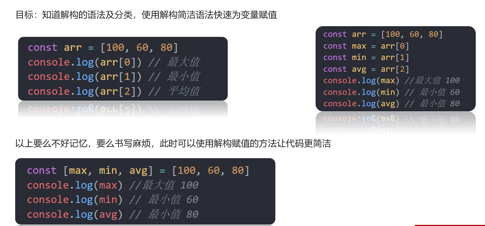

#### 1.1.1 基本语法

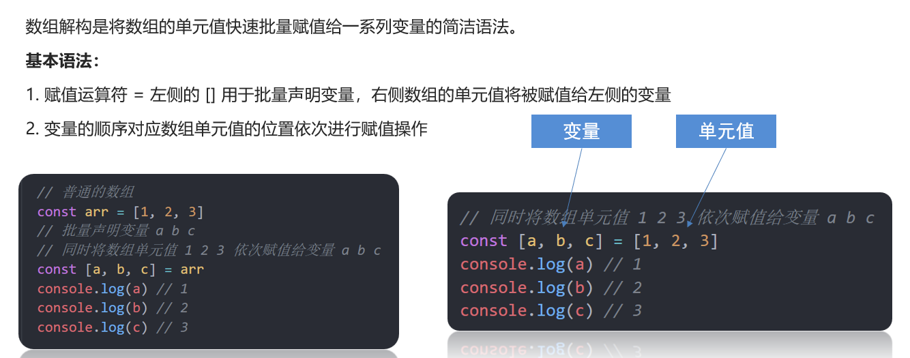

#### 1.1.2 交æ¢ä¸¤ä¸ªå˜é‡

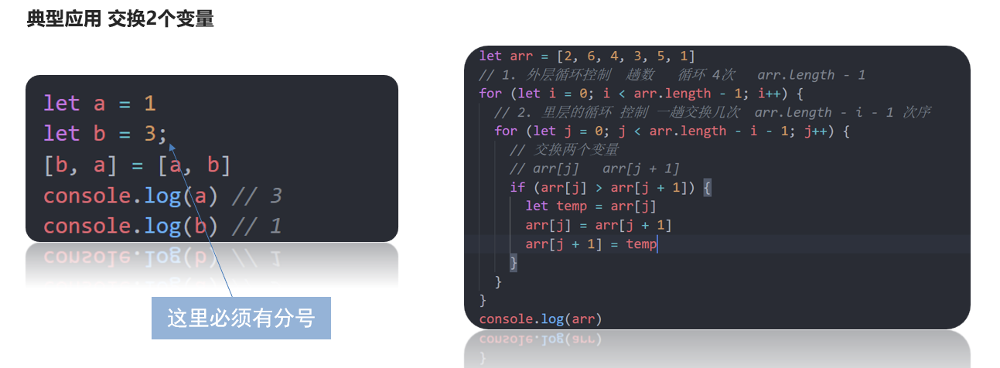


#### 1.1.3 加分å·çš„情况

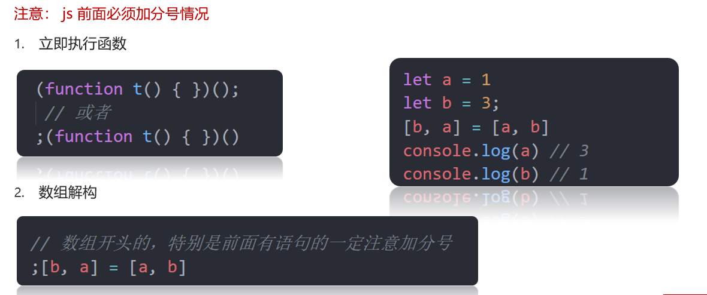

##### å°ç»“

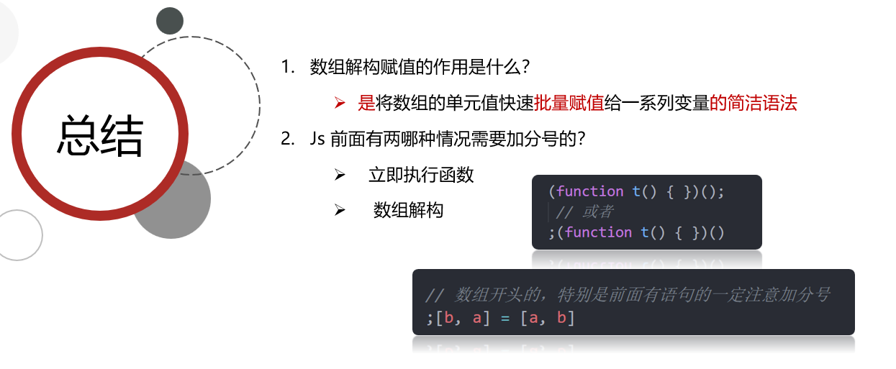

#### 1.1.4 练习

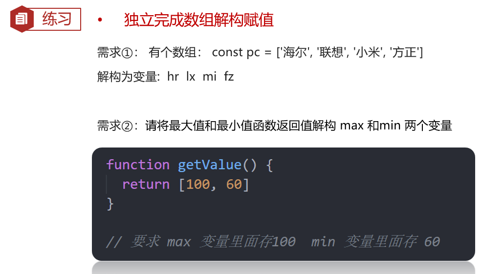

#### Code

```js
const pc = ['æµ·å°”', 'è”想', 'å°ç±³', '方正']
const [hr, lx, mi, fz] = ['æµ·å°”', 'è”想', 'å°ç±³', '方正']
console.log(hr,lx,mi,fz)

// 请将最大值和最å°å€¼å‡½æ•°è¿”å›å€¼è§£æ„ max å’Œ min 两个å˜é‡
function getValue() {
  return [100, 60]
}
const [max, min] = getValue()
console.log(max)
console.log(min)
```

#### 1.1.5 注æ„

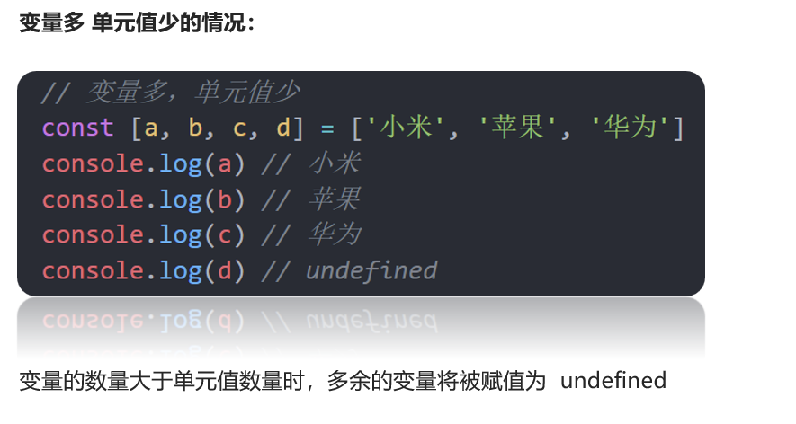

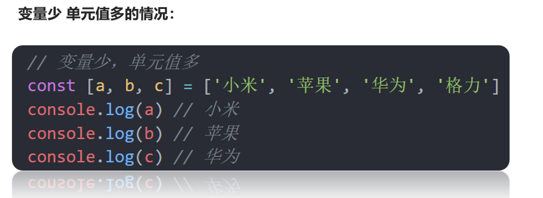

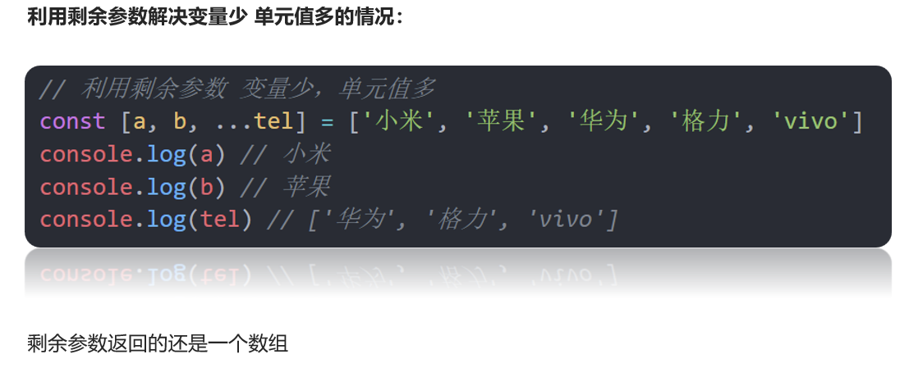

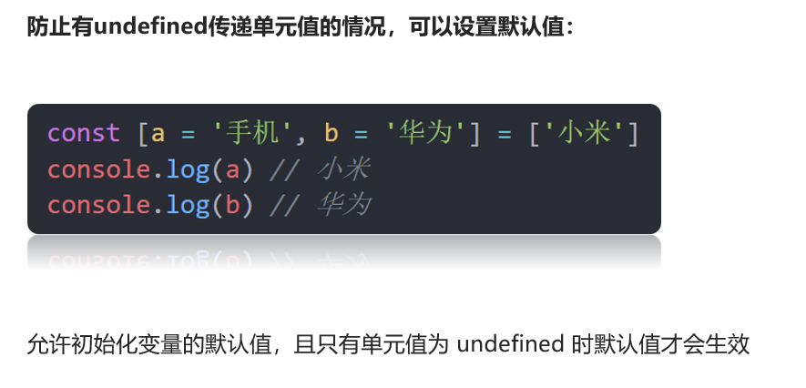

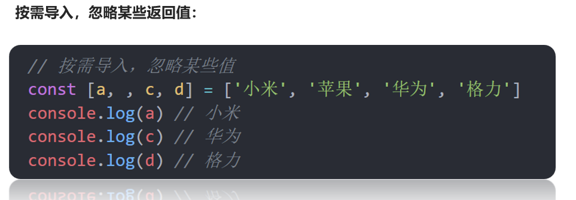

#### Code 

```js
// 1. å˜é‡å¤šï¼Œ å•å…ƒå€¼å°‘ ， undefined
const [a, b, c, d] = [1, 2, 3]
console.log(a) // 1
console.log(b) // 2
console.log(c) // 3
console.log(d) // undefined
// 2. å˜é‡å°‘， å•å…ƒå€¼å¤š
const [a, b] = [1, 2, 3]
console.log(a) // 1
console.log(b) // 2
// 3.  剩余å‚æ•° å˜é‡å°‘， å•å…ƒå€¼å¤š
const [a, b, ...c] = [1, 2, 3, 4]
console.log(a) // 1
console.log(b) // 2
console.log(c) // [3, 4]  真数组

// 4. 解æ„赋值å…许指定默认值 
const [a = 0, b = 0] = [1, 2]
console.log(a)
console.log(b)
const [a = 0, b = 0] = []  
const [a = 0, b = 1] = ['undefined', undefined]
console.log(a) // undefined string
console.log(b) // 1
// 5.  按照对应ä½ç½®ï¼Œå¯¹å˜é‡èµ‹å€¼ã€‚
const [a, b, , d] = [1, 2, 3, 4]
console.log(a) // 1
console.log(b) // 2
console.log(d) // 4
```


#### 1.1.6 多维数组

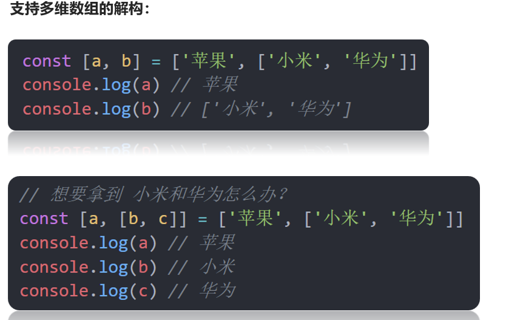

#### Code

```js
// 多维数组: 数组嵌套数组
const arr = [1, 2, [3, 4]]
console.log(arr[0])  // 1
console.log(arr[1])  // 2
console.log(arr[2])  // [3,4]
console.log(arr[2][0])  // 3

// 多维数组解æ„
const arr = [1, 2, [3, 4]]
const [a, b, c] = [1, 2, [3, 4]]
console.log(a) // 1
console.log(b) // 2
console.log(c) // [3,4] 

const [a, b, [c, d]] = [1, 2, [3, 4]]
console.log(a) // 1
console.log(b) // 2
console.log(c) // 3
console.log(d) // 4
```


##### å°ç»“


### 1.2 对象解æ„

#### 1.2.1 基本语法

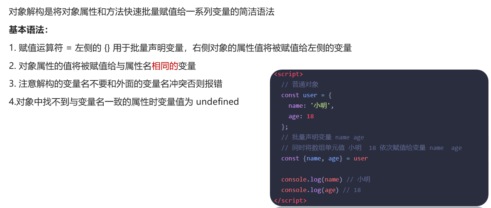

#### 1.2.2 ç»™å±æ€§é‡æ–°å‘½å

> 对象的解æ„赋值的内部机制，是先找到åŒåå±æ€§ï¼Œç„¶åå†èµ‹ç»™å¯¹åº”çš„å˜é‡ã€‚

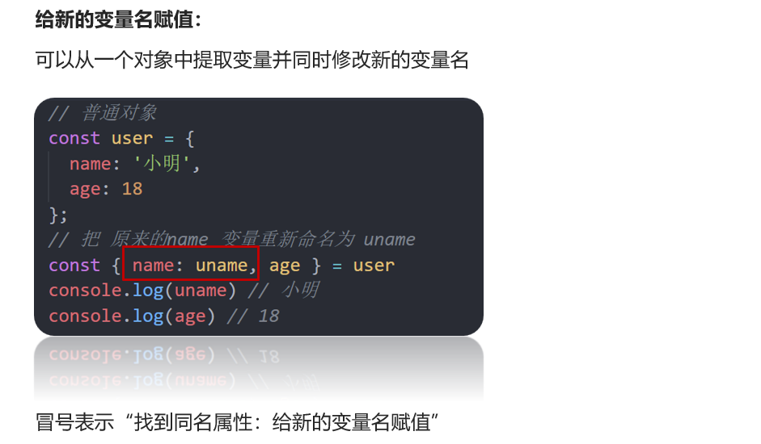

#### 1.2.3 数组对象解æ„


```js
const pig = [
  {
    uname: '佩奇',
    age: 6
  }
]
const [{ uname, age }] = pig
console.log(uname)
console.log(age)
```

#### Eg.练习

- 8分钟, 写完的åŒå­¦å›å¿†å‰é¢çš„知识.

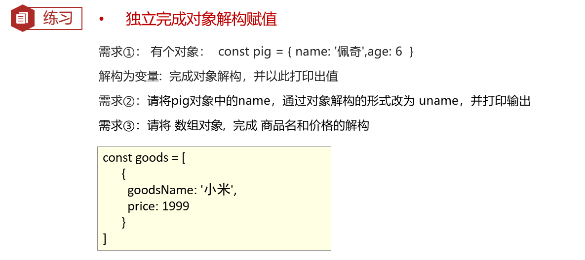

#### 1.2.4 多级对象解æ„

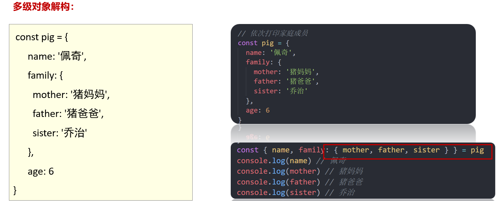

```js
const pig = {
    name: '佩奇',
    family: {
        mother: '猪妈妈',
        father: '猪爸爸',
        sister: '乔治'
    },
    age: 6
}
```

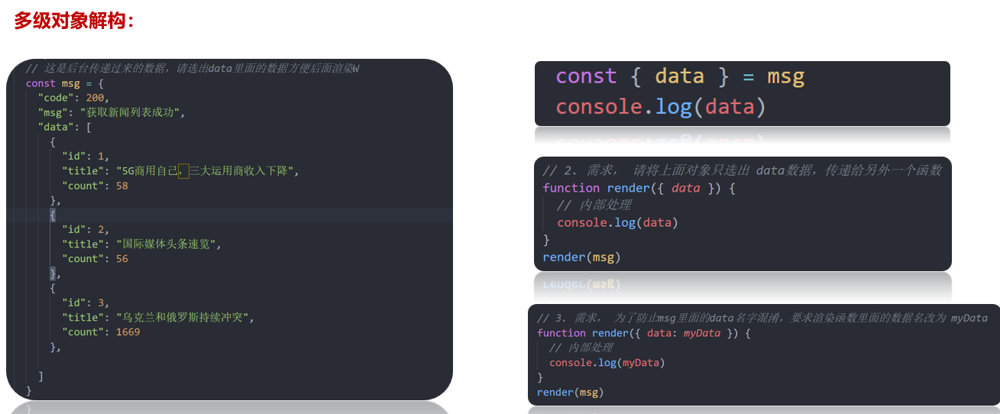

```js
// 1. 这是åå°ä¼ é€’过æ¥çš„æ•°æ®
const msg = {
    "code": 200,
    "msg": "è·å–新闻列表æˆåŠŸ",
    "data": [
        {
            "id": 1,
            "title": "5G商用自己，三大è¿ç”¨å•†æ”¶å…¥ä¸‹é™",
            "count": 58
        },
        {
            "id": 2,
            "title": "国际媒体头æ¡é€Ÿè§ˆ",
            "count": 56
        },
        {
            "id": 3,
            "title": "乌克兰和俄罗斯æŒç»­å†²çª",
            "count": 1669
        },

    ]
}
```

#### 1.2.4 函数的å‚数解æ„

```js
// å‚数是对象
const pos = {x:10, y: 20}
function move({x:aa, y}) { // pos
  console.log(aa, y)
  
}
move(pos)

// å‚数是数组
function add([x, y]){
  return x + y;
}

const res = add([1, 2])
console.log(res)
```

#### 1.2.4 forEachå¤ä¹ 

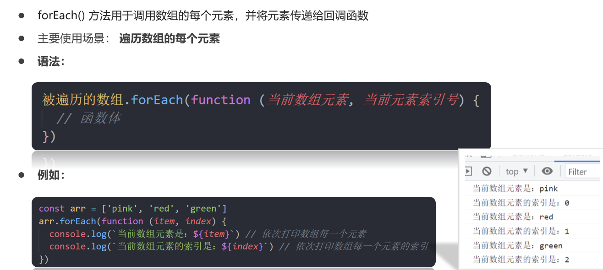

```js
// forEach 就是éå†  加强版的forå¾ªç¯  适åˆäºéå†æ•°ç»„对象
const arr = ['red', 'green', 'pink']
const result = arr.forEach(function (item, index) {
  console.log(item)  // 数组元素 red  green pink
  console.log(index) // 索引å·
})
// console.log(result)
```

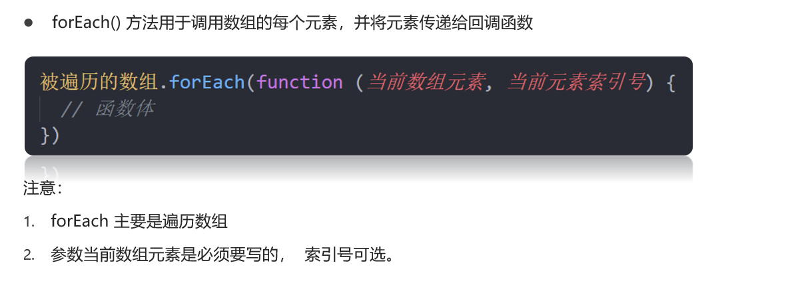

#### 1.2.6 Eg 渲染商å“列表


##### 


## 2. 综åˆæ¡ˆä¾‹

### 2.1 Array.filter()

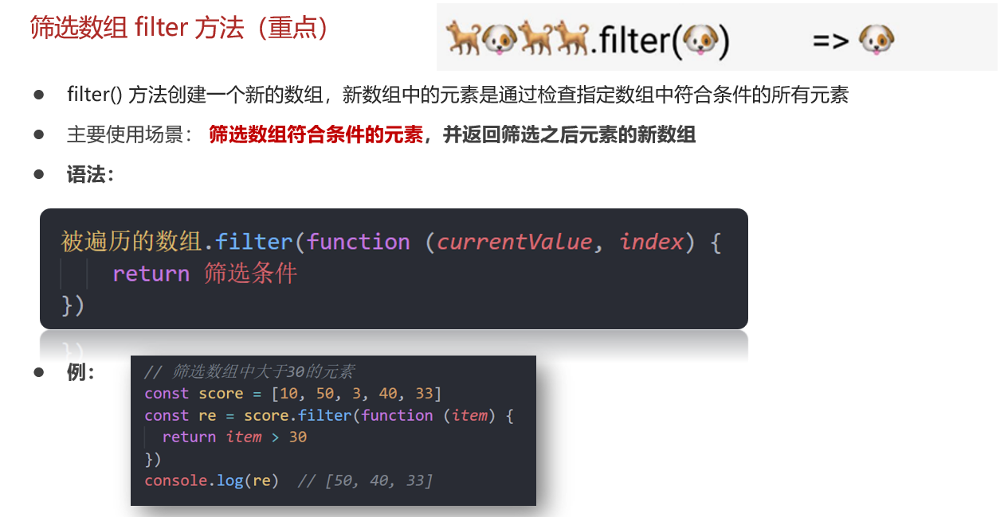


### 2.2 Eg. 价格筛选


todo 01 

```js
业务分æ：
①： 页é¢åˆå§‹æ¸²æŸ“
②： 点击ä¸åŒéœ€æ±‚显示ä¸åŒçš„æ•°æ®
```

todo 02 

```js
分æ：
â‘ ï¼šæ¸²æŸ“é¡µé¢ åˆ©ç”¨forEach éå†æ•°æ®é‡Œé¢çš„ æ•°æ®ï¼Œå¹¶æ¸²æŸ“æ•°æ®åˆ—表
â‘¡ï¼šæ ¹æ® filter 选择ä¸åŒæ¡ä»¶æ˜¾ç¤ºä¸åŒå•†å“
```

todo 03 

```js
步骤：
①：渲染页é¢æ¨¡å—
       (1) åˆå§‹åŒ–需è¦æ¸²æŸ“页é¢ï¼ŒåŒæ—¶ï¼Œç‚¹å‡»ä¸åŒçš„需求，还会é‡æ–°æ¸²æŸ“页é¢ï¼Œæ‰€ä»¥æ¸²æŸ“åšæˆä¸€ä¸ªå‡½æ•°
       (2) åšæ³•åŸºæœ¬è·Ÿå‰é¢æ¡ˆä¾‹é›·åŒï¼Œå°±æ˜¯å°è£…到了一个函数里é¢

```

todo 04

```js
步骤：
②：点击ä¸åŒéœ€æ±‚，显示ä¸åŒé¡µé¢å†…容
       (1) 点击采å–äº‹ä»¶å§”æ‰˜æ–¹å¼  .filter
       (2) 利用过滤函数 filter 筛选出符åˆæ¡ä»¶çš„æ•°æ®ï¼Œå› ä¸ºç”Ÿæˆçš„是一个数组，传递给渲染函数å³å¯
       (3) 筛选æ¡ä»¶æ˜¯æ ¹æ®ç‚¹å‡»çš„ data-index æ¥åˆ¤æ–­
       (4) å¯ä»¥ä½¿ç”¨å¯¹è±¡è§£æ„，把 事件对象 è§£æ„ 
       (5) 因为 全部区间ä¸éœ€è¦ç­›é€‰ï¼Œç›´æ¥ 把goodList渲染å³å¯

```

## 3.  æ„造函数

### PS . 对象的概念

> 对象是一组**<font color='red'>æ— åº</font>**的相关**å±æ€§**å’Œ**方法**的集åˆï¼ˆå¯ä»¥å­˜æ”¾ä»»æ„ç±»å‹çš„元素）

- 对象是一组**<font color='red'>æ— åº</font>**的相关**å±æ€§**å’Œ**方法**的集åˆï¼Œæ‰€æœ‰çš„事物都是对象，例如字符串ã€æ•°å€¼ã€æ•°ç»„ã€å‡½æ•°ç­‰ã€‚

- 对象是由**å±æ€§**å’Œ**方法**组æˆçš„

  - å±æ€§ï¼š**事物的特å¾**，在对象中用å±æ€§æ¥è¡¨ç¤ºï¼ˆå¸¸ç”¨åè¯ï¼‰
  - 方法：**事物的行为**，在对象中用方法æ¥è¡¨ç¤ºï¼ˆå¸¸ç”¨åŠ¨è¯ï¼‰

  

*注æ„：一个对象中**å±æ€§**å’Œ**方法**并ä¸æ˜¯éƒ½å…·æœ‰çš„，看具体情况æ¥è®¾ç½®ä¸€ä¸ªå¯¹è±¡ä¸­çš„内容*

- 对象中的å˜é‡ï¼Œç§°ä¹‹ä¸ºå±æ€§ 
- 对象中的函数，称之为方法 

### PS. 为什么需è¦å¯¹è±¡

> 对象的数æ®ç»“æ„清晰，数æ®æ›´è¯­ä¹‰åŒ–，表æ„æ˜æ˜¾ï¼Œæ›´é€‚åˆéå†

**场景：** 存一个值时，å¯ä»¥ä½¿ç”¨å˜é‡ï¼Œä¿å­˜å¤šä¸ªå€¼ï¼ˆä¸€ç»„值）时，å¯ä»¥ä½¿ç”¨æ•°ç»„。那么如æœæƒ³å‚¨å­˜ä¸€ç»„有æ„义且方便查找的数æ®å‘¢ï¼Ÿ

数组：

```js
const arr = ['张三', '男', 150, 154];
```

**引å‘的问题问题：** 用数组ä¿å­˜æ•°æ®çš„缺点 - æ•°æ®åªèƒ½é€šè¿‡ç´¢å¼•å€¼è®¿é—®ï¼Œå¼€å‘者需è¦æ¸…晰的清楚所有的数æ®çš„索引æ‰èƒ½å‡†ç¡®åœ°è·å–æ•°æ®ï¼Œè€Œå½“æ•°æ®é‡åºå¤§æ—¶ï¼Œä¸å¯èƒ½åšåˆ°è®°å¿†æ‰€æœ‰æ•°æ®çš„索引值。

**解决方案：为了让更好地存储一组数æ®ï¼Œå°±å¯ä»¥ç”¨åˆ°å¯¹è±¡ã€‚对象中为æ¯é¡¹æ•°æ®è®¾ç½®äº†å±æ€§å称，å¯ä»¥è®¿é—®æ•°æ®æ›´è¯­ä¹‰åŒ–，数æ®ç»“æ„清晰，表æ„æ˜æ˜¾ï¼Œæ–¹ä¾¿å¼€å‘者使用**。

```js
const obj = {
    "name":"张三",
    "sex":"ç”·",
    "age":128,
    "height":153
}
```


### 3.1 创建对象的三ç§æ–¹å¼

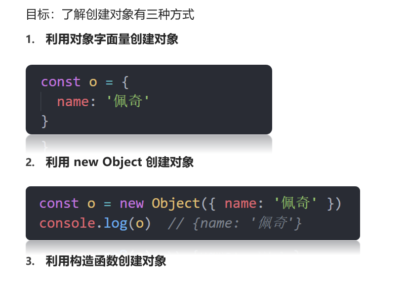

### 3.2 æ„造函数创建对象

#### 3.2.1 基本概念

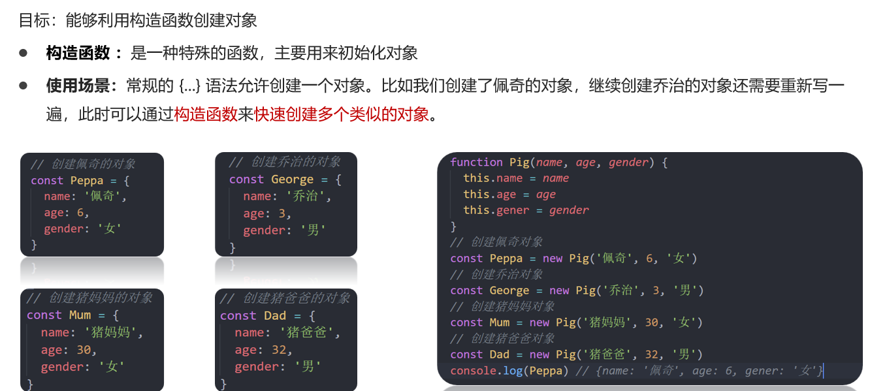

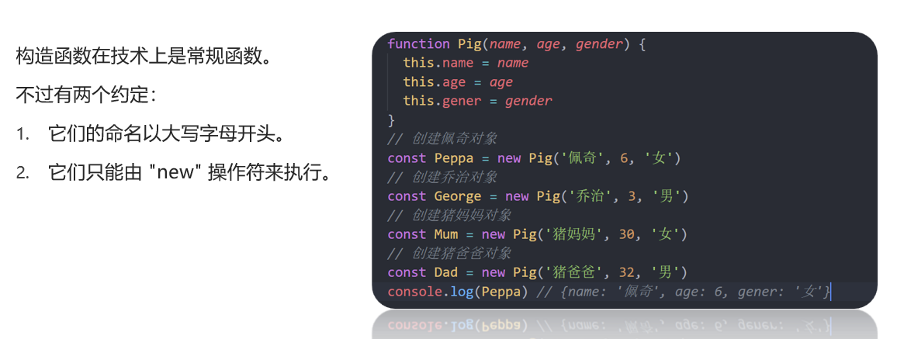

#### 3.2.2 语法

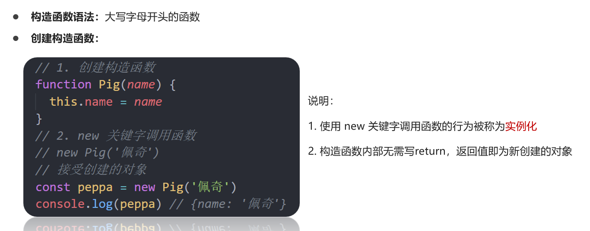

> **æ„造函数：**创建对象的方法 - 把对象里é¢ä¸€äº›ç›¸åŒçš„å±æ€§å’Œæ–¹æ³•æŠ½è±¡å‡ºæ¥å°è£…到函数里é¢

定义æ„造函数的语法

```js
function æ„造函数å(å½¢å‚1,å½¢å‚2,å½¢å‚3) { // æ„造函数的形å‚ä¸å¯¹è±¡çš„普通å±æ€§æ˜¯ä¸€èˆ¬ä¸€è‡´çš„
     this.å±æ€§å1 = å½¢å‚1; 
     this.å±æ€§å2 = å½¢å‚2; // å±æ€§çš„值，一般是通过åŒåçš„å½¢å‚æ¥èµ‹å€¼çš„
     this.å±æ€§å3 = å½¢å‚3;
     this.方法å = function(){
         
     };
}
// 调用
const obj = new æ„造函数å(å®å‚1，å®å‚2，å®å‚3)

// 简记
function æ„造函数å() {
    this.å±æ€§ = 值;  // 当å‰çš„这个对象的
    this.方法 = function() {}
}
new æ„造函数å();

// 注æ„: 
// 1. æ„造函数å字首字æ¯è¦å¤§å†™
// 2. æ„造函数里 å±æ€§å’Œæ–¹æ³•å‰é¢å¿…须添加 this
// 2. æ„造函数ä¸éœ€è¦ return å°±å¯ä»¥è¿”å›ç»“æœ
// 3. 我们调用æ„造函数 必须使用 new
```

#### Eg. 创建一个Personæ„造函数

```js
// 需求：定义一个人类æ„造函数，通过它创建的人类对象包å«
// å±æ€§ï¼šå§“å，年龄，性别
// 方法：打招呼。sayHi
```

```js
function Person(name, age, sex) {
   this.name = name;
   this.age = age;
   this.sex = sex;
   this.sayHi = function() { 
       console.log('nice to meet u :)')
   }
}
```

#### Eg. Goodsæ„造函数


```js
function Goods(name, price, count) {
  this.name = name
  this.price = price
  this.count = count
  this.sayhi = function () { }
}
const mi = new Goods('å°ç±³', 1999, 20)
// console.log(mi)
const hw = new Goods('å为', 3999, 59)
// console.log(hw)
console.log(mi === hw)
```

##### å°ç»“


#### 3.2.3  æ„造函数ä¸å¯¹è±¡çš„区别

- **æ„造函数：**如 Person()，**抽å–**了对象的公共部分，å°è£…到了函数里é¢ï¼Œå®ƒ**泛指æŸä¸€å¤§ç±»**（class）  
  **对象：**如 var ldh = new Stars()，**特指æŸä¸€ä¸ªï¼ˆå…·ä½“çš„æŸä¸€ä¸ªï¼‰**，

  

- **å®ä¾‹ï¼šå°±æ˜¯å®é™…的例å­**（æŸä¸€å¤§ç±»ä¸­çš„å®é™…的例å­ï¼‰

- 对象åˆå«åš**å®ä¾‹**

  

- **å®ä¾‹åŒ– : **通过æ„造函数创建对象的过程，å«åšå®ä¾‹åŒ–;  

  - 或者说 通过new关键字创建对象的过程我们也称为对象å®ä¾‹åŒ–

#### 3.2.4 new的执行过程

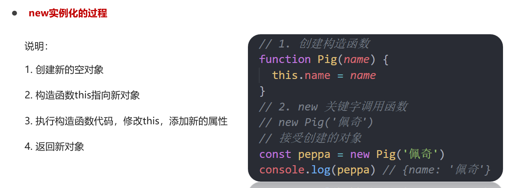

#### 3.2.5 å®ä¾‹æˆå‘˜/é™æ€æˆå‘˜

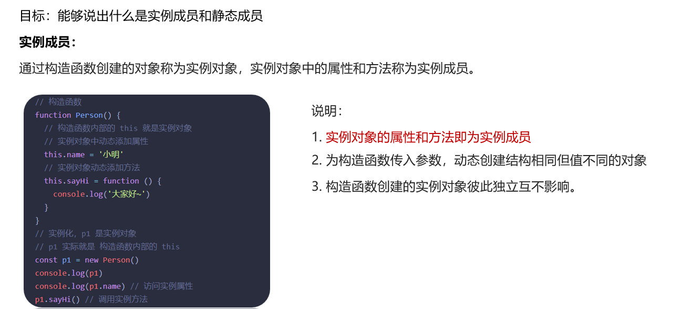

```js
// å®ä¾‹æˆå‘˜å°±æ˜¯æ„造函数内部通过this添加的æˆå‘˜
// å®ä¾‹æˆå‘˜é€šè¿‡å®ä¾‹åŒ–的对象æ¥è®¿é—®
```


```js
// é™æ€æˆå‘˜,  在æ„造函数本身上添加的æˆå‘˜
// é™æ€æˆå‘˜é€šè¿‡æ„造函数æ¥è®¿é—®
```


##### å°ç»“


## 4. 内置æ„造函数

### 4.1 基本包装类å‹

> js 底层完æˆï¼Œ 把简å•æ•°æ®ç±»å‹åŒ…装为了引用数æ®ç±»å‹, 所以基本类å‹çš„æ•°æ®ä¹Ÿå…·æœ‰ä¸€äº›å±æ€§å’Œæ–¹æ³•ã€‚

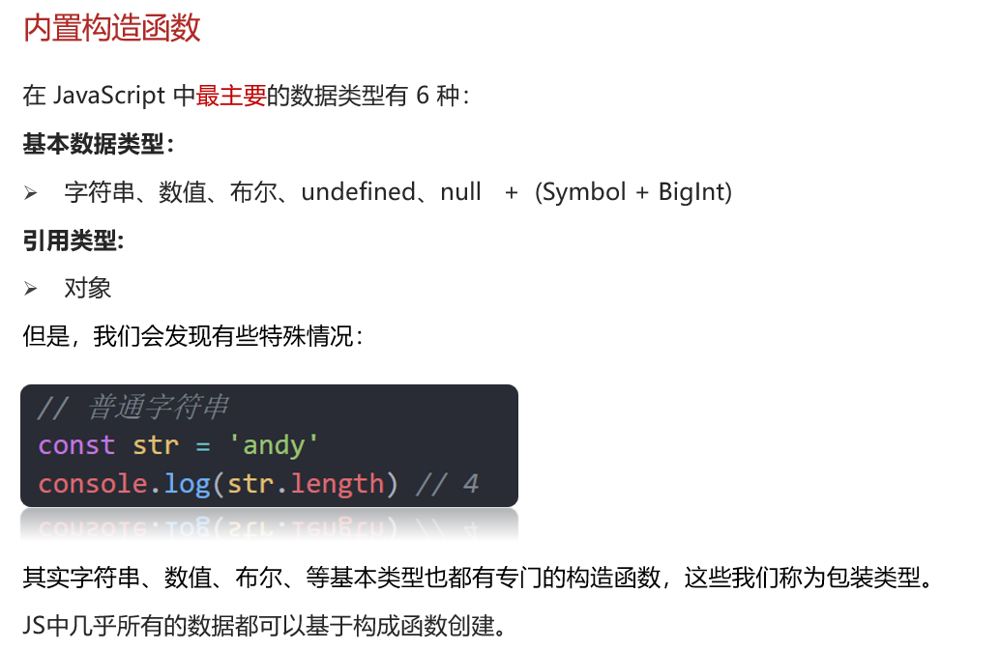


JS给我们æ供的内置æ„造函数。

> å¼•ç”¨ç±»å‹ 

Object  Array  RegExp  Date ç­‰

> 包装类å‹

String Number Boolean ç­‰

### 4.1 Object

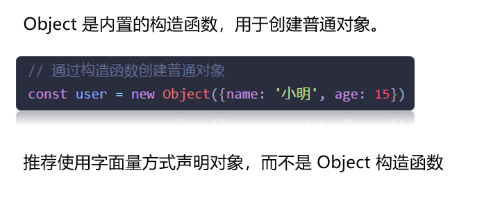

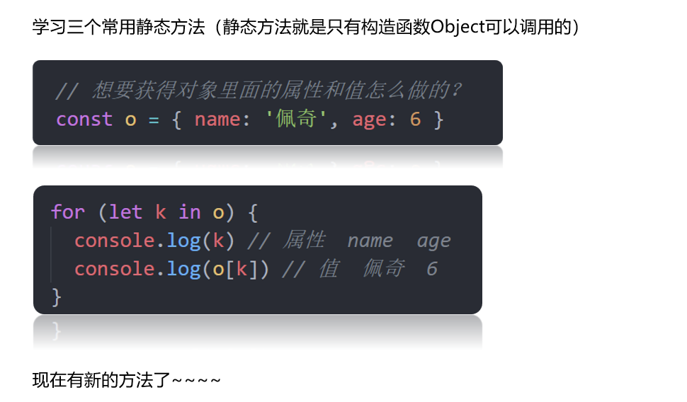

#### Object.keys()

> é™æ€æ–¹æ³•ï¼š 写在æ„造函数身上，通过æ„造函数直æ¥è°ƒç”¨ã€‚

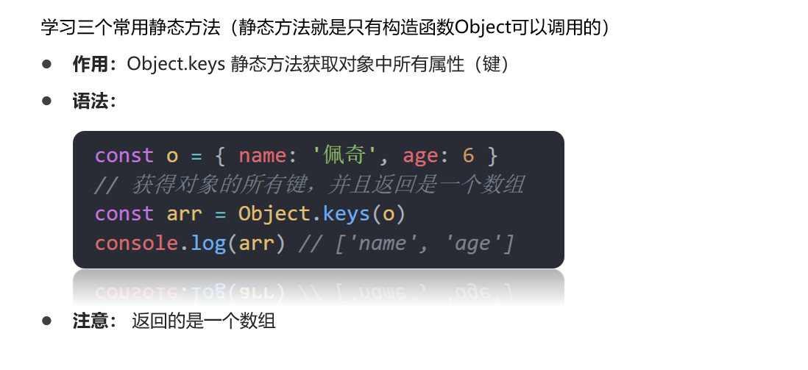

#### Object.values()

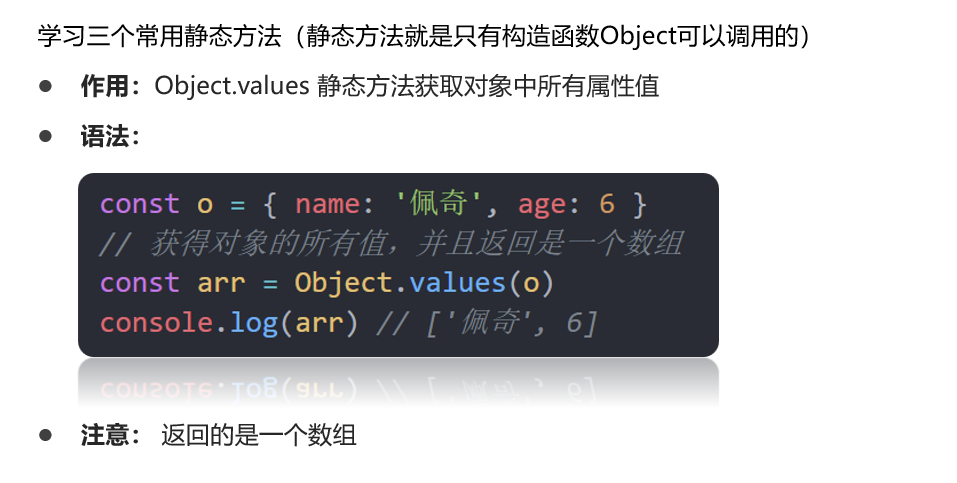

#### Object.assign()

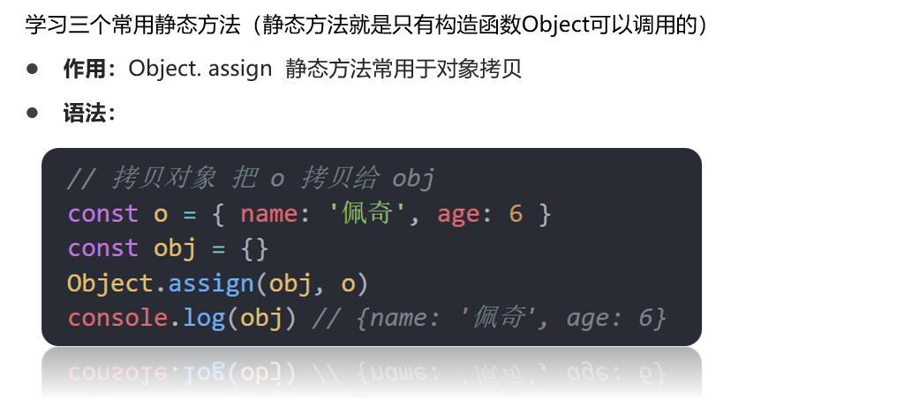

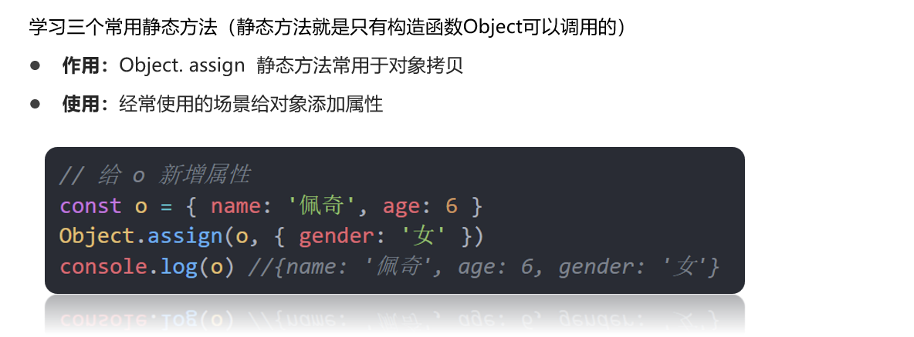

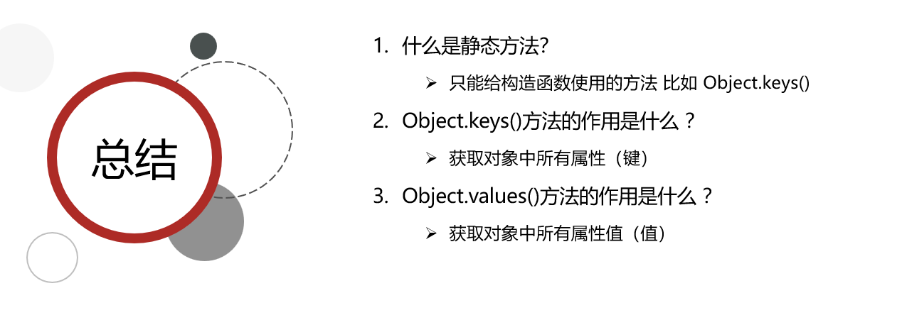

### 4.2 Array

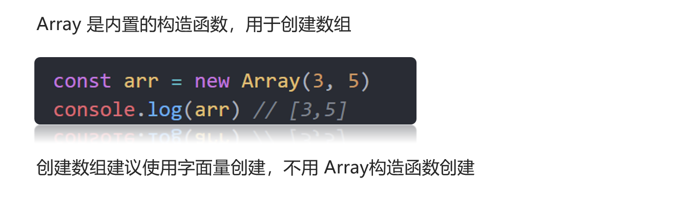

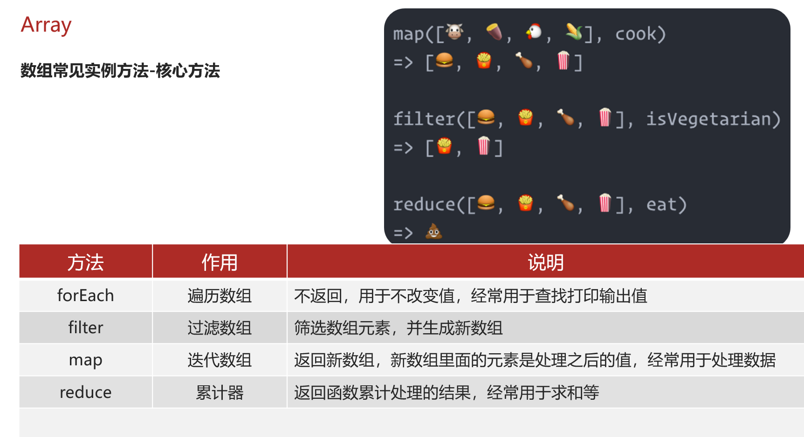

#### Array.prototype.reduce()

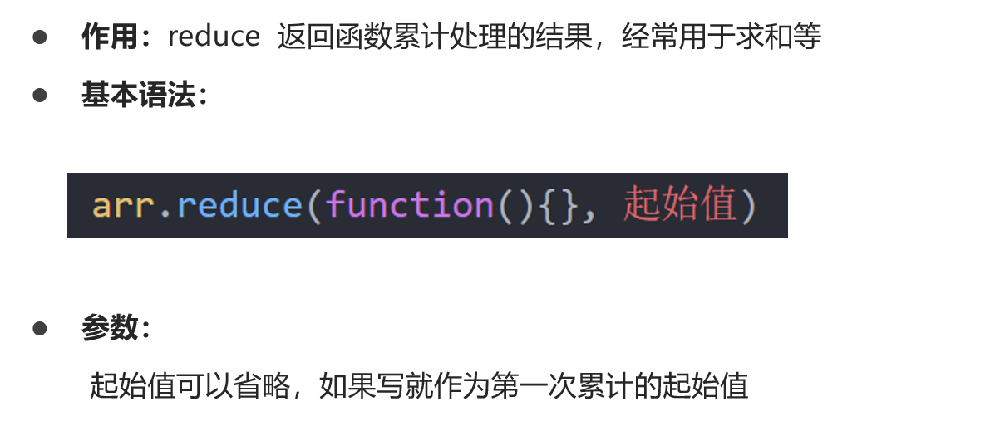

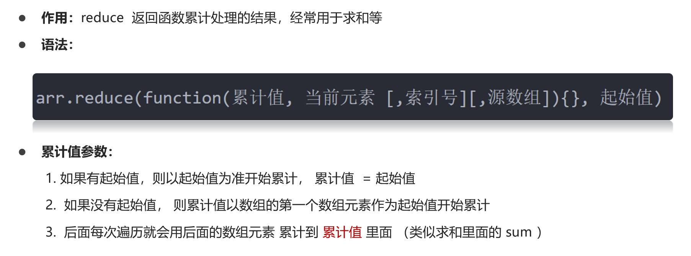

```js
// arr.reduce(function(){}, initValue)
// 定义:对数组中的æ¯ä¸ªå…ƒç´ æ‰§è¡Œä¸€ä¸ªè‡ªå®šä¹‰çš„reducer函数，将其结æœæ±‡æ€»ä¸ºå•ä¸ªè¿”å›å€¼
// å‚æ•°: 
//    callback : å›è°ƒå‡½æ•° 必选  √
//    initValue: åˆå§‹å€¼ (å¯é€‰) √
// å›è°ƒå‡½æ•°çš„å‚æ•°:
//    previousValue:上一次调用 callbackFn 时的返å›å€¼ 必选 √
//    currentValue: 当å‰å…ƒç´ , 必选 √
//    currentIndex: 当å‰å…ƒç´ ç´¢å¼•, (å¯é€‰)
//    array: æºæ•°ç»„: (å¯é€‰)

// 注æ„: 第一次调用时, 如æœæŒ‡å®šäº†initValueåˆå§‹å€¼, 则prev为åˆå§‹å€¼,
//      å¦åˆ™, prev为数组的第一个元素arr[0]
```

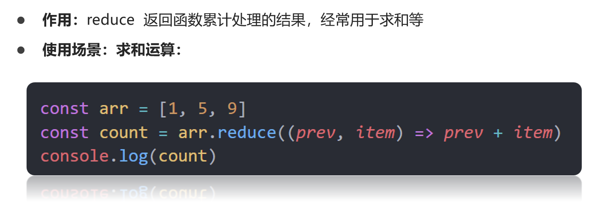

##### Eg. 员工涨薪计算

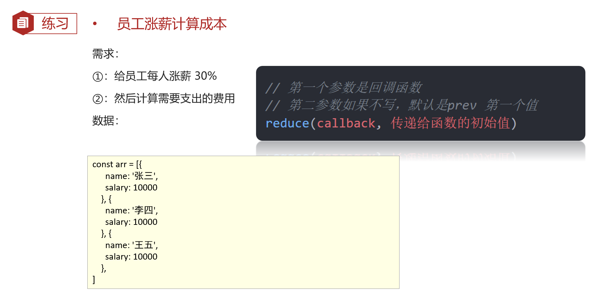

```js
const arr = [{
  name: '张三',
  salary: 10000
}, {
  name: 'æå››',
  salary: 10000
}, {
  name: 'ç‹äº”',
  salary: 20000
}]
```

```js
const money = arr.reduce((prev, item) => prev + item.salary * 0.3, 0)
console.log(money)
```


#### Array-Other

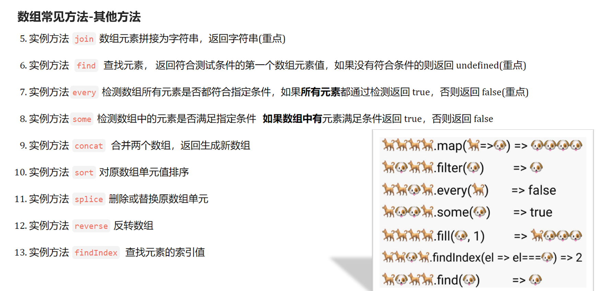

####  Array.prototype.find()

> è¿”å›æ•°ç»„中满足æ¡ä»¶çš„第一个数组元素, 如æœæ²¡æ‰¾åˆ°, è¿”å› undefined

```js
// 查MDN手册
// 1. 作用, 该API干嘛用的.
// 2. 语法, 先大致了解
// 3. å‚æ•°, 熟悉å‚æ•°
// 4. è¿”å›å€¼, 看是å¦æœ‰è¿”å›å€¼
// 5. æè¿°, 注æ„事项
// 6. 示例代ç , 自己å°è¯•ä¸€ä¸‹

// å®ä¾‹æ–¹æ³•:

const arr = ['red', 'blue', 'green']
const res = arr.find(function (item) {
  return item === 'blue'
})
console.log(res)  // find è¿”å›å€¼, 
// 简写:
const res = arr.find(el => el ==='blue')
```

####  Array.prototype.findIndex()

>  findIndex 查找满足æ¡ä»¶çš„第一个数组元素的索引值,若没有找到对应元素则返å›-1

```js
// findIndex 查找满足æ¡ä»¶çš„第一个数组元素的索引值,若没有找到对应元素则返å›-1
const index = arr.findIndex(item => item.name === 'å°ç±³')
console.log(index)
```

#### Array.prototype.every()

>  every æ¯ä¸€ä¸ªæ˜¯å¦éƒ½ç¬¦åˆæ¡ä»¶ï¼Œå¦‚æœéƒ½ç¬¦åˆè¿”å› true ，å¦åˆ™è¿”å›false

```js
// every æ¯ä¸€ä¸ªæ˜¯å¦éƒ½ç¬¦åˆæ¡ä»¶ï¼Œå¦‚æœéƒ½ç¬¦åˆè¿”å› true ，å¦åˆ™è¿”å›false
const arr = [10, 20, 30]
const res = arr.every(item => item >= 20)
console.log(res)
```

####  Array.prototype.some()

> some 检测数组内的是å¦æœ‰å…ƒç´ ç¬¦åˆæŒ‡å®šæ¡ä»¶, 如æœæœ‰ä¸€ä¸ªç¬¦åˆå°±è¿”å›true

```js
// some 检测数组内的是å¦æœ‰å…ƒç´ ç¬¦åˆæŒ‡å®šæ¡ä»¶, 如æœæœ‰ä¸€ä¸ªç¬¦åˆå°±è¿”å›true
const arr = [1, 2, 3, 6, 9]
const res = arr.some(x => x > 10) // false
```

#### Array.prototype.includes()

> 判断一个数组是å¦åŒ…å«ä¸€ä¸ªæŒ‡å®šçš„值, 包å«è¿”å›true, å¦åˆ™ false

```js
const arr = [1, 2, 3]
const res = arr.includes(1) // true
const res = arr.includes('1') // false
```


---

##### Eg. 

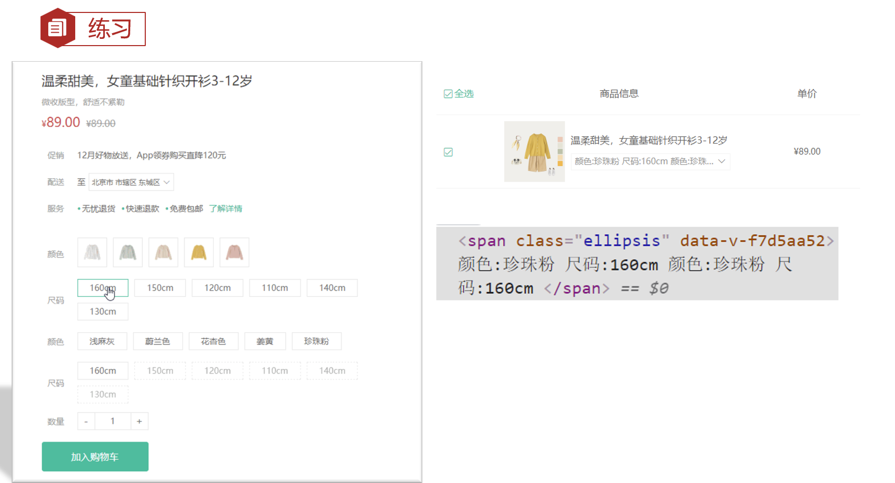

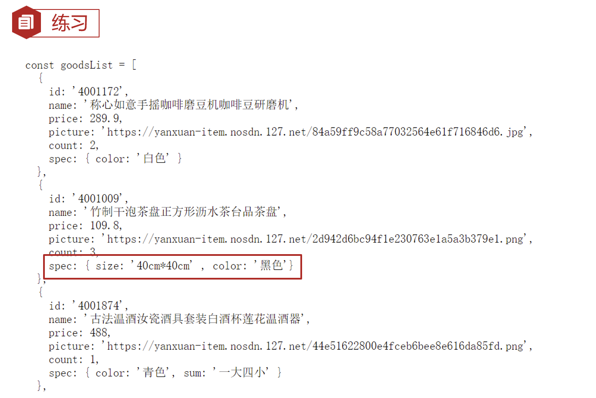

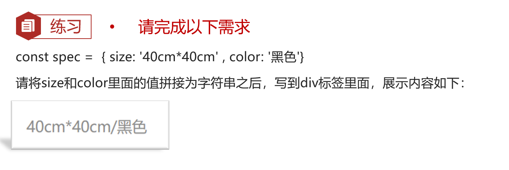

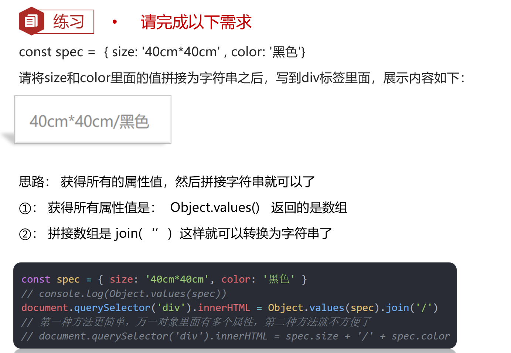

#### Array.from()

é™æ€æ–¹æ³•ï¼š 伪数组转为真数组。

```js
const lis = document.querySelectorAll('ul li')
// console.log(lis)
// lis.pop() 报错  删除最å一个
const lis_R = Array.from(lis)
lis_R.pop()
console.log(lis_R)
```

### 4.3 String

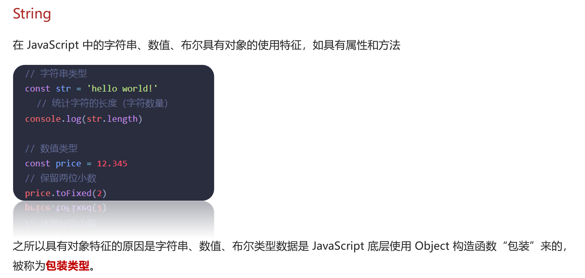


#### String.prototype.split()

> 字符串转数组: 使用指定分隔符, 将字符串分割, 得到一个字符串数组.

```js
const str = 'The quick brown fox jumps over the lazy dog.';
const words = str.split(' ');
console.log(words)

const str1 = '2022-08-09'
const arr = str1.split('-')
console.log(arr)
console.log(arr[0])
```

#### String.prototype.substring()

> 截å–字符串: è¿”å›ä¸€ä¸ªå­—符串在开始索引到结æŸç´¢å¼•ä¹‹é—´çš„一个å­é›†

```js
// 1 如æœçœç•¥ indexEnd，å–到最å
// 2 å‰é—­å开区间 [start, end), 结æŸç´¢å¼•å·ä¸åŒ…å«åœ¨æˆªå–的字符串内.
const str = '你喜欢åƒå†°æ·‡æ·‹å—'
console.log(str.substring(1))
console.log(str.substring(1, 3))
```

#### String.prototype.startsWith()

> 判断是ä¸æ˜¯ä»¥æŸä¸ªå­—符开头

```js
// 语法: str.startsWith(searchString[, position])
// 作用: 判断是å¦ä»¥æŸä¸ªå­—符开头
// å‚æ•°: 
//    第一个å‚æ•°: è¦æœç´¢çš„字符串
//    第二个å‚æ•°: 在str中æœç´¢çš„开始ä½ç½®, 默认为0 (å¯é€‰)
// è¿”å›å€¼:  true / false

const str = "To be, or not to be, that is the question.";

alert(str.startsWith("To be"));         // true
alert(str.startsWith("not to be"));     // false
alert(str.startsWith("not to be", 10)); // true
```

#### String.prototype.includes()

> 判断一个字符串是å¦åŒ…å«åœ¨å¦ä¸€ä¸ªå­—符串中  true/ false

```js
// str.includes()
// 判断一个字符串是å¦åŒ…å«åœ¨å¦ä¸€ä¸ªå­—符串中  true/ false
// 区分大å°å†™!
const str = 'To be, or not to be, that is the question.';
console.log(str.includes('To be'));       // true
console.log(str.includes('question'));    // true
console.log(str.includes('nonexistent')); // false
console.log(str.includes('To be', 1));    // false
console.log(str.includes('TO BE'));       // false
// åŒæ ·ä¹Ÿæœ‰pos, å¯é€‰
```

#### Eg.


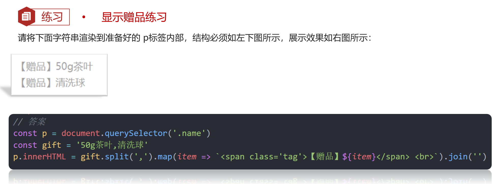

### 4.4 Number

#### Number.prototype.toFixed()

> 设置ä¿ç•™å°æ•°ä½ç½®

```js
// num.toFixed()
const num = 10.923
console.log(num.toFixed(1))
const num1 = 10
console.log(num1.toFixed(2))

// 如æœä¸ä¼ å‚æ•°,å››èˆäº”入转为整数
console.log(num.toFixed())  
```


## 5. 综åˆæ¡ˆä¾‹

### Eg. 购物车展示


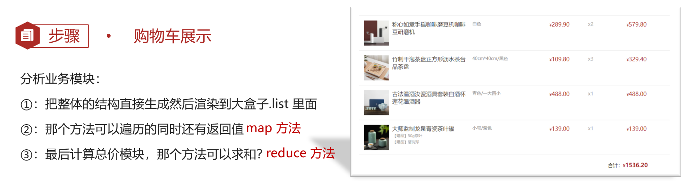

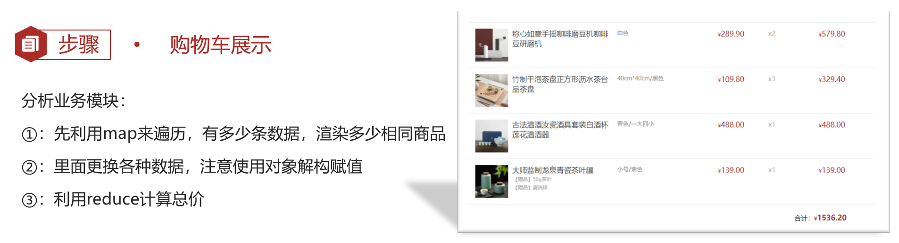


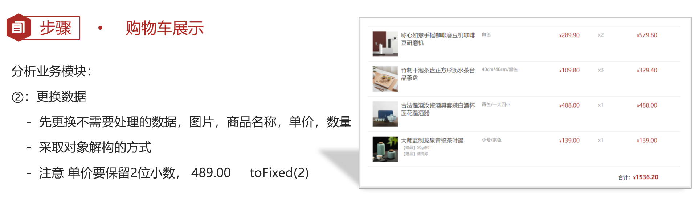

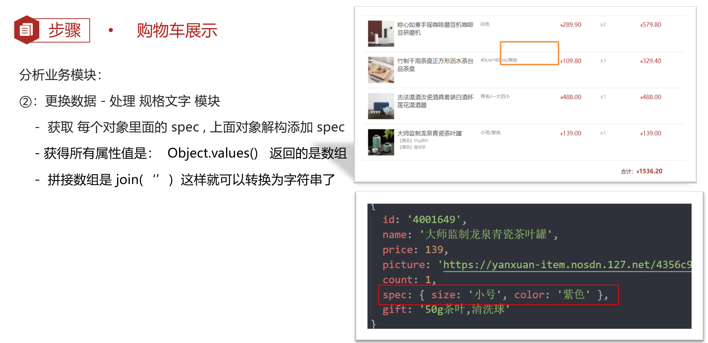


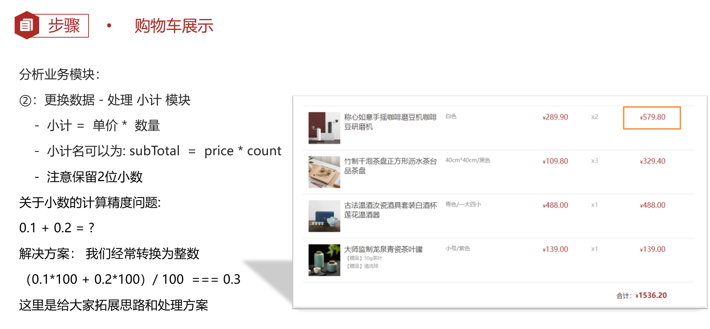

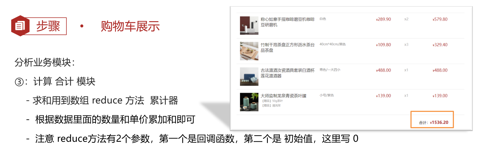

```js
// 1. æ ¹æ®æ•°æ®æ¸²æŸ“页é¢
document.querySelector('.list').innerHTML = goodsList.map(item => {
  // console.log(item)  // æ¯ä¸€æ¡å¯¹è±¡
  // å¯¹è±¡è§£æ„  item.price item.count
  const { picture, name, count, price, spec, gift } = item
  // 规格文字模å—处ç†
  const text = Object.values(spec).join('/')
  // 计算å°è®¡æ¨¡å— å•ä»· * æ•°é‡  ä¿ç•™ä¸¤ä½å°æ•° 
  // 注æ„精度问题，因为ä¿ç•™ä¸¤ä½å°æ•°ï¼Œæ‰€ä»¥ä¹˜ä»¥ 100  最å除以100
  const subTotal = ((price * 100 * count) / 100).toFixed(2)
  // 处ç†èµ å“æ¨¡å— '50g茶å¶,清洗çƒ'
  const str = gift ? gift.split(',').map(item => `<span class="tag">ã€èµ å“】${item}</span> `).join('') : ''
  return `
        <div class="item">
          
          <p class="name">${name} ${str} </p>
          <p class="spec">${text} </p>
          <p class="price">${price.toFixed(2)}</p>
          <p class="count">x${count}</p>
          <p class="sub-total">${subTotal}</p>
        </div>
      `
}).join('')

// 3. åˆè®¡æ¨¡å—
const total = goodsList.reduce((prev, item) => prev + (item.price * 100 * item.count) / 100, 0)
// console.log(total)
document.querySelector('.amount').innerHTML = total.toFixed(2)
```

