## Target

1. 能够说出构造函数和原型对象里面的this指向
2. 能够利用画图工具画出构造函数、实例对象、原型对象的关系图
3. 能够利用原型实现继承
4. 能够利用画图工具画出原型链
5. 能够跟随课堂代码完成综合案例-封装模态框

💡🚀🤟👉👇☀️🍉🍍🍇🍓🥕🍭🎖️🎁☘️🍀💯🔆❗🔥🚩

## 1. 编程思想

### 1.1 面向过程（POP）

> 面向过程编程： Process-oriented Programming , 以**过程**为核心，强调**事件的流程、顺序，**如：C语言。


### 1.2 面向对象（OOP）

> 面向对象编程：Object-oriented Programming , 以**对象**为核心，强调**事件的角色、主体，**如：C++、Java。

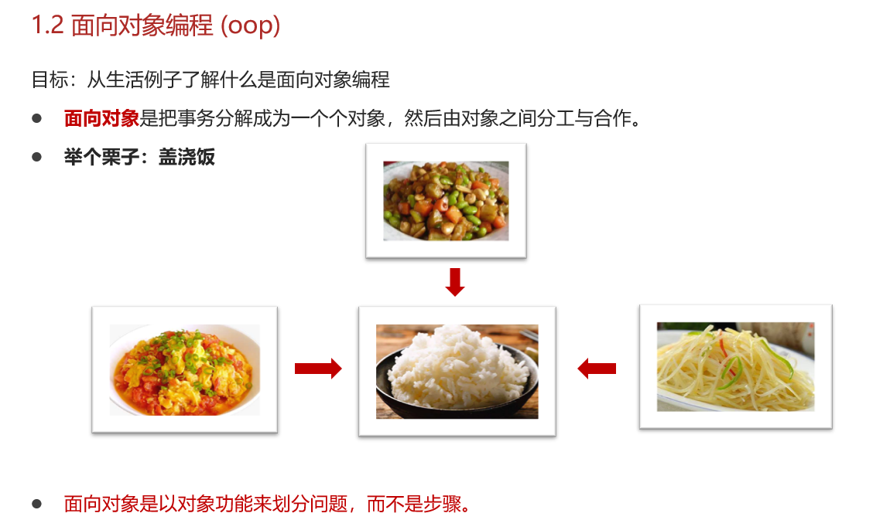

### 1.3 如何把大象装进冰箱

#### 1.3.1 面向过程

```js
为了把大象装进冰箱，需要3个过程。

1) 把冰箱门打开（得到打开门的冰箱）

2) 把大象装进去（得到打开着门的, 装着大象的冰箱）

3) 把冰箱门关上（打开门、装好大象后，获得关好门的冰箱）

每个过程有一个阶段性的目标，依次完成这些过程，就能把大象装进冰箱。

面向过程像是我们站在上帝视角, 为万物指定命运的轨迹……
```

#### 1.3.2 面向对象

```js
// 每个动作有一个执行者，它就是对象。
// 也就是谁(对象), 要做什么

为了把大象装进冰箱，对于冰箱这个对象来说, 需要做三个动作（或者叫行为）。

1) 冰箱，你给我把门打开

2) 冰箱，你给我把大象装进去（或者说，大象，你给我钻到冰箱里去） (大象, 滚进去~~~)

3) 冰箱，你给我把门关上  (大象,你帮我把冰箱门带上)

依次做这些动作，就能把大象装进冰箱。

冰箱.开门()
冰箱.装进(大象)
冰箱.关门()

===> 冰箱.开门().装进(大象).关门()

大象:吹个空调我容易么?

 // 求大象的心理阴影面积? 用面向对象的方式怎么写?
 大象.阴影面积()
```

**面向对象和面向过程不是互斥的, 也就是说, 面向对象的编程中, 也可以有面向过程的思想.**

比如求大象的心理阴影这个方法中, 是不是要计算长宽, 这样类似的步骤~~. 先计算长, 再计算宽, 再求和. 这是面向过程编程.


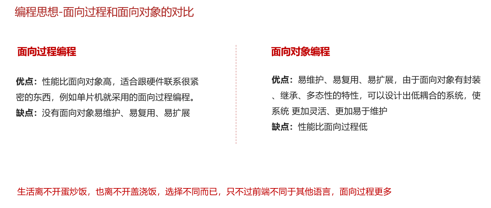

### 1.4 类

面向对象更贴近我们的实际生活, 可以使用面向对象来描述现实世界事物, 但是事物又分为具体的事物和抽象的事物.

比如, 手机, 就是一个大类 , 抽象的 泛指的. 汽车, 也是一个类.

比如, 小米手机, 苹果手机. 算是类还是对象? 宝马, 奔驰 算是类还是对象?

具体的 ,比如小米某个型号的手机, 是对象了吧? 但是, 这个型号的手机生产了100w台.

再具体点, 我手上的这台小米手机. 具体的一个对象.

#### 什么是类?

> **类是用于创建对象的模板。**它描述一类对象的行为和状态。(方法和属性)

比如, 中秋吃月饼, 月饼上都有一些图案花纹, 具有相同花纹的月饼, 都是 同一个月饼模具压出来的.. 那这个模具, 就相当是月饼的一个类. 用它压出来的月饼, 都具有相同的花纹.

#### 什么是对象

> **对象是属性和方法的集合**

#### 面向对象思维

1. 抽取(抽象) 对象共有的属性和方法封装成一个模板 (类).
2. 用类实例化一个对象 (用这个类作为模板创建一个具有它的属性和方法的对象, 可以创建很多个对象)

### 1.5 面向对象的三大特征

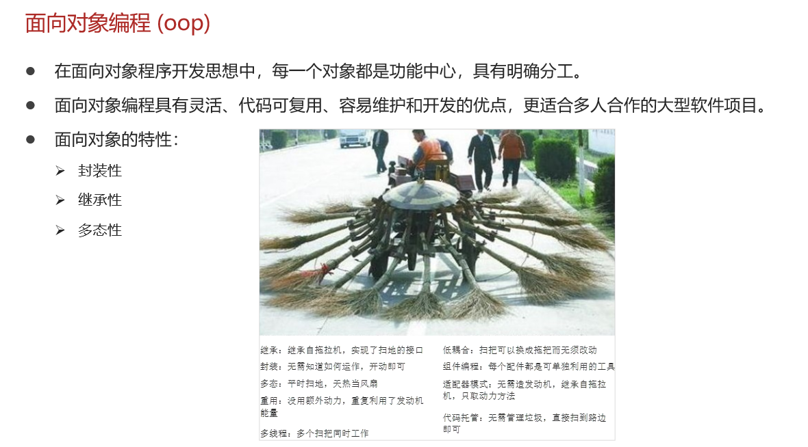

1. **封装** : 封装是指隐藏对象的属性和实现细节，仅对外提供公共访问方式。(抽取公共的属性方法)
2. **继承** : 继承可以使得子类具有父类的属性和方法. 或者重新定义、追加属性和方法等。
3. **多态** : 属于同一个父类的实例对象，调用同一个方法，出来不同的效果，就是多态

#### 1.5.1 **封装:**

我们程序设计追求“高内聚，低耦合”

高内聚：类的内部数据操作细节自己完成，不允许外部干涉

低耦合：仅对外暴露少量的方法用于使用。

隐藏对象内部的复杂性，只对外公开简单的接口。便于外界调用，从而提高系统的可扩展性、可维护性。通俗的说，把该隐藏的隐藏起来，该暴露的暴露岀来。这就是封装性的设计思想。

```js
// 构造函数 封装了人的姓名, 年龄, 打招呼等.
function Person(name, age){
    this.name = name
    this.age = age
    this.sayHi = function(){
        console.log('你好哇~ nice to meet u')
    }
}
var p1 = new Person('小张', 18)
```

#### 1.5.2 继承

**继承** : 继承可以使得子类具有父类的属性和方法. 或者重新定义、追加属性和方法等。

#### 1.5.2 多态

**多态**：属于同一个父类的实例对象，调用同一个方法，出来不同的效果，就是多态。

比如, 手机都有开机这个行为, 小米手机的开机动画是小米logo, 苹果手机开机动画是苹果logo.


## 2. 构造函数

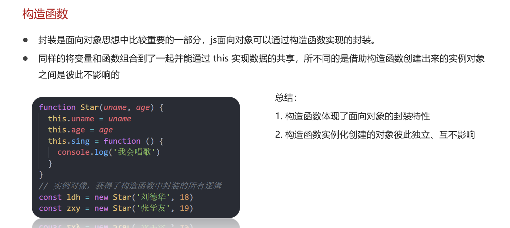

- [堆栈内存](https://zhuanlan.zhihu.com/p/362219811)

### 2.1 构造函数的问题

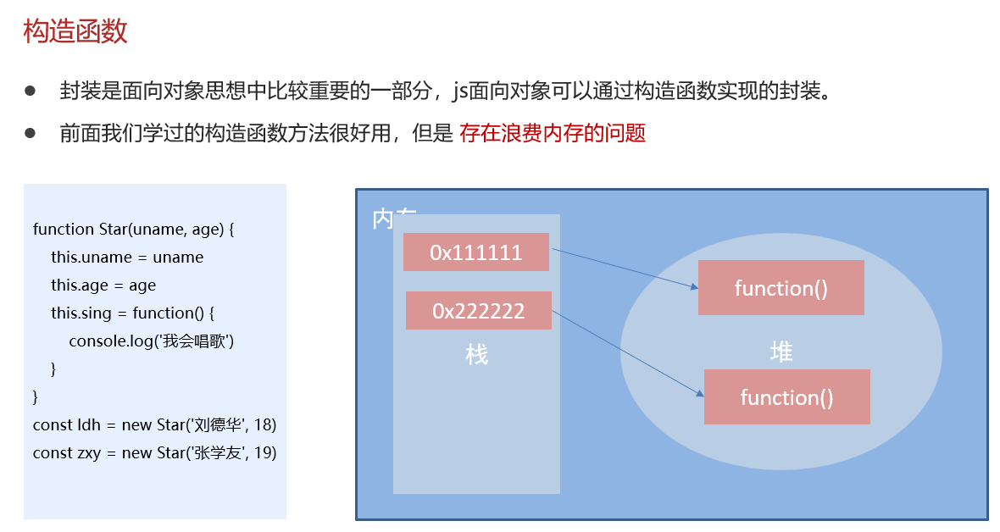

#### Code

```js
// 公共方法：每实例化一个对象, 就新开辟一个空间
function Star(name, age) {
  this.name = name
  this.age = age
  this.sing = function () {
    console.log('唱歌')
   }
}
const ldh = new Star('刘德华', 25)
const zxy = new Star('周杰伦', 18)
console.log(ldh.sing === zxy.sing)  // false 
```


### 小结

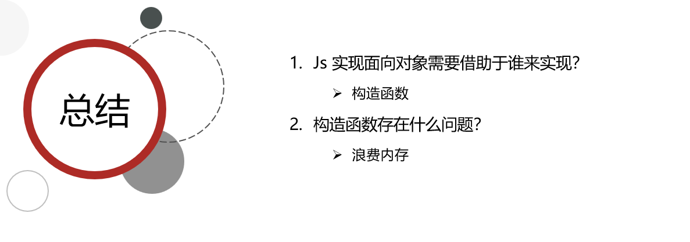

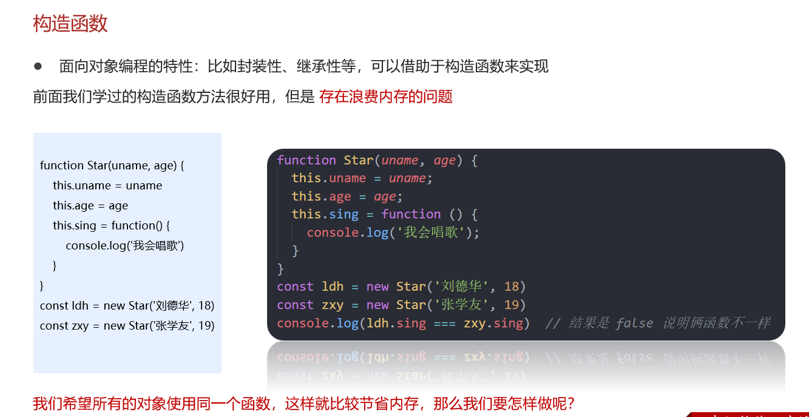

### 2.2 引入原型解决

#### Code

```js
// 1.公共的属性写到 构造函数里面
function Star(uname, age) {
  this.uname = uname
  this.age = age
  // this.sing = function () {
  //   console.log('唱歌')
  // }
}
// 2. 公共的方法写到原型对象身上   节约了内存
Star.prototype.sing = function () {
  console.log('唱歌')
}
const ldh = new Star('刘德华', 25)
const zxy = new Star('张学友', 18)
ldh.sing() //调用
zxy.sing() //调用
// console.log(ldh === zxy)  // false
// sing是方法, 在内存里面开辟了不同空间
console.log(ldh.sing === zxy.sing)

```


## 3. 原型

### 3.1 prototype 🔥🔥

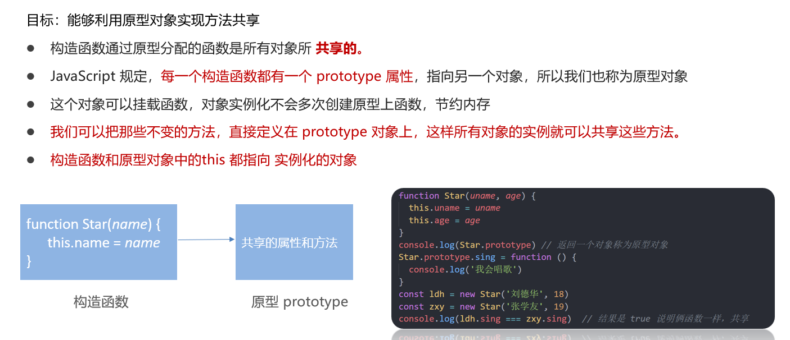

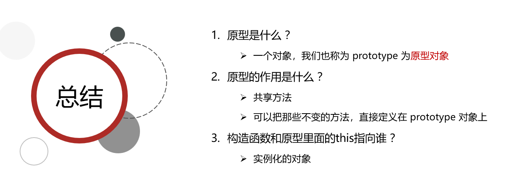

#### 原型this指向

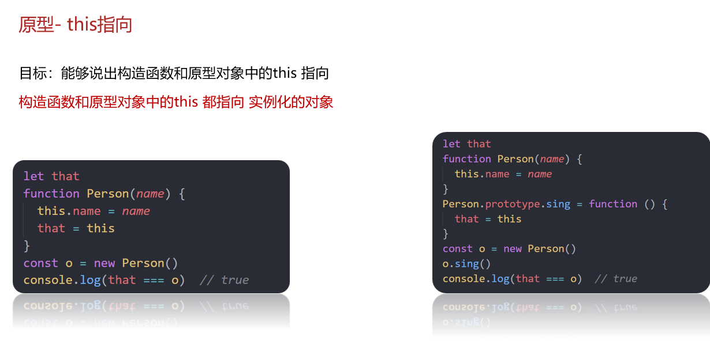

#### Code

```js
let that
function Star(uname) {
    // that = this
    // console.log(this)
    this.uname = uname
}
// 原型对象里面的函数this指向的还是 实例对象 ldh
Star.prototype.sing = function () {
    that = this
    console.log('唱歌')
}
// 实例对象 ldh   
// 构造函数里面的 this 就是  实例对象  ldh
const ldh = new Star('刘德华')
ldh.sing()
console.log(that === ldh)
```


#### Eg.数组扩展方法

> 构造函数和原型里面的this指向谁 ？ 实例化的对象

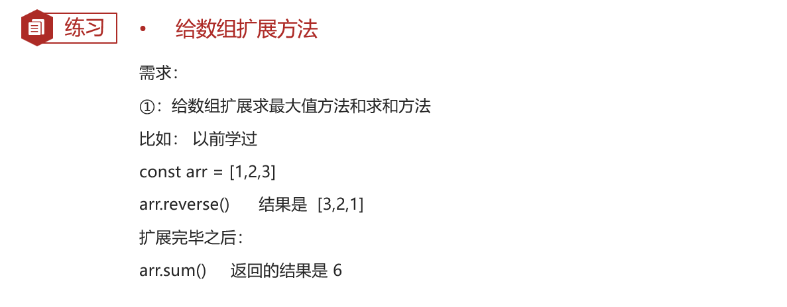

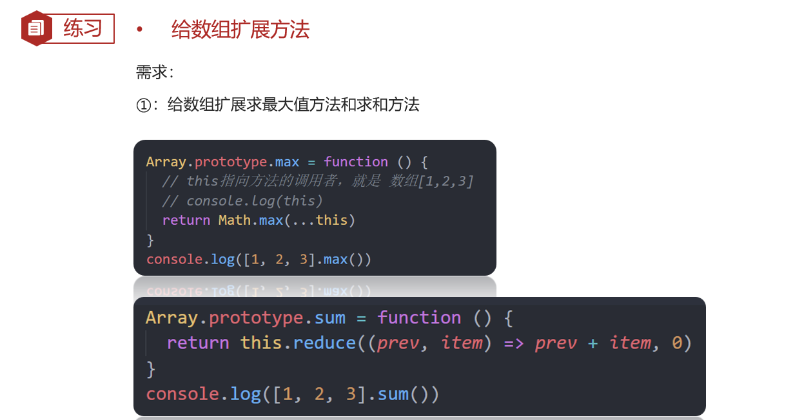

#### Code

> 看看视频， 实际工作中不建议这么用！

- 不建议修改Array，Object等对象的原型！‘
- 特别是prototype原型上本身存在的方法。因为实际开发，自己修改了， 而别的同学不知道， 一用就会有问题。并且可能找半天都找不到错误原因。
- 因为别的同学打死也想不到你会改这个， 最后发现是你改了原型。
- Good Luck.

```js
// 自己定义 数组扩展方法  求和 和 最大值 
// 1. 我们定义的这个方法，任何一个数组实例对象都可以使用
// 2. 自定义的方法写到  数组.prototype 身上
// 1. 最大值
const arr = [1, 2, 3]
Array.prototype.max = function () {
  // 展开运算符
  return Math.max(...this)
  // 原型函数里面的this 指向谁？ 实例对象 arr
}
// 2. 最小值
Array.prototype.min = function () {
  // 展开运算符
  return Math.min(...this)
  // 原型函数里面的this 指向谁？ 实例对象 arr
}
console.log(arr.max())
console.log([2, 5, 9].max())
console.log(arr.min())
// const arr = new Array(1, 2)
// console.log(arr)
// 3. 求和 方法 
Array.prototype.sum = function () {
  return this.reduce((prev, item) => prev + item, 0)
}
console.log([1, 2, 3].sum())
console.log([11, 21, 31].sum())
```


### 3.2 constructor属性 🔥🔥

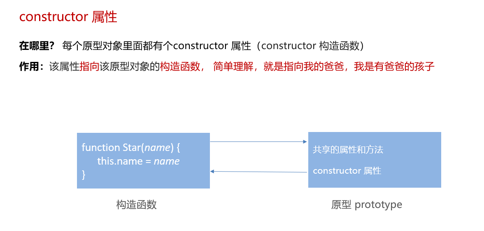

#### Code

```js
// constructor   构造函数

function Star(name, age) {
    this.name = name
    this.age = age
}
const ldh = new Star()
console.log(Star) // 
console.log(Star.prototype) 
// 每个原型(对象)都有一个constructor属性，指回构造函数本身
console.log(ldh.__proto__ == Star.prototype) // true
console.log(Star.prototype.constructor == Star) // true
// 可以获得对象的原型
console.log(Object.getPrototypeOf(ldh) === Star.prototype) // true
```


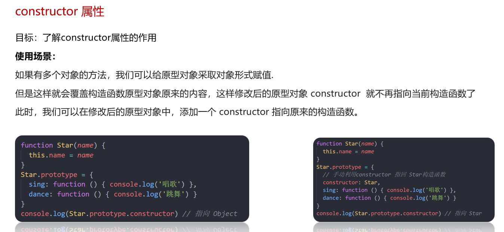

#### Code

```js
// 每个原型对象都有一个constructor属性，指回构造函数本身
function Star(name, age) {
    this.name = name
    this.age = age
}
Star.prototype.sing = function(){
    console.log('唱歌')
}
Star.prototype.dance = function(){
    console.log('跳舞')
}
console.log(Star.prototype)
Star.prototype = {
  // 可以手动的利用constructor指回原来的构造函数
    constructor: Star, // 
    sing: function(){
        console.log('唱歌')
    },
    dance:function(){
        console.log('跳舞')
    }
}
console.log(Star.prototype)
const ldh = new Star()
```


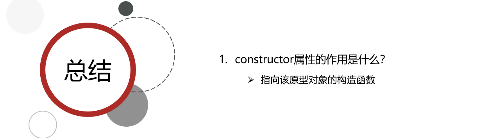

### 3.3 `__proto__` 🔥🔥

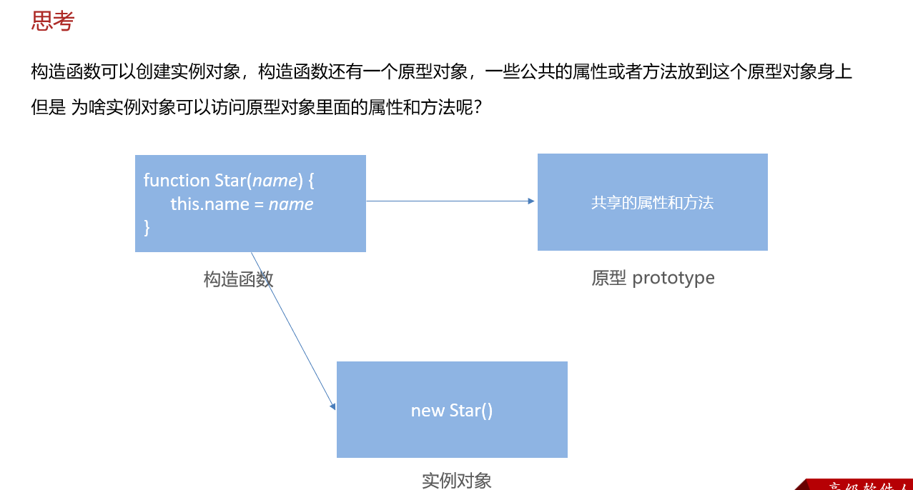

#### Code 

```js
function Star(name) {
  this.name = name
}
Star.prototype.sing = function(){
  console.log('sing')
}
const ldh = new Star('刘德华')
console.log(ldh); 
console.log(ldh.__proto__ === Star.prototype);
// 方法属性的查找规则:
// 首先先看ldh 对象身上是否有 sing 方法,如果有就执行这个对象上的sing
// 如果么有sing 这个方法,就会通过__proto__去实例的原型上查找 
```


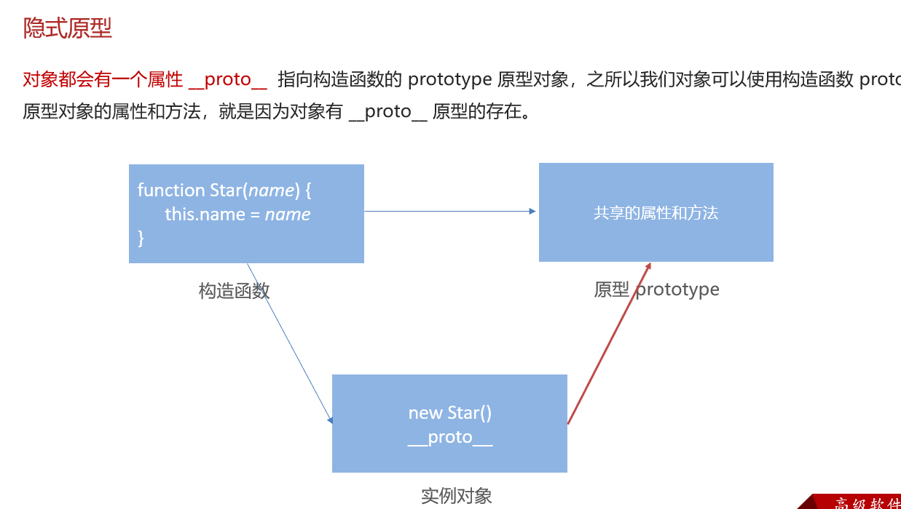

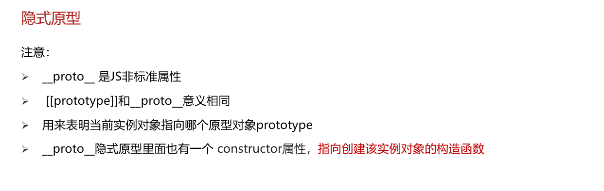

#### Error

>  注意下面这张图， 错误！Error

- 实例没有指回构造函数的那一条线！

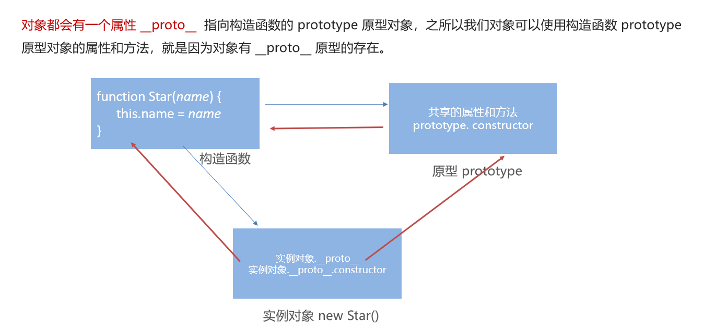

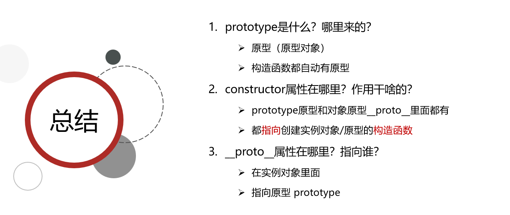

> 注意， 上面第二条， constructor属性在哪里？ 在原型对象里。

- 没有对象原型这种说法， 叫隐式原型更恰当！
- 并不是都有， 因为constructor就是在原型里，只是`实例.__proto__`能访问到而已！
- Error ==> 对象原型里面有constructor 指向 构造函数 Star

```js
ldh.__proto__ === Star.prototype // true
// 对象原型里面有constructor 指向 构造函数 Star  // Error！
ldh.__prototype.constructor === Star  // true
// Error 不要这么说！ 
// 本质上， 是因为ldh.__prototype 指向了原型， 原型里有constructor属性
// constructor是属性就是指向Star的。
```


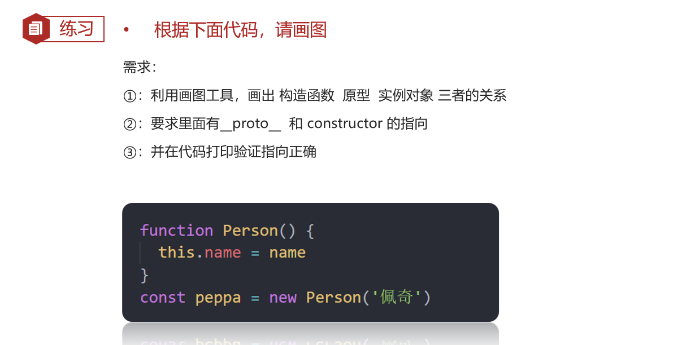

### 3.4 绘图:构造函数/原型/实例 🔥🔥

- https://app.diagrams.net/

- https://github.com/jgraph/drawio-desktop/releases/tag/v20.2.3

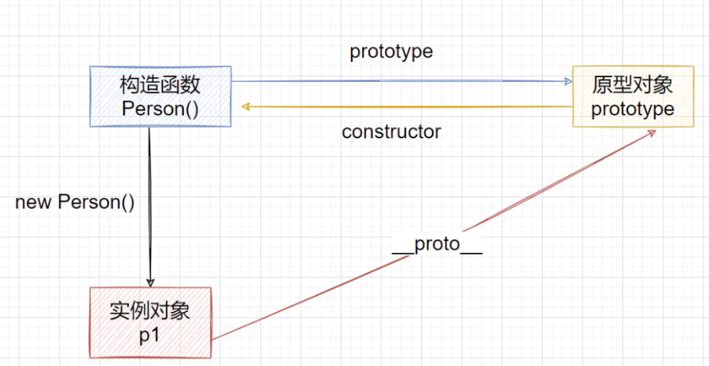

1. 构造函数.prototype      ==>      指向了原型对象
2. 原型对象.constructor   ==>      指回了构造函数
3. 实例.`__proto__`           ==>      指向了原型对象

构造函数和原型对象是相互指向的， 实例通过`__proto__` 可以访问原型对象。

```js
function Person(name){
  this.name = name
}
const p = new Person()

// 1. 实例对象隐式原型 指向 构造函数的显示原型
console.log(p.__proto__ === Person.prototype)

// 2. Person.prototype也是一个对象， 所以，它也有__proto__ 属性

console.log(Person.prototype.__proto__ === Object.prototype)
// 以下两个都指向 Object 的原型对象
console.log(Person.prototype.__proto__)
console.log(Object.prototype)

// 3. Object.prototype 原型对象的__proto__最终指向null
Object.prototype.__proto__ === null
```


### 3.5 原型链 🔥🔥🔥

> 原型链： (背下来)
>
> 1. 每个对象通过`__proto__`属性都能访问到它的原型对象，原型对象也有它的原型对象。
> 2. 当访问一个对象的属性或方法时，先在自身中寻找
> 3. 如果没有，就会沿着`__proto__`这条链向上查找，一直找到最顶层Object.prototype为止.

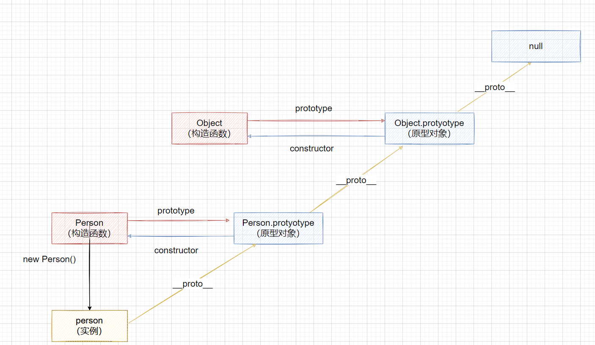

#### Code

```js
// Person.prototype也是一个对象， 所以，它也有__proto__ 属性
console.log(Person.prototype.__proto__ === Object.prototype)
// 都指向Object的原型
console.log(Person.prototype.__proto__)
console.log(Object.prototype)
// 正常的原型链都会终止于 Object 的原型对象 
// Object 原型的原型是 null
Object.prototype.__proto__ === null
```

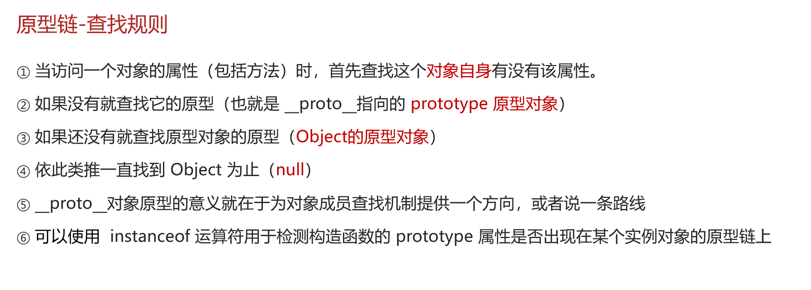

### 3.6 instanceof

```js
// instanceof 运算符
// 用于检测构造函数的 prototype 属性是否出现在某个实例对象的原型链上

// 语法
// 实例 instanceof 构造函数

// 理解： 检测构造函数的原型， 是否出现在某个实例的原型链上。
// ==> 实现原理就是只要右边变量的 prototype 在左边变量的原型链上即可

// 定义构造函数
function C(){} 
function D(){} 
const o = new C()
o instanceof C; // true，o.__proto__ === C.prototype
o instanceof D; // false，因为 D.prototype 不在 o 的原型链上

function Person() {} // 构造函数
const ldh = new Person()
// console.log(ldh.__proto__ === Person.prototype)
// console.log(Person.prototype.__proto__ === Object.prototype)
console.log(ldh instanceof Person)
console.log(ldh instanceof Object)
console.log(ldh instanceof Array)
console.log([1, 2, 3] instanceof Array)
console.log(Array instanceof Object)

```

## 4. 继承

### 4.1 原型链继承

- 不叫原型继承。叫原型链继承。！ Error

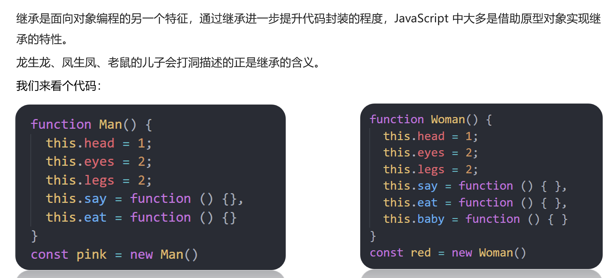

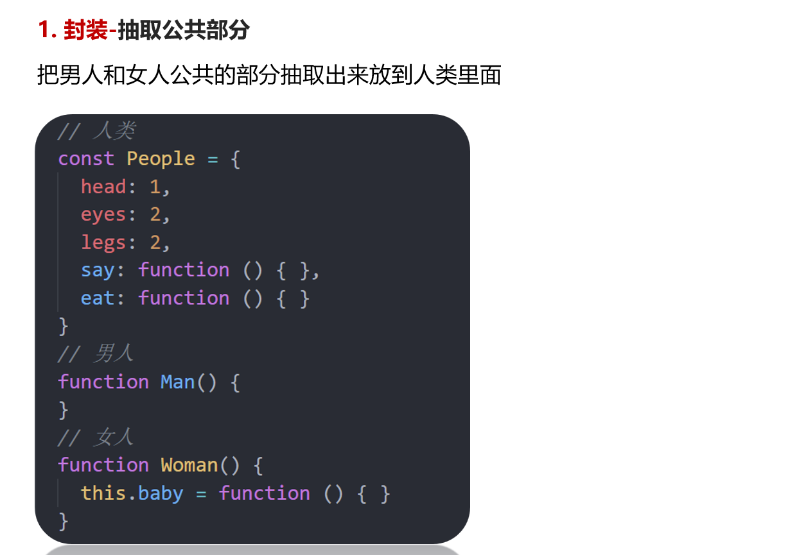

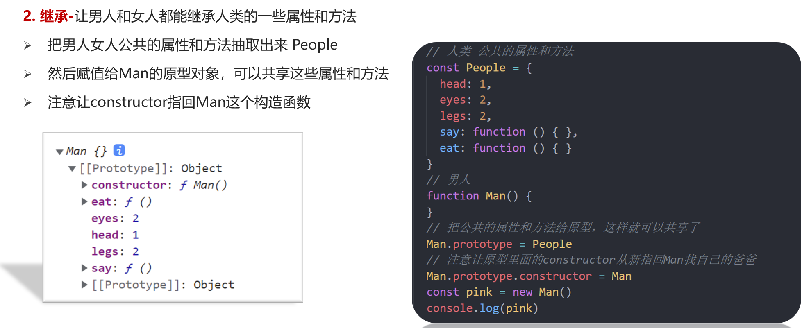

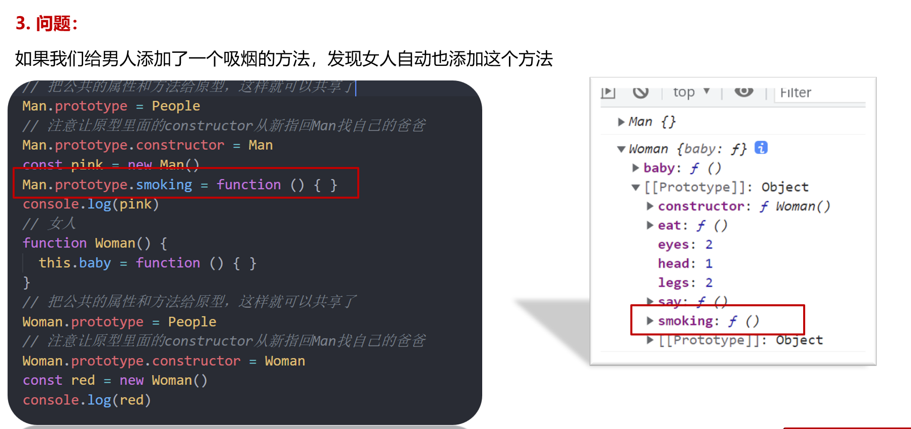

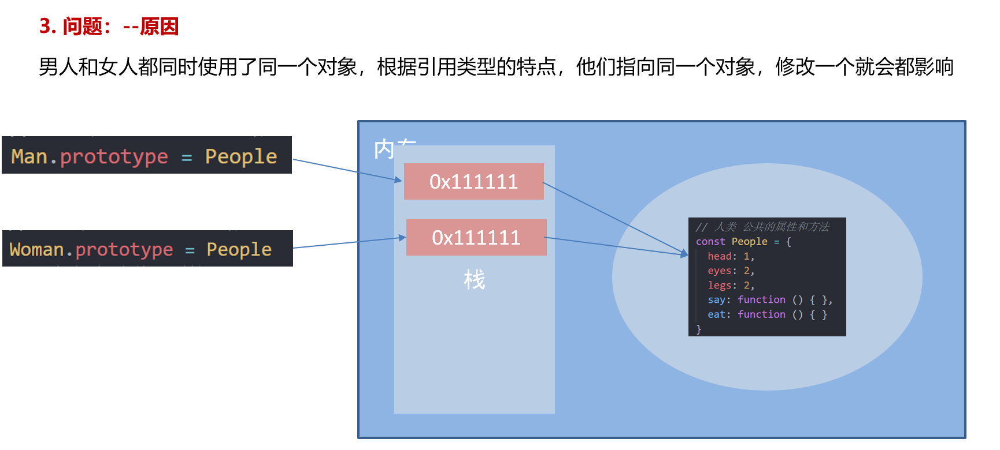

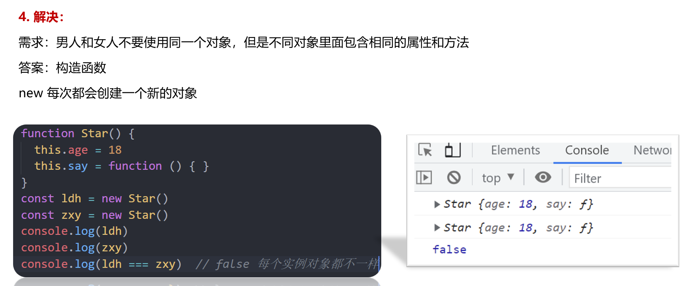

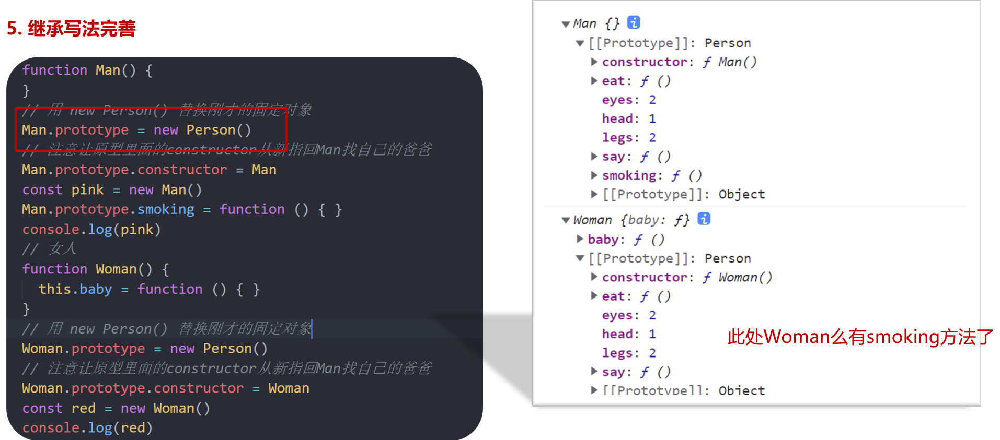

```js
   // 继续抽取   公共的部分放到原型上
    // const Person1 = {
    //   eyes: 2,
    //   head: 1
    // }
    // const Person2 = {
    //   eyes: 2,
    //   head: 1
    // }
    // 构造函数  new 出来的对象 结构一样，但是对象不一样
    function Person() {
      this.eyes = 2
      this.head = 1
    }
    // console.log(new Person)
    // 女人  构造函数   继承  想要 继承 Person
    function Woman() {

    }
    // Woman 通过原型来继承 Person
    // 父构造函数（父类）   子构造函数（子类）
    // 子类的原型 =  new 父类  
    Woman.prototype = new Person()   // {eyes: 2, head: 1} 
    // 指回原来的构造函数
    Woman.prototype.constructor = Woman

    // 给女人添加一个方法  生孩子
    Woman.prototype.baby = function () {
      console.log('宝贝')
    }
    const red = new Woman()
    console.log(red)
    // console.log(Woman.prototype)
    // 男人 构造函数  继承  想要 继承 Person
    function Man() {

    }
    // 通过 原型继承 Person
    Man.prototype = new Person()
    Man.prototype.constructor = Man
    const pink = new Man()
    console.log(pink)
```


## 5.Eg.案例

### 效果

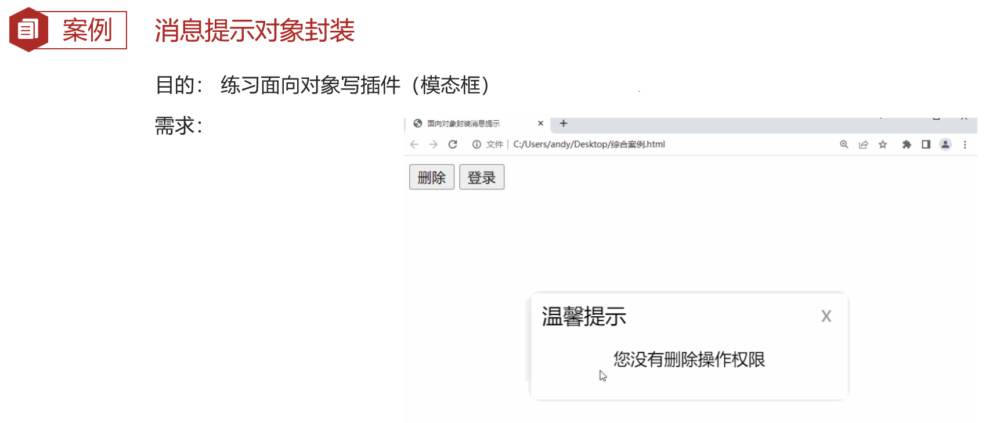

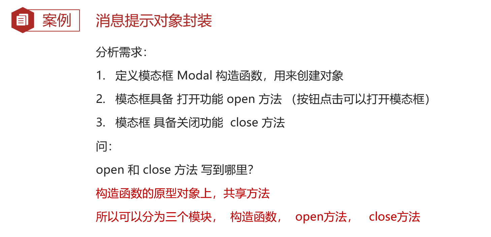

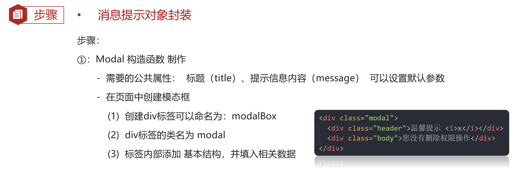

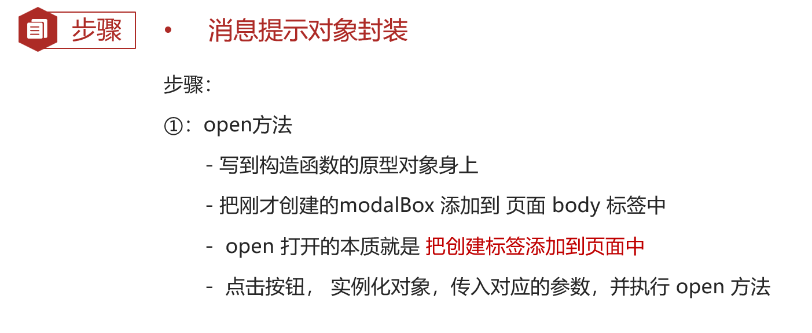

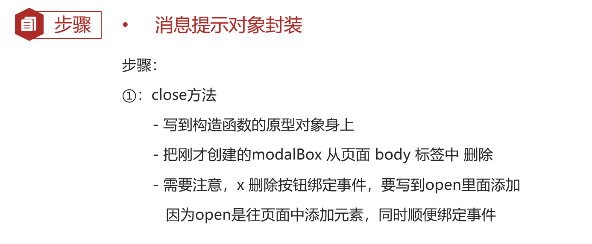

#### Code 

```js
// 1.  模态框的构造函数
function Modal(title = '', message = '') {
  // 公共的属性部分
  this.title = title
  this.message = message
  // 因为盒子是公共的
  // 1. 创建 一定不要忘了加 this 
  this.modalBox = document.createElement('div')
  // 2. 添加类名
  this.modalBox.className = 'modal'
  // 3. 填充内容 更换数据
  this.modalBox.innerHTML = `
        <div class="header">${this.title} <i>x</i></div>
        <div class="body">${this.message}</div>
      `
  // console.log(this.modalBox)
}
// 2. 打开方法 挂载 到 模态框的构造函数原型身上
Modal.prototype.open = function () {
  if (!document.querySelector('.modal')) {
    // 把刚才创建的盒子 modalBox  渲染到 页面中  父元素.appendChild(子元素)
    document.body.appendChild(this.modalBox)
    // 获取 x  调用关闭方法
    this.modalBox.querySelector('i').addEventListener('click', () => {
      // 箭头函数没有this 上一级作用域的this
      // 这个this 指向 m 
      this.close()
    })
  }
}
// 3. 关闭方法 挂载 到 模态框的构造函数原型身上
Modal.prototype.close = function () {
  document.body.removeChild(this.modalBox)
}

// 4. 按钮点击
document.querySelector('#delete').addEventListener('click', () => {
  const m = new Modal('温馨提示', '您没有权限删除')
  // 调用 打开方法
  m.open()
})

// 5. 按钮点击
document.querySelector('#login').addEventListener('click', () => {
  const m = new Modal('友情提示', '您还么有注册账号')
  // 调用 打开方法
  m.open()
})
```

