## Target

1. 能够说出作用域链是什么
2. 能够了解什么是垃圾回收机制
3. 能够说出什么是闭包以及作用
4. 能够写出箭头函数常见的写法
5. 能够完成数组解构并且完成多维数组解构
6. 能够完成对象解构并且完成多级对象解构
7. 能够完成今日综合案例-商品筛选案例

💡🚀🤟👉👇☀️🍉🍍🍇🍓🥕🍭🎖️🎁☘️🍀💯🔆❗🔥🚩

## 1. 作用域

> 作用域 scope : **就是变量与函数的可访问范围，即作用域控制着变量和函数的可见性和生命周期。**

ES6之前，ES作用域只有：

 - **全局作用域** (Global Scope): 中的对象在代码中的任何地方都能访问，其生命周期伴随着页面的生命周期。
 - **函数作用域** (Local Scope) :  JS的作用域是通过函数来定义的,  在一个函数中定义的变量只对这个函数内部可见, 称为函数(局部)作用域

ES6新增

 - **块级作用域：块级作用域内声明的变量不影响外面的变量**

### 1.1 全局作用域

> 直接写在script标签中的js代码，在全局作用域

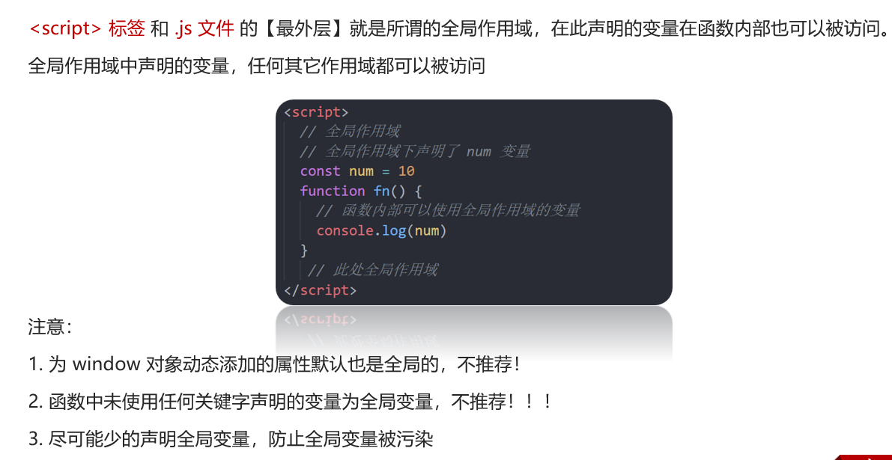

### 1.2 局部作用域

局部作用域分为函数作用域和块级作用域(ES6)。

#### 函数作用域

> 在函数内部声明的变量只能在函数内部被访问，外部无法直接访问。

```js
function getSum() {
    // 函数内部定义的变量只对函数内部可见, 叫函数作用域(局部)
    const num = 10
}
console.log(num) // Error 函数外部不能访问局部作用域.
```

1.  **函数内部声明的变量， 在函数外部无法被访问**
2. 函数的形参也是函数的局部变量
3. 不同函数内部声明的变量,  无法相互访问
4. 函数执行完毕后, 函数内部的变量实际被清空了(垃圾回收)

#### 块级作用域

> ES6,  `{}` 包裹起来的代码称为代码块, **使用 let 或 const 声明的变量**, 在 `{}` 会产生块级作用域

```js
for (let i = 0; i <= 6; i++) {
    console.log(i)
}
console.log(i) // Error
```

1. var声明不会产生块级作用域
2. **只有let const 才会产生块级作用域** 
3. 不同代码块之间的变量无法相互访问


> 局部作用域声明的变量 外部不能使用

### 1.3 作用域链

#### 思考

```js
// 全局作用域
let a = 1 
let b = 1
function f(){
    // 局部作用域
    let a = 1
    function g(){
         // 局部作用域
        a = 2
        console.log(a)
    }
    g() // 调用g
}
f() // 调用f
```


#### 作用域链

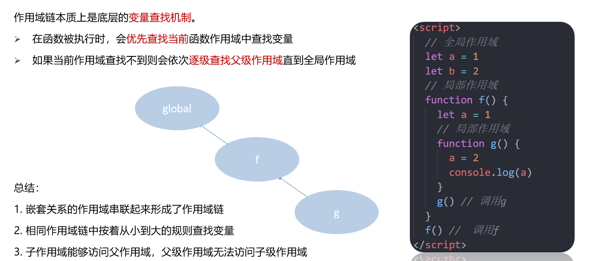

#### 小结

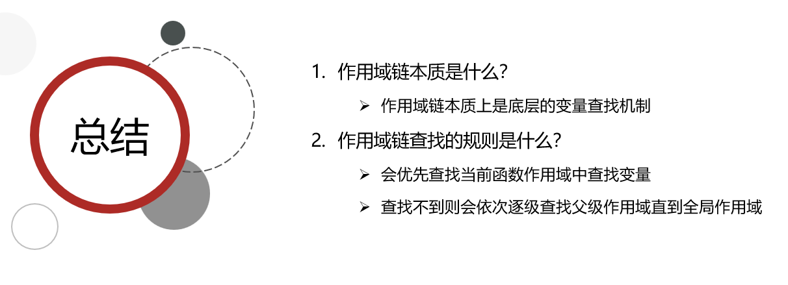


```js
var x=10;
function fn() {
    console.log(x);
}
function show(f) {
    var x=20;
    f();
}
show(fn);
// 函数的作用域在定义的时候就产生了
```

- 由于fn是最外层的函数所以没有闭包产生，应该用函数的作用域来解决，函数的作用域是再定义函数的时候就已经产生了，并不是代码执行的时候产生，所以即便把fn作为参数传到了show()函数里面，但是执行代码时使用的作用域是定义函数时候的，fn是在最外层定义的，所以当自己内部找不到x的时候会去window上面找。

## 2. 垃圾回收

### 2.1 什么是垃圾回收机制

垃圾回收机制(Garbage Collection) 简称 GC

JS中内存的分配和闲置资源的回收都是自动完成的，内存在不使用的时候会被垃圾回收程序自动回收。 

```js
function fn(){
    const num = 1
}
fn()
```


基本思路很简单：

确定哪个变量不会再使用，然后释放它占用的内存。这个过程是周期性的，即垃圾回收程序每隔一定时间（或者说在代码执行过程中某个预定的收集时间）就会自动运行。


#### 内存泄漏

正因为垃圾回收机制的存在，许多人认为JS不用太关心内存管理的问题

但如果不了解JS的内存管理机制，我们同样非常容易成内存泄漏（内存无法被回收）的情况.

> 内存泄漏 : 不再用到的内存，没有及时释放


#### 内存的生命周期

1.内存分配：当我们声明变量、函数、对象的时候，系统会自动为他们分配内存

2.内存使用：即读写内存，也就是使用变量、函数等

3.内存回收：使用完毕，由垃圾回收自动回收不再使用的内存

**说明**

1. 全局变量一般不会回收(关闭页面回收)； 

2. 一般情况下局部变量的值, 不用了, 会被自动回收掉

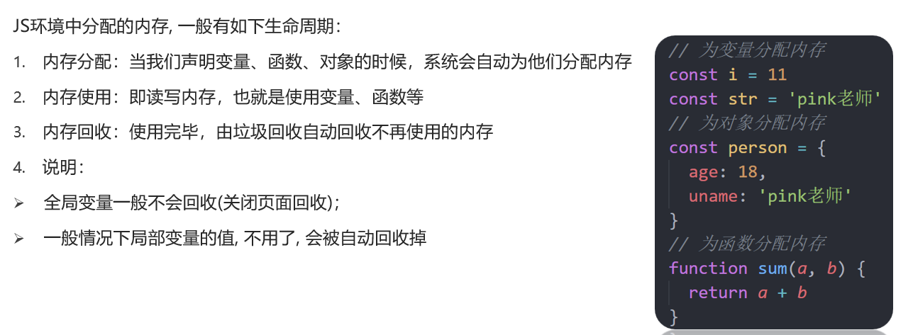

#### 小结

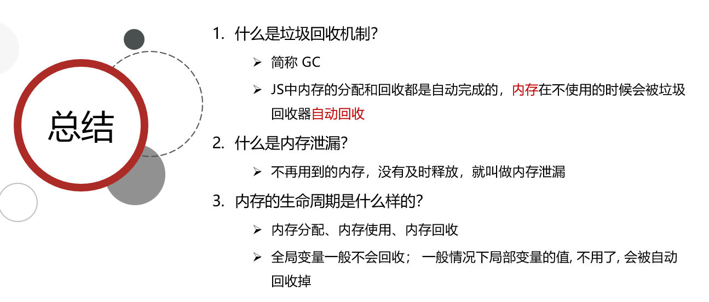


### 2.2 垃圾回收策略

> `JavaScript` 垃圾回收机制的原理说白了也就是定期找出那些不再用到的内存（变量），然后释放其内存

可能大家还会好奇为什么不是实时的找出无用内存并释放呢？其实很简单，实时开销太大了

我们都可以 Get 到这之中的重点，那就是怎样找出所谓的垃圾？

这个流程就涉及到了一些算法策略，有很多种方式，我们简单介绍两个最常见的

- 引用计数算法 (淘汰)

- 标记清除算法 

#### 2.2.1 引用计数法

> 其思路是对每个值都记录它被引用的次数。

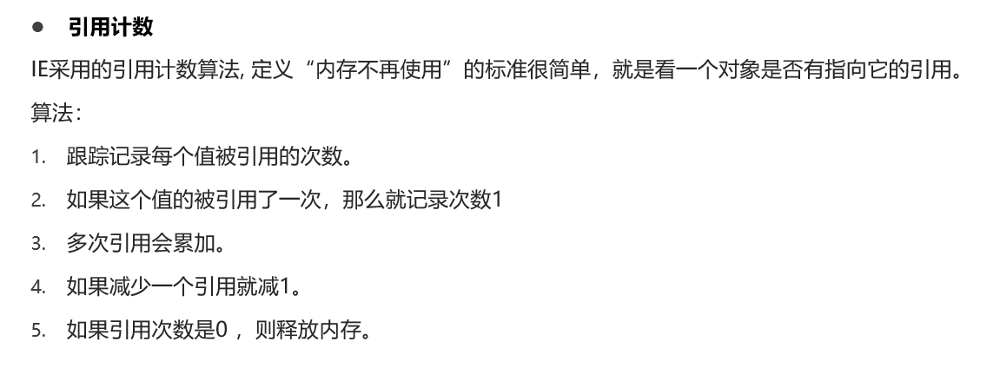

```js
const person = {
      age: 18,
      name: 'pink老师'
}
const p = person
person = 1
p = null
```

由上面可以看出，引用计数算法是个简单有效的算法。

但它却存在一个致命的问题：**循环引用**

如果两个对象相互引用，尽管他们已不再使用，垃圾回收器不会进行回收，导致内存泄露。 

```js
function problem () {
    let oA = {}
    let oB = {}
    oA.c = oB  //  oB被oA引用
    oB.d = oA  //  oA又被oB引用
}
problem()
```


#### 2.2.2 标记清除法

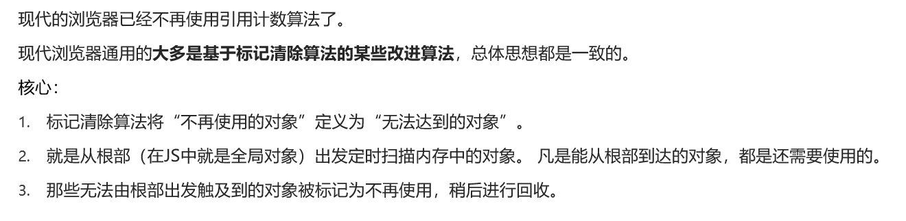

**主要将GC的垃圾回收过程分为两个阶段**

- 标记阶段：把所有活动对象做上标记。
- 清除阶段：把没有标记（也就是非活动对象）销毁。

##### 标记阶段

**根**可以理解成我们的全局作用域，GC从全局作用域的变量，沿作用域逐层往里遍历（对，是深度遍历），当遍历到堆中对象时，说明该对象被引用着，则打上一个标记，继续递归遍历（因为肯定存在堆中对象引用另一个堆中对象），直到遍历到最后一个（最深的一层作用域）节点。

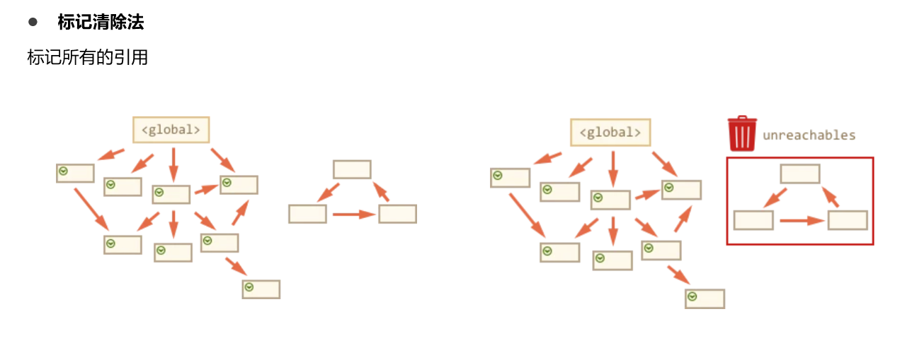

##### 清除阶段

> **回收没有打上标记的对象**。


## 3. 闭包

### 3.1 定义

#### 1. 高程3 / 4 

> Closures are functions that have access to variables from another function’s scope.

- 3: **闭包是指有权访问另一个函数作用域中的变量的函数。**

- 4: 闭包指的是那些引用了另一个函数作用域中变量的函数，通常是在嵌套函数中实现的。

#### 2. MDN

**闭包**（closure）是一个函数以及其捆绑的周边环境状态的引用的组合。换而言之，闭包让开发者可以从内部函数访问外部函数的作用域。在 JavaScript 中，闭包会随着函数的创建而被同时创建。

#### 3. 极客时间

**内部函数引用外部函数的变量的集合**


> **闭包 = 内层函数 + 外层函数的变量**

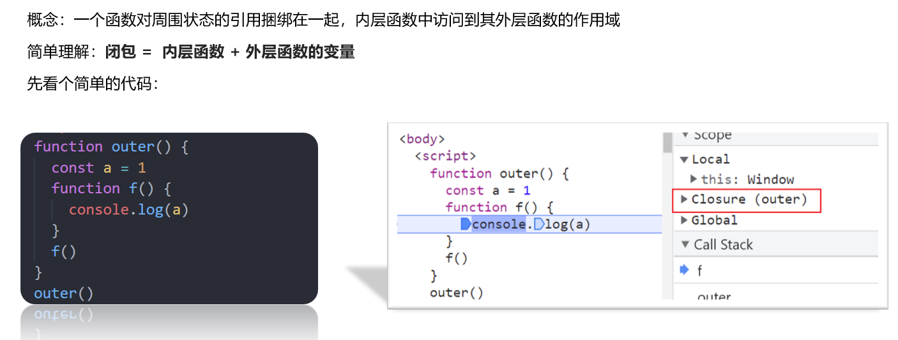

```js
function outer() {
    let a = 10
    function fn() {
        console.log(a)  // breakpoint
    }
    fn()
}
outer()
```


在 JavaScript 中，内部函数总是可以访问其外部函数中声明的变量，当通过调用一个外部函数返回一个内部函数后，即使该外部函数已经执行结束了，但是内部函数引用外部函数的变量依然保存在内存中，我们就把这些变量的集合称为闭包。比如外部函数是 foo，那么这些变量的集合就称为 foo 函数的闭包。

### 3.2 闭包的作用

> 外部可以访问函数内部的变量

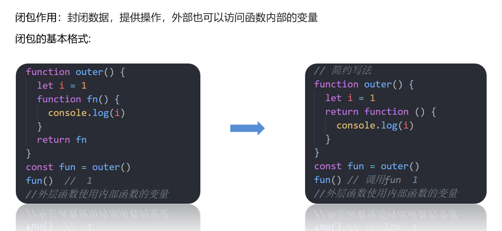

### 3.3 闭包的应用

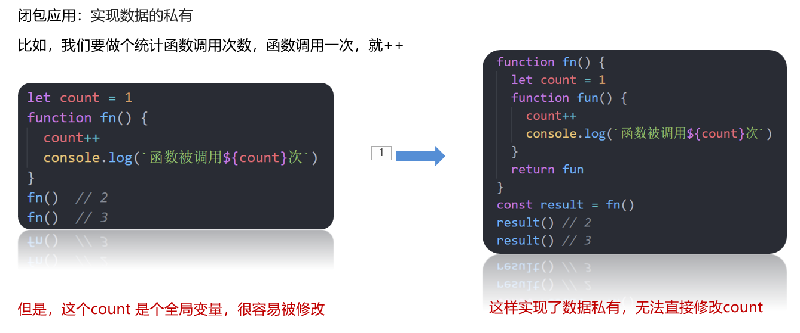

#### Code

```js
let i = 0
function fn() {
  i++
  console.log(`函数被调用了${i}次`)
}
fn()

//==================
function count() {
  let i = 0
  function fn() {
    i++
    console.log(`函数被调用了${i}次`)
  }
  return fn  
}
const fun = count()
```

### 3.4 总结

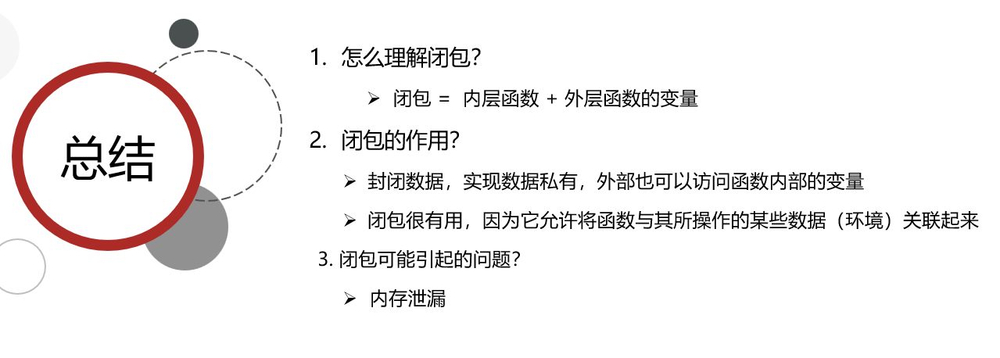


## 4. 变量提升(Hoisting)

### 4.1 变量提升

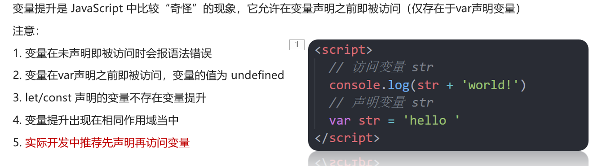

#### Code 

```js
console.log(num + '件')
var num = 10
// var num
// console.log(num + '件')
// num = 10
// console.log(num)

function fn() {
  // 只提升到当前作用域的最前
  console.log(num)
  var num = 10
  }
fn()
```


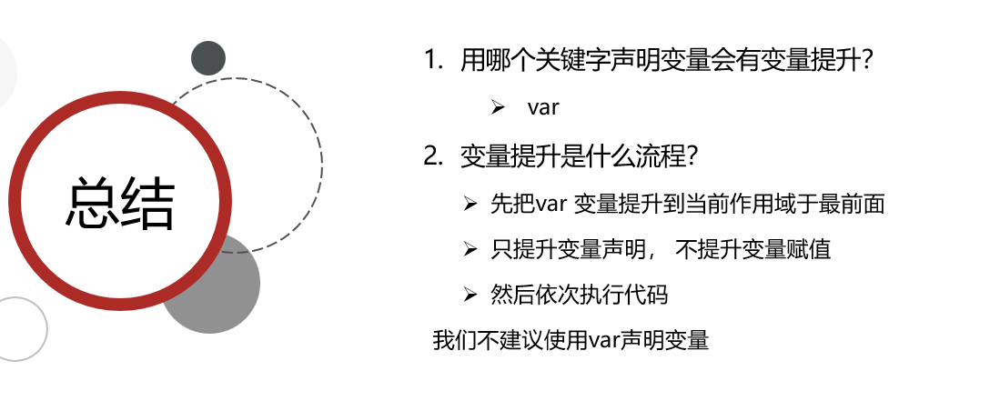

### 4.2 函数提升

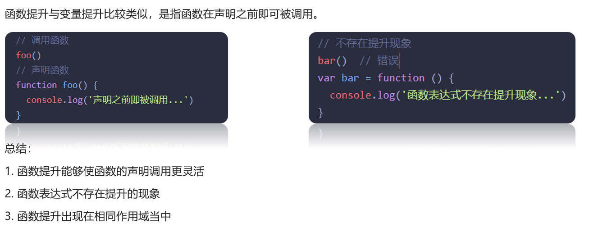

```js
// 1. 会把所有函数声明提升到当前作用域的最前面
// 2. 只提升函数声明，不提升函数调用
fn()
function fn() {
  console.log('函数提升')
}
fun()
var fun = function () {
  console.log('函数表达式')
}
```

### 4.3 提升优先级

```js
console.log(c)
var c;
function c(){
    console.log(c);
    var c = 3;
}
c(2);
```

```js
var c = 1;
function c(){
    console.log(c);
    var c = 3;
}
console.log(c);
c(2);
```

- 在函数与变量之间，函数首先会被提升，然后才是变量。

> 函数提升优先级比变量提升要高，且不会被**同名的变量声明覆盖**，但是会被变量赋值覆盖。
>
> 当二者同时存在时，会先指向函数声明。

## 5. 函数参数

### 5.1 动态参数

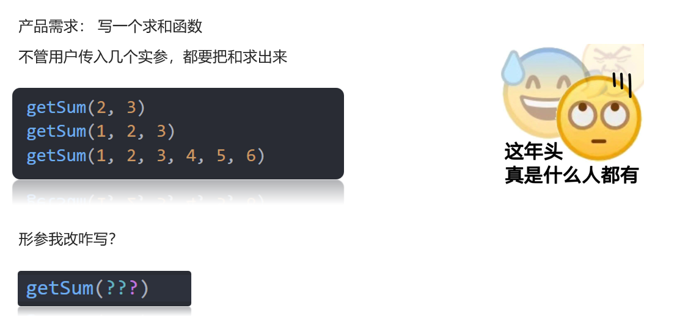


#### Code

```js
function getSum() {
  // arguments 动态参数 只存在于 函数里面
  // 是伪数组 里面存储的是传递过来的实参
  // console.log(arguments)  [2,3,4]
  let sum = 0
  for (let i = 0; i < arguments.length; i++) {
    sum += arguments[i]
  }
  console.log(sum)
}
getSum(2, 3, 4)
getSum(1, 2, 3, 4, 2, 2, 3, 4)
```


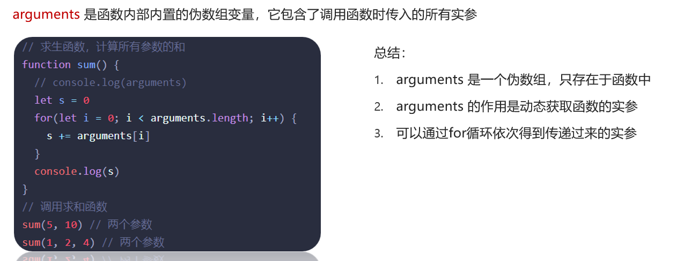

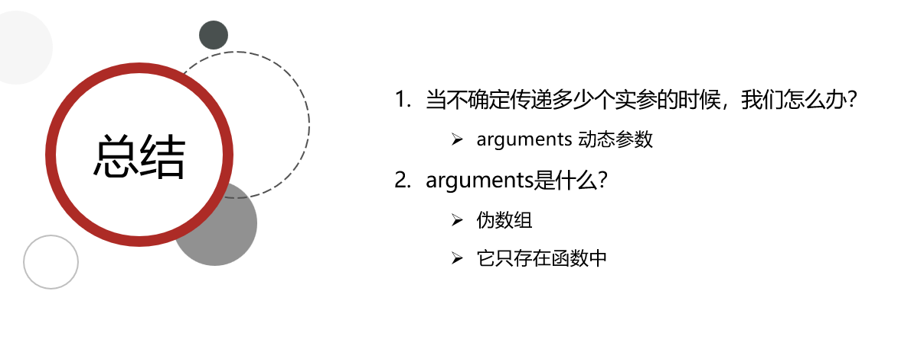

### 5.2 rest参数  ES6

> ES6 引入 rest 参数（形式为`...变量名`），用于获取函数的多余参数，这样就不需要使用`arguments`对象了。rest 参数搭配的变量是一个数组，该变量将多余的参数放入数组中。

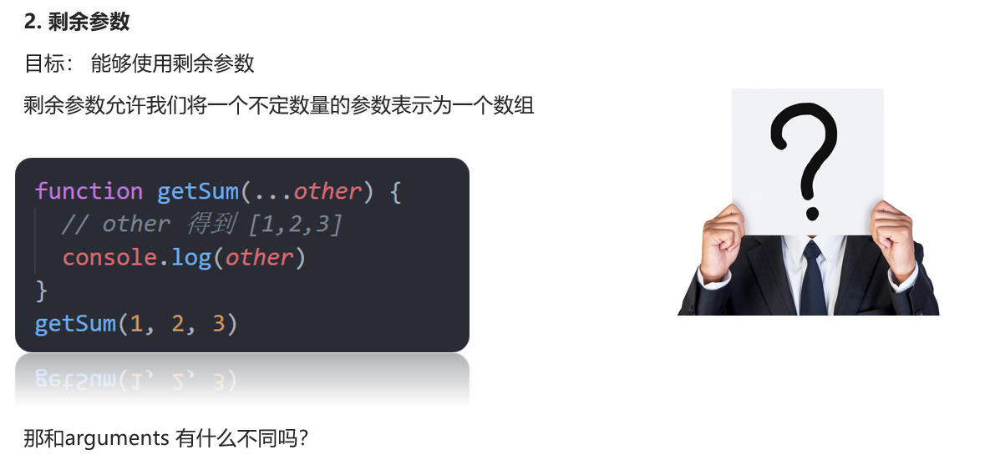

#### Code

```js
function getSum(...arr) {
  console.log(arr)  // 使用的时候不需要写 ...
}
function getSum(a, b, ...arr) {
  console.log(arr)  
}
getSum(2, 3)
getSum(1, 2, 3, 4, 5)
```


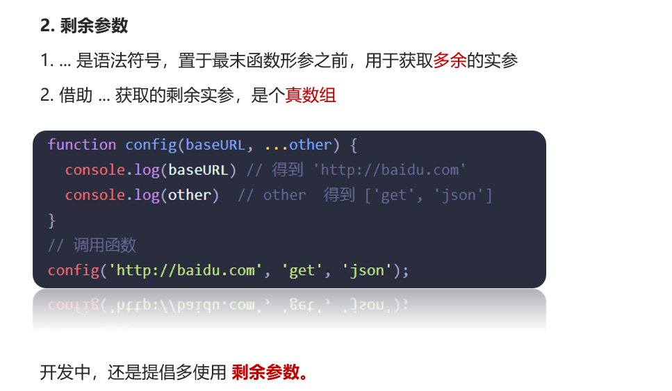

#### 小结

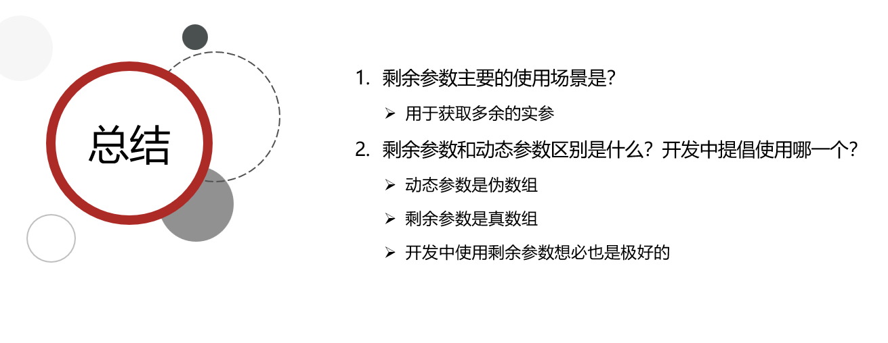

### 5.3 扩展运算符

>  扩展运算符（spread）是三个点（`...`）。它好比 rest 参数的逆运算，将一个数组转为用逗号分隔的参数序列。

```js
// 扩展运算符(...arr) 将一个数组进行展开
const arr = [1, 5, 3, 8, 2]
console.log(...arr)
// 注意: 不会修改原数组
```


#### 应用场景

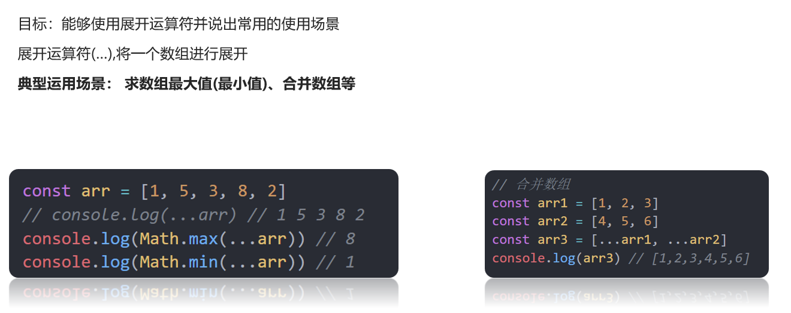

#### 与rest区别

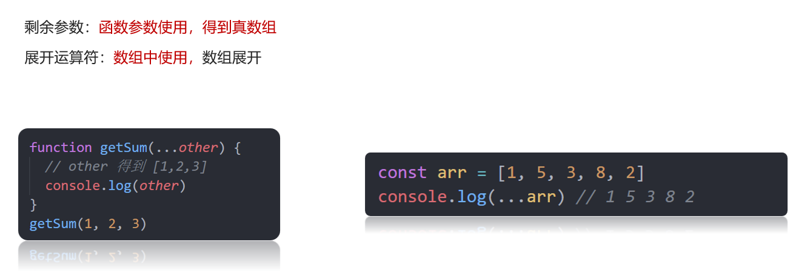

#### 小结

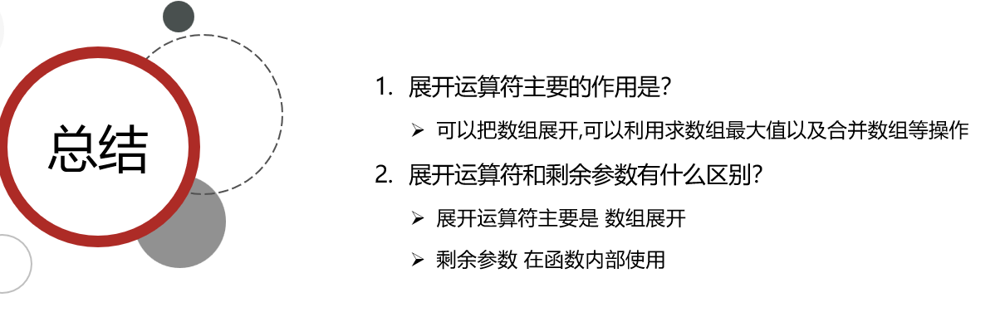

## 6. 箭头函数

> ES6 允许使用“箭头”（`=>`）定义函数。 箭头函数

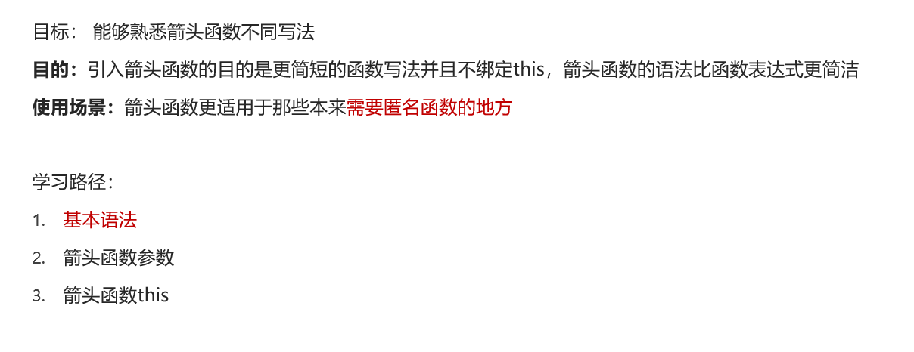

### 6.1 箭头函数

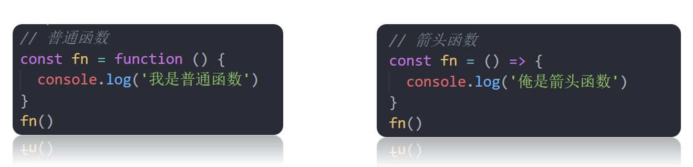

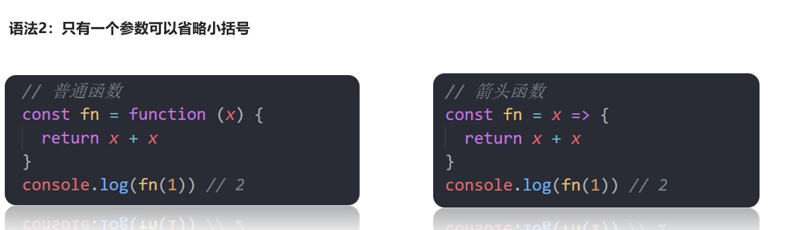

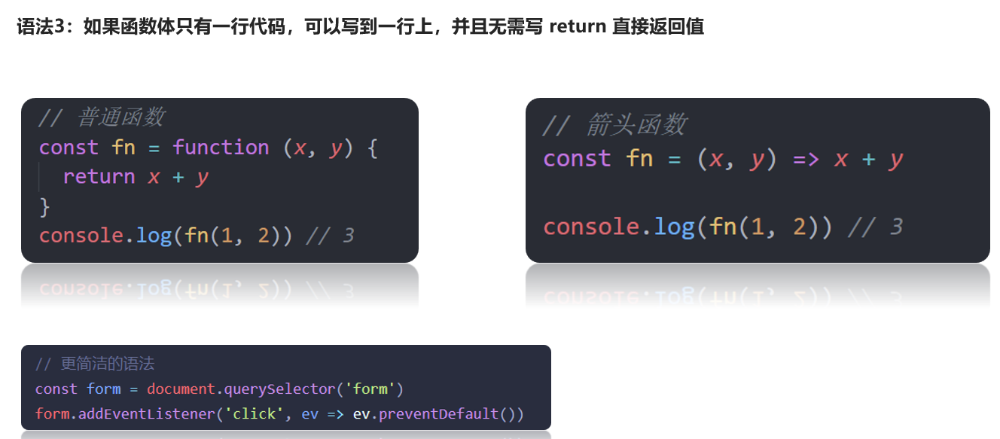


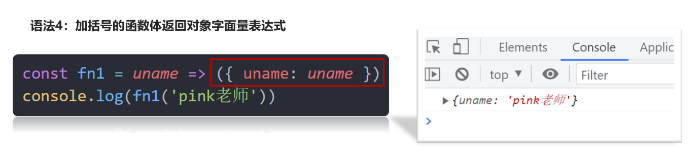

#### Code

```js
// const fn = function () {
//   console.log(123)
// }
// 1. 箭头函数 基本语法
const fn1 = () => {
  console.log(123)
}
fn1()
// 传参
const fn2 = (x) => {
  console.log(x)
}
fn2(1)
// 2. 只有一个形参的时候，可以省略小括号
const fn3 = x => {
  console.log(x)
}
fn3(1)
// 3. 只有一行代码的时候，我们可以省略大括号
const fn4 = x => console.log(x)
fn4(6)
// 4. 只有一行代码的时候，可以省略return
const fn5 = x => x + x
console.log(fn5(1))
// 5. 箭头函数可以直接返回一个对象, 但必须在对象外面加上括号
const fn6 = (name) => ({ user_name: name })
console.log(fn6('刘德华'))
```

### 6.2 箭头函数参数

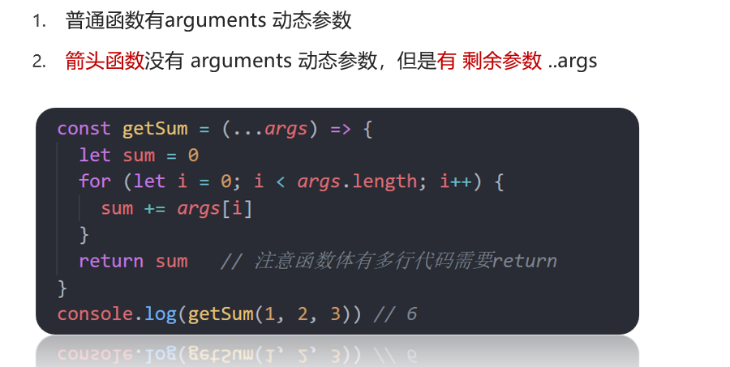

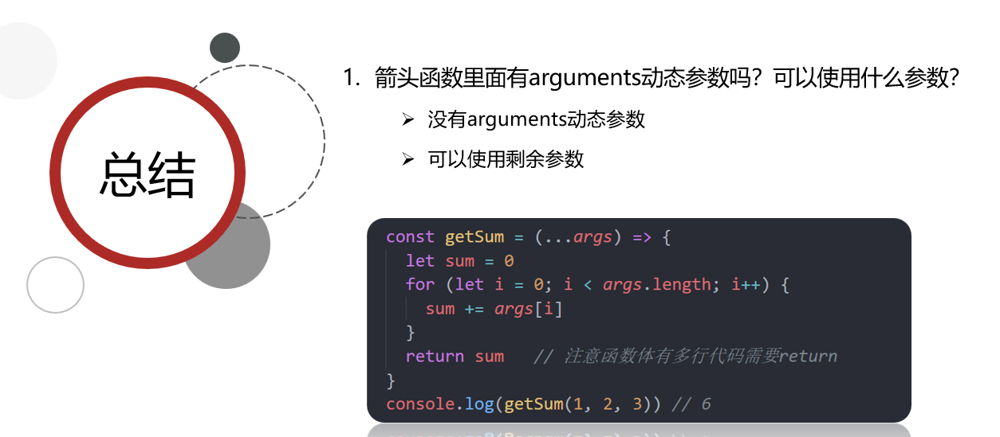

### 6.3 箭头函数this

#### Code

```js
// 以前this的指向：  谁调用的这个函数，this 就指向谁
// console.log(this)  // window
// 普通函数
function fn() {
  console.log(this)  // window
}
window.fn()
// 对象方法里面的this
const obj = {
  name: 'andy',
  sayHi: function () {
    console.log(this)  // obj
  }
}
obj.sayHi()

// 2. 箭头函数的this  是上一层作用域的this 指向
const fn = () => {
  console.log(this)  // window
}
fn()
// 对象方法箭头函数 this
const obj = {
  uname: 'pink老师',
  sayHi: () => {
    console.log(this)  // this 指向谁？
  }
}
obj.sayHi()
```


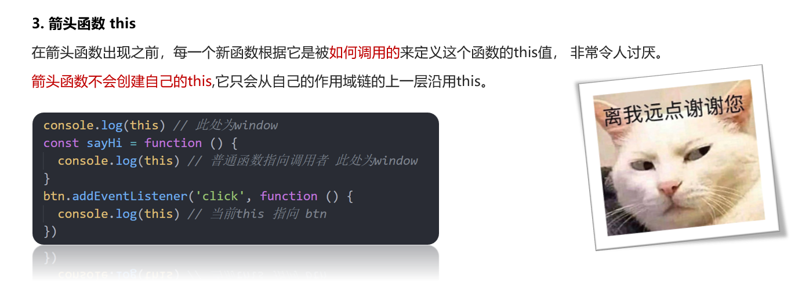

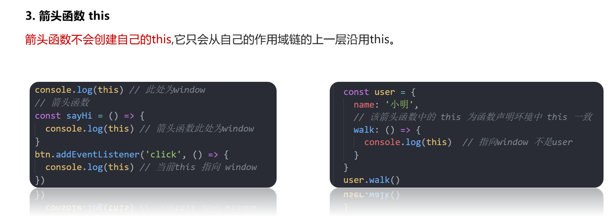

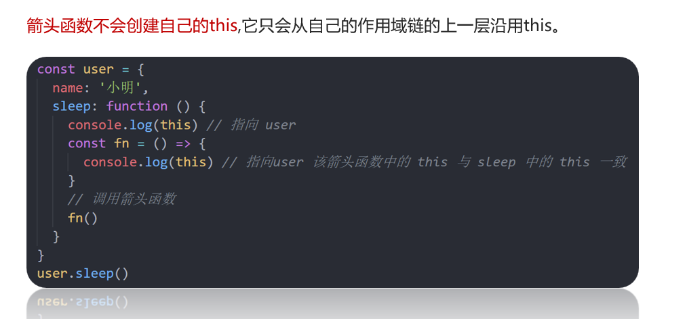

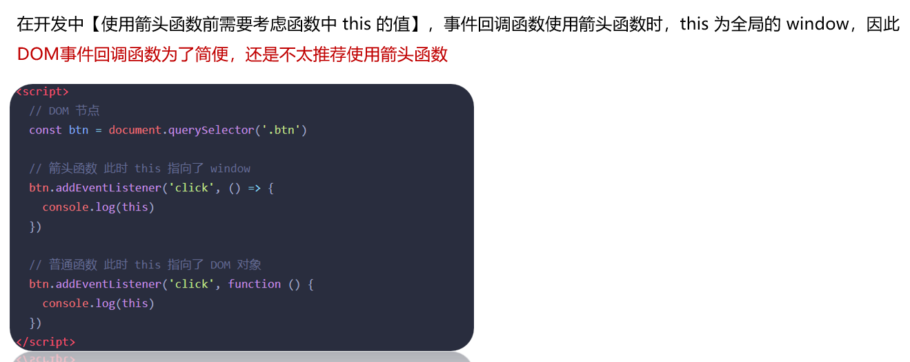

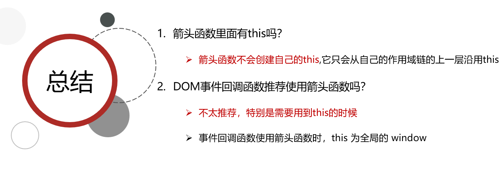
