## Target

1. 能够完成数组解构并且完成多维数组解构
2. 能够完成对象解构并且完成多级对象解构
3. 能够完成今日综合案例-商品筛选案例
4. 能够声明一个构造函数，并创建一个对象
5. 能够说出new实例化执行4个过程
6. 能够说出Object获得对象所有属性值和属性的方法
7. 能够使用reduce、find、every等数组方法，并学会查阅文档

💡🚀🤟👉👇☀️🍉🍍🍇🍓🥕🍭🎖️🎁☘️🍀💯🔆❗🔥🚩


## 1. 解构赋值

ES6 允许按照一定模式，从数组和对象中提取值，对变量进行赋值，这被称为解构（Destructuring）。


> 解构赋值是一种快速为变量赋值的简洁语法，本质上仍然是为变量赋值。

### 1.1 数组解构

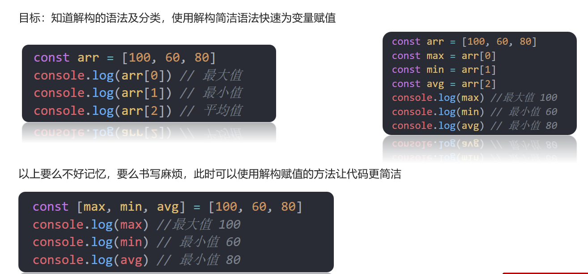

#### 1.1.1 基本语法

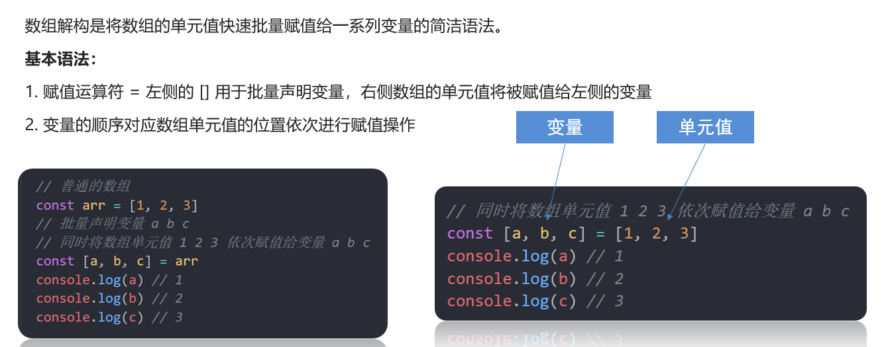

#### 1.1.2 交换两个变量

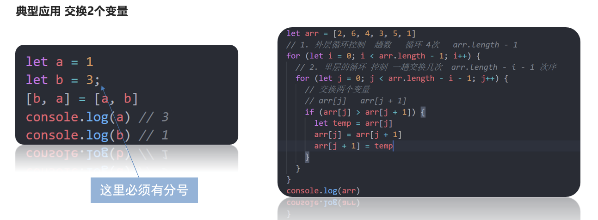


#### 1.1.3 加分号的情况

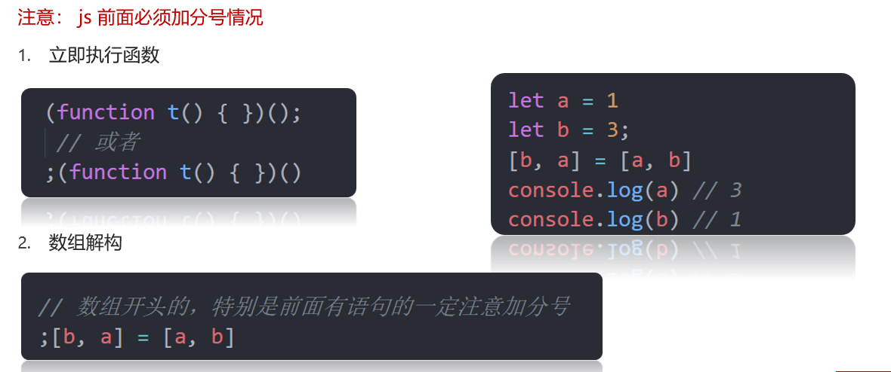

##### 小结

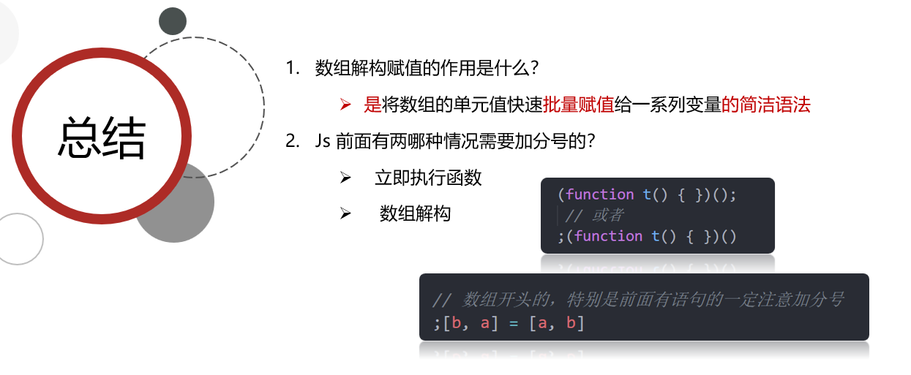

#### 1.1.4 练习

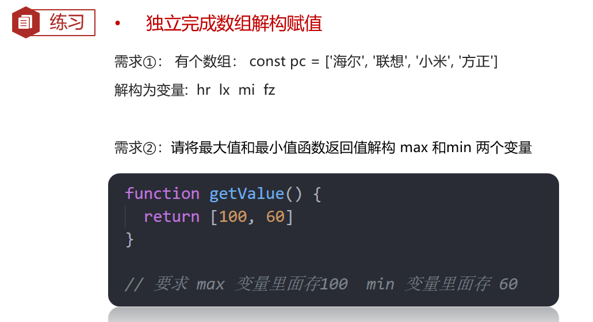

#### Code

```js
const pc = ['海尔', '联想', '小米', '方正']
const [hr, lx, mi, fz] = ['海尔', '联想', '小米', '方正']
console.log(hr,lx,mi,fz)

// 请将最大值和最小值函数返回值解构 max 和 min 两个变量
function getValue() {
  return [100, 60]
}
const [max, min] = getValue()
console.log(max)
console.log(min)
```

#### 1.1.5 注意

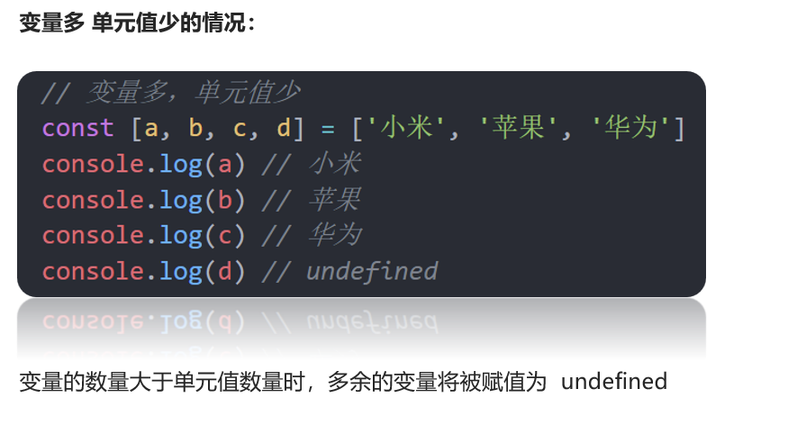

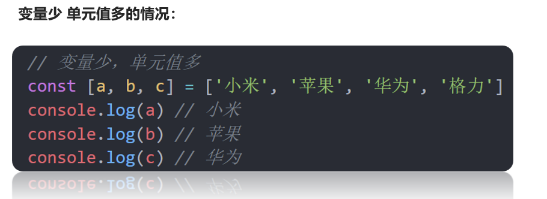

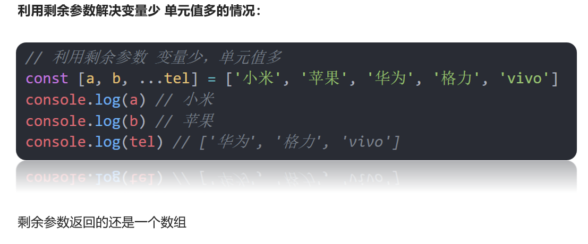

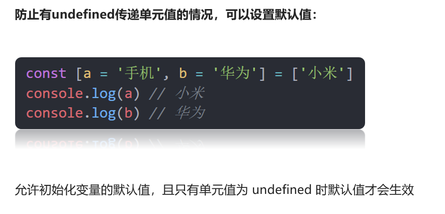

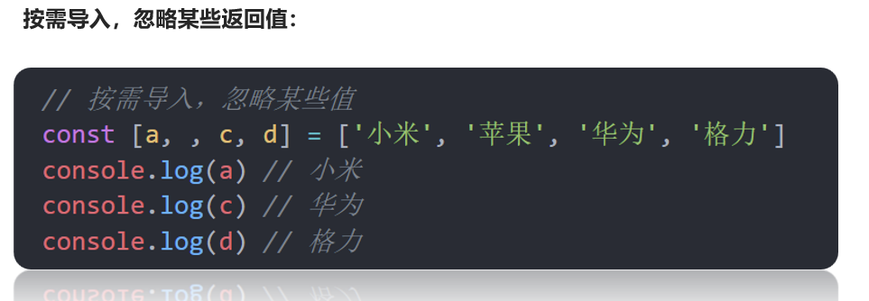

#### Code 

```js
// 1. 变量多， 单元值少 ， undefined
const [a, b, c, d] = [1, 2, 3]
console.log(a) // 1
console.log(b) // 2
console.log(c) // 3
console.log(d) // undefined
// 2. 变量少， 单元值多
const [a, b] = [1, 2, 3]
console.log(a) // 1
console.log(b) // 2
// 3.  剩余参数 变量少， 单元值多
const [a, b, ...c] = [1, 2, 3, 4]
console.log(a) // 1
console.log(b) // 2
console.log(c) // [3, 4]  真数组

// 4. 解构赋值允许指定默认值 
const [a = 0, b = 0] = [1, 2]
console.log(a)
console.log(b)
const [a = 0, b = 0] = []  
const [a = 0, b = 1] = ['undefined', undefined]
console.log(a) // undefined string
console.log(b) // 1
// 5.  按照对应位置，对变量赋值。
const [a, b, , d] = [1, 2, 3, 4]
console.log(a) // 1
console.log(b) // 2
console.log(d) // 4
```


#### 1.1.6 多维数组

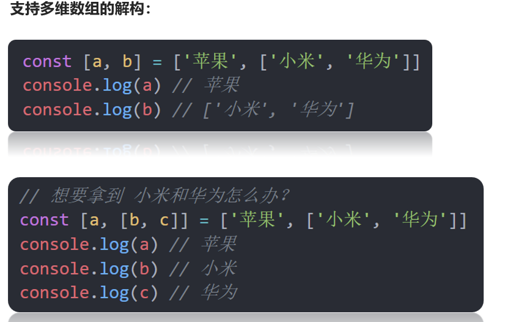

#### Code

```js
// 多维数组: 数组嵌套数组
const arr = [1, 2, [3, 4]]
console.log(arr[0])  // 1
console.log(arr[1])  // 2
console.log(arr[2])  // [3,4]
console.log(arr[2][0])  // 3

// 多维数组解构
const arr = [1, 2, [3, 4]]
const [a, b, c] = [1, 2, [3, 4]]
console.log(a) // 1
console.log(b) // 2
console.log(c) // [3,4] 

const [a, b, [c, d]] = [1, 2, [3, 4]]
console.log(a) // 1
console.log(b) // 2
console.log(c) // 3
console.log(d) // 4
```


##### 小结

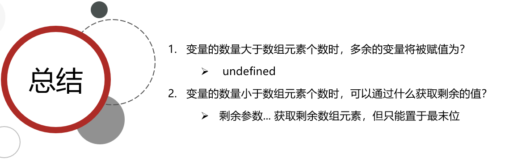

### 1.2 对象解构

#### 1.2.1 基本语法

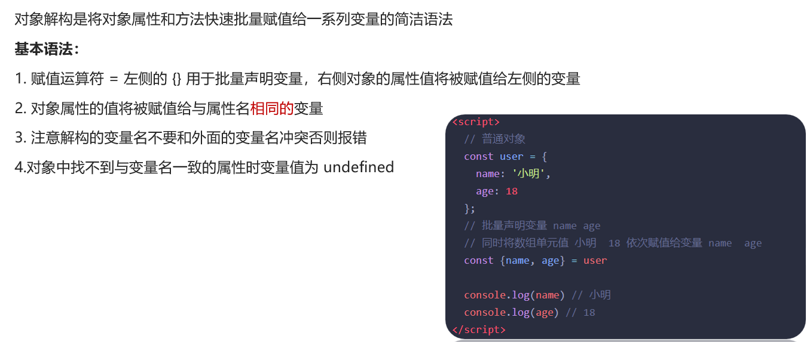

#### 1.2.2 给属性重新命名

> 对象的解构赋值的内部机制，是先找到同名属性，然后再赋给对应的变量。

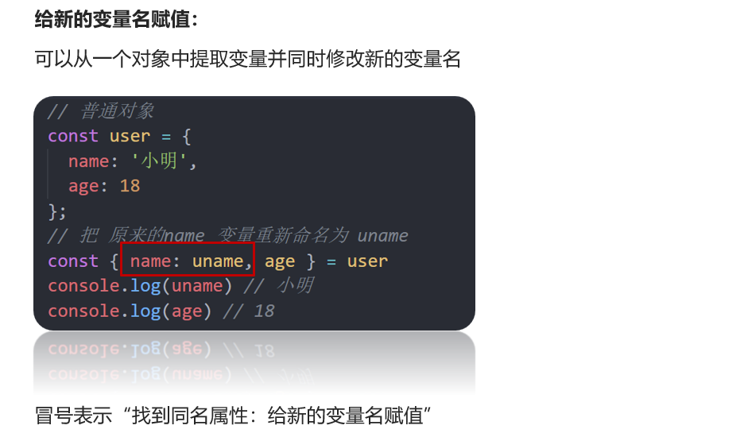

#### 1.2.3 数组对象解构

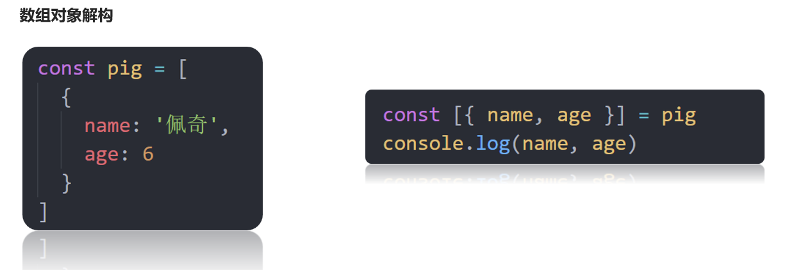

```js
const pig = [
  {
    uname: '佩奇',
    age: 6
  }
]
const [{ uname, age }] = pig
console.log(uname)
console.log(age)
```

#### Eg.练习

- 8分钟, 写完的同学回忆前面的知识.

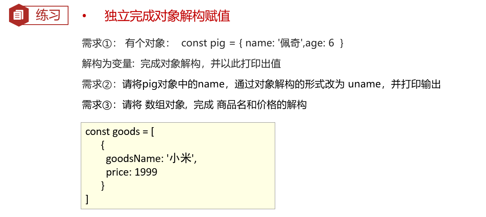

#### 1.2.4 多级对象解构

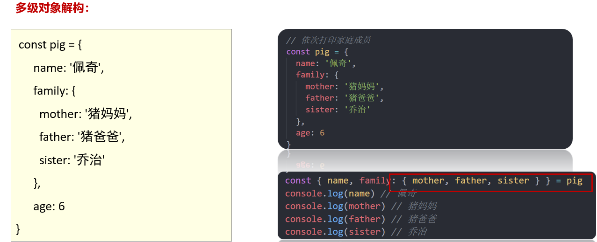

```js
const pig = {
    name: '佩奇',
    family: {
        mother: '猪妈妈',
        father: '猪爸爸',
        sister: '乔治'
    },
    age: 6
}
```

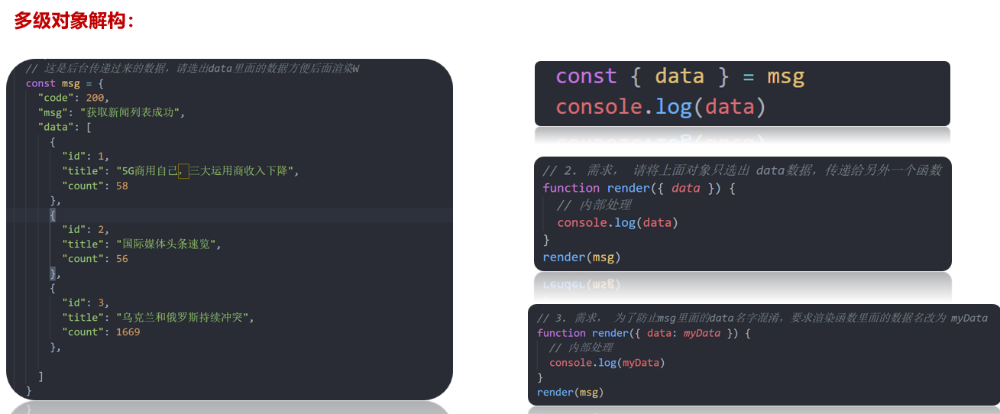

```js
// 1. 这是后台传递过来的数据
const msg = {
    "code": 200,
    "msg": "获取新闻列表成功",
    "data": [
        {
            "id": 1,
            "title": "5G商用自己，三大运用商收入下降",
            "count": 58
        },
        {
            "id": 2,
            "title": "国际媒体头条速览",
            "count": 56
        },
        {
            "id": 3,
            "title": "乌克兰和俄罗斯持续冲突",
            "count": 1669
        },

    ]
}
```

#### 1.2.4 函数的参数解构

```js
// 参数是对象
const pos = {x:10, y: 20}
function move({x:aa, y}) { // pos
  console.log(aa, y)
  
}
move(pos)

// 参数是数组
function add([x, y]){
  return x + y;
}

const res = add([1, 2])
console.log(res)
```

#### 1.2.4 forEach复习

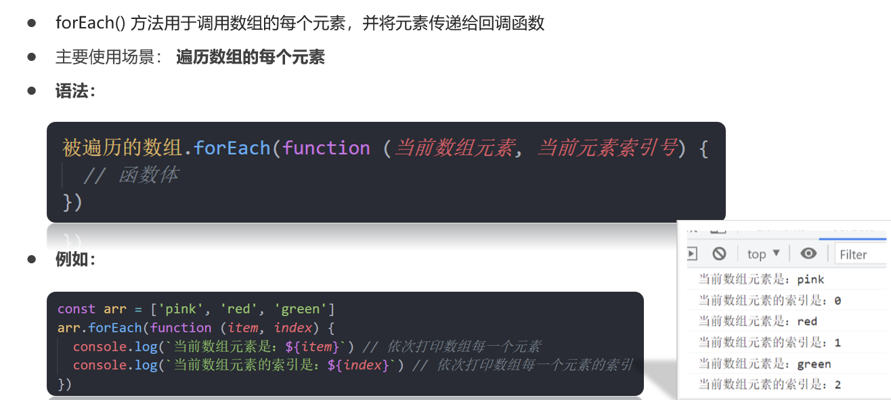

```js
// forEach 就是遍历  加强版的for循环  适合于遍历数组对象
const arr = ['red', 'green', 'pink']
const result = arr.forEach(function (item, index) {
  console.log(item)  // 数组元素 red  green pink
  console.log(index) // 索引号
})
// console.log(result)
```

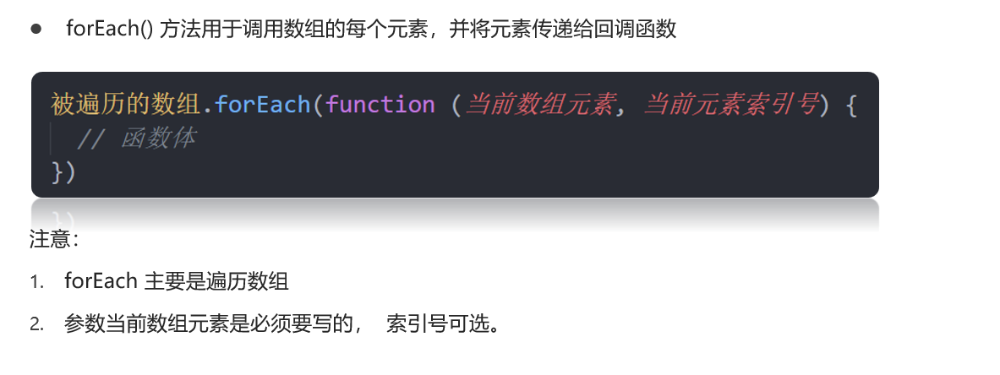

#### 1.2.6 Eg 渲染商品列表


##### 

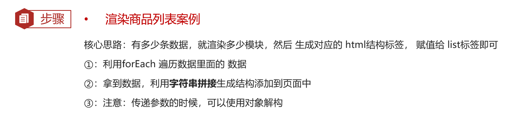

## 2. 综合案例

### 2.1 Array.filter()

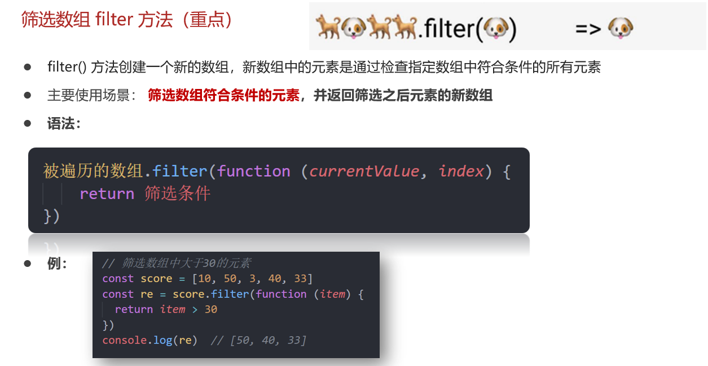

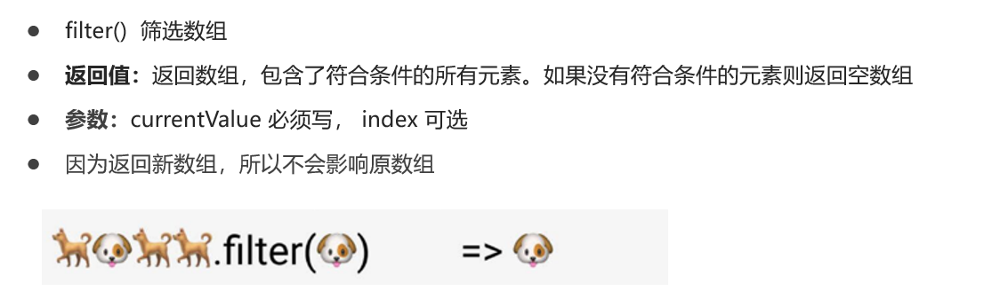

### 2.2 Eg. 价格筛选

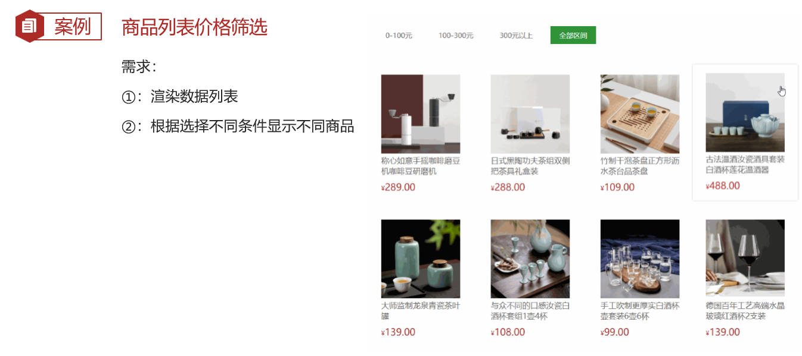

todo 01 

```js
业务分析：
①： 页面初始渲染
②： 点击不同需求显示不同的数据
```

todo 02 

```js
分析：
①：渲染页面 利用forEach 遍历数据里面的 数据，并渲染数据列表
②：根据 filter 选择不同条件显示不同商品
```

todo 03 

```js
步骤：
①：渲染页面模块
       (1) 初始化需要渲染页面，同时，点击不同的需求，还会重新渲染页面，所以渲染做成一个函数
       (2) 做法基本跟前面案例雷同，就是封装到了一个函数里面

```

todo 04

```js
步骤：
②：点击不同需求，显示不同页面内容
       (1) 点击采取事件委托方式  .filter
       (2) 利用过滤函数 filter 筛选出符合条件的数据，因为生成的是一个数组，传递给渲染函数即可
       (3) 筛选条件是根据点击的 data-index 来判断
       (4) 可以使用对象解构，把 事件对象 解构 
       (5) 因为 全部区间不需要筛选，直接 把goodList渲染即可

```

## 3.  构造函数

### PS . 对象的概念

> 对象是一组**<font color='red'>无序</font>**的相关**属性**和**方法**的集合（可以存放任意类型的元素）

- 对象是一组**<font color='red'>无序</font>**的相关**属性**和**方法**的集合，所有的事物都是对象，例如字符串、数值、数组、函数等。

- 对象是由**属性**和**方法**组成的

  - 属性：**事物的特征**，在对象中用属性来表示（常用名词）
  - 方法：**事物的行为**，在对象中用方法来表示（常用动词）

  

*注意：一个对象中**属性**和**方法**并不是都具有的，看具体情况来设置一个对象中的内容*

- 对象中的变量，称之为属性 
- 对象中的函数，称之为方法 

### PS. 为什么需要对象

> 对象的数据结构清晰，数据更语义化，表意明显，更适合遍历

**场景：** 存一个值时，可以使用变量，保存多个值（一组值）时，可以使用数组。那么如果想储存一组有意义且方便查找的数据呢？

数组：

```js
const arr = ['张三', '男', 150, 154];
```

**引发的问题问题：** 用数组保存数据的缺点 - 数据只能通过索引值访问，开发者需要清晰的清楚所有的数据的索引才能准确地获取数据，而当数据量庞大时，不可能做到记忆所有数据的索引值。

**解决方案：为了让更好地存储一组数据，就可以用到对象。对象中为每项数据设置了属性名称，可以访问数据更语义化，数据结构清晰，表意明显，方便开发者使用**。

```js
const obj = {
    "name":"张三",
    "sex":"男",
    "age":128,
    "height":153
}
```


### 3.1 创建对象的三种方式

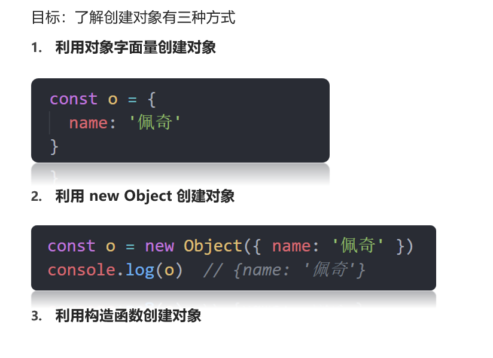

### 3.2 构造函数创建对象

#### 3.2.1 基本概念

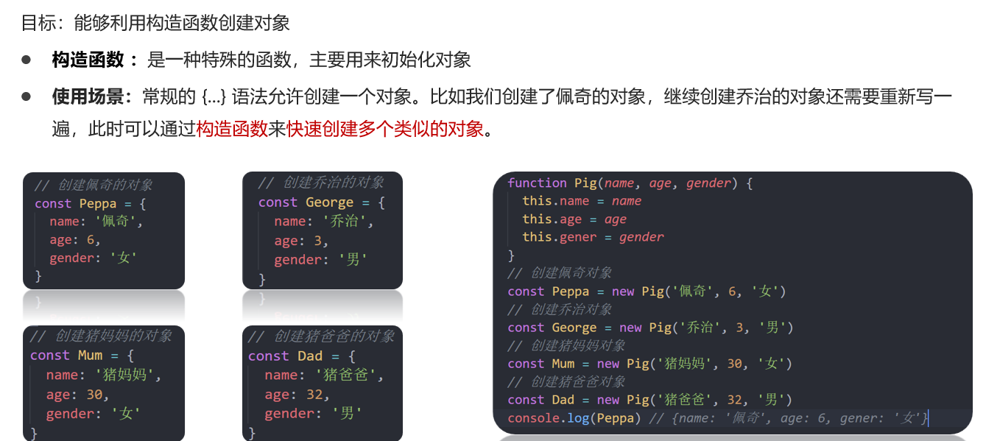

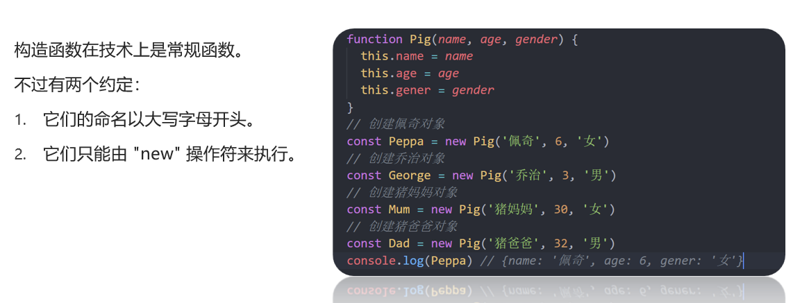

#### 3.2.2 语法

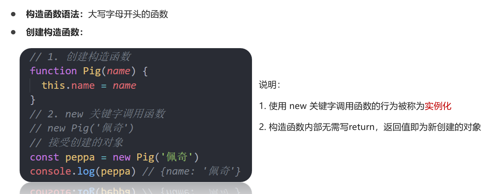

> **构造函数：**创建对象的方法 - 把对象里面一些相同的属性和方法抽象出来封装到函数里面

定义构造函数的语法

```js
function 构造函数名(形参1,形参2,形参3) { // 构造函数的形参与对象的普通属性是一般一致的
     this.属性名1 = 形参1; 
     this.属性名2 = 形参2; // 属性的值，一般是通过同名的形参来赋值的
     this.属性名3 = 形参3;
     this.方法名 = function(){
         
     };
}
// 调用
const obj = new 构造函数名(实参1，实参2，实参3)

// 简记
function 构造函数名() {
    this.属性 = 值;  // 当前的这个对象的
    this.方法 = function() {}
}
new 构造函数名();

// 注意: 
// 1. 构造函数名字首字母要大写
// 2. 构造函数里 属性和方法前面必须添加 this
// 2. 构造函数不需要 return 就可以返回结果
// 3. 我们调用构造函数 必须使用 new
```

#### Eg. 创建一个Person构造函数

```js
// 需求：定义一个人类构造函数，通过它创建的人类对象包含
// 属性：姓名，年龄，性别
// 方法：打招呼。sayHi
```

```js
function Person(name, age, sex) {
   this.name = name;
   this.age = age;
   this.sex = sex;
   this.sayHi = function() { 
       console.log('nice to meet u :)')
   }
}
```

#### Eg. Goods构造函数

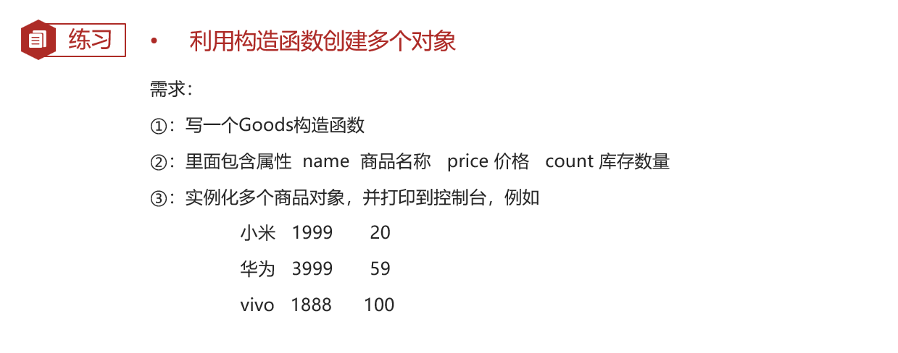

```js
function Goods(name, price, count) {
  this.name = name
  this.price = price
  this.count = count
  this.sayhi = function () { }
}
const mi = new Goods('小米', 1999, 20)
// console.log(mi)
const hw = new Goods('华为', 3999, 59)
// console.log(hw)
console.log(mi === hw)
```

##### 小结

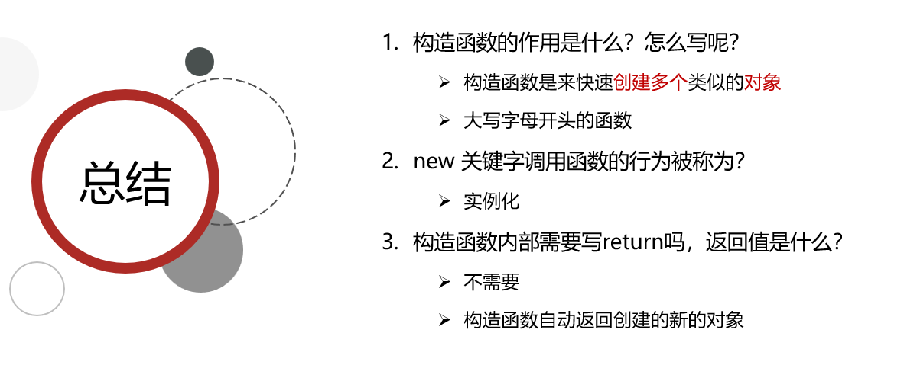

#### 3.2.3  构造函数与对象的区别

- **构造函数：**如 Person()，**抽取**了对象的公共部分，封装到了函数里面，它**泛指某一大类**（class）  
  **对象：**如 var ldh = new Stars()，**特指某一个（具体的某一个）**，

  

- **实例：就是实际的例子**（某一大类中的实际的例子）

- 对象又叫做**实例**

  

- **实例化 : **通过构造函数创建对象的过程，叫做实例化;  

  - 或者说 通过new关键字创建对象的过程我们也称为对象实例化

#### 3.2.4 new的执行过程

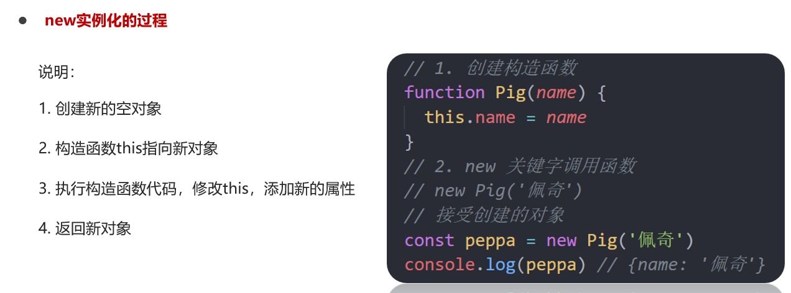

#### 3.2.5 实例成员/静态成员

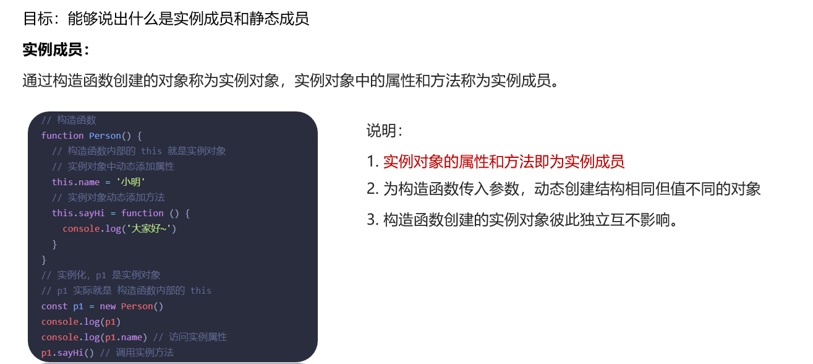

```js
// 实例成员就是构造函数内部通过this添加的成员
// 实例成员通过实例化的对象来访问
```


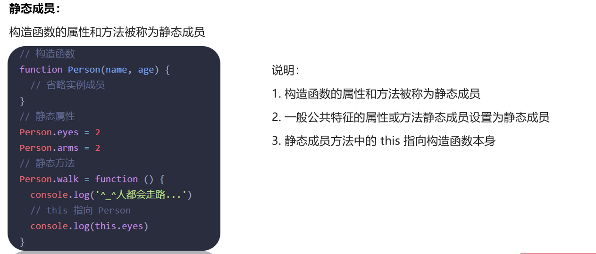

```js
// 静态成员,  在构造函数本身上添加的成员
// 静态成员通过构造函数来访问
```


##### 小结

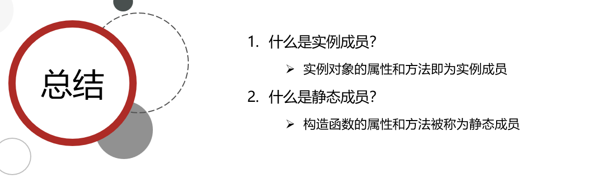

## 4. 内置构造函数

### 4.1 基本包装类型

> js 底层完成， 把简单数据类型包装为了引用数据类型, 所以基本类型的数据也具有一些属性和方法。

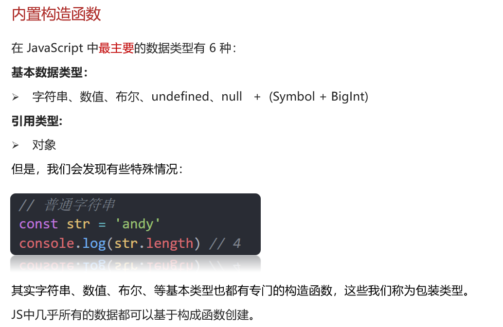


JS给我们提供的内置构造函数。

> 引用类型 

Object  Array  RegExp  Date 等

> 包装类型

String Number Boolean 等

### 4.1 Object

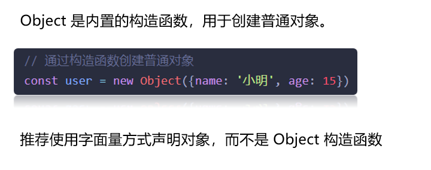

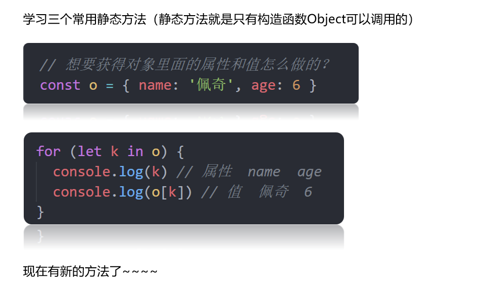

#### Object.keys()

> 静态方法： 写在构造函数身上，通过构造函数直接调用。

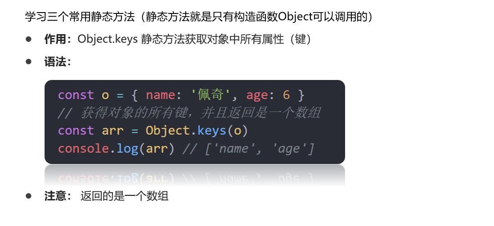

#### Object.values()

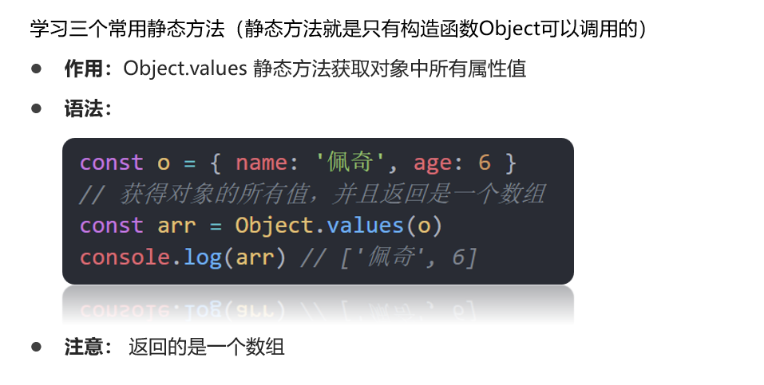

#### Object.assign()

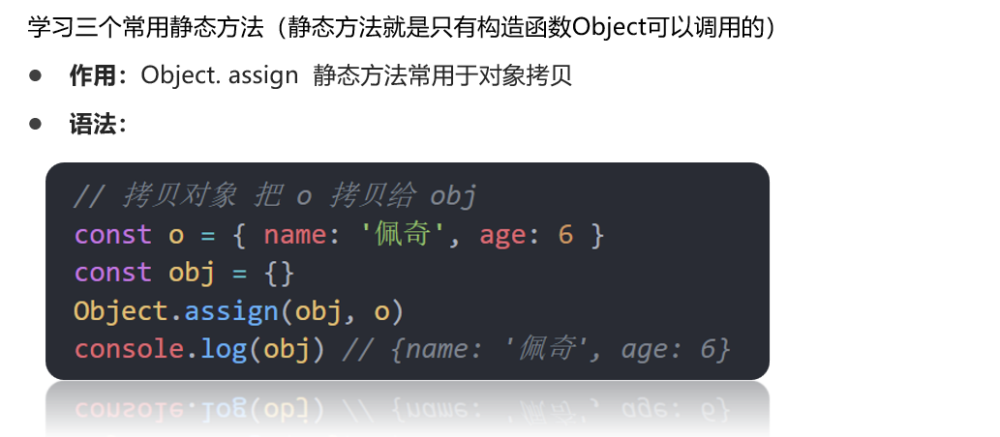

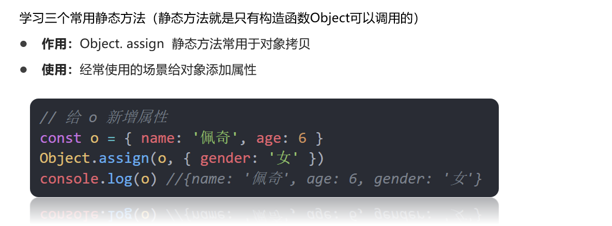

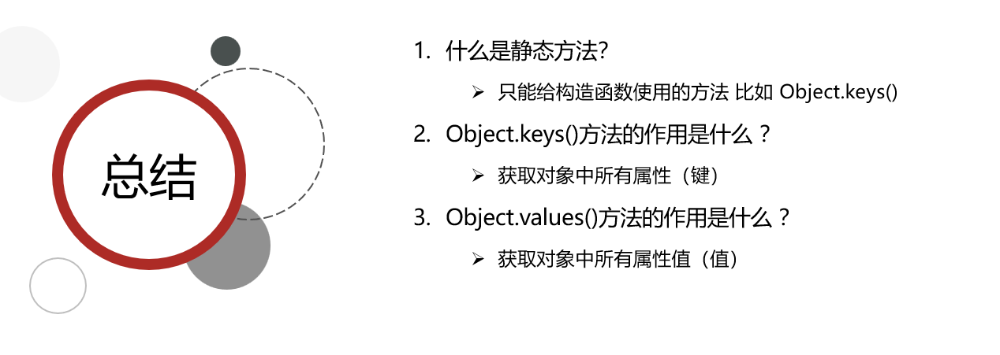

### 4.2 Array

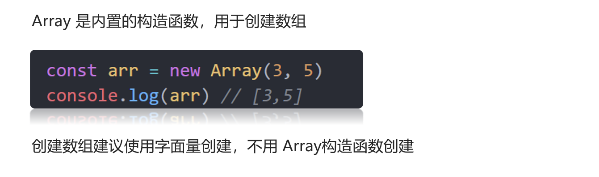

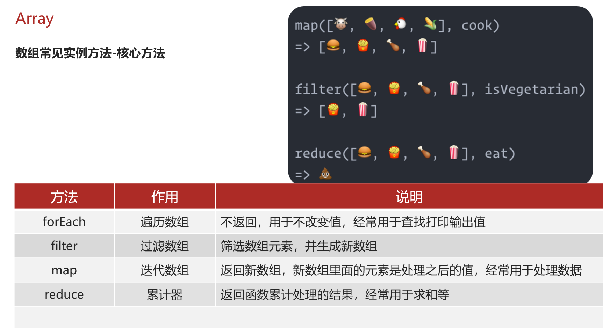

#### Array.prototype.reduce()

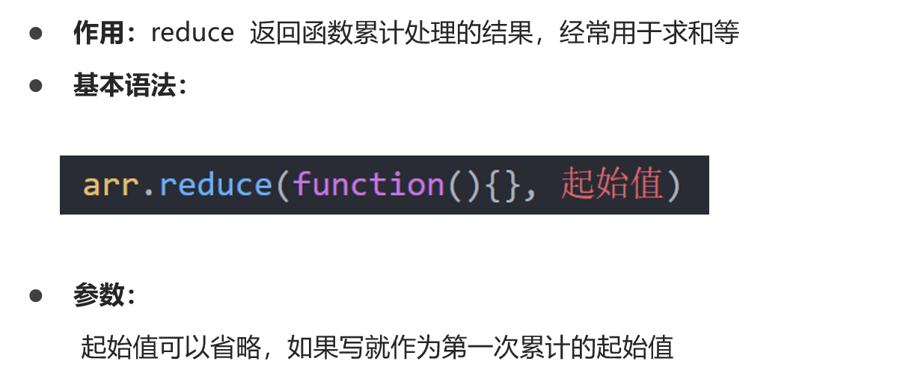

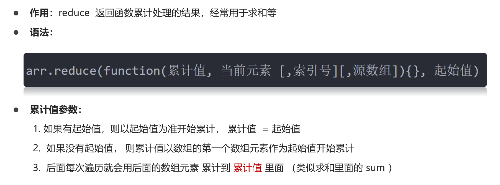

```js
// arr.reduce(function(){}, initValue)
// 定义:对数组中的每个元素执行一个自定义的reducer函数，将其结果汇总为单个返回值
// 参数: 
//    callback : 回调函数 必选  √
//    initValue: 初始值 (可选) √
// 回调函数的参数:
//    previousValue:上一次调用 callbackFn 时的返回值 必选 √
//    currentValue: 当前元素, 必选 √
//    currentIndex: 当前元素索引, (可选)
//    array: 源数组: (可选)

// 注意: 第一次调用时, 如果指定了initValue初始值, 则prev为初始值,
//      否则, prev为数组的第一个元素arr[0]
```

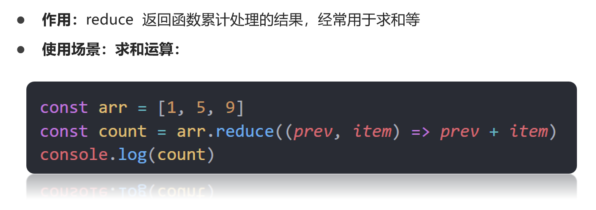

##### Eg. 员工涨薪计算

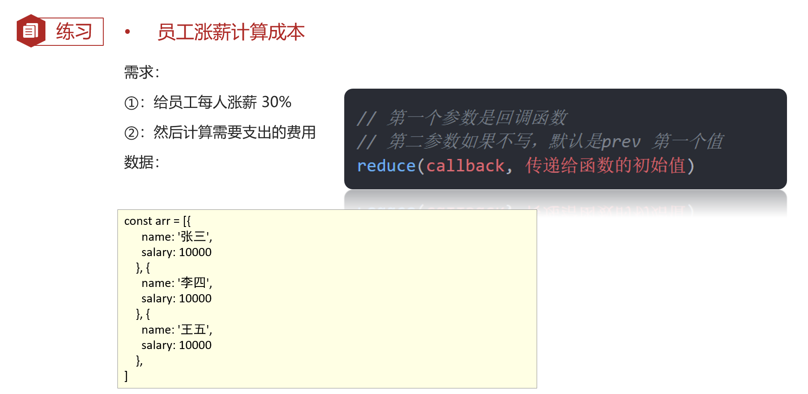

```js
const arr = [{
  name: '张三',
  salary: 10000
}, {
  name: '李四',
  salary: 10000
}, {
  name: '王五',
  salary: 20000
}]
```

```js
const money = arr.reduce((prev, item) => prev + item.salary * 0.3, 0)
console.log(money)
```


#### Array-Other

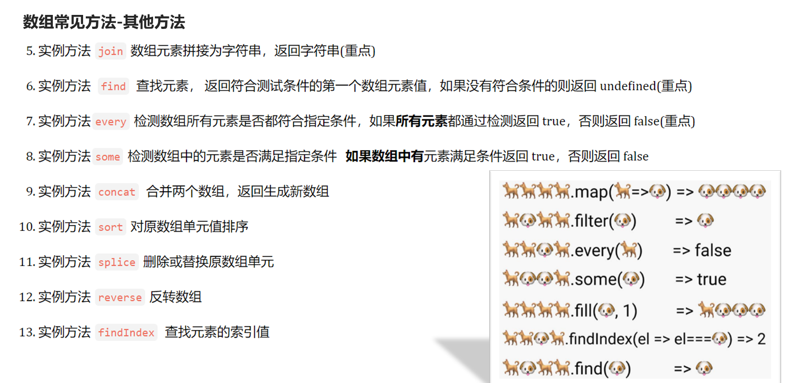

####  Array.prototype.find()

> 返回数组中满足条件的第一个数组元素, 如果没找到, 返回 undefined

```js
// 查MDN手册
// 1. 作用, 该API干嘛用的.
// 2. 语法, 先大致了解
// 3. 参数, 熟悉参数
// 4. 返回值, 看是否有返回值
// 5. 描述, 注意事项
// 6. 示例代码, 自己尝试一下

// 实例方法:

const arr = ['red', 'blue', 'green']
const res = arr.find(function (item) {
  return item === 'blue'
})
console.log(res)  // find 返回值, 
// 简写:
const res = arr.find(el => el ==='blue')
```

####  Array.prototype.findIndex()

>  findIndex 查找满足条件的第一个数组元素的索引值,若没有找到对应元素则返回-1

```js
// findIndex 查找满足条件的第一个数组元素的索引值,若没有找到对应元素则返回-1
const index = arr.findIndex(item => item.name === '小米')
console.log(index)
```

#### Array.prototype.every()

>  every 每一个是否都符合条件，如果都符合返回 true ，否则返回false

```js
// every 每一个是否都符合条件，如果都符合返回 true ，否则返回false
const arr = [10, 20, 30]
const res = arr.every(item => item >= 20)
console.log(res)
```

####  Array.prototype.some()

> some 检测数组内的是否有元素符合指定条件, 如果有一个符合就返回true

```js
// some 检测数组内的是否有元素符合指定条件, 如果有一个符合就返回true
const arr = [1, 2, 3, 6, 9]
const res = arr.some(x => x > 10) // false
```

#### Array.prototype.includes()

> 判断一个数组是否包含一个指定的值, 包含返回true, 否则 false

```js
const arr = [1, 2, 3]
const res = arr.includes(1) // true
const res = arr.includes('1') // false
```


---

##### Eg. 


#### Array.from()

静态方法： 伪数组转为真数组。

```js
const lis = document.querySelectorAll('ul li')
// console.log(lis)
// lis.pop() 报错  删除最后一个
const lis_R = Array.from(lis)
lis_R.pop()
console.log(lis_R)
```

### 4.3 String


#### String.prototype.split()

> 字符串转数组: 使用指定分隔符, 将字符串分割, 得到一个字符串数组.

```js
const str = 'The quick brown fox jumps over the lazy dog.';
const words = str.split(' ');
console.log(words)

const str1 = '2022-08-09'
const arr = str1.split('-')
console.log(arr)
console.log(arr[0])
```

#### String.prototype.substring()

> 截取字符串: 返回一个字符串在开始索引到结束索引之间的一个子集

```js
// 1 如果省略 indexEnd，取到最后
// 2 前闭后开区间 [start, end), 结束索引号不包含在截取的字符串内.
const str = '你喜欢吃冰淇淋吗'
console.log(str.substring(1))
console.log(str.substring(1, 3))
```

#### String.prototype.startsWith()

> 判断是不是以某个字符开头

```js
// 语法: str.startsWith(searchString[, position])
// 作用: 判断是否以某个字符开头
// 参数: 
//    第一个参数: 要搜索的字符串
//    第二个参数: 在str中搜索的开始位置, 默认为0 (可选)
// 返回值:  true / false

const str = "To be, or not to be, that is the question.";

alert(str.startsWith("To be"));         // true
alert(str.startsWith("not to be"));     // false
alert(str.startsWith("not to be", 10)); // true
```

#### String.prototype.includes()

> 判断一个字符串是否包含在另一个字符串中  true/ false

```js
// str.includes()
// 判断一个字符串是否包含在另一个字符串中  true/ false
// 区分大小写!
const str = 'To be, or not to be, that is the question.';
console.log(str.includes('To be'));       // true
console.log(str.includes('question'));    // true
console.log(str.includes('nonexistent')); // false
console.log(str.includes('To be', 1));    // false
console.log(str.includes('TO BE'));       // false
// 同样也有pos, 可选
```

#### Eg.


### 4.4 Number

#### Number.prototype.toFixed()

> 设置保留小数位置

```js
// num.toFixed()
const num = 10.923
console.log(num.toFixed(1))
const num1 = 10
console.log(num1.toFixed(2))

// 如果不传参数,四舍五入转为整数
console.log(num.toFixed())  
```


## 5. 综合案例

### Eg. 购物车展示


```js
// 1. 根据数据渲染页面
document.querySelector('.list').innerHTML = goodsList.map(item => {
  // console.log(item)  // 每一条对象
  // 对象解构  item.price item.count
  const { picture, name, count, price, spec, gift } = item
  // 规格文字模块处理
  const text = Object.values(spec).join('/')
  // 计算小计模块 单价 * 数量  保留两位小数 
  // 注意精度问题，因为保留两位小数，所以乘以 100  最后除以100
  const subTotal = ((price * 100 * count) / 100).toFixed(2)
  // 处理赠品模块 '50g茶叶,清洗球'
  const str = gift ? gift.split(',').map(item => `<span class="tag">【赠品】${item}</span> `).join('') : ''
  return `
        <div class="item">
          
          <p class="name">${name} ${str} </p>
          <p class="spec">${text} </p>
          <p class="price">${price.toFixed(2)}</p>
          <p class="count">x${count}</p>
          <p class="sub-total">${subTotal}</p>
        </div>
      `
}).join('')

// 3. 合计模块
const total = goodsList.reduce((prev, item) => prev + (item.price * 100 * item.count) / 100, 0)
// console.log(total)
document.querySelector('.amount').innerHTML = total.toFixed(2)
```

