## Target

1. 能够说出æ„造函数和åŸå‹å¯¹è±¡é‡Œé¢çš„this指å‘
2. 能够利用画图工具画出æ„造函数ã€å®ä¾‹å¯¹è±¡ã€åŸå‹å¯¹è±¡çš„关系图
3. 能够利用åŸå‹å®ç°ç»§æ‰¿
4. 能够利用画图工具画出åŸå‹é“¾
5. 能够跟éšè¯¾å ‚代ç å®Œæˆç»¼åˆæ¡ˆä¾‹-å°è£…模æ€æ¡†

💡🚀🤟👉👇☀ï¸ğŸ‰ğŸğŸ‡ğŸ“🥕ğŸ­ğŸ–ï¸ğŸâ˜˜ï¸ğŸ€ğŸ’¯ğŸ”†â—🔥🚩

## 1. 编程æ€æƒ³

### 1.1 é¢å‘过程（POP）

> é¢å‘过程编程： Process-oriented Programming , 以**过程**为核心，强调**事件的æµç¨‹ã€é¡ºåºï¼Œ**如：C语言。

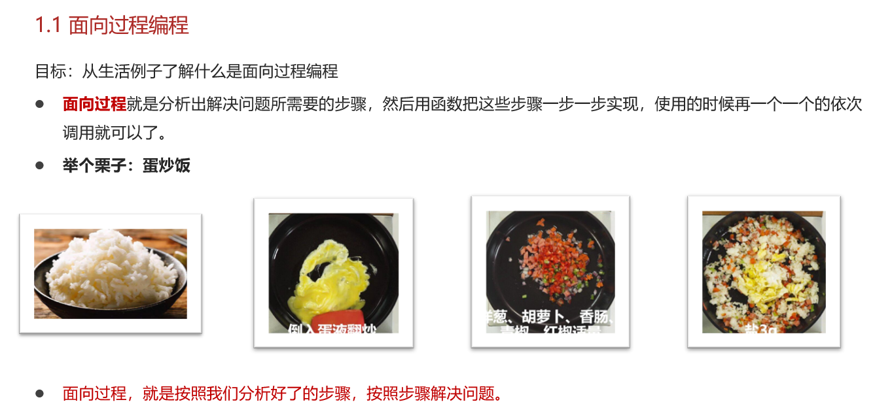

### 1.2 é¢å‘对象（OOP）

> é¢å‘对象编程：Object-oriented Programming , 以**对象**为核心，强调**事件的角色ã€ä¸»ä½“，**如：C++ã€Java。

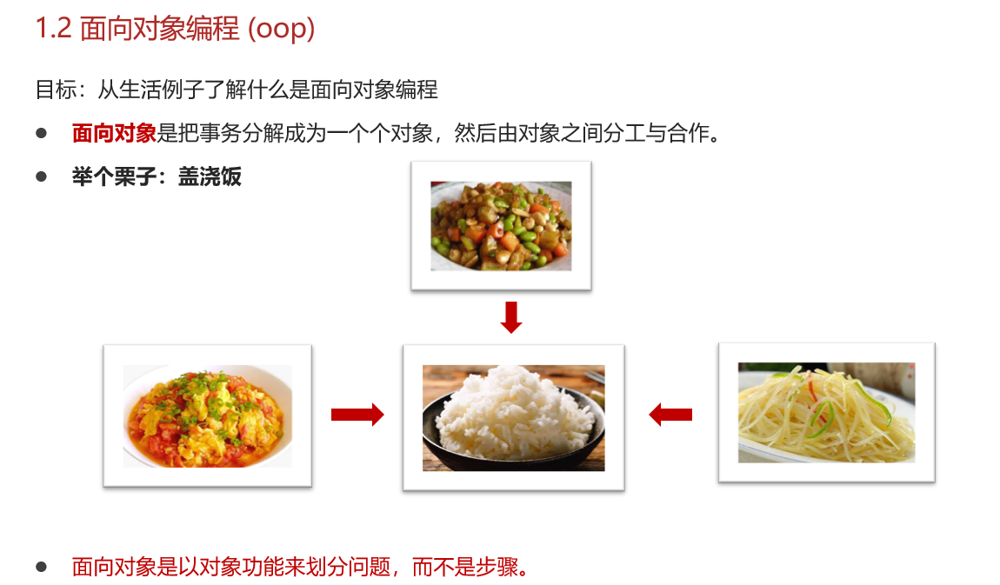

### 1.3 如何把大象装进冰箱

#### 1.3.1 é¢å‘过程

```js
为了把大象装进冰箱，需è¦3个过程。

1) 把冰箱门打开（得到打开门的冰箱）

2) 把大象装进å»ï¼ˆå¾—到打开ç€é—¨çš„, 装ç€å¤§è±¡çš„冰箱）

3) 把冰箱门关上（打开门ã€è£…好大象å，è·å¾—关好门的冰箱）

æ¯ä¸ªè¿‡ç¨‹æœ‰ä¸€ä¸ªé˜¶æ®µæ€§çš„目标，ä¾æ¬¡å®Œæˆè¿™äº›è¿‡ç¨‹ï¼Œå°±èƒ½æŠŠå¤§è±¡è£…进冰箱。

é¢å‘过程åƒæ˜¯æˆ‘们站在上å¸è§†è§’, 为万物指定命è¿çš„轨迹……
```

#### 1.3.2 é¢å‘对象

```js
// æ¯ä¸ªåŠ¨ä½œæœ‰ä¸€ä¸ªæ‰§è¡Œè€…，它就是对象。
// 也就是è°(对象), è¦åšä»€ä¹ˆ

为了把大象装进冰箱，对äºå†°ç®±è¿™ä¸ªå¯¹è±¡æ¥è¯´, 需è¦åšä¸‰ä¸ªåŠ¨ä½œï¼ˆæˆ–者å«è¡Œä¸ºï¼‰ã€‚

1) 冰箱，你给我把门打开

2) 冰箱，你给我把大象装进å»ï¼ˆæˆ–者说，大象，你给我钻到冰箱里å»ï¼‰ (大象, 滚进å»~~~)

3) 冰箱，你给我把门关上  (大象,你帮我把冰箱门带上)

ä¾æ¬¡åšè¿™äº›åŠ¨ä½œï¼Œå°±èƒ½æŠŠå¤§è±¡è£…进冰箱。

冰箱.开门()
冰箱.装进(大象)
冰箱.关门()

===> 冰箱.开门().装进(大象).关门()

大象:å¹ä¸ªç©ºè°ƒæˆ‘容易么?

 // 求大象的心ç†é˜´å½±é¢ç§¯? 用é¢å‘对象的方å¼æ€ä¹ˆå†™?
 大象.阴影é¢ç§¯()
```

**é¢å‘对象和é¢å‘过程ä¸æ˜¯äº’斥的, 也就是说, é¢å‘对象的编程中, 也å¯ä»¥æœ‰é¢å‘过程的æ€æƒ³.**

比如求大象的心ç†é˜´å½±è¿™ä¸ªæ–¹æ³•ä¸­, 是ä¸æ˜¯è¦è®¡ç®—长宽, 这样类似的步骤~~. 先计算长, å†è®¡ç®—宽, å†æ±‚å’Œ. 这是é¢å‘过程编程.


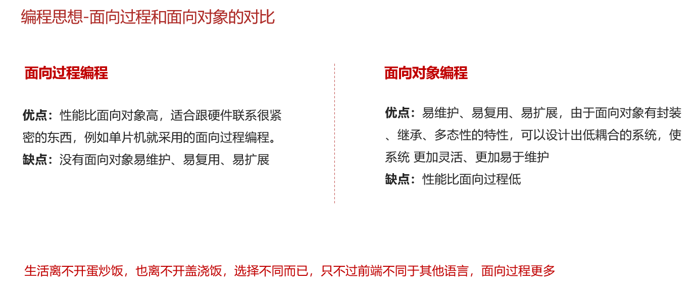

### 1.4 ç±»

é¢å‘对象更贴近我们的å®é™…生活, å¯ä»¥ä½¿ç”¨é¢å‘对象æ¥æè¿°ç°å®ä¸–界事物, 但是事物åˆåˆ†ä¸ºå…·ä½“的事物和抽象的事物.

比如, 手机, 就是一个大类 , 抽象的 泛指的. 汽车, 也是一个类.

比如, å°ç±³æ‰‹æœº, 苹æœæ‰‹æœº. 算是类还是对象? å®é©¬, 奔驰 算是类还是对象?

具体的 ,比如å°ç±³æŸä¸ªå‹å·çš„手机, 是对象了å§? 但是, 这个å‹å·çš„手机生产了100wå°.

å†å…·ä½“点, 我手上的这å°å°ç±³æ‰‹æœº. 具体的一个对象.

#### 什么是类?

> **类是用äºåˆ›å»ºå¯¹è±¡çš„模æ¿ã€‚**它æ述一类对象的行为和状æ€ã€‚(方法和å±æ€§)

比如, 中秋åƒæœˆé¥¼, 月饼上都有一些图案花纹, 具有相åŒèŠ±çº¹çš„月饼, 都是 åŒä¸€ä¸ªæœˆé¥¼æ¨¡å…·å‹å‡ºæ¥çš„.. 那这个模具, 就相当是月饼的一个类. 用它å‹å‡ºæ¥çš„月饼, 都具有相åŒçš„花纹.

#### 什么是对象

> **对象是å±æ€§å’Œæ–¹æ³•çš„集åˆ**

#### é¢å‘对象æ€ç»´

1. 抽å–(抽象) 对象共有的å±æ€§å’Œæ–¹æ³•å°è£…æˆä¸€ä¸ªæ¨¡æ¿ (ç±»).
2. 用类å®ä¾‹åŒ–一个对象 (用这个类作为模æ¿åˆ›å»ºä¸€ä¸ªå…·æœ‰å®ƒçš„å±æ€§å’Œæ–¹æ³•çš„对象, å¯ä»¥åˆ›å»ºå¾ˆå¤šä¸ªå¯¹è±¡)

### 1.5 é¢å‘对象的三大特å¾

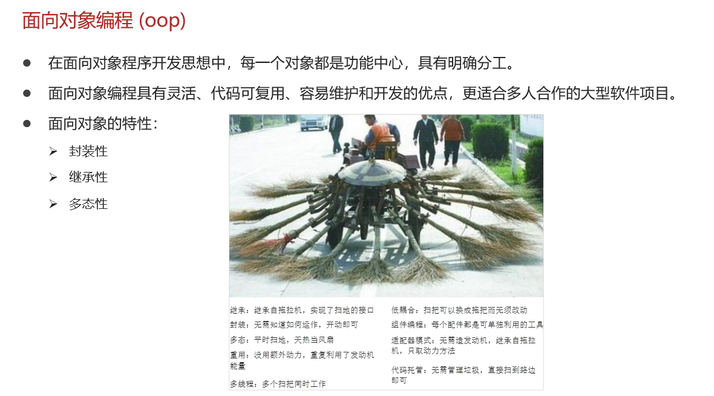

1. **å°è£…** : å°è£…是指éšè—对象的å±æ€§å’Œå®ç°ç»†èŠ‚，仅对外æ供公共访问方å¼ã€‚(抽å–公共的å±æ€§æ–¹æ³•)
2. **继承** : 继承å¯ä»¥ä½¿å¾—å­ç±»å…·æœ‰çˆ¶ç±»çš„å±æ€§å’Œæ–¹æ³•. 或者é‡æ–°å®šä¹‰ã€è¿½åŠ å±æ€§å’Œæ–¹æ³•ç­‰ã€‚
3. **多æ€** : å±äºåŒä¸€ä¸ªçˆ¶ç±»çš„å®ä¾‹å¯¹è±¡ï¼Œè°ƒç”¨åŒä¸€ä¸ªæ–¹æ³•ï¼Œå‡ºæ¥ä¸åŒçš„效æœï¼Œå°±æ˜¯å¤šæ€

#### 1.5.1 **å°è£…:**

我们程åºè®¾è®¡è¿½æ±‚“高内èšï¼Œä½è€¦åˆâ€

高内èšï¼šç±»çš„内部数æ®æ“作细节自己完æˆï¼Œä¸å…许外部干涉

ä½è€¦åˆï¼šä»…对外暴露少é‡çš„方法用äºä½¿ç”¨ã€‚

éšè—对象内部的å¤æ‚性，åªå¯¹å¤–公开简å•çš„æ¥å£ã€‚便äºå¤–界调用，ä»è€Œæ高系统的å¯æ‰©å±•æ€§ã€å¯ç»´æŠ¤æ€§ã€‚通俗的说，把该éšè—çš„éšè—èµ·æ¥ï¼Œè¯¥æš´éœ²çš„暴露岀æ¥ã€‚这就是å°è£…性的设计æ€æƒ³ã€‚

```js
// æ„造函数 å°è£…了人的姓å, 年龄, 打招呼等.
function Person(name, age){
    this.name = name
    this.age = age
    this.sayHi = function(){
        console.log('你好哇~ nice to meet u')
    }
}
var p1 = new Person('å°å¼ ', 18)
```

#### 1.5.2 继承

**继承** : 继承å¯ä»¥ä½¿å¾—å­ç±»å…·æœ‰çˆ¶ç±»çš„å±æ€§å’Œæ–¹æ³•. 或者é‡æ–°å®šä¹‰ã€è¿½åŠ å±æ€§å’Œæ–¹æ³•ç­‰ã€‚

#### 1.5.2 多æ€

**多æ€**：å±äºåŒä¸€ä¸ªçˆ¶ç±»çš„å®ä¾‹å¯¹è±¡ï¼Œè°ƒç”¨åŒä¸€ä¸ªæ–¹æ³•ï¼Œå‡ºæ¥ä¸åŒçš„效æœï¼Œå°±æ˜¯å¤šæ€ã€‚

比如, 手机都有开机这个行为, å°ç±³æ‰‹æœºçš„开机动画是å°ç±³logo, 苹æœæ‰‹æœºå¼€æœºåŠ¨ç”»æ˜¯è‹¹æœlogo.


## 2. æ„造函数

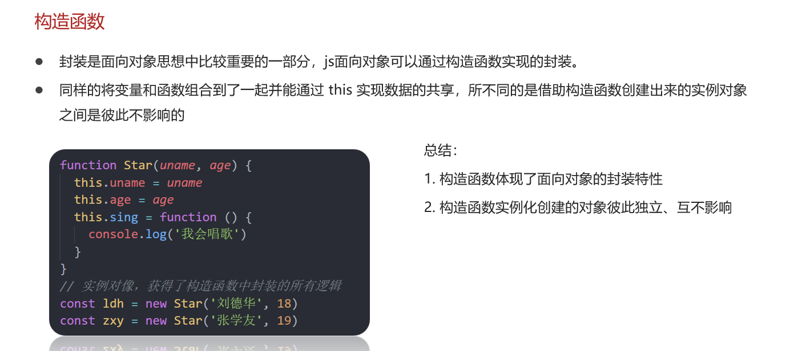

- [堆栈内存](https://zhuanlan.zhihu.com/p/362219811)

### 2.1 æ„造函数的问题

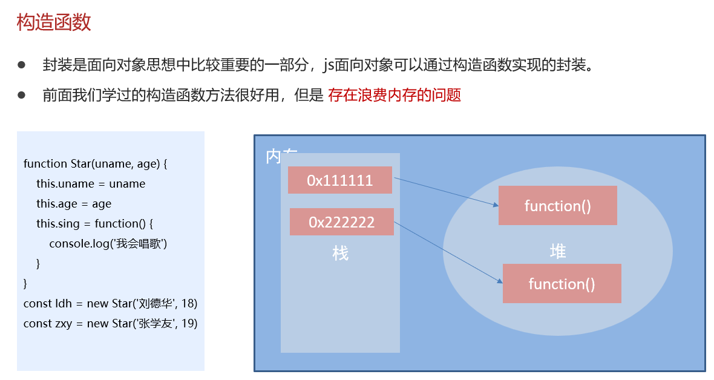

#### Code

```js
// 公共方法：æ¯å®ä¾‹åŒ–一个对象, 就新开辟一个空间
function Star(name, age) {
  this.name = name
  this.age = age
  this.sing = function () {
    console.log('唱歌')
   }
}
const ldh = new Star('刘德å', 25)
const zxy = new Star('周æ°ä¼¦', 18)
console.log(ldh.sing === zxy.sing)  // false 
```


### å°ç»“

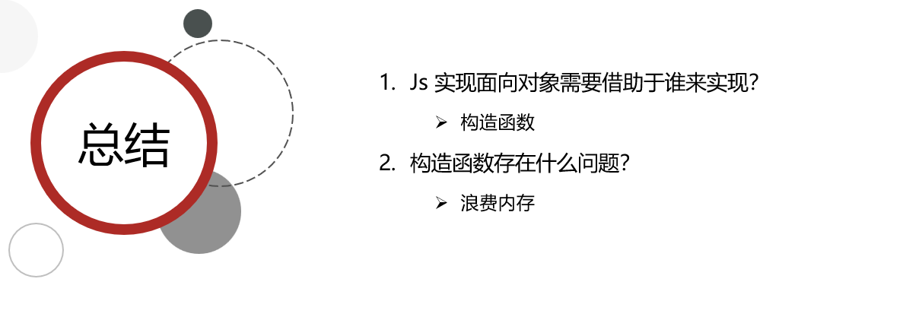

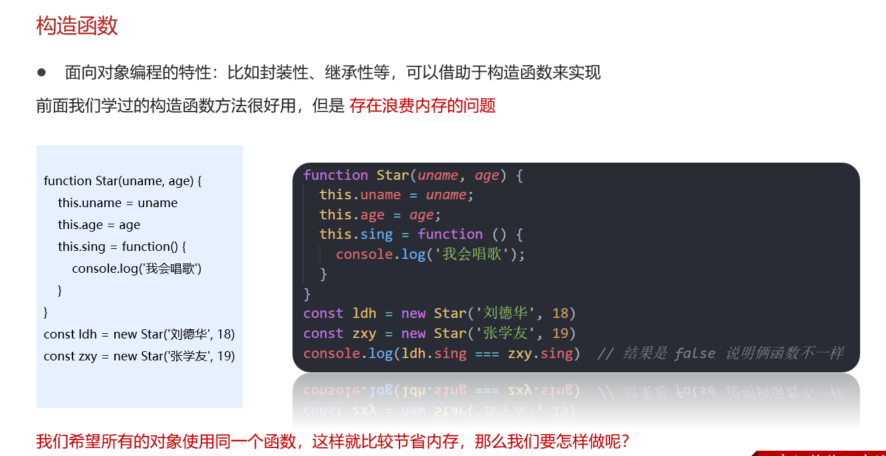

### 2.2 引入åŸå‹è§£å†³

#### Code

```js
// 1.公共的å±æ€§å†™åˆ° æ„造函数里é¢
function Star(uname, age) {
  this.uname = uname
  this.age = age
  // this.sing = function () {
  //   console.log('唱歌')
  // }
}
// 2. 公共的方法写到åŸå‹å¯¹è±¡èº«ä¸Š   节约了内存
Star.prototype.sing = function () {
  console.log('唱歌')
}
const ldh = new Star('刘德å', 25)
const zxy = new Star('å¼ å­¦å‹', 18)
ldh.sing() //调用
zxy.sing() //调用
// console.log(ldh === zxy)  // false
// sing是方法, 在内存里é¢å¼€è¾Ÿäº†ä¸åŒç©ºé—´
console.log(ldh.sing === zxy.sing)

```


## 3. åŸå‹

### 3.1 prototype 🔥🔥

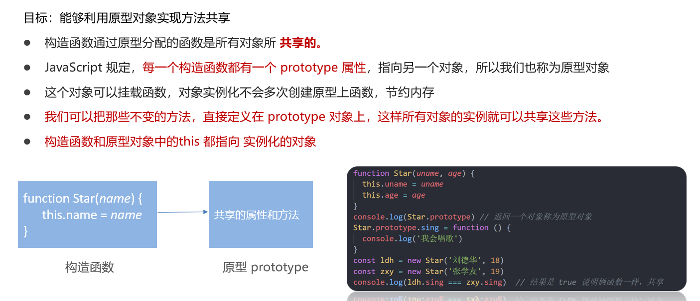

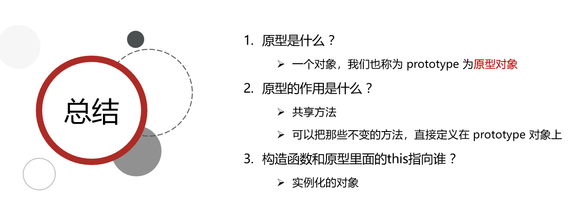

#### åŸå‹this指å‘

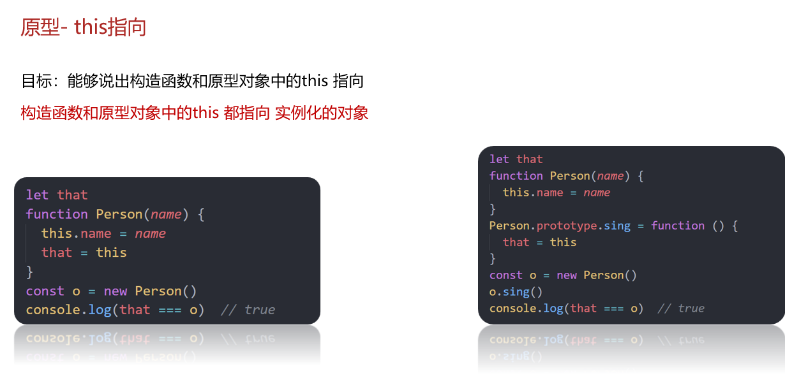

#### Code

```js
let that
function Star(uname) {
    // that = this
    // console.log(this)
    this.uname = uname
}
// åŸå‹å¯¹è±¡é‡Œé¢çš„函数this指å‘的还是 å®ä¾‹å¯¹è±¡ ldh
Star.prototype.sing = function () {
    that = this
    console.log('唱歌')
}
// å®ä¾‹å¯¹è±¡ ldh   
// æ„造函数里é¢çš„ this 就是  å®ä¾‹å¯¹è±¡  ldh
const ldh = new Star('刘德å')
ldh.sing()
console.log(that === ldh)
```


#### Eg.数组扩展方法

> æ„造函数和åŸå‹é‡Œé¢çš„this指å‘è° ï¼Ÿ å®ä¾‹åŒ–的对象


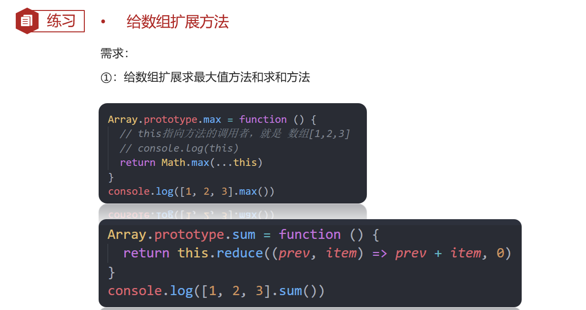

#### Code

> 看看视频， å®é™…工作中ä¸å»ºè®®è¿™ä¹ˆç”¨ï¼

- ä¸å»ºè®®ä¿®æ”¹Array，Object等对象的åŸå‹ï¼â€˜
- 特别是prototypeåŸå‹ä¸Šæœ¬èº«å­˜åœ¨çš„方法。因为å®é™…å¼€å‘，自己修改了， 而别的åŒå­¦ä¸çŸ¥é“， 一用就会有问题。并且å¯èƒ½æ‰¾åŠå¤©éƒ½æ‰¾ä¸åˆ°é”™è¯¯åŸå› ã€‚
- 因为别的åŒå­¦æ‰“死也想ä¸åˆ°ä½ ä¼šæ”¹è¿™ä¸ªï¼Œ 最åå‘ç°æ˜¯ä½ æ”¹äº†åŸå‹ã€‚
- Good Luck.

```js
// 自己定义 数组扩展方法  求和 和 最大值 
// 1. 我们定义的这个方法，任何一个数组å®ä¾‹å¯¹è±¡éƒ½å¯ä»¥ä½¿ç”¨
// 2. 自定义的方法写到  数组.prototype 身上
// 1. 最大值
const arr = [1, 2, 3]
Array.prototype.max = function () {
  // 展开è¿ç®—符
  return Math.max(...this)
  // åŸå‹å‡½æ•°é‡Œé¢çš„this 指å‘è°ï¼Ÿ å®ä¾‹å¯¹è±¡ arr
}
// 2. 最å°å€¼
Array.prototype.min = function () {
  // 展开è¿ç®—符
  return Math.min(...this)
  // åŸå‹å‡½æ•°é‡Œé¢çš„this 指å‘è°ï¼Ÿ å®ä¾‹å¯¹è±¡ arr
}
console.log(arr.max())
console.log([2, 5, 9].max())
console.log(arr.min())
// const arr = new Array(1, 2)
// console.log(arr)
// 3. 求和 方法 
Array.prototype.sum = function () {
  return this.reduce((prev, item) => prev + item, 0)
}
console.log([1, 2, 3].sum())
console.log([11, 21, 31].sum())
```


### 3.2 constructorå±æ€§ 🔥🔥

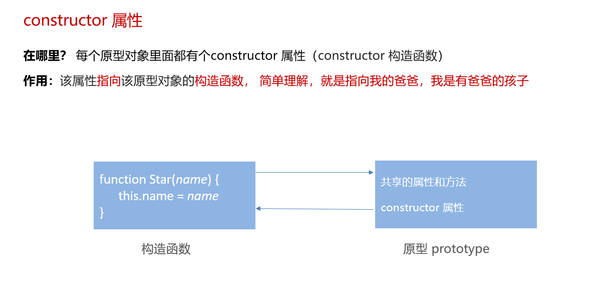

#### Code

```js
// constructor   æ„造函数

function Star(name, age) {
    this.name = name
    this.age = age
}
const ldh = new Star()
console.log(Star) // 
console.log(Star.prototype) 
// æ¯ä¸ªåŸå‹(对象)都有一个constructorå±æ€§ï¼ŒæŒ‡å›æ„造函数本身
console.log(ldh.__proto__ == Star.prototype) // true
console.log(Star.prototype.constructor == Star) // true
// å¯ä»¥è·å¾—对象的åŸå‹
console.log(Object.getPrototypeOf(ldh) === Star.prototype) // true
```


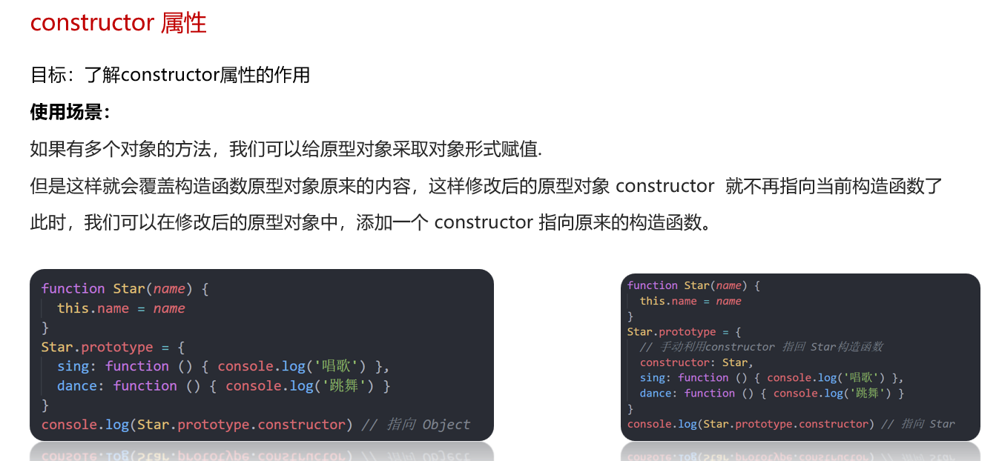

#### Code

```js
// æ¯ä¸ªåŸå‹å¯¹è±¡éƒ½æœ‰ä¸€ä¸ªconstructorå±æ€§ï¼ŒæŒ‡å›æ„造函数本身
function Star(name, age) {
    this.name = name
    this.age = age
}
Star.prototype.sing = function(){
    console.log('唱歌')
}
Star.prototype.dance = function(){
    console.log('è·³èˆ')
}
console.log(Star.prototype)
Star.prototype = {
  // å¯ä»¥æ‰‹åŠ¨çš„利用constructor指å›åŸæ¥çš„æ„造函数
    constructor: Star, // 
    sing: function(){
        console.log('唱歌')
    },
    dance:function(){
        console.log('è·³èˆ')
    }
}
console.log(Star.prototype)
const ldh = new Star()
```


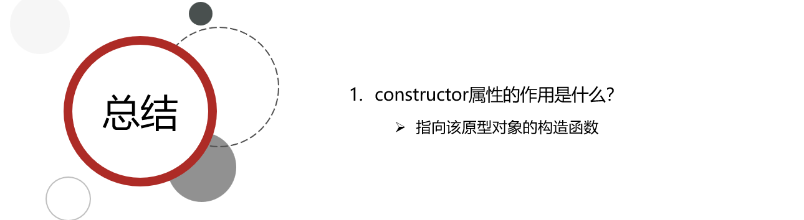

### 3.3 `__proto__` 🔥🔥

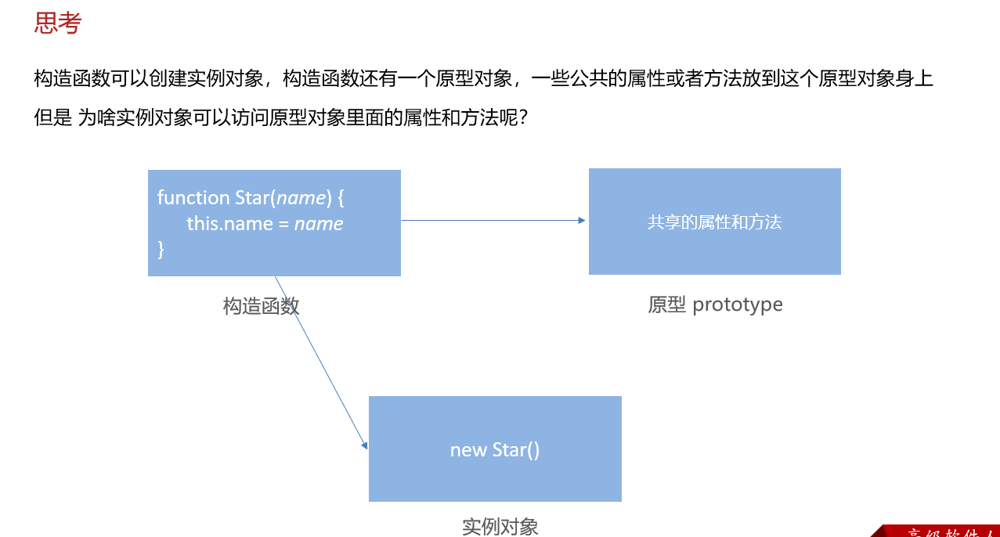

#### Code 

```js
function Star(name) {
  this.name = name
}
Star.prototype.sing = function(){
  console.log('sing')
}
const ldh = new Star('刘德å')
console.log(ldh); 
console.log(ldh.__proto__ === Star.prototype);
// 方法å±æ€§çš„查找规则:
// 首先先看ldh 对象身上是å¦æœ‰ sing 方法,如æœæœ‰å°±æ‰§è¡Œè¿™ä¸ªå¯¹è±¡ä¸Šçš„sing
// 如æœä¹ˆæœ‰sing 这个方法,就会通过__proto__å»å®ä¾‹çš„åŸå‹ä¸ŠæŸ¥æ‰¾ 
```


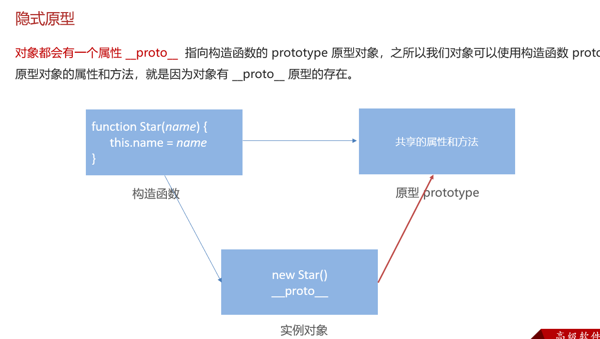

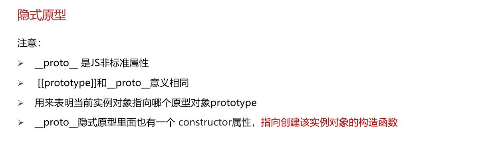

#### Error

>  注æ„下é¢è¿™å¼ å›¾ï¼Œ 错误ï¼Error

- å®ä¾‹æ²¡æœ‰æŒ‡å›æ„造函数的那一æ¡çº¿ï¼

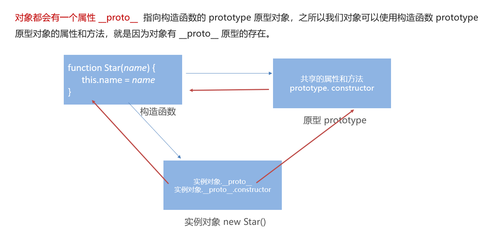


> 注æ„， 上é¢ç¬¬äºŒæ¡ï¼Œ constructorå±æ€§åœ¨å“ªé‡Œï¼Ÿ 在åŸå‹å¯¹è±¡é‡Œã€‚

- 没有对象åŸå‹è¿™ç§è¯´æ³•ï¼Œ å«éšå¼åŸå‹æ›´æ°å½“ï¼
- 并ä¸æ˜¯éƒ½æœ‰ï¼Œ 因为constructor就是在åŸå‹é‡Œï¼Œåªæ˜¯`å®ä¾‹.__proto__`能访问到而已ï¼
- Error ==> 对象åŸå‹é‡Œé¢æœ‰constructor æŒ‡å‘ æ„造函数 Star

```js
ldh.__proto__ === Star.prototype // true
// 对象åŸå‹é‡Œé¢æœ‰constructor æŒ‡å‘ æ„造函数 Star  // Errorï¼
ldh.__prototype.constructor === Star  // true
// Error ä¸è¦è¿™ä¹ˆè¯´ï¼ 
// 本质上， 是因为ldh.__prototype 指å‘了åŸå‹ï¼Œ åŸå‹é‡Œæœ‰constructorå±æ€§
// constructor是å±æ€§å°±æ˜¯æŒ‡å‘Star的。
```


### 3.4 绘图:æ„造函数/åŸå‹/å®ä¾‹ 🔥🔥

- https://app.diagrams.net/

- https://github.com/jgraph/drawio-desktop/releases/tag/v20.2.3

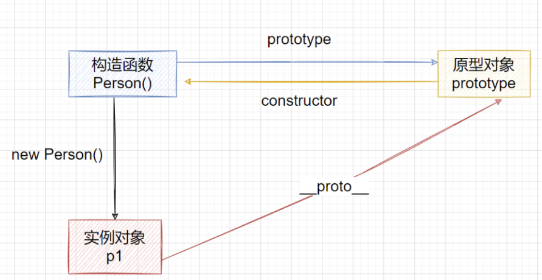

1. æ„造函数.prototype      ==>      指å‘了åŸå‹å¯¹è±¡
2. åŸå‹å¯¹è±¡.constructor   ==>      指å›äº†æ„造函数
3. å®ä¾‹.`__proto__`           ==>      指å‘了åŸå‹å¯¹è±¡

æ„造函数和åŸå‹å¯¹è±¡æ˜¯ç›¸äº’指å‘的， å®ä¾‹é€šè¿‡`__proto__` å¯ä»¥è®¿é—®åŸå‹å¯¹è±¡ã€‚

```js
function Person(name){
  this.name = name
}
const p = new Person()

// 1. å®ä¾‹å¯¹è±¡éšå¼åŸå‹ æŒ‡å‘ æ„造函数的显示åŸå‹
console.log(p.__proto__ === Person.prototype)

// 2. Person.prototype也是一个对象， 所以，它也有__proto__ å±æ€§

console.log(Person.prototype.__proto__ === Object.prototype)
// ä»¥ä¸‹ä¸¤ä¸ªéƒ½æŒ‡å‘ Object çš„åŸå‹å¯¹è±¡
console.log(Person.prototype.__proto__)
console.log(Object.prototype)

// 3. Object.prototype åŸå‹å¯¹è±¡çš„__proto__最终指å‘null
Object.prototype.__proto__ === null
```


### 3.5 åŸå‹é“¾ 🔥🔥🔥

> åŸå‹é“¾ï¼š (背下æ¥)
>
> 1. æ¯ä¸ªå¯¹è±¡é€šè¿‡`__proto__`å±æ€§éƒ½èƒ½è®¿é—®åˆ°å®ƒçš„åŸå‹å¯¹è±¡ï¼ŒåŸå‹å¯¹è±¡ä¹Ÿæœ‰å®ƒçš„åŸå‹å¯¹è±¡ã€‚
> 2. 当访问一个对象的å±æ€§æˆ–方法时，先在自身中寻找
> 3. 如æœæ²¡æœ‰ï¼Œå°±ä¼šæ²¿ç€`__proto__`è¿™æ¡é“¾å‘上查找，一直找到最顶层Object.prototype为止.

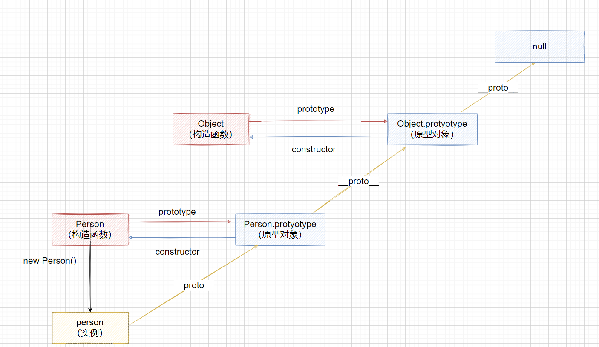

#### Code

```js
// Person.prototype也是一个对象， 所以，它也有__proto__ å±æ€§
console.log(Person.prototype.__proto__ === Object.prototype)
// 都指å‘Objectçš„åŸå‹
console.log(Person.prototype.__proto__)
console.log(Object.prototype)
// 正常的åŸå‹é“¾éƒ½ä¼šç»ˆæ­¢äº Object çš„åŸå‹å¯¹è±¡ 
// Object åŸå‹çš„åŸå‹æ˜¯ null
Object.prototype.__proto__ === null
```

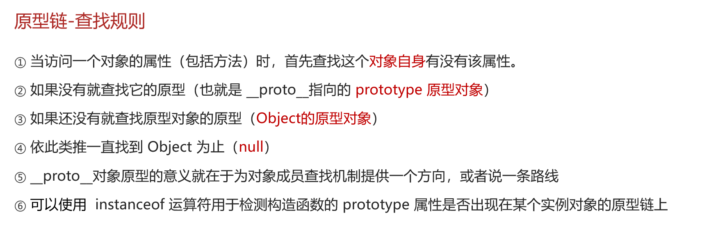

### 3.6 instanceof

```js
// instanceof è¿ç®—符
// 用äºæ£€æµ‹æ„造函数的 prototype å±æ€§æ˜¯å¦å‡ºç°åœ¨æŸä¸ªå®ä¾‹å¯¹è±¡çš„åŸå‹é“¾ä¸Š

// 语法
// å®ä¾‹ instanceof æ„造函数

// ç†è§£ï¼š 检测æ„造函数的åŸå‹ï¼Œ 是å¦å‡ºç°åœ¨æŸä¸ªå®ä¾‹çš„åŸå‹é“¾ä¸Šã€‚
// ==> å®ç°åŸç†å°±æ˜¯åªè¦å³è¾¹å˜é‡çš„ prototype 在左边å˜é‡çš„åŸå‹é“¾ä¸Šå³å¯

// 定义æ„造函数
function C(){} 
function D(){} 
const o = new C()
o instanceof C; // true，o.__proto__ === C.prototype
o instanceof D; // false，因为 D.prototype ä¸åœ¨ o çš„åŸå‹é“¾ä¸Š

function Person() {} // æ„造函数
const ldh = new Person()
// console.log(ldh.__proto__ === Person.prototype)
// console.log(Person.prototype.__proto__ === Object.prototype)
console.log(ldh instanceof Person)
console.log(ldh instanceof Object)
console.log(ldh instanceof Array)
console.log([1, 2, 3] instanceof Array)
console.log(Array instanceof Object)

```

## 4. 继承

### 4.1 åŸå‹é“¾ç»§æ‰¿

- ä¸å«åŸå‹ç»§æ‰¿ã€‚å«åŸå‹é“¾ç»§æ‰¿ã€‚ï¼ Error

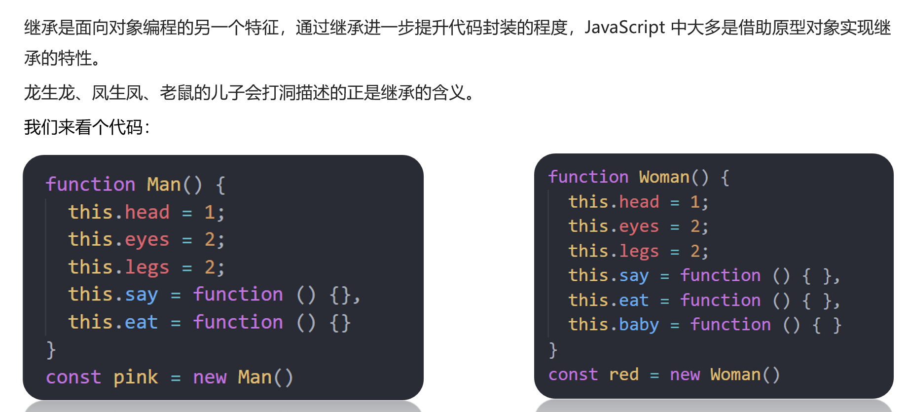

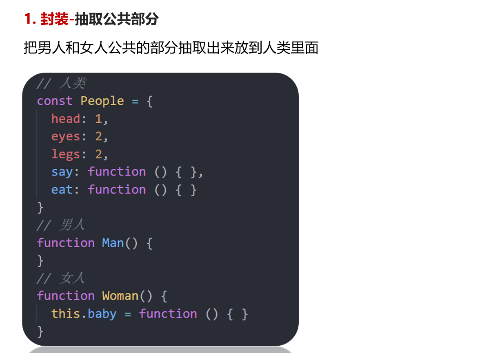

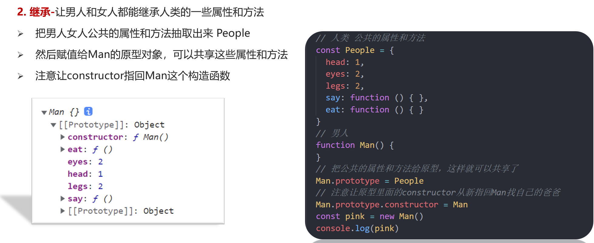

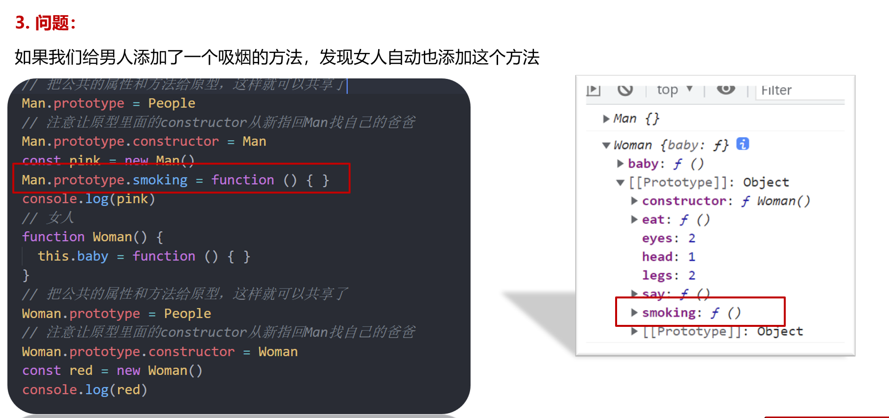

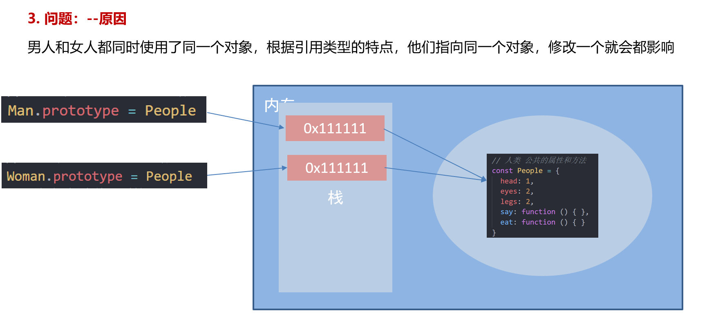

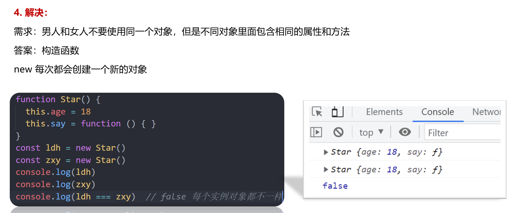

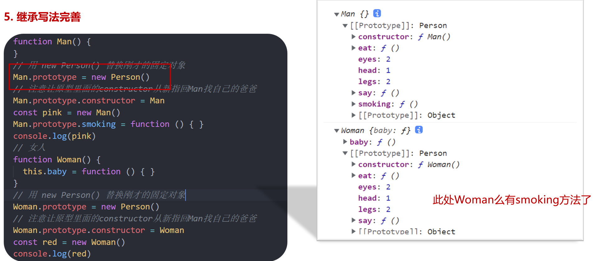

```js
   // ç»§ç»­æŠ½å–   公共的部分放到åŸå‹ä¸Š
    // const Person1 = {
    //   eyes: 2,
    //   head: 1
    // }
    // const Person2 = {
    //   eyes: 2,
    //   head: 1
    // }
    // æ„造函数  new 出æ¥çš„对象 结æ„一样，但是对象ä¸ä¸€æ ·
    function Person() {
      this.eyes = 2
      this.head = 1
    }
    // console.log(new Person)
    // 女人  æ„造函数   继承  æƒ³è¦ ç»§æ‰¿ Person
    function Woman() {

    }
    // Woman 通过åŸå‹æ¥ç»§æ‰¿ Person
    // 父æ„造函数（父类）   å­æ„造函数（å­ç±»ï¼‰
    // å­ç±»çš„åŸå‹ =  new 父类  
    Woman.prototype = new Person()   // {eyes: 2, head: 1} 
    // 指å›åŸæ¥çš„æ„造函数
    Woman.prototype.constructor = Woman

    // 给女人添加一个方法  生孩å­
    Woman.prototype.baby = function () {
      console.log('å®è´')
    }
    const red = new Woman()
    console.log(red)
    // console.log(Woman.prototype)
    // 男人 æ„造函数  继承  æƒ³è¦ ç»§æ‰¿ Person
    function Man() {

    }
    // 通过 åŸå‹ç»§æ‰¿ Person
    Man.prototype = new Person()
    Man.prototype.constructor = Man
    const pink = new Man()
    console.log(pink)
```


## 5.Eg.案例

### 效æœ


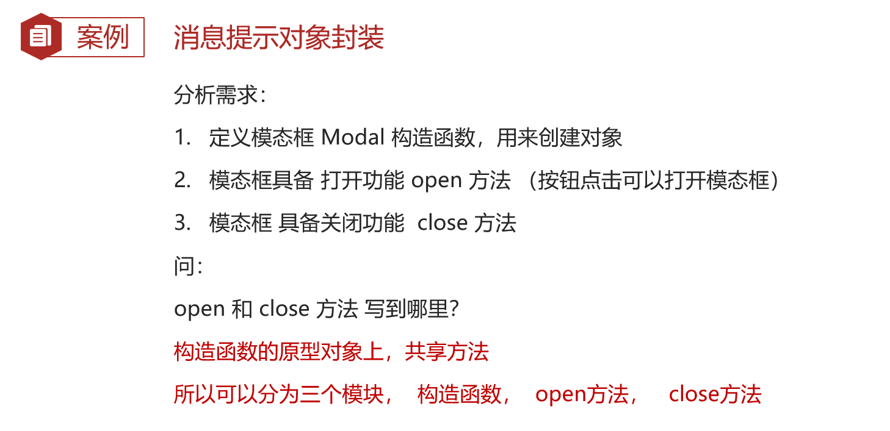

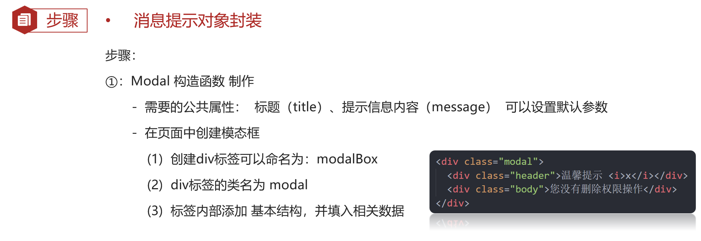

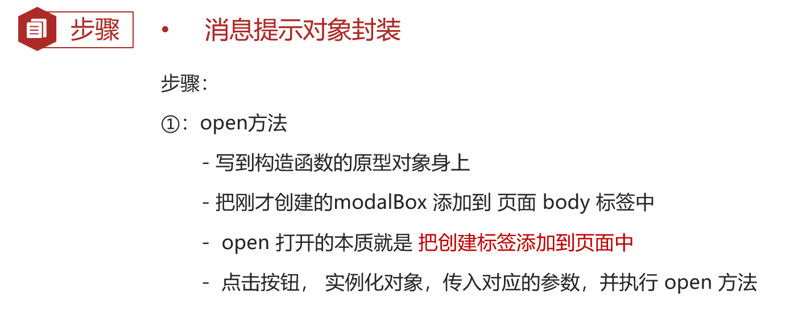

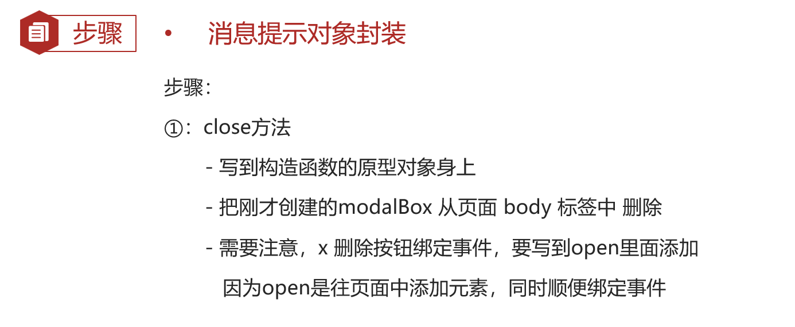

#### Code 

```js
// 1.  模æ€æ¡†çš„æ„造函数
function Modal(title = '', message = '') {
  // 公共的å±æ€§éƒ¨åˆ†
  this.title = title
  this.message = message
  // 因为盒å­æ˜¯å…¬å…±çš„
  // 1. 创建 一定ä¸è¦å¿˜äº†åŠ  this 
  this.modalBox = document.createElement('div')
  // 2. 添加类å
  this.modalBox.className = 'modal'
  // 3. 填充内容 æ›´æ¢æ•°æ®
  this.modalBox.innerHTML = `
        <div class="header">${this.title} <i>x</i></div>
        <div class="body">${this.message}</div>
      `
  // console.log(this.modalBox)
}
// 2. 打开方法 挂载 到 模æ€æ¡†çš„æ„造函数åŸå‹èº«ä¸Š
Modal.prototype.open = function () {
  if (!document.querySelector('.modal')) {
    // 把刚æ‰åˆ›å»ºçš„ç›’å­ modalBox  渲染到 页é¢ä¸­  父元素.appendChild(å­å…ƒç´ )
    document.body.appendChild(this.modalBox)
    // è·å– x  调用关闭方法
    this.modalBox.querySelector('i').addEventListener('click', () => {
      // 箭头函数没有this 上一级作用域的this
      // 这个this æŒ‡å‘ m 
      this.close()
    })
  }
}
// 3. 关闭方法 挂载 到 模æ€æ¡†çš„æ„造函数åŸå‹èº«ä¸Š
Modal.prototype.close = function () {
  document.body.removeChild(this.modalBox)
}

// 4. 按钮点击
document.querySelector('#delete').addEventListener('click', () => {
  const m = new Modal('温馨æ示', '您没有æƒé™åˆ é™¤')
  // 调用 打开方法
  m.open()
})

// 5. 按钮点击
document.querySelector('#login').addEventListener('click', () => {
  const m = new Modal('å‹æƒ…æ示', '您还么有注册账å·')
  // 调用 打开方法
  m.open()
})
```

