## Target

1. 能够知道如何在现有目录中初始化Git仓库 (git init)
2. 能够知道如何检查文件的状态 (git status)
3. 能够知道如何把文件加入暂存区 (git add)
4. 能够说出提交更新的命令  (git commit -m)
5. 能够知道如何向暂存区中一次性添加多个文件 (git add .)


💡🚀🤟👉👇☀️🍉🍍🍇🍓🥕🍭🎖️🎁☘️🍀💯🔆❗🔥🚩

## 1. 基本概念

### 1. 版本控制系统


分布式相比于集中式的最大区别在于开发者可以提交到本地，每个开发者通过克隆（git clone），在本地机器上拷贝一个完整的Git仓库。


### 2. 版本管理的演变

> VCS   版本控制系统（version control system)

#### 2.1 没有VCS

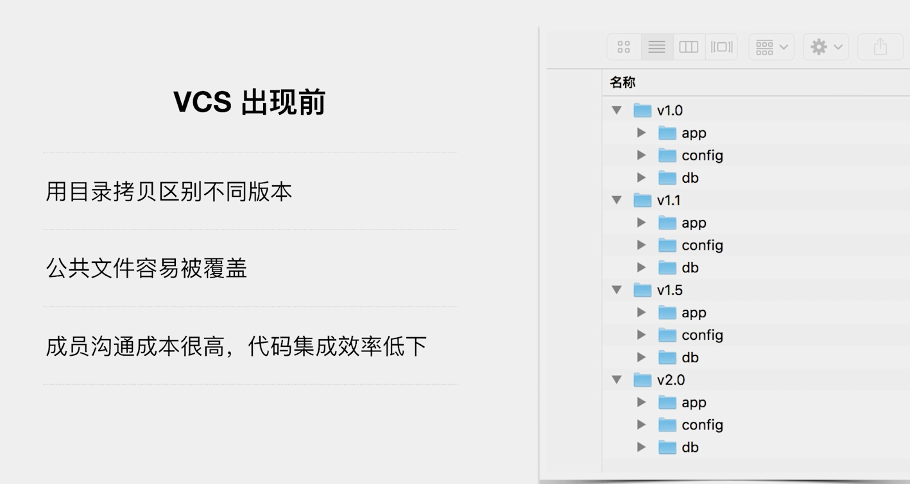

#### 2.2 本地VCS

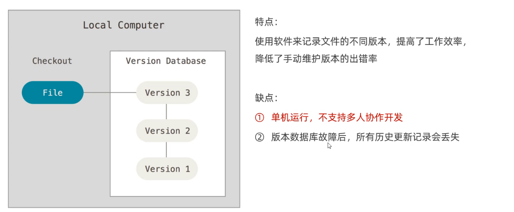

#### 2.3 集中式VCS

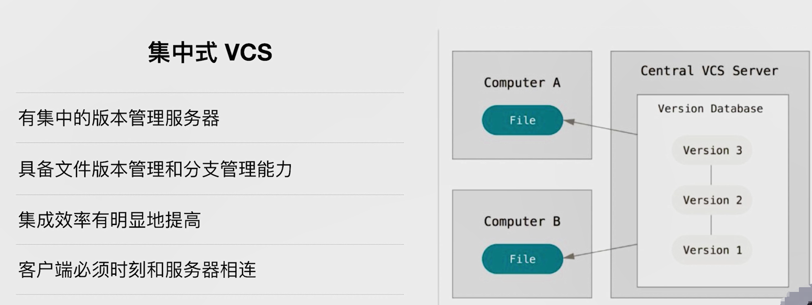

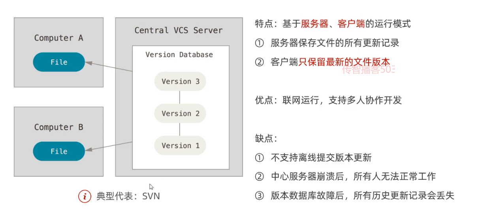


先说集中式版本控制系统，版本库是集中存放在中央服务器的，而干活的时候，用的都是自己的电脑，所以要先从中央服务器取得最新的版本，然后开始干活，干完活了，再把自己的活推送给中央服务器。中央服务器就好比是一个图书馆，你要改一本书，必须先从图书馆借出来，然后回到家自己改，改完了，再放回图书馆。

#### 2.4 分布式VCS

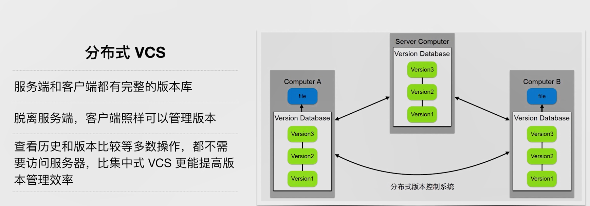

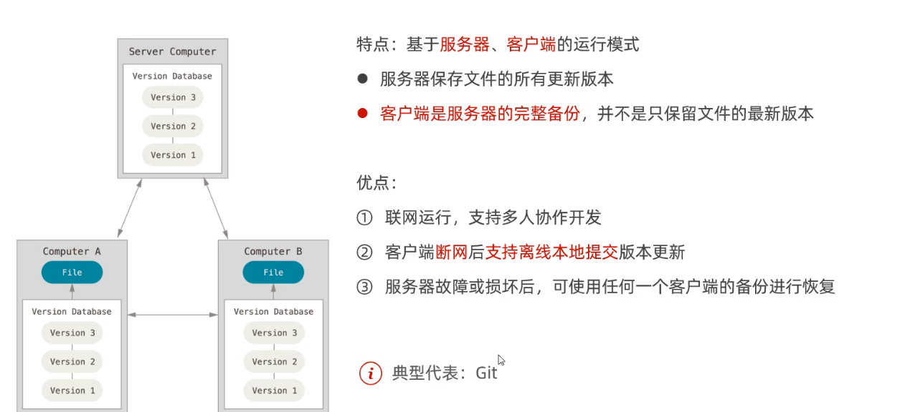

和集中式版本控制系统相比，分布式版本控制系统的安全性要高很多，因为每个人电脑里都有完整的版本库，某一个人的电脑坏掉了不要紧，随便从其他人那里复制一个就可以了。而集中式版本控制系统的中央服务器要是出了问题，所有人都没法干活了。

### 3. 版本控制系统的好处


## 2. Git

> https://www.liaoxuefeng.com/wiki/896043488029600/896202815778784

```js
Linus花了两周时间自己用C写了一个分布式版本控制系统，这就是Git！一个月之内，Linux系统的源码已经由Git管理了！牛是怎么定义的呢？大家可以体会一下。

Git迅速成为最流行的分布式版本控制系统，尤其是2008年，GitHub网站上线了，它为开源项目免费提供Git存储，无数开源项目开始迁移至GitHub.
```

### 2.1 什么是Git?

> 作用： 代码存档备份。 支持多人协作开发

Git 是一个开源的分布式版本控制系统,  是目前世界上<span style="color:red">最先进, 最流行</span>的版本控制系统. 可以快速高效的处理从很小到非常大的项目版本管理


**特点:** 项目越大越复杂, 协同开发者越多, 越能体现出Git的 <span style="color:red">高性能 和 高可用性</span>

Git 之所以快速和高效, 主要依赖于它的如下两个特性: 

- 直接记录快照, 而非差异比较
- 几乎所有操作都是本地执行.

##### 2.1.1 SVN记录差异

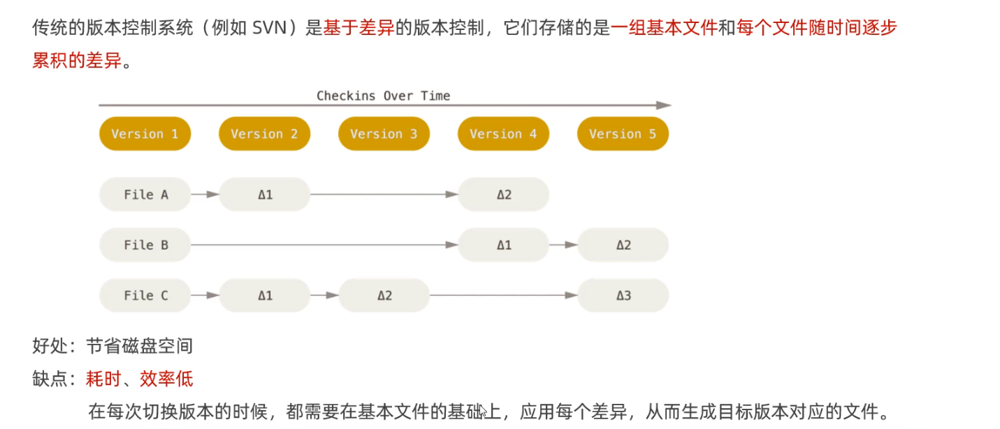

- 文件ABC是一个基本文件.  Version 2 记录了 文件A修改的差异, 每次切换版本, 需要从基文件 应用差异, 得到修改后的版本. 

##### 2.1.2 Git记录快照

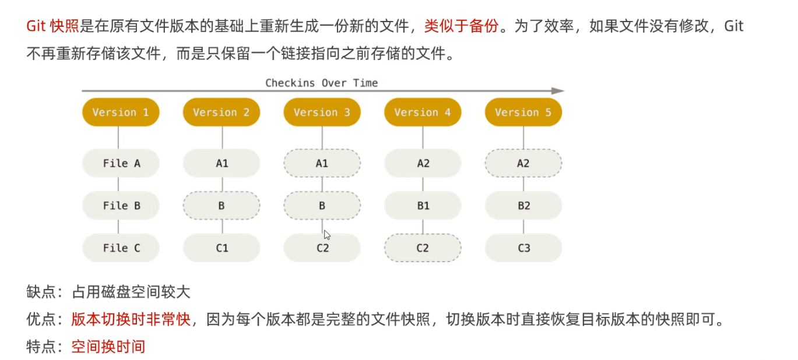

- 该项目有五个版本.   
- version2中  A1 是文件File A 修改后的一份新快照  B文件未修改, 只保留了一个链接指向旧文件.
- 如果要从V1切换版本V5, 直接将V5的快照进行恢复就行, 不用从V1一次一次对比差异得到.


> **Git每次commit提交会保存项目快照，难道是将所有的文件重新复制一份吗？**

当然不可能，在git的文件系统中，是存在共用文件的。

比如有三次commit提交，产生了三个tree树，它们在向下引用的时候，如果两个commit中的整个文件夹或者某个文件没有改变，这两个commit的tree会指向同一个对象。对于两次提交修改了的文件，则会创建一个该文件的一个新的版本的文件，上一次提交指向旧的文件，修改文件的提交指向新版本的文件。


##### 2.1.3 本地执行

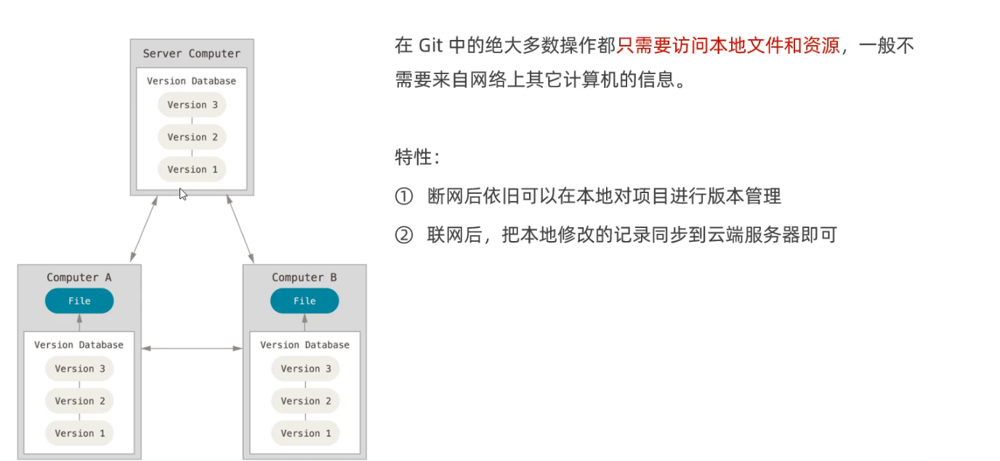

- 如果本地修改了文件, 提交了一个新版本. 那么本地版本号比服务器上的高一个版本, 联网后, 可以直接将修改的记录同步到服务器. 

### 2.2 安装Git

- [Git官网-安装](https://git-scm.com/book/zh/v2/%E8%B5%B7%E6%AD%A5-%E5%AE%89%E8%A3%85-Git)

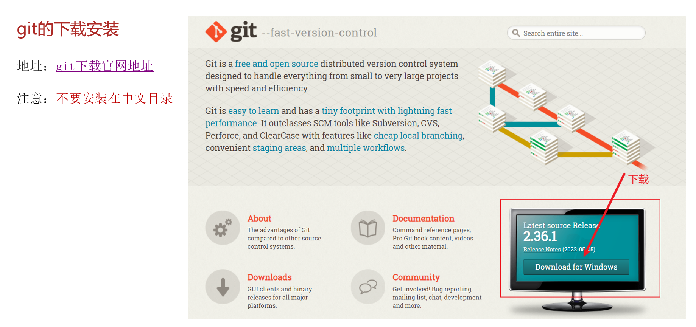

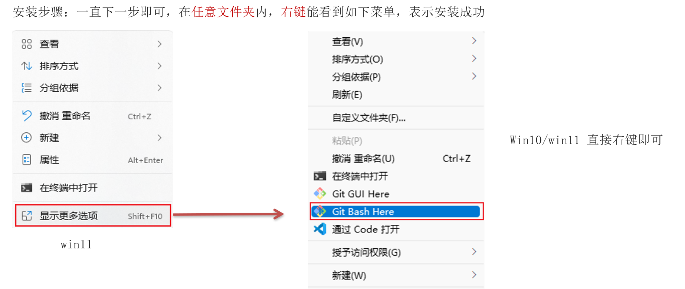

- 或者windows下  `win + R` 输入 `cmd` 打开终端

```bash
# 查看 git 版本
git --version  
# 如果有显示版本号, 说明安装成功了.
```

### 2.3 先配置user信息

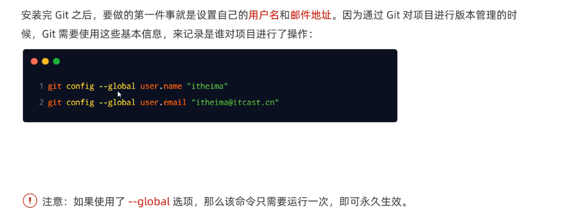

#### 1 **user.name 和 user.email**

```bash
git config --global user.name "your name"   # user.name后面是空格!
git config --global user.email "your email"
```

> global表示什么意思

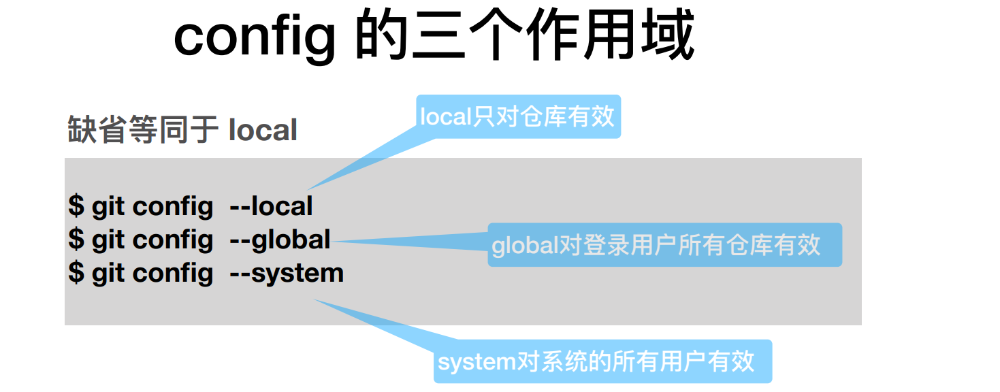

#### 2 检测配置信息

```js
git config --list  // 列出所有配置 
git config --list --local   // 具体的项目中有配置才生效
git config --list --global  //  --global --list 可以交换位置.
git config --list --system

// 查看所有的配置和它们所在的文件
git config --list --show-origin
```

#### 3 清除, --unset

```js
git config --unset --local user.name
git config --unset --global user.name  // 一般用的是global
git config --unset --system user.name
```

#### 4 优先级

> local > global > system

#### 5 全局配置文件

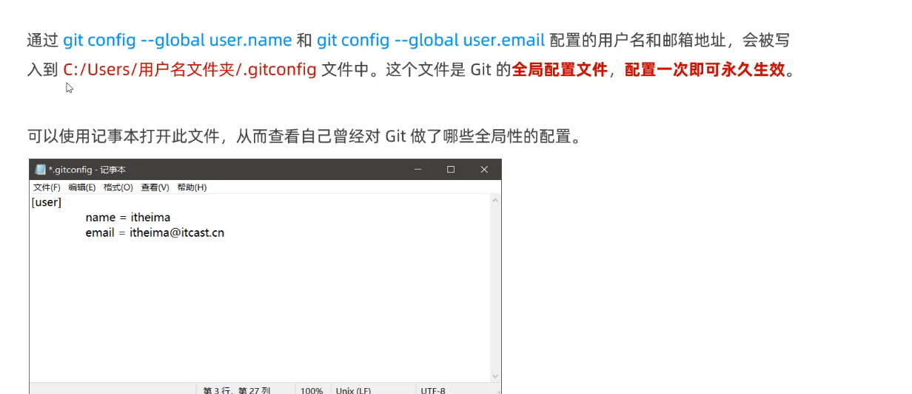

> win + R  ==> cmd ==> .gitconfig 

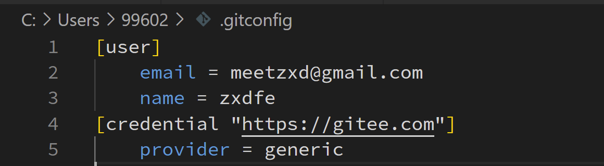

### 2.4 git 三个区域

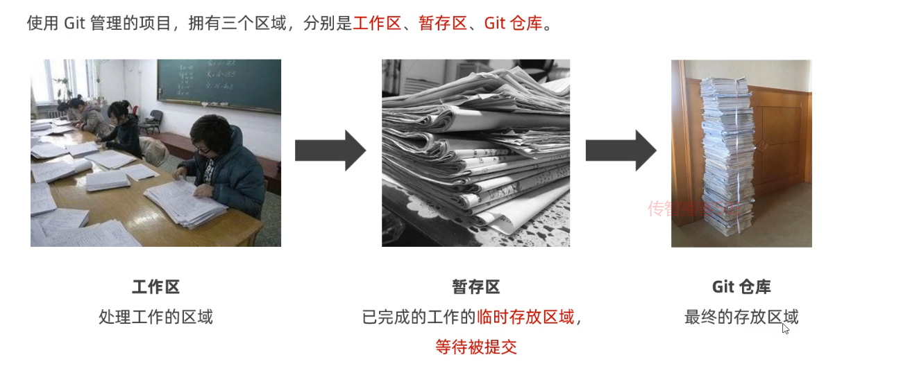

### 2.5 状态

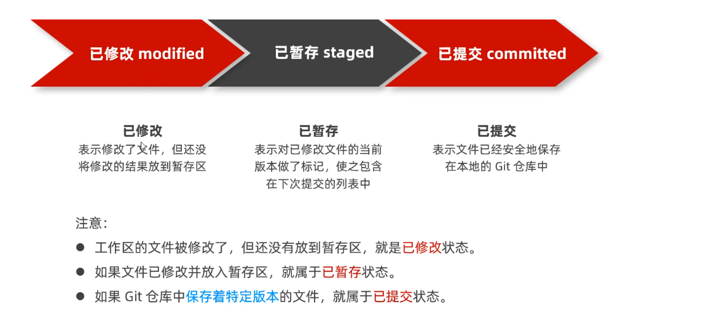


### 2.6 基本工作流程


## 3. 基本操作

### 3.1 git init

#### 建Git仓库

```js
// 方式 1.1   用Git之前已经有项目代码
cd 项目代码所在的文件夹
git init

// 方式 1.2   用Git之前还没有项目代码
cd 某个文件夹 
git init project_name // 在在当前路径下创建和项目名称同名的文件夹
cd project_name

// 方式 2    从其他服务器上克隆一个已经存在的Git仓库
cd 文件夹
git clone 某个地址
```

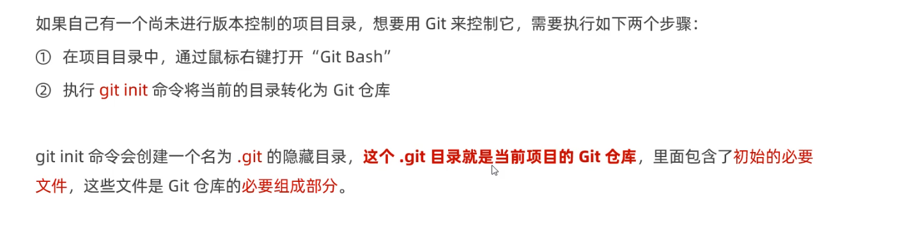

#### 文件的4种状态

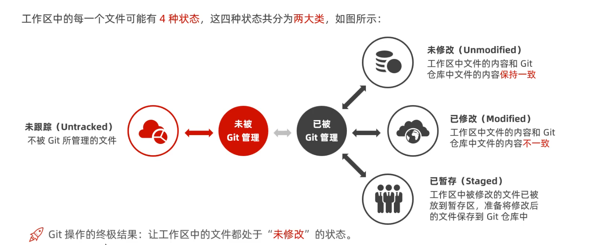

1. 未被跟踪的状态 Untracked  :  未跟踪 ,  文件没有纳入git管理
2. 已被跟踪的状态
   1. 未修改  Unmodified
   2. 已修改 Modified
   3. 已暂存  Staged

终极目标: 让工作区的内容, 和仓库中所保存的内容完全一致.

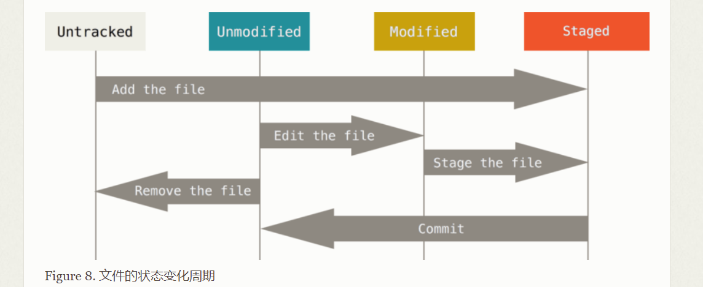


### 3.2 git status 

#### 检查当前文件的状态

> git status 检查当前文件的状态

- <span style="color:red">**红色**</span> 表示工作区中的文件需要提交
- <span style="color:lightGreen">**绿色**</span>  表示暂存区中的文件需要提交

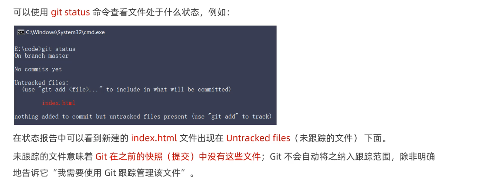

#### 中文乱码解决

如果执行git status中文乱码 如下

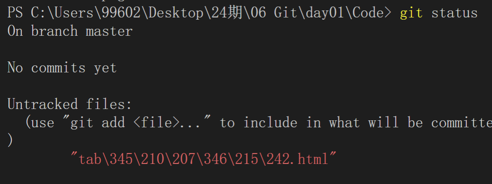

```js
// 解决git status中文显示问题
git config --global core.quotepath false
```

#### 精简模式

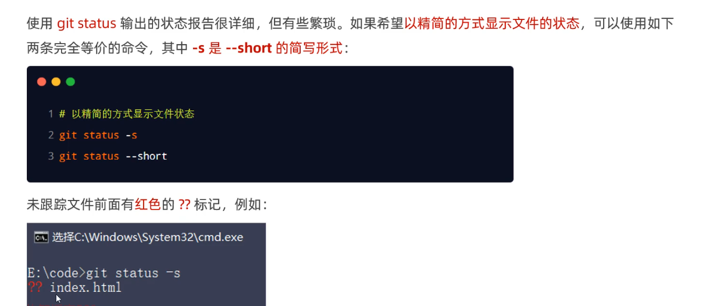

```js
git status -s 
git status --short

// 清空终端  cls  clear
```

- ?? :  新添加的未跟踪文件
- A :  新添加到暂存区中的文件
- M : 修改过的文件 (暂存区)

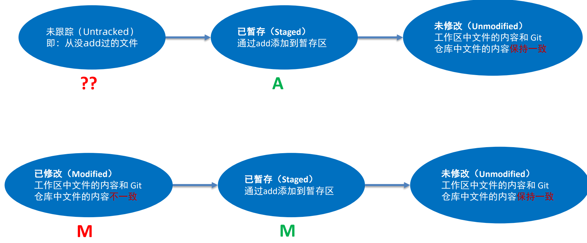

### 3.3 git add

#### 跟踪新文件

> 使用命令 `git add` 开始跟踪一个文件,  并且添加后的文件处于**暂存状态**

```js
git add 文件名
```

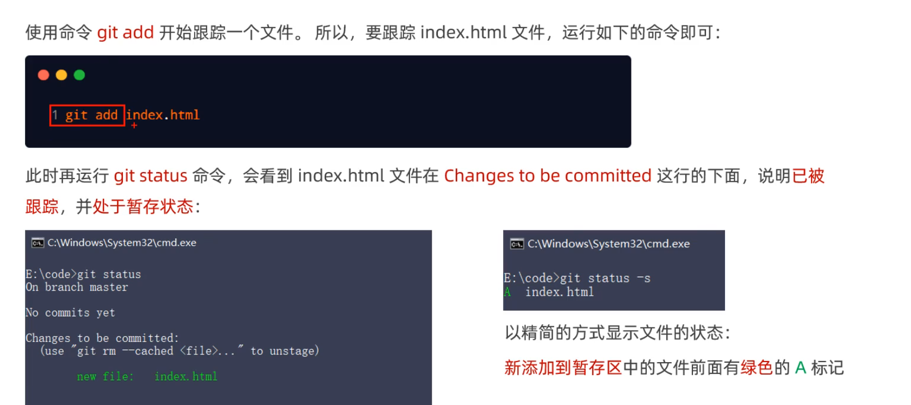

> 只要在 `Changes to be committed` 这行下面的，就说明是已暂存状态

#### 暂存已修改的文件

```js
git add 文件名
```

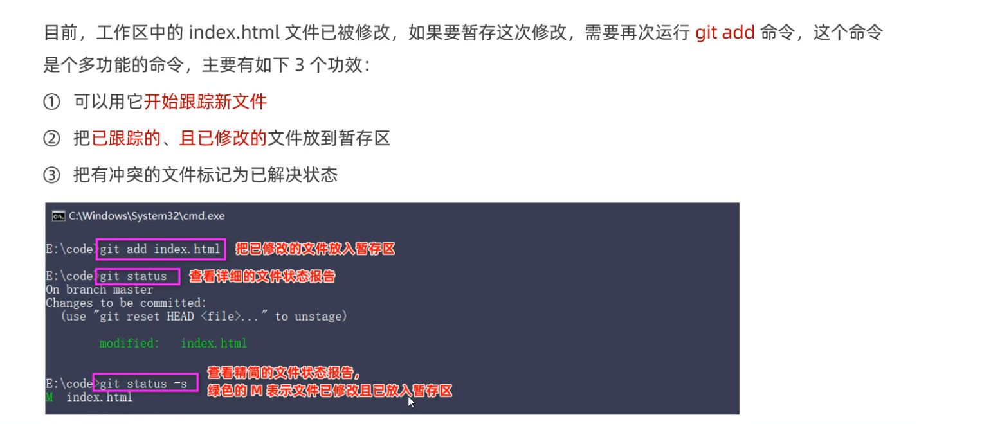


#### 向暂存区一次性添加多个文件

如果需要被暂存的文件个数比较多，可以使用如下的命令，一次性将所有的新增和修改过的文件加入暂存区：

```js
git add . // 注意 add后面是空格
```

>  **今后在项目开发中，会经常使用这个命令，将新增和修改过后的文件加入暂存区**


### 3.4 git commit

#### 提交更新

在提交更新之前，务必确认还有什么已修改或新建的文件还没有 `git add` 过， 否则提交的时候不会记录这些尚未暂存的变化。 这些已修改但未暂存的文件只会保留在本地磁盘。

 所以，每次准备提交前，先用 `git status` 看下，你所需要的文件是不是都已暂存起来了， 然后再运行提交命令 `git commit`：

```js
// 1. 提交之前 检查状态  git status
// 2. git commit -m "update"   ===> git commit -m"update" m和消息之间的空格可以省略
// 3. 提交完成后 检测状态  git status
```

```bash
git commit -m "本次提交要记录的提交描述信息"
```

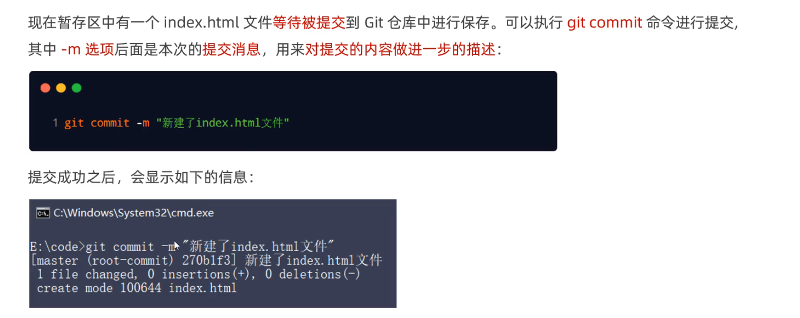

```bash
# 提交完成后，检测状态
# git status
On branch master
nothing to commit, working tree clean

# 只要执行git commit -m ""  就会把已暂存的文件 提交到本地仓库中持久的保存起来。（记录快照）
```

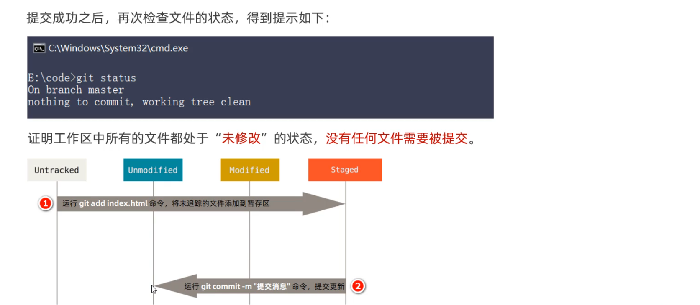

```js
// git add 新建的文件     ==>  暂存区
// git add 修改后的文件   ==>  暂存区
// git commit -m "msg"  =>  将暂存区文件 ===>提交到本地仓库
//  commit后，工作区的文件内容， 和 仓库中所保存的文件内容一致
```

#### 提交已暂存的文件

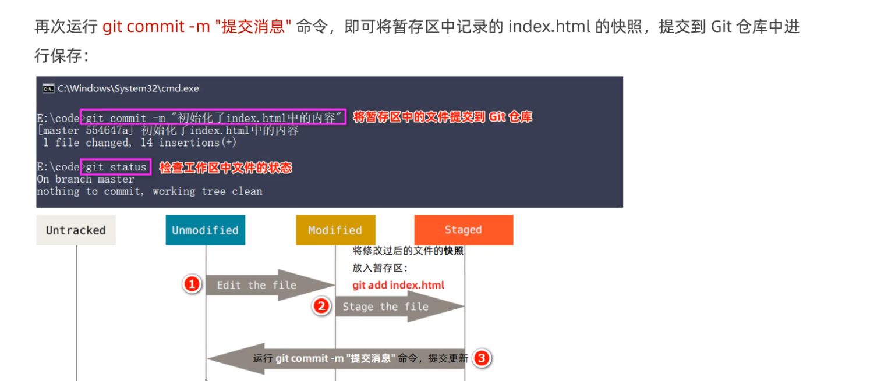


```js
git commit -m "update"

// 修改最近一次提交说明 amend修正
git commit --amend -m "修改最近一次提交信息"
```

#### 跳过使用暂存区

```js
git commit -a -m "描述信息"
```

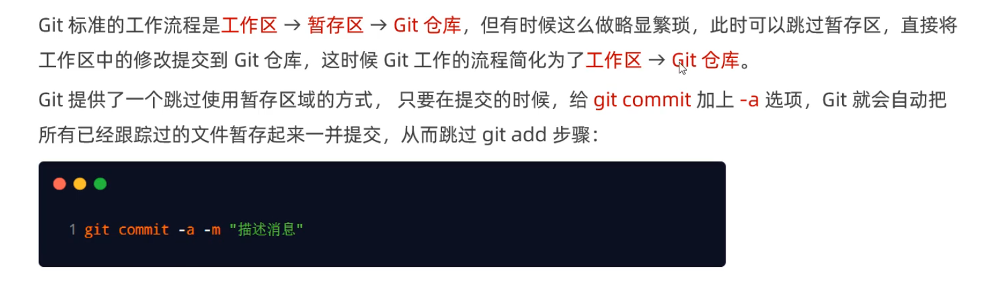

### 3.5 修改文件

> 对工作区的文件进行修改后， 修改后的文件会变为Modified 状态

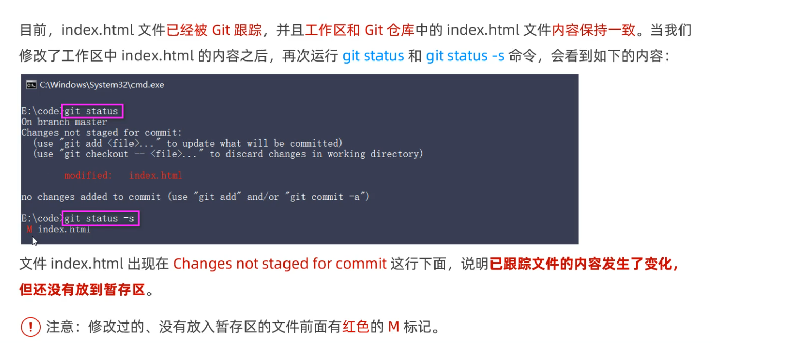

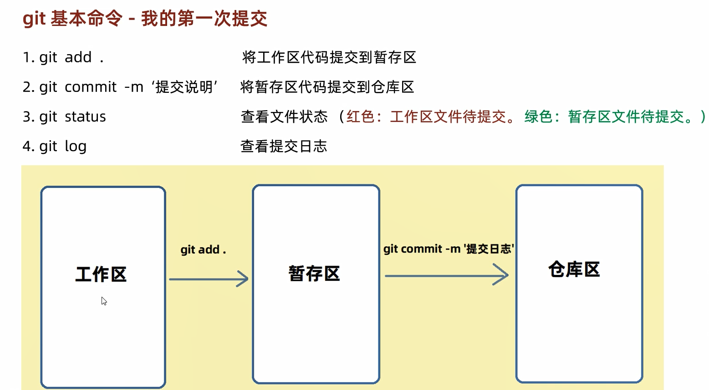

#### 撤销对文件的修改

- 实际开发用得非常少

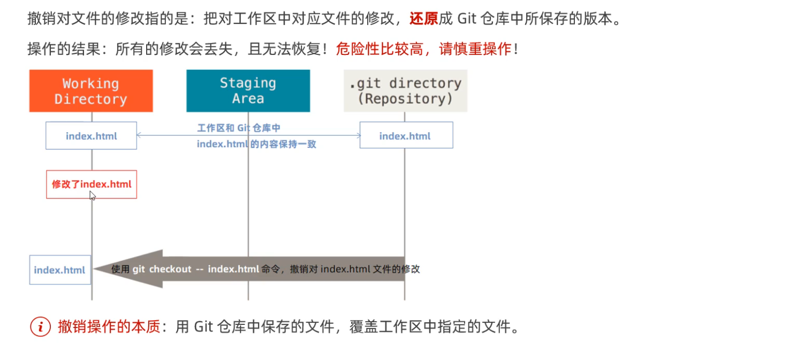

```js
git checkout -- 要撤销修改的文件
```

### 3.6 git reset

#### 取消暂存的文件

如果需要从暂存区中移除对应的文件，可以使用如下的命令：

```js
git reset HEAD 要移出的文件名称
// git status 再次检查

git reset HEAD . // 空格 英文点号， 把暂存区所有的文件都移到工作区
```

#### 回退到指定版本

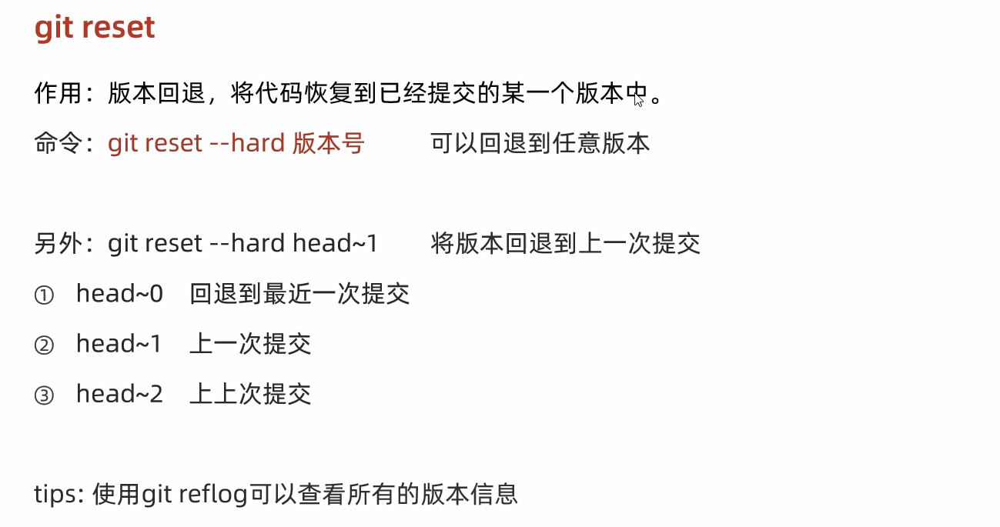

```bash
# 在一行上展示所有的提交历史
git log --oneline

# 使用 git reset --hard 命令，根据指定的提交 ID 回退到指定版本
git reset --hard <CommitID>

# 可以查看所有的版本记录
git reflog 
```


### 3.7 git rm

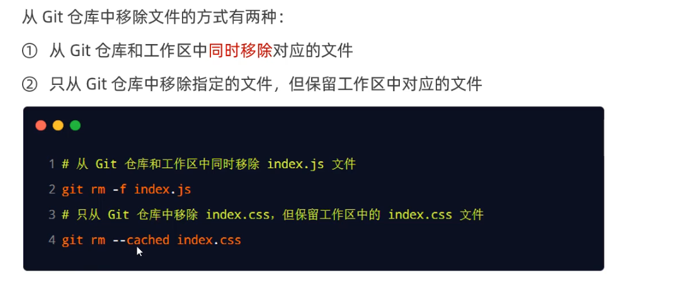

```bash
# 从 Git仓库和工作区中同时移除 index.js 文件
git rm -f index.js
# 只从 Git 仓库中移除 index.css，但保留工作区中的 index.css 文件
git rm --cached index.css
```

### 3.8 .gitignore


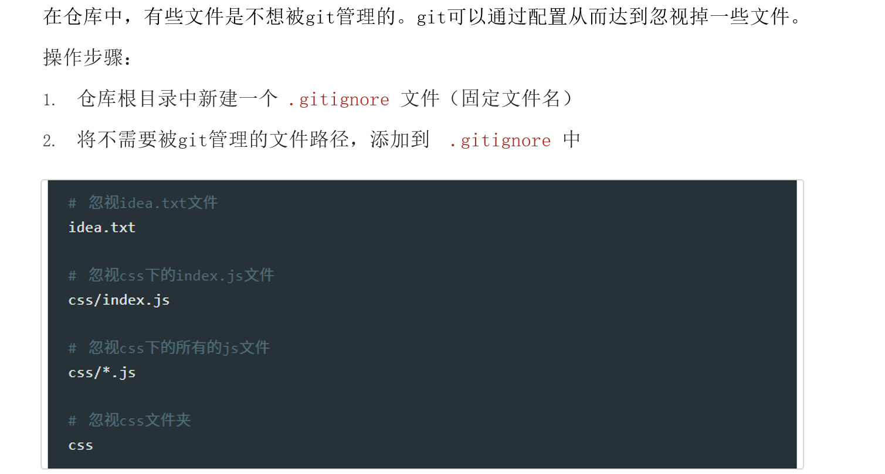

#### 匹配规则

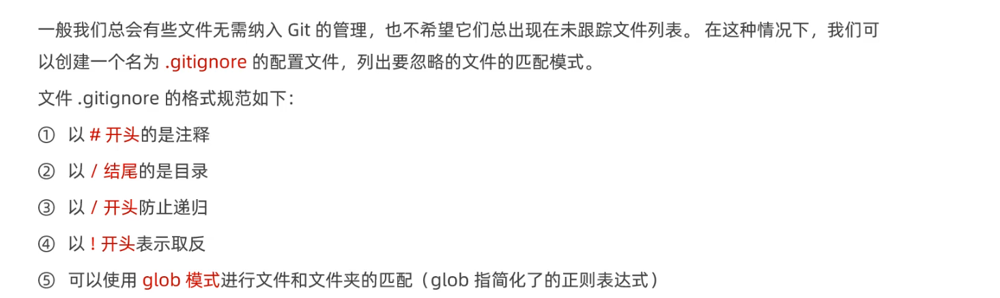

#### glob模式


#### 例子

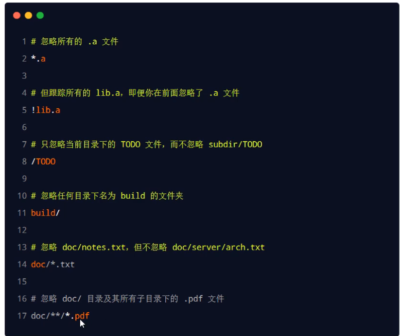

>  注意: .gitignore 只忽略没有被追踪的文件, 如果文件已经被纳入了管理, 则修改.gitignore无效.

解决办法 :先把本地缓存删除, 把仓库中的文件 改为  未被追踪的状态. 重新提交 

```bash
# 0. 进入项目路径

# 1. 清除本地当前的Git缓存
git rm -r --cached .

# 2. 应用.gitignore等本地配置文件重新建立Git索引
git add .

# 3. （可选）提交当前Git版本并备注说明
git commit -m 'update .gitignore'
```


### 3.9 git log

回车， 上下翻页， q退出

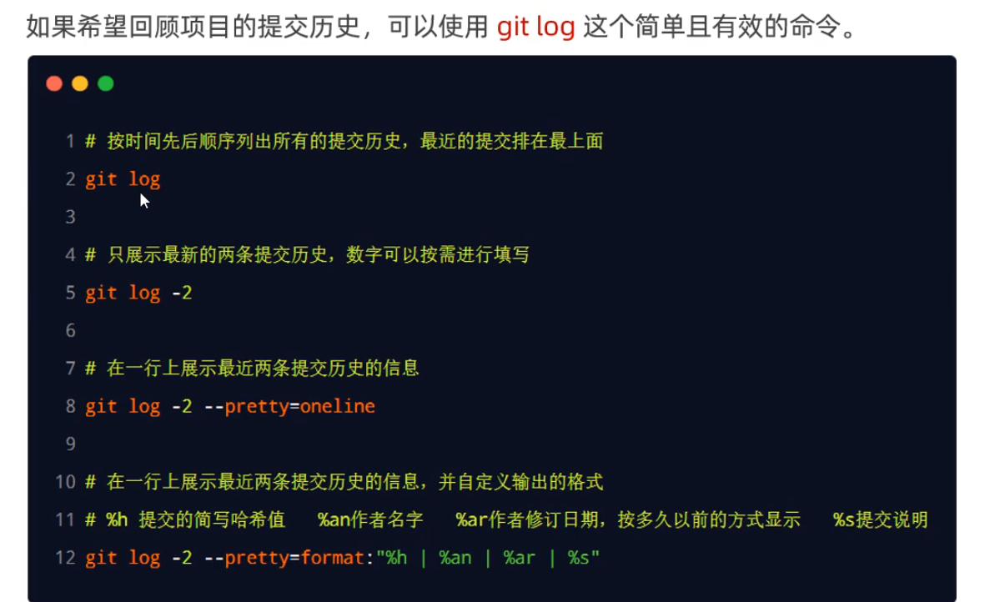

```bash
# 按时间先后顺序列出所有的提交历史，最近的提交在最上面
git log

# 只展示最新的两条提交历史，数字可以按需进行填写
git log -2

# 一行显示 ，hash简写
git log --online 

# 在一行上展示最近两条提交历史的信息
git log -2 --pretty=oneline

# 在一行上展示最近两条提交历史信息，并自定义输出的格式
# &h 提交的简写哈希值  %an 作者名字  %ar 作者修订日志  %s 提交说明
git log -2 --pretty=format:"%h | %an | %ar | %s"
```

