## Target

1. 能够知道Github的作用 
2. 能够创建并配置Github账号
3. 能够在Github中创建仓库并使用
4. 能够知道分支的作用
5. 能够创建分支与合并
6. 能够操作远程分支

💡🚀🤟👉👇☀️🍉🍍🍇🍓🥕🍭🎖️🎁☘️🍀💯🔆❗🔥🚩


## 1. 开源

### 1.1 基本概念


### 1.2 开源协议

开源并不意味着完全没有限制，为了**限制使用者的使用范围**和**保护作者的权利**，每个开源项目都应该遵守**开源许可协议**（Open Source License）

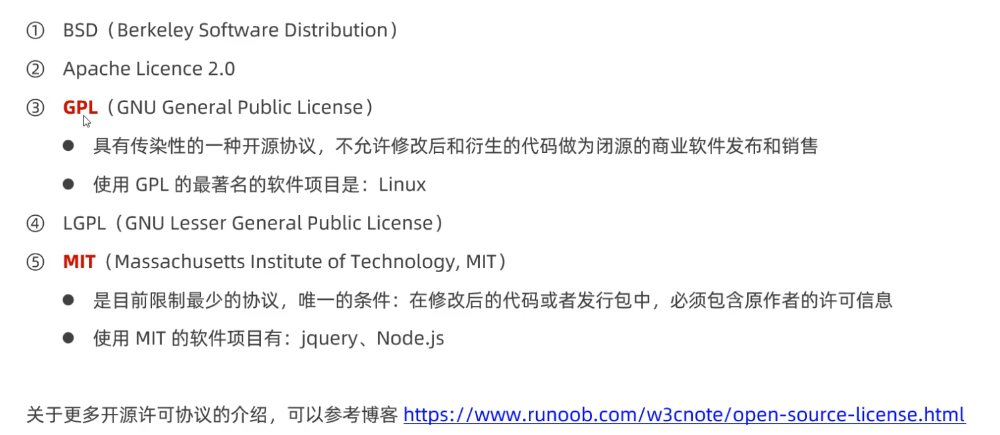

### 1.3 为什么拥抱开源

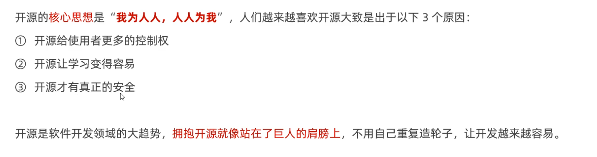

- 第三点不太认可哈，看什么项目了~~

### 1.4 托管平台

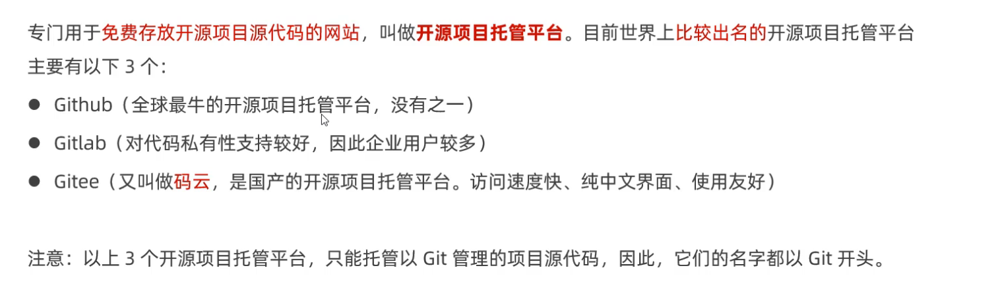

## 2. GitHub

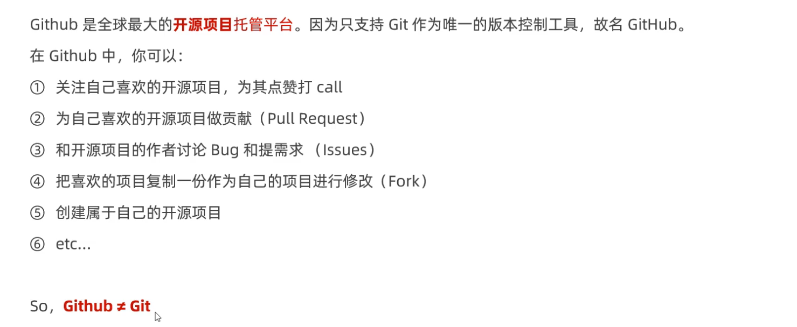

> Pull Request 解释 :  我改了你们的代码，请拉回去看看吧


### 2.1 注册Github


### 2.2 远程仓库

#### 1. 新建空白远程仓库

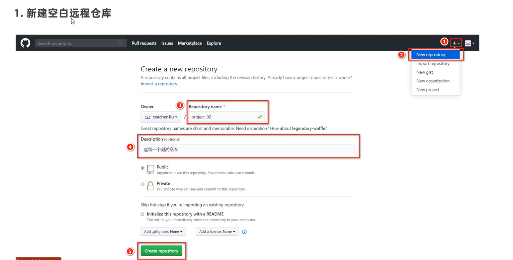

#### 2. 远程仓库的两种访问方式

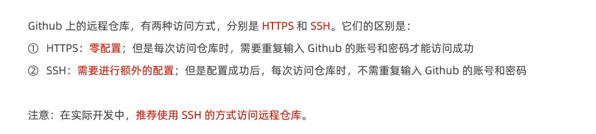

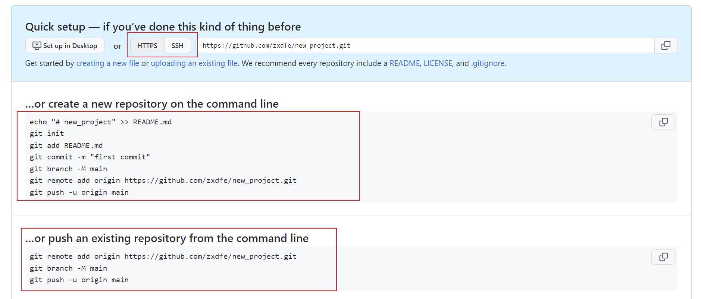

```js
git branch -M main  //  将当前主分支改名为 main  -M 强制 rename
// 黑人敏感词 master ？？ 
> 1. main 更短，简明扼要！
> 2. 更容易记住；
> 3. 如果让我的任何队友都感到舒适，那就开始吧！
> 4. 甚至不会让黑人在科技界感到更加孤立；
```

##### 添加远程仓库

要添加一个新的远程仓库，可以指定一个简单的名字，以便将来引用,命令格式如下：

```js
git remote add [shortname] [url]  // 本地仓库与远程仓库建立连接 
git remote add origin git地址
```

这个`origin`其实就是要添加的这个远程仓库`http:://xxx.git`的名称，还有upstream经常也会看到

##### 查看当前的远程库

```bash
git remote
git remote -v

# 执行时加上 -v 参数，你还可以看到每个别名的实际链接地址。
```


#### 3. 基于HTTPS上传 🔥

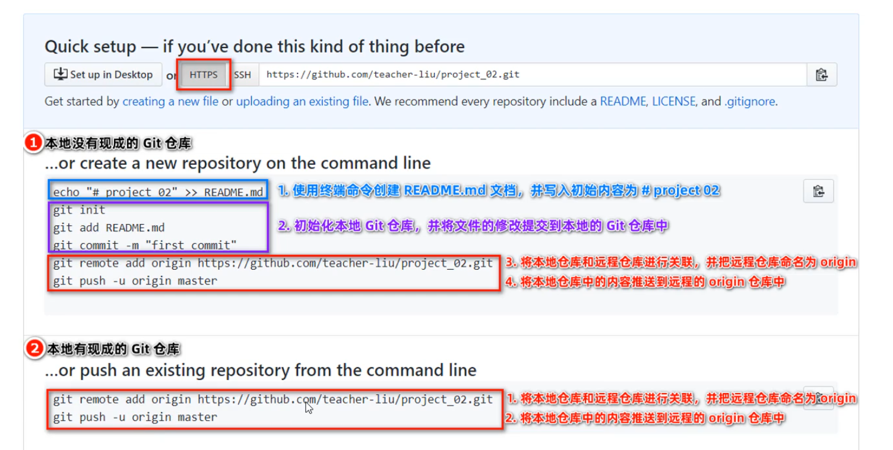

#### 4. git push 🔥

> **git push** 命令用于从将本地的分支版本上传到远程并合并。

```bash
git push <远程主机名> <本地分支名>
```

以下命令将本地的 master 分支推送到 origin 主机的 master 分支。

```bash
 git push origin master
 
 # origin 远程仓库的别名， master 本地分支名
```

```bash
git push -u origin master
# 加上了-u参数，Git不但会把本地的master分支内容推送的远程origin仓库，
# 还会把本地的master分支和远程的origin仓库关联起来，在以后的推送或者拉取时就可以简化命令
```

> 第一次推送 :  git push -u origin master

- 将本地的master分支和远程仓库的master分支绑定，这样的话以后每次的push操作都可以简化为git push而非git push origin master了。

#### 5. SSH key 🔥

`SSH key` 的**作用**：实现本地仓库和 `Github` 之间免登录的加密数据传输。

`SSH key` 的**好处**：免登录身份认证、数据加密传输。

`SSH key` 由**两部分组成**，分别是：

① `id_rsa`（私钥文件，存放于客户端的电脑中即可）

② `id_rsa.pub`（公钥文件，需要配置到 `Github` 中）

##### 生成SSH key

> [官方-生成新的SSH](https://docs.github.com/cn/authentication/connecting-to-github-with-ssh/generating-a-new-ssh-key-and-adding-it-to-the-ssh-agent)

① 打开 Git Bash

② 粘贴如下的命令，并将 `your_email@example.com` 替换为注册 `Github` 账号时填写的邮箱：

```bash
$ ssh-keygen -t ed25519 -C "your_email@example.com"
```

```bash
# 注：如果您使用的是不支持 Ed25519 算法的旧系统，请使用以下命令：
$ ssh-keygen -t rsa -b 4096 -C "your_email@example.com"
```

以下步骤, 直接敲回车略过就好

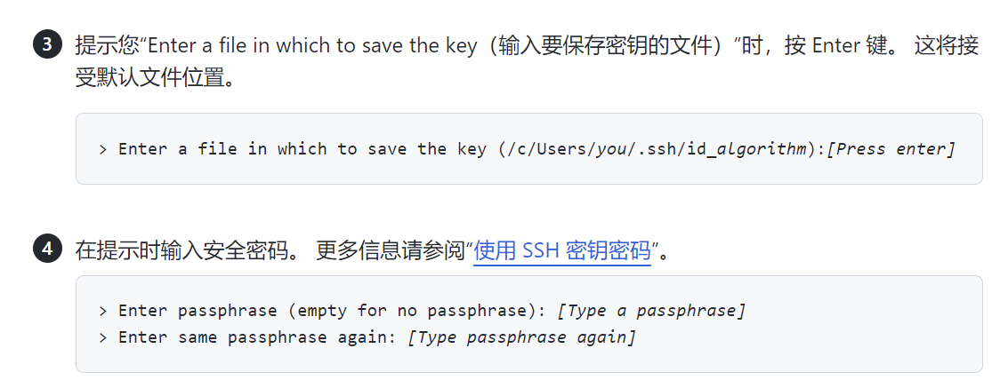

③ 连续敲击 3 次回车，即可在 `C:\Users\用户名文件夹\.ssh` 目录中生成 `id_rsa` 和 `id_rsa.pub` 两个文件

##### 配置添加 SSH 秘钥

> [添加 SSH 秘钥](https://docs.github.com/cn/authentication/connecting-to-github-with-ssh/adding-a-new-ssh-key-to-your-github-account)

① 使用记事本打开 `id_rsa.pub` 文件，复制里面的文本内容

② 在浏览器中登录 `Github`，点击头像 -> `Settings -> SSH and GPG Keys -> New SSH key`

③ 将 `id_rsa.pub` 文件中的内容，粘贴到 `Key` 对应的文本框中

④ 在 `Title` 文本框中添加新密钥添加描述性标签, 如果您使用的是个人 Mac，此密钥名称可能是 "Personal MacBook Air"。

- 需要输入密码确认操作

##### 检测SSH key是否配置成功

> [测试 SSH 连接](https://docs.github.com/cn/authentication/connecting-to-github-with-ssh/testing-your-ssh-connection)

打开 `Git Bash`，输入如下的命令并回车执行：

```bash
ssh -T git@github.com
```

您可能会看到类似如下的警告：

```shell
> The authenticity of host 'github.com (IP ADDRESS)' can't be established.
> RSA key fingerprint is SHA256:nThbg6kXUpJWGl7E1IGOCspRomTxdCARLviKw6E5SY8.
> Are you sure you want to continue connecting (yes/no)?
```

验证所看到消息中的指纹是否匹配 [GitHub 的公钥指纹](https://docs.github.com/cn/github/authenticating-to-github/githubs-ssh-key-fingerprints)。 如果是，则输入 `yes`：

```shell
> Hi username! You've successfully authenticated, but GitHub does not
> provide shell access.
```

#### 6. 基于SSH上传

1. 先本地创建一个项目文件夹, 并在项目中添加一些新的文件
2. 运行 `git init` 初始化新的创库
3. 检查当前工作区状态 `git status -s`
4. 运行  `git add .` 将文件都添加进暂存区 ,  并再次检查文件状态 `git status -s`
5. 运行 `git commit -m "初始化项目"` (描述信息可以自定义)
6. 到此, 我们完成了一个本地的版本提交 , 但是并没有同步到远端.

##### Github端新建仓库

1. 顶部右侧头像处点击新建一个空仓库  Repository  /rɪˈpɒːzətɔːri/

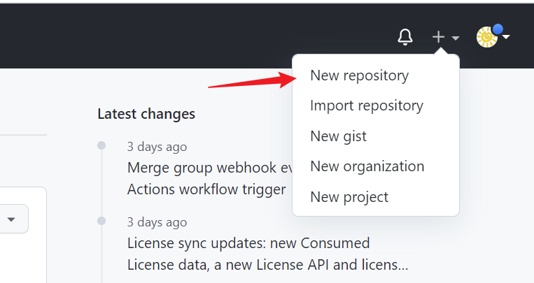

2. 给新建的仓库命名,  可以写上一条描述语句, 其他都不需要勾选, 直接点击 `Create repository`


3. 因为我们刚才已经初始化好了一个本地的仓库, 所以现在可以直接选择第二个方框中命令操作, 注意切换为SSH

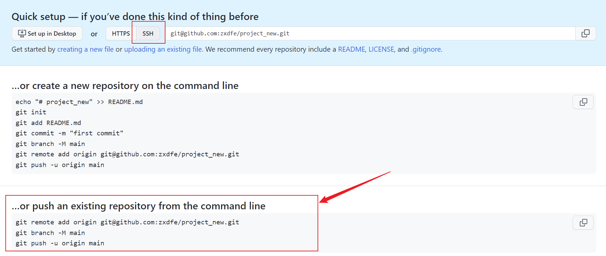

```bash
# 1. 粘贴这句在刚才项目终端中, 点击回车, 建立远端仓库的链接
git remote add origin git@github.com:zxdfe/project_new.git
# 2.新建一个main分支, 可以不用做这一条操作
# git branch -M main
# git push -u origin main

# 2.如果不新建分支, 那么只需要 粘贴这句, 回车 
git push -u origin master 
```

在Git Bash终端中,  右键复制上方两条命令 回车执行.  注意 , 需要是在当前项目下

#### 7. clone远程仓库

```bash
# 可以 选择HTTPS 或者 SSH 都行
git clone 远程仓库地址
# 比如下载Vue的项目源码, 可以使用如下命令
git clone git@github.com:vuejs/vue.git
```

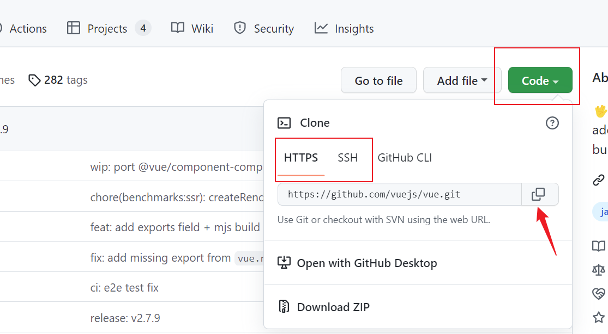

## Gitee

### 1. 远端仓库

#### 1.1 新建仓库

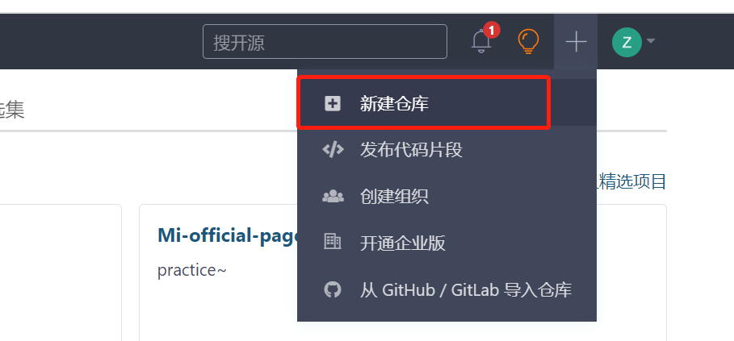

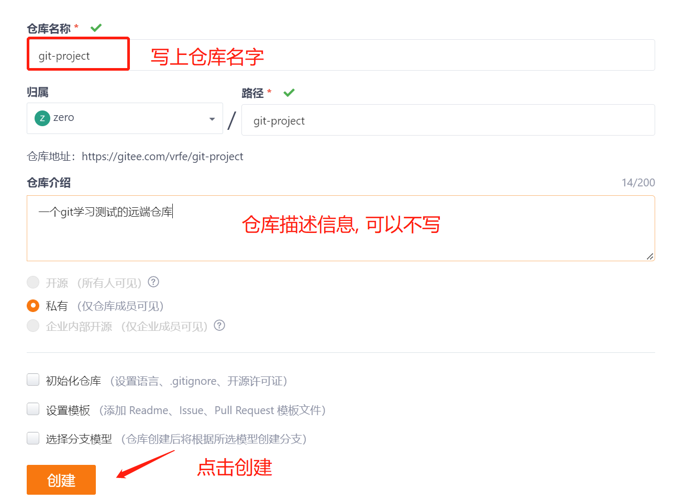


#### 1.2 关联远端仓库HTTPS

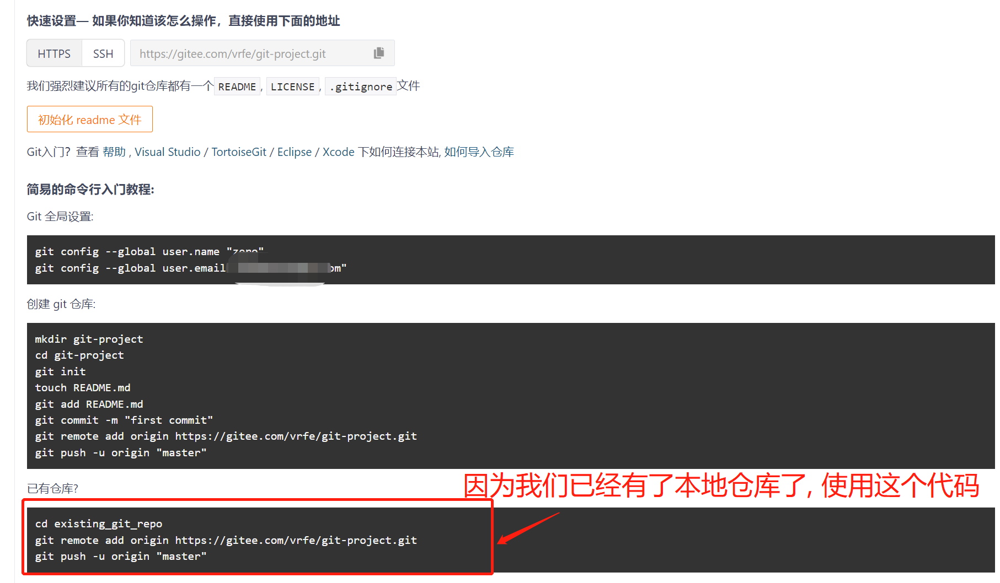

```bash
git remote add origin https://gitee.com/vrfe/git-project.git
git push -u origin "master"
```

##### 输入gitee码云的 邮箱 和 密码

- 注意这里的用户名是输入邮箱! 输入完确认后, 会自动执行刚才的push推送命令

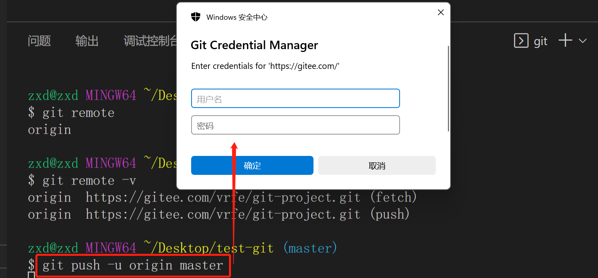

看到类似下图的显示, 表示已经将我们本地的代码推送的远端仓库了 

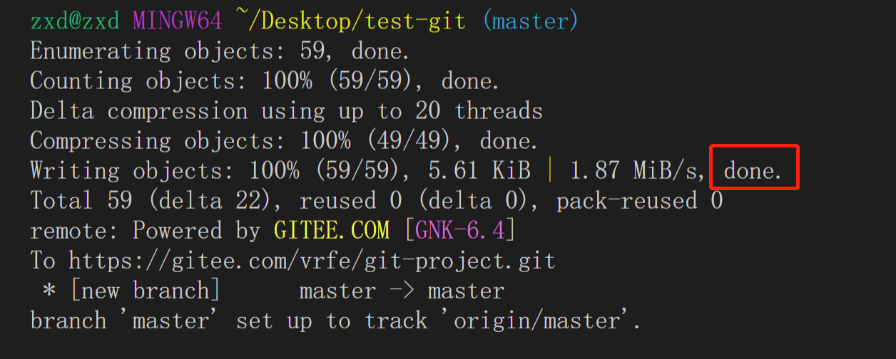

##### 查看远端仓库

- 如果远端仓库项目中已经有了我们本地的代码, 同样说明已经推送成功!

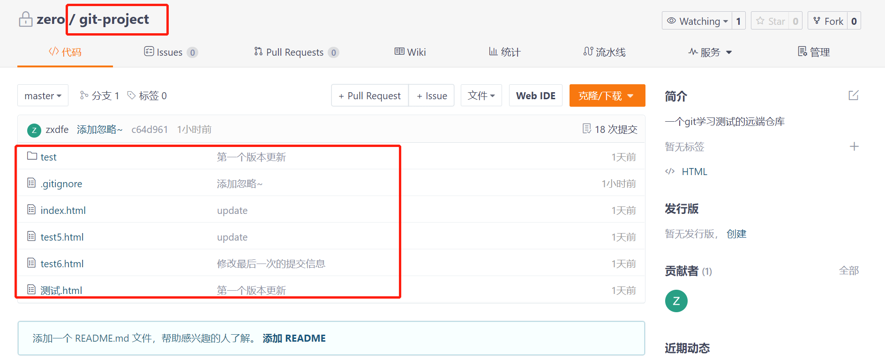

##### 第二次推送 HTTPS的情况

```bash
# 之后每次修改代码 , 提交本地更新 (提交到本地仓库后), 可以继续将更新同步推送到远端仓库
# 修改代码后, 依次使用命令
git status  # 查看
git add .   # 添加到暂存区
git commit -m "msg" # 提交更新版本, 本地仓库永久保存了这一版本
git push    # 推送到远端仓库
```

#### 1.3 使用SSH的方式

点击头像下方的设置

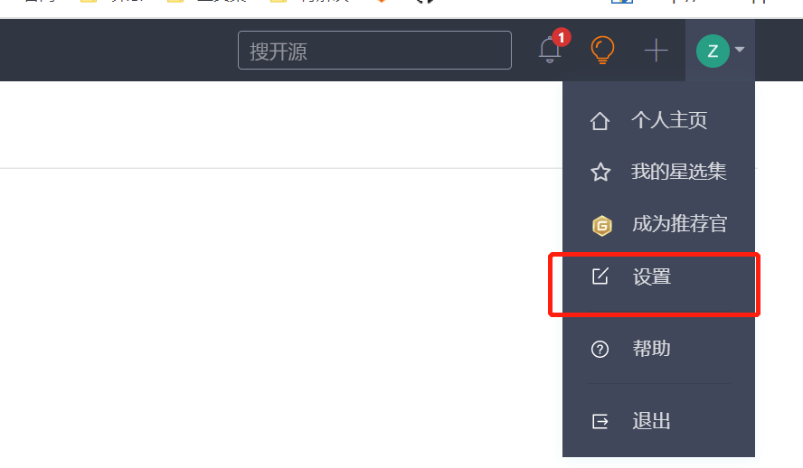

找到左侧的 SSH公钥, 点击怎样生成公钥

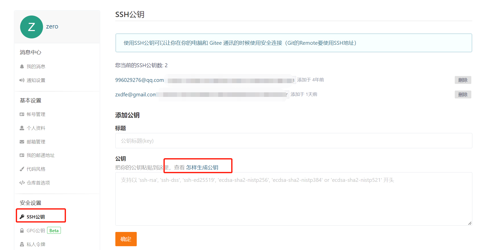

##### 生成添加SSH公钥

[Gitee-SSH公钥](https://gitee.com/help/articles/4181#article-header0)

简单解释下: 

既然是加密，那肯定是不希望别人知道我的消息，所以只有我才能解密，所以可得出**公钥负责加密，私钥负责解密**；同理，既然是签名，那肯定是不希望有人冒充我发消息，只有我才能发布这个签名，所以可得出**私钥负责签名，公钥负责验证**。

> 公钥加密, 私钥解密 
>
> 私钥签名, 公钥验证

公钥和私钥成对出现~~~~

> 生成SSH 秘钥

```bash
ssh-keygen -t ed25519 -C "xxxxx@xxxxx.com"  
# Generating public/private ed25519 key pair...
```

按照提示完成三次回车，即可生成 ssh key。通过查看 `~/.ssh/id_ed25519.pub` 文件内容，获取到你的 public key

```bash
cat ~/.ssh/id_ed25519.pub
# ssh-ed25519 AAAAB3NzaC1yc2EAAAADAQABAAABAQC6eNtGpNGwstc....
Ctrl + C 复制;
```

##### 添加关联远程仓库

```bash
git remote add origin git@gitee.com:vrfe/git-project.git
git push -u origin "master"

# 因为刚才已经添加过origin别名的远程仓库了
git remote rm origin
# 重新添加远程仓库
git remote add origin git@gitee.com:vrfe/git-project.git
# git push  ==> 不能这么推送, 相当于第一次推送了
git push -u origin "master"  
```

##### 报错解决

```bash
$ git push
fatal: The current branch master has no upstream branch.
To push the current branch and set the remote as upstream, use

    git push --set-upstream origin master
    --set-upstream : 为当前本地分支设置默认远程分支。
===> 简写 git push -u origin master
```

##### 常见命令

```bash
# 一些常见命令
# cat 查看文件内容  ~/ 表示用户目录
# mkdir 新建文件夹
# touch 新建文件
# cd 进入某个文件   cd .. 回到上一层目录
# . 表示当前目录  .. 表示上一层目录
# clear 清除控制台  terminal中也可以 ==> cls
# ls 显示没有隐藏的文件与文件夹  查看文件列表
# ll 查看文件列表详情
# ls -a 显示所有文件与文件夹(包括 隐藏文件 ./和 ../)
# pwd 显示用户当前目录

# 使用vim编辑器 
vi 文件名  编辑文件
i  进入编辑模式
:q 不保存退出 (若有修改提示报错)
:q! 强制不保存退出
:w  保存
:wq 强制保存并退出
按ESC, 退出编辑模式
```

#### 1.4 VSCode 切换默认的终端

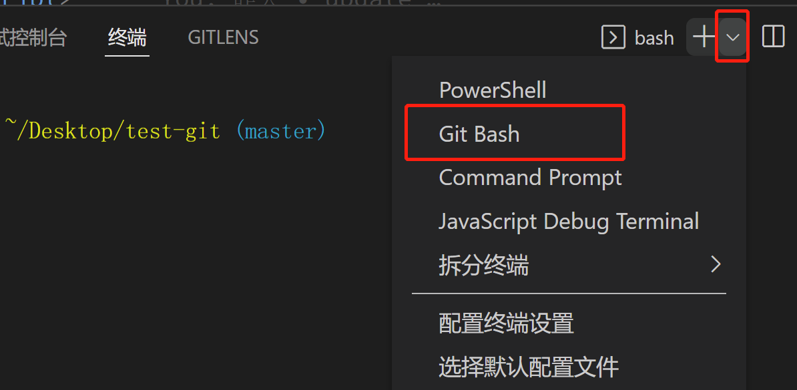

```bash
```


## 3. 分支branch

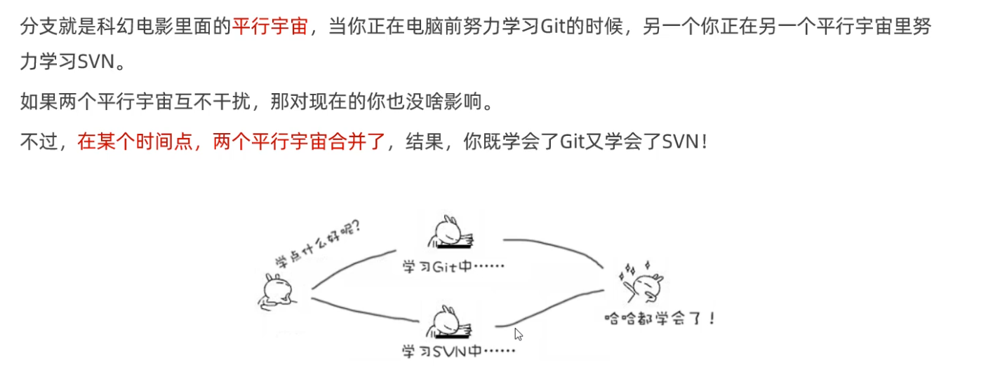

### 3.1 分支在实际开发中的作用


### 3.2 master主分支

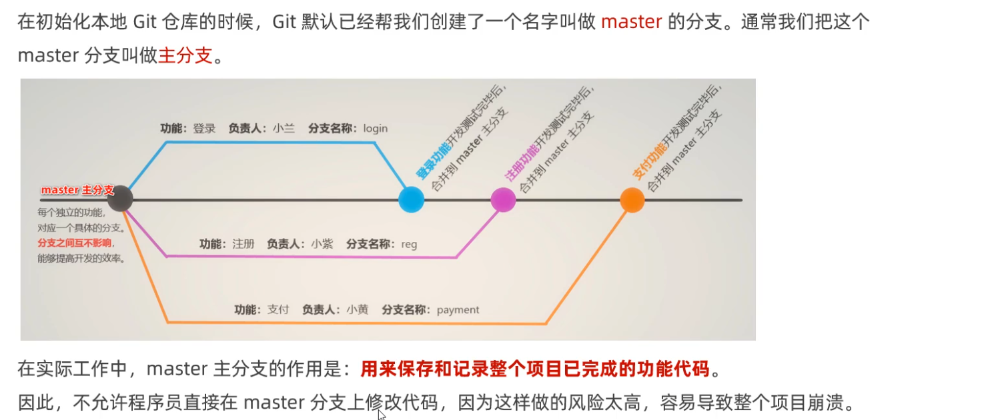

### 3.3 功能分支

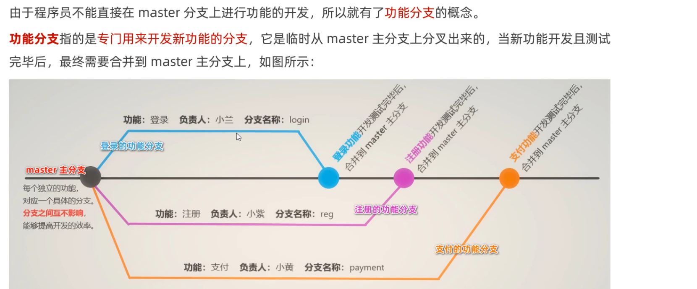

### 3.3 查看分支列表

```bash
# 在仓库目录下输入如下命令
git branch 
```

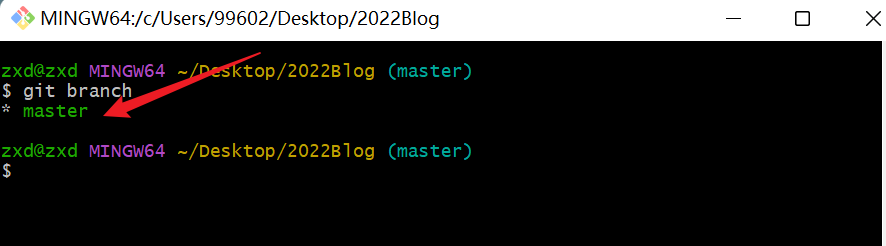

**注意：**分支名字前面的 ***** 号表示当前所处的分支。

### 3.4 创建新分支

使用如下的命令，可以**基于当前分支**，**创建一个新的分支**，此时，新分支中的代码和当前分支完全一样：

```bash
# 在 branch 后面加上一个名字, 代表创建一个新分支
git branch 新分支名称
# 注意, 
# 1. 创建的分支是基于当前所处的分支创建的
# 2. 创建完后, 用户还是处在master分支上
```


### 3.5 切换分支

使用如下的命令，可以**切换到指定的分支上**进行开发：

```bash
git checkout 指定分支名字
# 比如: 切换到login分支上
git checkout login 
```

图示如下

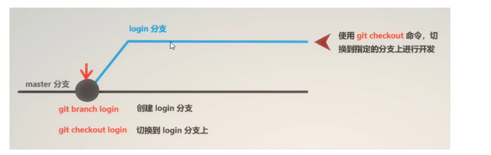

### 3.6 快速创建和切换

使用如下的命令，可以**创建指定名称的新分支**，并**立即切换到新分支上**：

```bash
# -b 表示创建一个新分支
# checkout 表示切换到刚才新建的分支上
git checkout -b 分支名称
```

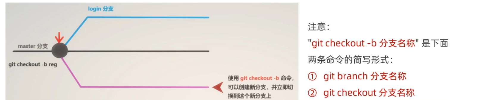

> 注意:创建新分支的时候, 要先切换到master主分支上.

### 3.7 分支合并

功能分支的代码开发测试完毕之后，可以使用如下的命令，将完成后的代码合并到 `master` 主分支上：

```bash
# 1. 切换到 master 分支
git checkout master
# 2. 在master 分支上运行 git merge 命令，将 login 分支的代码合班到 master 分支
git merge login
```

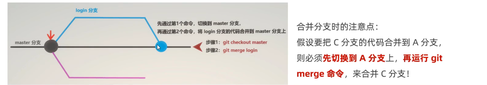

**合并分支时的注意点**：

假设要把 login 分支的代码合并到 test 分支，

则必须**先切换到 test 分支**上，**再运行 git merge 命令**，来合并 login  分支！

### 3.8 删除分支

当把功能分支的代码合并到 `master` 主分支上以后，就可以使用如下的命令，删除对应的功能分支：

```bash
git branch -d 分支名称
# 注意要删除某个分支时, 不能在那个分支上面
```

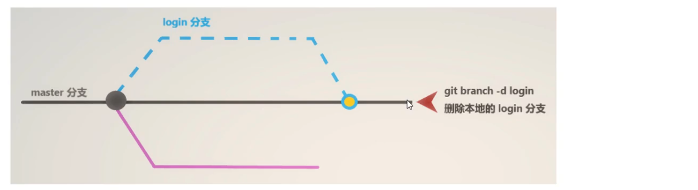

### 3.9 合并冲突

如果**在两个不同的分支中**，对**同一个文件**进行了**不同的修改**，Git 就没法干净的合并它们。 此时，我们需要打开

这些包含冲突的文件然后**手动解决冲突**。

```bash
# 假设：在把 reg 分支合并到 master 分支期间
git checkout master
git merge reg

# 打开包含冲突的文件，手动解决冲突之后，再执行如下命令
git add .
git commit -m "解决了分支合并冲突的问题"
```

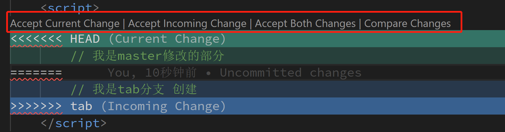

> 1. 采用当前更改 2. 采用传入更改  3. 保留双方更改  4. 比较变更

 ```bash
 <<<<<<<  HEAD 
 # 这里的是当前分支上修改的内容
 ========
 # 这里的是要merge过来的那个分支的修改内容
 >>>>>>> tab
 ```


## 4. 远程分支remote

### 4.1 将本地分支推送到远程仓库

如果是**第一次**将本地分支推送到远程仓库，需要运行如下的命令：

```bash
# -u 表示把本地分支和远程分支进行关联，只在第一次推送的时候需要带 -u 参数
git push -u 远程仓库的别名 本地分支名称:远程分支名称

# 实际案例   :重命名    原来名字:新名字
git push -u origin payment:pay

# 如果希望远程分支的名称和本地分支名称保持一致，可以对命令进行简化
git push -u origin payment
```

### 4.2 查看远程仓库所有分支列表

通过如下的命令，可以查看远程仓库中，所有的分支列表的信息：

```bash
git remote show 远程仓库名称
git remote show origin  # origin是远程仓库的别名
```

### 4.3 跟踪分支

跟踪分支指的是：从远程仓库中，把远程分支下载到本地仓库中。需要运行的命令如下：

```bash
# 从远程仓库中, 把对应的远程分支下载到本地仓库, 保持本地分支和远程分支名称相同
git checkout 远程分支名字

# 示例
git checkout pay

# 如果需要重命名
# 从远程仓库中，把对应的远程分支下载到本地仓库，并把下载的本地分支进行重命名
git checkout -b 本地分支名称 远程仓库名称/远程分支名称

# 示例
git checkout -b payment origin/pay
```

### 4.4 拉取远程分支最新代码

可以使用如下的命令，把远程分支最新的代码下载到本地对应的分支中:

```bash
# 从远程仓库，拉取当前分支最新的代码，保持当前分支的代码和远程分支代码一致
git pull
```

### 4.5 删除远程分支

可以使用如下的命令，删除远程仓库中指定的分支：

```bash
# 删除远程仓库中，指定名称的远程分支
git push 远程仓库名称 --delete 远程分支名称

# 示例
git push origin --delete pay

# PS.注意: 删除本地分支
git branch -d 分支  # 如果代码没有合并到master, 会提示
git branch -D 分支 
```

## 5. 总结

- 能够掌握 `Git` 中基本命令的使用
  - `git init`
  - `git add .`
  - `git commit –m "提交消息"` 
  - `git status` 和 `git status -s`
- 能够使用 `Github` 创建和维护远程仓库
  - 能够配置 `Github` 的 `SSH` 访问
  - 能够将本地仓库上传到 `Github`
- 能够掌握 `Git` 分支的基本使用
  - `git checkout -b 新分支名称`
  - `git push -u origin 新分支名称`  第一次上传
  - `git checkout 分支名称`
  - `git branch`  查看当前分支

## 6. SourceTree
