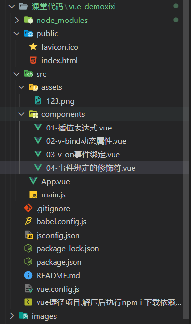
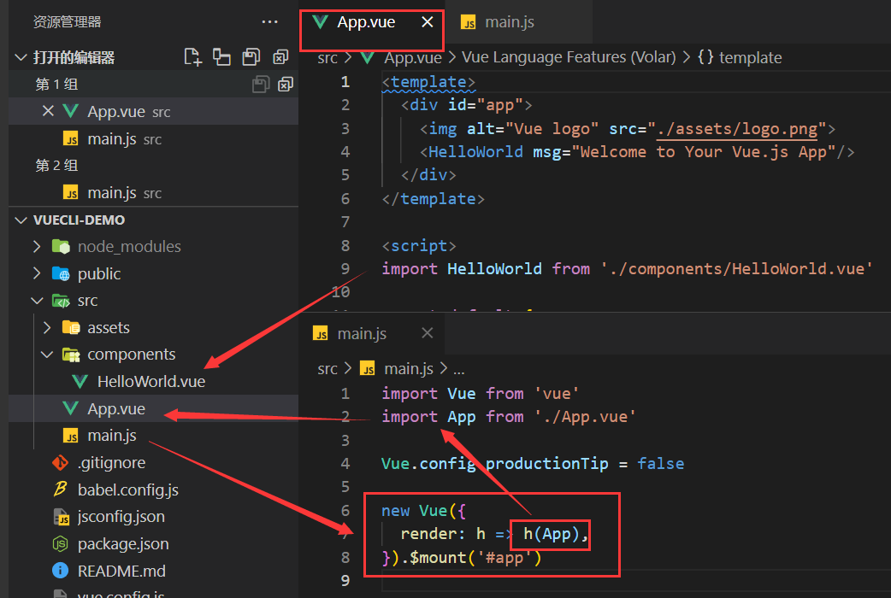
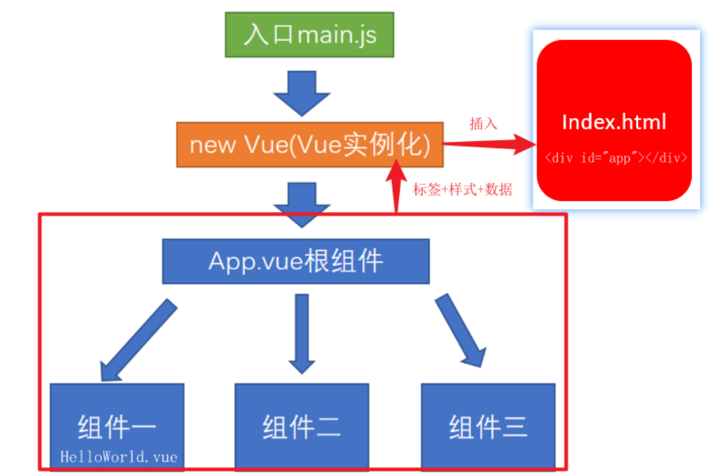
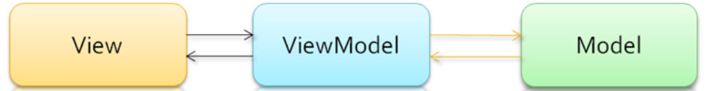
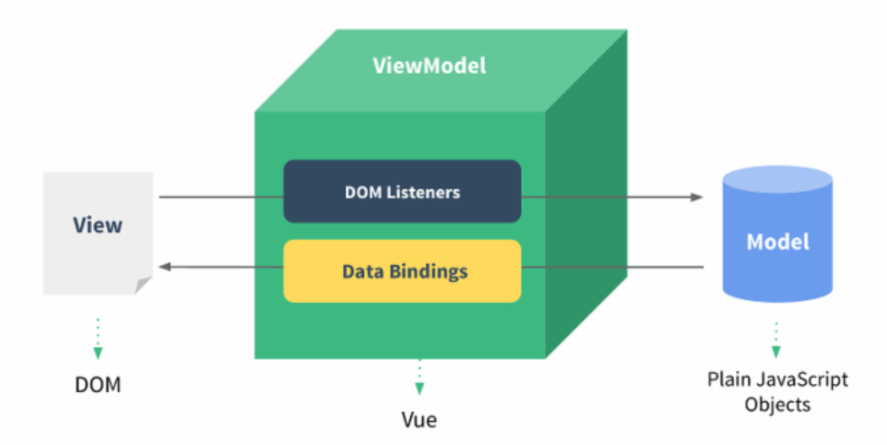

# vue02.base

## 1. 渐进式框架 - VUE

> 官网地址: https://cn.vuejs.org/ (作者: 尤雨溪)

**渐进式：逐渐使用，集成更多功能** - 逐渐进步, 想用什么就用什么, 不必全都使用 (可以联想一下vscode及它的插件库)

## 2. @vue/cli 目录和代码分析




```vue
 vuecil-demo        # 项目目录
    ├── node_modules # 项目依赖的第三方包
    ├── public       # 静态文件目录
      ├── favicon.ico# 浏览器小图标
      └── index.html # 单页面的html文件(网页浏览的是它)
    ├── src          # 业务文件夹
      ├── assets     # 静态资源
        └── logo.png # vue的logo图片
      ├── components # 组件目录
        └── HelloWorld.vue # 欢迎页面vue代码文件 
      ├── App.vue    # 整个应用的根组件
      └── main.js    # 入口js文件
    ├── .gitignore   # git提交忽略配置
    ├── babel.config.js  # babel配置
    ├── package.json  # 依赖包列表
    ├── README.md    # 项目说明
        └── yarn.lock    # 项目包版本锁定和缓存地址

```

主要文件及含义

```vue
node_modules下都是下载的第三方包 可以通过npm install下载，一般不会做为拷贝对象
public/index.html – 浏览器运行的网页
src/main.js – webpack打包的入口文件
src/App.vue – vue项目入口页面
package.json – 依赖包列表文件

```

注意：引用组件要遵循的三个步骤

```vue
<template>
<!-- 页面的标签结构，可以类比于html -->
<!-- 在template标签中，只能有一个跟标签<div> -->
  <div id="app">
   <Demo></Demo>
  </div>
</template>

<script>
//  js相关代码
// 引用组件要遵循的三个步骤
/*
 1.通过import 引入组件，并起名字
 2.通过components属性进行组件的“注册”
 3.在template标签内，以标签的形式继续使用
*/ 

import Demo from './components/04-事件绑定的修饰符.vue'
export default {
  name: 'App',
  components: {
    Demo
  }
}
</script>

<style scoped>

/* 一般情况下会去设置一个属性 scoped，这个属性的目的是让这个文件夹的样式只作用域这个style样式 */

</style>
```


## 3.App.vue, main.js, index.html的关系 App.vue => main.js => index.html

3.1 App.vue里面需要“关联”自己的components项目文件，例：import xxx from '自己的项目vue文件路径'

3.2 main.js（入口文件）里同样需要关联App.vue

**作用：**

1. main.js - 项目打包入口 - Vue初始化
2. App.vue - Vue页面入口
3. index.html - 浏览器运行的文件





## 4.单vue文件的好处

> 单vue文件好处, 独立作用域互不影响

- Vue推荐采用.vue文件来开发项目
- template里只能有一个根标签
- vue文件-独立模块-作用域互不影响
- style配合scoped属性, 保证样式只针对当前template内标签生效
- vue文件配合webpack, 把他们打包起来插入到index.html

# 总结：

1. @vue/cli的本质是一个脚手架
2. 通过`vue create 项目名称`创建脚手架， 通过`npm run serve`启动
3. 脚手架的优势是不需要配置webpack直接可以使用
4. 脚手架项目打包的入口是`main.js`所有和项目有联系的代码都需要和它有联系
5. 浏览器真正运行的html是`public/index.html`
6. 单`vue`文件拥有独立的作用域，不会影响其他文件


## 1-插值表达式.vue

语法：{{ 表达式}}

**注意：**

1. dom中插值表达式赋值
2. vue的变量必须在data里声明

```vue
<template>
<!-- 1.通过<vue 来快捷部署页面构建 -->
  <div>
    <!-- 通过花括号的形式来构建插值表达式 -->
    <!-- 简单来说在标签里面写js代码 -->
    <div>{{ 111 }}</div>
    <div>{{ msg }}</div>
    <div>{{ obj.uname }}</div>
    <div>{{ obj.height }}</div>
    <div>{{ obj.age >= 18 ? '成年' : '未成年' }}</div>
  </div>
</template>

<script>
export default {
    // 2.给每一个vue文件起个名字 （要求：组件的名称一般情况下是全英文驼峰式）

    name: 'demo-01',

    // 3. 一个vue文件中声明的变量需要放置在data函数的return对象上
    data () {
        return {
            msg: '插值表达式',
            obj: {
                age: 18,
                uname: '淏',
                height: '188cm'
            }
        }
    }
}
</script>
```


##  MVVM设计模式（面试必考）

场景： 当修改了data中的某个数据时， vue可以帮助我们在数据修改的同时，页面上的相应部分也会做出改变

演示: 在上个代码基础上, 在devtool工具改变M层的变量, 观察V层(视图的自动同步)


设计模式: 是一套被反复使用的、多数人知晓的、经过分类编目的、代码设计经验的总结。

- MVVM，一种软件架构模式，决定了写代码的思想和层次
  - M： model数据模型 (data里定义)
  - V： view视图 （html页面）
  - VM： ViewModel视图模型 (vue.js源码)

- MVVM通过

  ```
  数据双向绑定
  ```

  让数据自动地双向同步

   

  不再需要操作DOM

  - V（修改视图） -> M（数据自动同步）
  - M（修改数据） -> V（视图自动同步）



**1. 在vue中，不推荐直接手动操作DOM！！！**

**2. 在vue中，通过数据驱动视图，不要在想着怎么操作DOM，而是想着如何操作数据！！**(思想转变)

> 减少了DOM操作, 挺高开发效率




## [面试口诀1](https://restianootbook.netlify.app/#/06-vue基础/vue02/vue02/vue02?id=面试口诀1)

**问：简单描述一下vue的设计模式**（三句话）

**答：**vue使用的mvvm设计模式。

1.MVVM是`Model-View-ViewModel`缩写，也就是把`MVC`中的`Controller`演变成`ViewModel`。

`2.Model`层代表数据模型，`View`代表UI组件，`ViewModel`是`View`和`Model`层的桥梁，

3.数据会绑定到`viewModel`层并自动将数据渲染到页面中，视图变化的时候会通知`viewModel`层更新数据。


## 2. v-bind动态属性.vue

**vue指令, 实质上就是特殊的 html 标签属性, 特点: v- 开头**

每个指令, 都有独立的作用

- 语法：`v-bind:属性名="vue变量"`
- 简写：`:属性名="vue变量"`

```vue
<template>
  <div>
    <!--  动态属性 替换的是 webapi 中对dom属性的操作-->
    <!-- 
        v-bind动态属性语法：
        v-bind:属性名="vue变量"
        :属性名="vue变量"  (简写)
     -->

     <a v-bind:href="url">百度</a>
     <a :href="url">百度2</a>
      <!-- 
      关于动态属性的特例： 在使用动态属性渲染图片时，不可以直接将变量的值设置为路径
      原因： v-bind会把这个路径认为是字符串
      解决方案： 
        1. 通过 import 的方式引入图片并且赋值给data中的变量
        2. 通过 require 的方式引入图片并赋值给data中的变量

      以上两种解决方案，你觉得哪一个更好呢？？
      答： require 的引入方式更为友好。 当一个vue文件被使用时，那么既然是js代码，那么遵循从上往下依次执行，import中引入的图片就会在页面渲染初期被加载，而require引入的图片，只有在使用的时候才会被加载，初次开启页面会显得更加的高效
    -->
     <hr/>
     
     <hr/>
     
     <hr/>
     
     <hr/>
     
  </div>
</template>

<script>
import imge from '../assets/123.png'
export default {
    
    name: 'demo-02',
    data () {
        return {
        url: 'http://baidu.com',
        url2: "../assets/123.png",
        url3: imge,
        url4: require('../assets/123.png')
        }
    }
}
</script>
```

## 3 v-on事件绑定.vue

给标签绑定事件

常用@事件名, 给dom标签绑定事件, 以及=右侧事件处理函数


案例：

**注意引入的不同方式**

vue中涉及到本地图片加载时，如果是动态地址，则一定要用`require`引入，如果直接写字符串，会被解析为字符串找不到图片

```vue
<template>
  <div>
    <!-- v-on 绑定事件 替换的是 webapi 中的.onclick, .addEventListener -->
    <!-- 1. v-on绑定事件
      语法: v-on:事件名="少量代码"
      语法: v-on:事件名="methods里函数名"
      语法: v-on:事件名="methods里函数名(值)"
      语法: @事件名="methods里函数名"
    -->
    <div>当前数字: {{count}} </div>
    <button v-on:click="count++">点击后1</button>
    <button v-on:click="addFn">点击后2</button>
    <button @click="addFn2(3)">点击后3</button>
 
    <!-- 
         v-on获取事件对象 - event
        1. 无参数获取事件对象 - 我们的时间对象event默认在第一个形式参数上
        2. 有参数(特指带小括号的方法)，这个小括号会覆盖event默认参数，我们可以同$event的实际参数来代替这个事件对象

        注意事项：一般情况下，我们都将事件对象event 放到整个形式参数的最后一位
     -->
    <button v-on:click="addFn">点击后+2（获取事件对象版本）</button>
    <button @click="addFn2(3, $event)">点击后+3（获取事件对象版本）</button>
     <a href="http://baidu.com" @click="go">百度</a>
  </div>
</template>

<script>

export default {
    name: 'demo-03',
    data () {
        return {
            count: 1
        }
    },
    // methods 里面定义的这个vue文件中所需要使用到的方法
    methods: {
        // 触发后的count加2
        addFn(event) {
            // this 代表 export default {} 对象. data和methods里面的属性都挂载在这个对象上
            this.count += 2
            console.log(event);
        },
        // 触发后count添加点击按钮传过来的实际参数
        addFn2 (num, event) {
            this.count += num
            console.log(event)
        },

        // a标签的点击事件
        go (event) {
            event.preventDefault()
            console.log('希望XXXX')
        }
    }

}
</script>
```

## [面试口诀2](https://restianootbook.netlify.app/#/06-vue基础/vue02/vue02/vue02?id=面试口诀2)

**问：vue项目如何做代码优化**

**答：**以上问题中其中一点： 可以用require的方式引入图片，当使用到它的时候才会按需加载，而不会像import引入那样在页面创建时就会加载，加快页面初次加载效率


## 4-事件绑定的修饰符.vue


```vue
<template>
  <div>
    <div @click="fatherFn">
        <p @click.stop="stopFn">点击后希望阻止事件冒泡</p>
        <a href="http://www.baidu.com" @click.prevent.stop>去百度</a>
        <p @click.once="clickCount">点击观察事件处理函数执行几次</p>
    </div>
  </div>
</template>

<script>

export default {
    name: 'demo-04',
    data () {
        return {
        
        }
    },
    methods: {
        // 父标签的冒泡事件
        fatherFn () {
            console.log('冒泡事件出发了');
        },
        // 阻止冒泡的方法
        stopFn() {
            console.log('子元素组件出发了');
        },
        clickCount () {
            console.log('once出发了');
        }
    }

}
</script>
```


