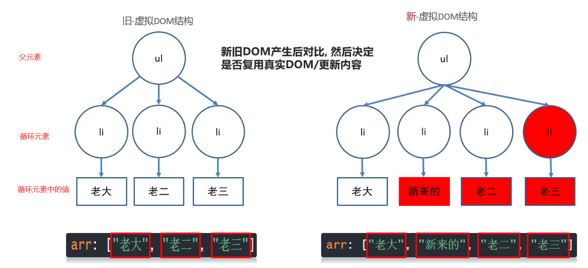
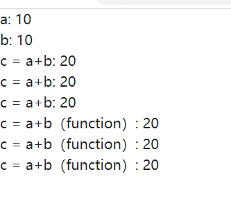

# vue03.base

### 1.v-for的基本使用

> 原因: 当v-for遍历的目标结构改变, `Vue`触发v-for的更新

场景：

1. 数组翻转

```vue
<template>
  <div>
    <!-- 通过循环数据的方式，来展示列表的每一项内容 -->
    <!-- 
      v-for="(值, 当前索引) in 需要遍历的数据结构"
      和forEach非常相似的
      循环遍历是，需要给v-for标签上添加一个key属性，用来表现当前循环的每一个元素它的唯一 (一般可以用索引来作为它的key)
      口诀： 谁要循环就放在谁上面
      (主要去掌握数组，数组对象的遍历方式，其他的遍历只是vue提供了这样的功能，实际上并不常用)
    -->
    <ul>
      <li v-for="(value, index) in arr" :key="index">
        {{ value }} ---- {{ index }}
      </li>
    </ul>

    <!-- 
      当遍历的是一个数组对象，且每一个对象元素中，都有一个属性它的值能够表示当前元素的唯一性，那么就可以在循环遍历的时候不使用index来作为key属性的值，而替换成这个唯一的属性值
    -->
    <ul>
      <li v-for="value in arr2" :key="value.id">
        {{ value }}
      </li>
    </ul>


    <!-- v-for遍历对象
      当遍历对象时， 第一个参数是对象中每个属性的值
                    第二个参数是对象中每个属性的键
    -->
    <ul>
      <li v-for="(value, key) in obj" :key="key">
        {{ value }} ---- {{ key }}
      </li>
    </ul>

    <!-- 
      v-for 遍历数字
      当遍历数字时， 第一个参数是从1开始往上依次递增
                    第二个参数是当前遍历的索引位置
    -->
    <ul>
      <li v-for="(value, index) in 10" :key="index">
        {{ value }} ---- {{ index }}
      </li>
    </ul>

    <!-- 
      v-for 遍历字符串
      当遍历字符串时， 第一个参数是字符串中每个字符
                      第二个参数是当前遍历的索引位置
    -->
    <ul>
      <li v-for="(value, index) in str" :key="index">
        {{ value }} ---- {{ index }}
      </li>
    </ul>
  </div>
</template>

<script>
export default {
  name: 'demo-01',
  data () {
    return {
      arr: ['张三', '李四', '卢本伟', '张三'],
      arr2: [
        {name: '张三', age: 18, id: 1},
        {name: '卢本伟', age: 29, id: 2},
      ],
      obj: {
        name: '卢本伟',
        age: 29,
        content: '我卢本伟没有开挂！'
      },
      str: 'lbw'
    }
  }
}
</script>

<style>

</style>
```

### 2.v-if和v-for的组合使用 copy

```vue
<template>
  <div>
    <!-- 遍历arr数组，只显示没有张三的内容 -->
    <!-- v-for与v-if不允许在同一个标签中使用 -->
    <!-- 当不得不既需要遍历又需要判断时，可以在遍历数组之前进行filter的过滤操作（就是把原本写在v-if中的判断条件，写到filter的回调函数中即可） -->
    <ul>
      <!-- 错误！ <li v-for="(value, index) in arr" :key="index" v-if="value !== '张三'"> -->
      <li v-for="(item, index) in arr.filter(v => v !== '张三')" :key="index">
        {{ item }}
      </li>
    </ul>
  </div>
</template>

<script>
export default {
  name: 'demo-02',
  data () {
    return {
      arr: ['张三', '李四', '卢本伟', '张三']
    }
  }
}
</script>

<style>

</style>
```

### 3.v-for的更新监测

```vue
<template>
  <div>
    <!-- 
      将js中遍历数组、处理数组的方式形参笔记
      forEach((value, index) => {})
      filter((value, index) => {})
      map((value, index) => {})
      some((value, index) => {})
      every((value, index) => {})
    -->
    <!-- 1. 当v-for遍历的数组发生变化时，(一定是得发生变化) , 会触发v-for的遍历更新 -->
    <!-- 2. 如果某个数组处理方式不会改变原数组，那么通过赋值的操作来让数组发生变化 -->
    <!-- 3. 如果遍历的数据无法实时响应式，可以使用this.$set()方法来进行强制响应，这一方法其实是应急手段，在迫不得已时（找不到其他解决办法时）再去使用 -->
    <ul>
      <li v-for="(item, index) in arr" :key="index">
        {{ item }}
      </li>
    </ul>

    <!-- 设计一个按钮，点击下去的时候，arr数组元素位置颠倒 - reverse() -->
    <button @click="revBtn">数组颠倒</button>
    <!-- 设置一个按钮，点击下去的时候，保留前3个元素 (数组的截取) -->
    <button @click="sliceBtn">数组截取</button>
    <!-- 设置一个按钮，点击下去的时候，修改第一个元素的值改为1000 -->
    <button @click="updateBtn">修改索引为0的元素值</button>

  </div>
</template>

<script>
export default {
  name: 'demo-02',
  data () {
    return {
      arr: [1, 2, 3, 4, 5]
    }
  },
  methods: {
    revBtn () {
      this.arr.reverse()
    },

    // 数组截取
    sliceBtn () {
      // 通过slice方法来截取数组
      // this.arr.slice(0, 3) // 发现页面并不更新，其原因是slice方法并不会改变原数组

      // 通过重新赋值的形式，来改变数组
      // this.arr = this.arr.slice(0, 3)

      // 通过splice方法就能够改变原数组，不需要进行赋值操作
      this.arr.splice(3, 2)
    },

    // 修改索引为0的元素的值
    // 在修改引用数据类型（主要指的是数组元素），若数据发生变化，但页面并没有产生响应式，尝试使用this.$set() vue内置的更新数据方式来强制刷新
    updateBtn () {
      // this.arr[0] = 1000
      // this.arr.length = 100

      /* 
        this.$set(参数1， 参数2， 参数3)
        参数1： 更新的目标结构 - v-for所遍历的数据
        参数2： 更新数据的位置 - 常常是索引位置
        参数3： 需要更新的值
      */
      // this.$set(this.arr, 0, 1000)

      // 正确的替换索引位置元素的操作 splice(目标索引位置, 删除当前索引位置的一个元素， 需要替换的元素)
      this.arr.splice(0, 1, 1000)
    }
  }
}
</script>

<style>

</style>
```

### 4.v-for的立即更新示例

>  `v-for` 的默认行为会尝试原地修改元素而不是移动它们。
>
>  简单来说就是不删除原来的dom元素，而是尽量去修改各循环元素内部的值

原来webapi是如何做列表更新的？ =》 删除所有列表的dom元素，重新渲染

v-for尝试去用原来的dom元素进行修改，能改就不删



**CODE**

```vue
<template>
  <div>
    <ul>
      <!-- eslint-disable -->
      <!-- 问题？ 既然用索引作为key和没有key时页面更新的效率完全一样，那为什么要加key呢？？ -->
      <!-- 答：满足vue的代码规范，以及满足eslint的书写规范 -->
      <li v-for="(obj, index) in arr" :key="obj.id">
        {{ obj.name }}
        <!-- 如果input框没有绑定v-model时，页面中输入的内容只与inputdom元素有关 -->
        <input type="text">
      </li>
    </ul>
    <button @click="btn">下标1位置插入新来的</button>
  </div>
</template>

<script>
export default {
  data() {
    return {
      arr: [
        {name: '老大',id: 50},
        {name: '老二',id: 31},
        {name: '老三',id: 10}
      ],
    };
  },
  methods: {
    btn(){
      this.arr.splice(1, 0, {
        id: 19, 
        name: '新来的'
      })
    }
  }
};
</script>
```

##  阶段小结

1. v-for什么时候会更新页面呢?

   数组采用更新方法, 才导致v-for更新页面

2. vue是如何提高更新性能的?

   采用虚拟DOM+diff算法提高更新性能

3. 虚拟DOM是什么?

   本质是保存dom关键信息的JS对象

4. diff算法如何比较新旧虚拟DOM?

   根元素改变 => 删除当前DOM树重新建

   根元素未变, 属性改变 => 更新属性

   根元素未变, 子元素/内容改变 => 无key – 就地更新 / 有key – 按key比较

   

### 5.动态属性class和style

> 目标: 用v-bind给标签class设置动态的值

语法:

* :class="{类名: 布尔值}"
* :class="[类名]"

```vue
<template>
  <div>
     <!-- 
        动态class
        语法：
        1. :class="{ 类名: 布尔值(可以是表达式的返回值) }" => 通过布尔值来判断前面的类名是否生效
        => 语法1，是通过一个布尔值来做某个类名的开关

        2. :class="[ 带有类名字符串的变量 ]" => 可以通过改变这个变量的值，来实现切换不同的类名
        => 语法2，通过改变变量中的类名，来切换样式表中的不同的类的样式

        使用的选择： 如果有一个样式在使用场景中只需要它生效或者不生效，此时选择语法1（花括号键值对） （90%）
                    如果有一个样式在使用场景中需要实时的变化，此时选择语法2（方括号变量）
      -->
      <p class="style1 style2 style3"></p>
      <p :class="{ red_str: bool }">动态class</p>
      <p :class="[ changeClass ]">动态class2</p>

      <!-- 
        动态style
        语法：
        动态style的写法特点： 如果出现多个单词短横线链接的样式属性名时，需要转化为驼峰式命名来设置

        1. :style="{ css样式属性名: 携带当前样式的样式值的变量 }" => 通过一个变量来控制当前显示样式的状态

        2. :style="[ 带有属性键值对的对象 ]" => 可以通过这个对象中的值来变化各种样式属性

        使用的选择: 如果仅需要修改某一个 ‘特定’ 样式的属性内容， 选择语法1（花括号键值对）（90%）
                   如果需要修改或切换不同的样式种类时， 选择语法2(方括号变量)
       -->
       <p :style="{ color: styleColor }">动态style</p>
       <p :style="[ styleObj ]">动态style2</p>

       <button @click="changeStyle">改变动态style</button>
  </div>
</template>

<script>
export default {
  name: 'demo-05',
  data () {
    return {
      bool: true,
      changeClass: 'red_str',
      styleColor: 'pink',
      styleObj: {
        color: 'red',
        backgroundColor: 'green'
      }
    }
  },

  methods: {
    changeStyle () {
      this.styleObj = {
        fontSize: '32px'
      }
    }
  }
}
</script>

<style scoped>
  .red_str {
    color: red;
  }

  .green_str {
    color: green;
  }

  .blue_str {
    color: blue;
  }
</style>
```

### 6.案例-品牌管理

```vue
<template>
  <div id="app">
    <div class="container">
      <!-- 顶部框模块 -->
      <div class="form-group">
        <div class="input-group">
          <h4>品牌管理</h4>
        </div>
      </div>

      <!-- 数据表格 -->
      <table class="table table-bordered table-hover mt-2">
        <thead>
          <tr>
            <th>编号</th>
            <th>资产名称</th>
            <th>价格</th>
            <th>创建时间</th>
            <th>操作</th>
          </tr>
        </thead>
        <tbody>
          <tr v-for="obj in list" :key="obj.id">
            <td>{{ obj.id }}</td>
            <td>{{ obj.name }}</td>

            <!-- 如果价格超过100，就有red这个类 -->
            <td :class="{ red: obj.price > 100 }">{{ obj.price }}</td>
            <td>{{ obj.time | formatDate }}</td>
            <td>
              <a href="#" @click.prevent="delFn(obj)">删除</a>
            </td>
          </tr>

          <!-- 统计行 -->
          <tr style="background-color: #EEE" v-if="list.length !== 0">
            <td>统计:</td>
            <td colspan="2">总价钱为: {{ allPrice }}</td>
            <td colspan="2">平均价: {{ svgPrice }}</td>
          </tr>
        </tbody>
          <!-- 
        <tfoot >
          <tr>
            <td colspan="5" style="text-align: center">暂无数据</td>
          </tr>
        </tfoot>
            -->
      </table>

      <!-- 添加资产 -->
      <form class="form-inline">
        <div class="form-group">
          <div class="input-group">
            <input
              type="text"
              class="form-control"
              placeholder="资产名称"
              v-model.trim="form.name"
            />
          </div>
        </div>
        &nbsp;&nbsp;&nbsp;&nbsp;
        <div class="form-group">
          <div class="input-group">
            <input
              type="text"
              class="form-control"
              placeholder="价格"
              v-model.number="form.price"
            />
          </div>
        </div>
        &nbsp;&nbsp;&nbsp;&nbsp;
        <!-- 阻止表单提交 -->
        <button class="btn btn-primary" @click.prevent="addFn">添加资产</button>
      </form>
    </div>
  </div>
</template>
11:10分上课
<script>

/* 
  目标1： 铺设页面
  1. npm i bootstrap 下载样式依赖
  2. 在main.js中引入样式表
  3. 观察页面样式结构进行微调
  4. 将data中列表数据通过v-for的方式渲染到页面上
  5. 关于价格需要用到动态style/class 来判断是否显示红色（大于100的显示红色）
*/

/* 
  目标2：新增
  注意事项：
  1. 阻止默认跳转
  2. 输入框内容不能为空
  3. 判断输入框输入的内容是否符合规范

  实现步骤：
  1. 为输入框添加去除前后空格，设置数字，取消默认事件的修饰符
  2. 给按钮绑定添加方法
    2.1 判断表单内容是否合法
    2.2 创建添加的对象结构，进行列表的添加元素操作
    2.3 清空表单内容
*/

/* 
  目标3：删除
  1. 给删除按钮添加删除点击事件
  2. 阻止默认事件
  3. 根据当前列表元素的id，来进行删除操作
    删除的方案：
    3.1 通过id找到索引位置（findIndex）, 通过splice来进行删除
    3.2 通过filter来过滤数组中需要删除的那个元素，然后在进行数组的重新赋值
*/

// dayjs?? moment?? - 不同的时间处理插件在使用中有哪些差异
/* 
  目标4：格式化时间
  1. 通过filter过滤器来过滤页面上的时间格式
  2. 在过滤器中使用moment.js插件来完成时间的格式化
    2.1 npm i moment 下载插件
    2.2 在组件中局部引入 moment
*/

/* 
  目标5: 通过计算属性来设置页面的总价和平均价格
  1. 通过计算属性，对list列表中的所有price求和处理 （reduce）
  2. 通过计算属性，针对以及计算得来的总和后 求出平均值
*/

/*
  目标6：本地缓存
  1. 什么时候存 - 曾，删，改数据时都需要存储 - 前面的3种操作都会导致数据的变化，所有可以统一的放到监听器中进行存储
  2. 什么时候取 - 查（渲染数据）需要获取 - 渲染数据的数据来源于data中定义变量，所以可以再定义变量时，设置当前变量的初始值为缓存中保存的值
*/
import Moment from 'moment'
export default {
  data() {
    return {
      form: {
          name: '', // 名称
          price: 0 // 价格
      },
      // list: [
      //   { id: 100, name: "外套", price: 199, time: new Date('2010-08-12')},
      //   { id: 101, name: "裤子", price: 34, time: new Date('2013-09-01') },
      //   { id: 102, name: "鞋", price: 25.4, time: new Date('2018-11-22') },
      //   { id: 103, name: "头发", price: 19900, time: new Date('2020-12-12') }
      // ],
      list: JSON.parse(localStorage.getItem('P_LIST')) || []
    }
  },

  watch: {
      'list' () {
        console.log('监听器', this.list);
        // 增，删，改数据时都需要储存 - 前面三种操作都会导致数据的变化，所有可以统一的放到监听器中进行储存
        localStorage.setItem('P_LIST', JSON.stringify(this.list))
      }
  },

  computed: {
    // 求总价
    'allPrice' () {
      // sum是起始值 => 0
      // obj是每个数组元素
      return this.list.reduce((sum, obj) => { return sum += obj.price }, 0)
    },

      // 求平局值
    'svgPrice' () {
      // 通过tofixed来保留两位小数
      return (this.allPrice / this.list.length).toFixed(2)
    }
  }, 

  filters: {
    formatDate (value) {
      // format()格式化方法，能够将时间格式化成你希望的那样
      return Moment(value).format('YYYY-MM-DD')
    }
  },

  methods: {
    // 参数元素
    delFn (delObj) {
      //  方案一： 通过id找到索引位置（findIndex）, 通过splice来进行删除
      // let index = this.list.findIndex(value => value.id === delObj.id)
      //  下面的这种代码写法是标准的删除指定索引位置元素的写法
      // this.list.splice(index, 1)

      // 方案二： 通过filter来过滤数组中需要删除的那个元素，然后在进行数组的重新赋值
      this.list = this.list.filter(value => value.id !== delObj.id)
    },
    // 添加元素
    addFn () {
      // 2.1 判断表单内容是否合法
      // name不能为空，要取消前后空格
      // price 必须大于0
      // 判断price数据类型，必须是number
      if (this.form.name.trim().length === 0 || typeof this.form.price !== 'number' || this.form.price <= 0) {
        alert('内容不能为空，金额必须大于0')
        return
      }
      // 2.2 创建添加的对象结构，进行列表的添加元素操作
      let tempObj = {
        // 当前数组中最后一个对象的id + 1 作为新对象的id
        // 如果数组的长度为0时， 默认设置id 为 100
        id: this.list.length > 0 ? this.list[this.list.length - 1].id + 1 : 100,
        name: this.form.name,
        price: this.form.price,
        time: new Date()
      }

      this.list.push(tempObj)
      // 2.3 清空表单内容
      this.form = {
        name: '', // 名称
        price: 0 // 价格
      }
    }
  }
}
</script>

<style >
.red{
  color: red;
}

.form-group {
  width: 250px;
  display: inline-block;
}
</style>
```

### 7.过滤器filter 

> 目的: 转换格式, 过滤器就是一个**函数**, 传入值返回处理后的值
>
> 简单理解就是在数据渲染到页面之前的过程中，进行一次包装处理

注意：过滤器只能用在, 插值表达式和v-bind表达式

**Vue中的过滤器场景：**

- 字母转大写, 输入"hello", 输出"HELLO"
- 字符串翻转, "输入hello, world", 输出"dlrow ,olleh"

**语法:**

- Vue.filter("过滤器名", (值) => {return "返回处理后的值"})
- filters: {过滤器名字: (值) => {return "返回处理后的值"}

注意：一定要有返回值

例子:

- 全局定义字母都大写的过滤器
- 局部定义字符串翻转的过滤器

```vue
<template>
  <div>
    <!--
      过滤器的作用： 在不改变data中数据的基础上，在页面上展示不同于数据的内容效果
      过滤器在实际工作中，其实只有一些非常简单且通用的展示方法会去使用过滤器，其他时候一般很少遇到

      过滤器有两种不同的写法
      1. 全局过滤器（定义在全局，所有的组件都可以使用） - filter是Vue构造函数的静态方法
      Vue.filter(
        参数1 - "自定义过滤器名称",
        参数2 - (需要过滤的值-必填, 过滤时传过来的自定义参数-选填) => {
          return '返回处理后的数据'
        })

      2. 局部过滤器(定义在组件中，只有当前的组件才可以使用)
      和data同级的地方有一个属性，叫做filters
      filters: {
        '自定义过滤器名称' (需要过滤的值-必填, 过滤时传过来的自定义参数-选填) {
          return '返回处理后的数据'
        }
      }

      过滤器的使用 - 在插值表达式中，通过 ‘|’ 来链接变量和过滤器
      {{ 变量 | 过滤器(传入自定义的参数) }}
    -->
    <div>{{ str | reverseG('&') }}</div>
    <div>{{ str | toUp }}</div>

    <!-- 过滤器的连用 -->
    <div>{{ str | toUp | reverseG }}</div>

    <!-- 不用过滤器去实现一个字符串的全大写 -->
    <div>{{ str.toUpperCase() }}</div>

    <button @click="consoleStr">打印str的值</button>
  </div>
</template>

<script>
export default {
  name: 'demo-07',
  data () {
    return {
      str: 'hello, world'
    }
  },

  filters: {
    // 让字符串所有单词大写
    toUp (value) {
      return value.toUpperCase()
    }
  },

  methods: {
    consoleStr () {
      console.log(this.str)
    }
  }
}
</script>

<style>

</style>
```

### 8.计算属性 

> 场景： 页面上某一个变量是有其他两个或多个变量通过一定逻辑后运算得到的时候，可以用到计算属性进行简化

基础语法

语法:

```vue
computed: {
    "计算属性名" () {
        return "值"
    }
}
```


```vue
<template>
  <div>
    <!-- 
      computed计算属性语法
      在data同级，创建computed
      computed: {
        '自定义的计算属性名称' () {
          return '计算后返回的值'
        }
      }

      计算属性的使用： 与data中的变量的使用方式是一样的
      注意事项：data中的变量与计算属性的名称不可以相同

      计算属性的特点： 计算属性具有缓存结果的特点，计算属性基于它的依赖项（计算属性中所使用的其他变量）进行计算的结果会缓存起来，只要依赖项的值不变，那么下次使用计算属性时不必进行计算，只会返回缓存中的结果，对于代码效率来说是比较高的

      计算属性的优缺点：
      优点：因为缓存机制，所以不会重复的进行计算，页面效率高
      缺点：因为缓存机制，计算属性会消耗内存
      ---- 空间换时间 ----
     -->
     <div>a: {{ a }}</div>
     <div>b: {{ b }}</div>
     <div>c = a+b: {{ c }}</div>
     <div>c = a+b: {{ c }}</div>
     <div>c = a+b: {{ c }}</div>
     <div>c = a+b（function）: {{ sum() }}</div>
     <div>c = a+b（function）: {{ sum() }}</div>
     <div>c = a+b（function）: {{ sum() }}</div>
  </div>
</template>

<script>
export default {
  name: 'demo-08',
  data () {
    return {
      a: 10,
      b: 10
    }
  },

  computed: {
    'c' () {
      console.log('计算属性')
      return this.a + this.b
    }
  },

  methods: {
    // 这个方法能不能直接用在插值表达式中 - 可以
    sum () {
      console.log('方法')
      return this.a + this.b
    }
  }
}
</script>

<style>

</style>
```



**小结：**

1. 使用场景： 当变量的值, 需要通过别人计算而得来
2. 特点：函数内使用的变量改变, 重新计算结果返回
3. 注意事项：计算属性名和data里名字不能重复


### 9.计算属性的完整写法

> 计算属性也是变量, 如果想要直接赋值, 需要使用完整写法
>
> 场景： 当计算属性变量作为表单的值时

语法：

```vue
computed: {
    "属性名": {
        set(值){
            
        },
        get() {
            return "值"
        }
    }
}
```


```vue
<template>
  <div>
    <!-- 
      computed: {
       "属性名": {
          // 设置 - 当计算属性绑定在某个表单控件的v-model上时，当主动的触发了这个计算属性的变化时，就会执行set方法来改变该方法做所做的业务逻辑

          set属性拥有非常大的局限性，并不是在各个环境下都可以正常使用的
          set(值 - 计算属性的当前值 == this.属性名){
            // 去修改其他的变量
          },
          
          // 获取 - 获取其他依赖项对计算属性的影响
          get() {
            return "值"
          }
        }
      }
     -->
     <div>a: {{ a }}</div>
     <div>b: {{ b }}</div>
     <div>c = a+b: 
      <input type="text" v-model="c">
     </div>
     <div>{{ d }}</div>
  </div>
</template>

<script>
export default {
  name: 'demo-09',
  data () {
    return {
      a: 10,
      b: 20,
      d: 0
    }
  },

  computed: {
    'c': {
      set (value) {
        this.d = value
      },

      get () {
        return this.a + this.b
      }
    }
  }
}
</script>

<style>

</style>
```

### 10.全选反选（工具包）

* 需求: 点击反选, 让所有小选框, 各自取相反勾选状态

分析:

①: 小选框的勾选状态, 在对象的c属性

②: 遍历所有对象, 把对象的c属性取相反值赋予回去即可

```vue
<template>
  <!-- 
      计算属性完整写法的语法：
      computed: {
       "属性名": {
          // 设置 - 当计算属性绑定在某个表单控件的v-model上时，当主动的触发了这个计算属性的变化时，就会执行set方法来改变该方法做所做的业务逻辑

          set属性拥有非常大的局限性，并不是在各个环境下都可以正常使用的
          set(值 - 计算属性的当前值 == this.属性名){
            // 去修改其他的变量
          },
          
          // 获取 - 获取其他依赖项对计算属性的影响
          get() {
            return "值"
          }
        }
      }
    -->
  <div>
    <span>全选:</span>
    <input type="checkbox" v-model="isAll" />
    <button @click="btn">反选</button>
    <ul>
      <li v-for="(obj, index) in arr" :key="index">
        <input type="checkbox" v-model="obj.c" />
        <span>{{ obj.name }}</span>
      </li>
    </ul>
  </div>
</template>

<script>
/* 
  目标1： 小选框的勾选状态，影响全选框的勾选状态
  1. 通过计算属性，来绑定全选框的input框
  2. 计算属性的get方法来受到小选框的影响 （所有的c属性都为true时，才将计算属性设置为true，否则计算属性为false）
*/

/* 
  目标2: 全选框通过点击来影响小选框的选中状态
  1. 如果全选框点击以后为未选中状态，那么就让所有的小选框都变成未选中状态
  2. 如果全选框点击以后为选中状态，  那么就让所有的小选框都变成  选中状态
*/

/* 
  目标3：反向 - 让数组的c属性取反
*/
export default {
  computed: {
    'isAll': {
      // 完整写法中，set在99%的情况下的使用操作 - 让全选框影响小选框
      set (value) {
        // console.log(value, '当前计算属性的值')
        // value 表示的是当前isAll计算属性的值
        this.arr.forEach(obj => {
          // 让所有的c属性，都变成当前的计算属性的值
          obj.c = value
        })
      },
      get () {
        // every方法查找数组中不符合的条件，直接返回false
        // let flag = this.arr.every(obj => obj.c)
        let flag = this.arr.every(obj => {
          // every判断数组中的每一个c属性是不是都是true有一个不是，就返回false
          return obj.c === true
        })

        return flag
      }
    }
  },

  methods: {
    btn () {
      this.arr.forEach(obj => {
        // 通过逻辑非来实现c属性的取反操作
        obj.c = !obj.c
      })
    }
  },

  data () {
    return {
      arr: [
        {
          name: "猪八戒",
          c: false,
        },
        {
          name: "孙悟空",
          c: false,
        },
        {
          name: "唐僧",
          c: false,
        },
        {
          name: "白龙马",
          c: false,
        },
      ],
    };
  }
};
</script>

<style>

</style>
```

### 11.11-watch监听器

> 可以侦听data/computed属性值改变

​		一个对象，键是需要观察的表达式，值是对应回调函数。值也可以是方法名，或者包含选项的对象。Vue 实例将会在实例化时调用 `$watch()`，遍历 watch 对象的每一个 property。

 基本语法

语法：

```vue
watch: {
    "被侦听的属性名" (newVal, oldVal){
        
    }
}
```


```vue
<template>
  <div>
    <!-- 

            监听器的作用： 监视变量 - data，计算属性。当监听的变量发生变化时，就会触发当前监听器中设置的逻辑
      // 计算属性： 多个数据控制一个数据的变化
      // 监听器：   一个数据的改变能够影响多个数据的变化

      语法：
      在data的同级
      watch: {
        // 是从data或者计算属性中定义来的
        '被监听的变量(属性)名' (newValue, oldValue) {
          // newValue: 监听的这个变量更改后的值
          // oldValue: 监听的这个变量更改前的值
        }
      }

      发现：
      使用后其实会发现，我们最常用的应该是newValue， 而oldValue在使用时，往往会用在对比新旧数据的差异上
      newValue,与监听的目标变量其实并无区别

      总结： 只要不进行新旧数据的对比，就可以不传任何参数
      '被监听的变量' () {}

      监听器的完整写法
      '被监听的变量': {
        handler () {},
        deep: true, // 启动深度监听复杂数据类型
        immediate: true // 立即执行监听 - 当监听器生成时，会立即执行一次handler中的逻辑
      }

      特点：
      现象: 监听复杂数据类型，发现newvalue和oldvalue都是新数据，这是因为复杂数据类型的数据存在堆内存中，而监听的目标则是栈中的堆内存地址。所以说当堆中的数据发生变化时， 不管是newValue栈中的地址还是oldvalue栈中的地址，都指向统一个堆，没有旧数据的记录

      结论: 复杂数据类型的监听不必写任何参数


      今后如何使用监听器：
      1. 如果不做新旧数据的对比，不用传任何参数
      2. 如果发现监听器设置后并没有监听到任何数据，转化为深度监听
     -->
     <input type="text" v-model="str" />

     <br />
     <input type="text" v-model="from.name" />
   
  </div>
</template>

<script>
export default {
  name: 'demo-11',
  data () {
    return {
      str: '',
      from: {
        name: ''
      }
    }
  },
  
  watch: {
    'str' (newValue, oldValue) {
      console.log(newValue, oldValue)
      console.log(this.str);
    },


    'from': {
        handler (newValue, oldValue) {
          console.log(newValue, oldValue)
      },
      deep: true, // 启动深度监听复杂数据类型
      immediate: true  // 立即执行监听 - 当监听器生成时，会立即执行一次handler中的逻辑
    }
  }

}
</script>

<style>

</style>
```

