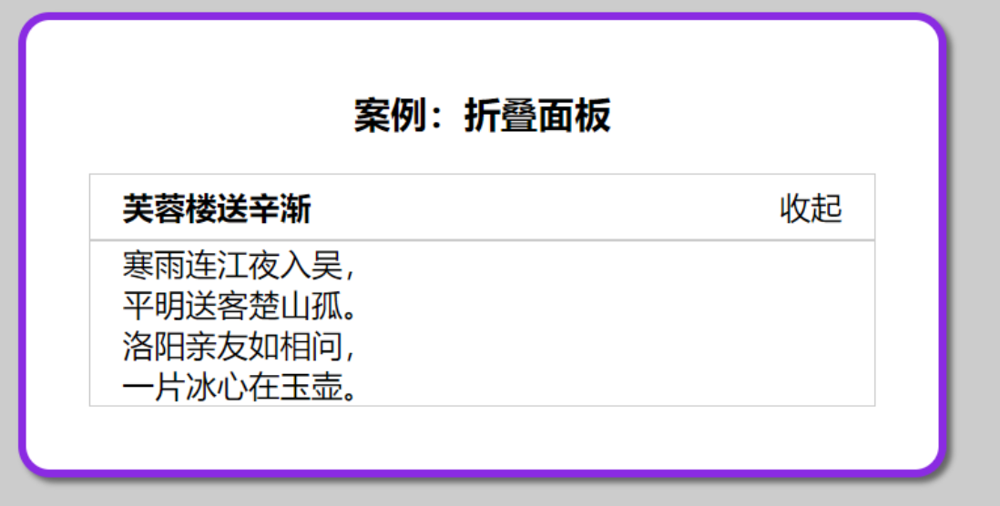
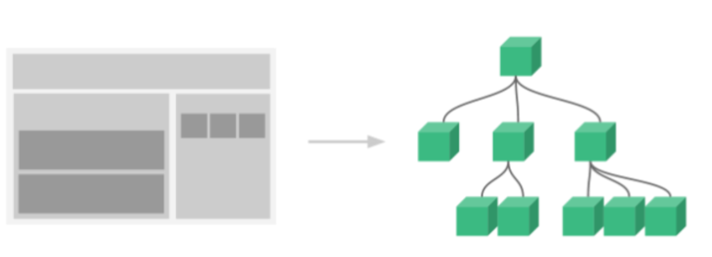
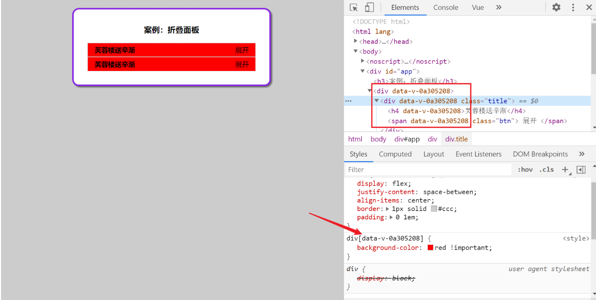
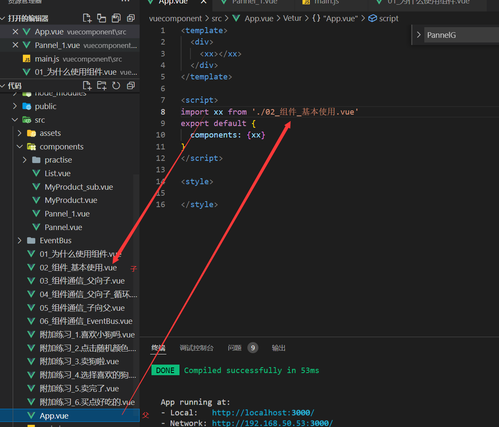
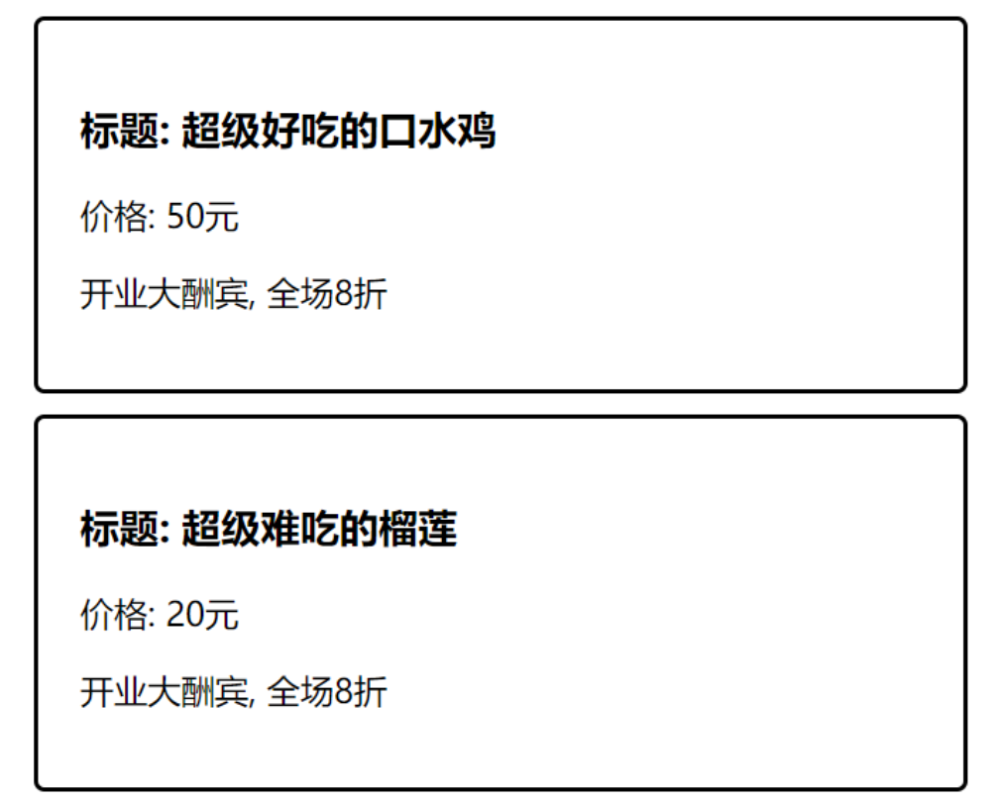

# vue04.base

# 一. VUE组件

## 1.1 为什么要用组件

以前做过一个折叠面板



需求: 现在想要多个收起展开的部分

方案1: 复制代码

- 代码重复 冗余
- 不利于维护

步骤：

1. 模板标签 - 在这个基础上，把 **要重复使用的代码多复制几份** 

```vue
<template>
  <div id="app">
    <h3>案例：折叠面板</h3>
    <div>
      <div class="title">
        <h4>芙蓉楼送辛渐</h4>
        <span class="btn" @click="isShow = !isShow">
          {{ isShow ? '收起' : '展开' }}
        </span>
      </div>
      <div class="container" v-show="isShow">
        <p>寒雨连江夜入吴, </p>
        <p>平明送客楚山孤。</p>
        <p>洛阳亲友如相问，</p>
        <p>一片冰心在玉壶。</p>
      </div>
    </div>
  </div>
</template>

<script>
export default {
  data() {
    return {
      isShow: false
    }
  }
}
</script>

<style lang="less">
body {
  background-color: #ccc;
  #app {
    width: 400px;
    margin: 20px auto;
    background-color: #fff;
    border: 4px solid blueviolet;
    border-radius: 1em;
    box-shadow: 3px 3px 3px rgba(0, 0, 0, 0.5);
    padding: 1em 2em 2em;
    h3 {
      text-align: center;
    }
    .title {
      display: flex;
      justify-content: space-between;
      align-items: center;
      border: 1px solid #ccc;
      padding: 0 1em;
    }
    .title h4 {
      line-height: 2;
      margin: 0;
    }
    .container {
      border: 1px solid #ccc;
      padding: 0 1em;
    }
    .btn {
      /* 鼠标改成手的形状 */
      cursor: pointer;
    }
  }
}
</style>
```

以上代码，复制3份后，进入页面测试，发现展开框会一起变化

解决方案: 不同的部分, 用不同的isShow变量

```vue
<template>
  <div id="app">
    <h3>案例：折叠面板</h3>
    <div>
      <div class="title">
        <h4>芙蓉楼送辛渐</h4>
        <span class="btn" @click="isShow = !isShow">
          {{ isShow ? '收起' : '展开' }}
        </span>
      </div>
      <div class="container" v-show="isShow">
        <p>寒雨连江夜入吴, </p>
        <p>平明送客楚山孤。</p>
        <p>洛阳亲友如相问，</p>
        <p>一片冰心在玉壶。</p>
      </div>
    </div>
    <div>
      <div class="title">
        <h4>芙蓉楼送辛渐</h4>
        <span class="btn" @click="isShow1 = !isShow1">
          {{ isShow1 ? '收起' : '展开' }}
        </span>
      </div>
      <div class="container" v-show="isShow1">
        <p>寒雨连江夜入吴, </p>
        <p>平明送客楚山孤。</p>
        <p>洛阳亲友如相问，</p>
        <p>一片冰心在玉壶。</p>
      </div>
    </div>
    <div>
      <div class="title">
        <h4>芙蓉楼送辛渐</h4>
        <span class="btn" @click="isShow2 = !isShow2">
          {{ isShow2 ? '收起' : '展开' }}
        </span>
      </div>
      <div class="container" v-show="isShow2">
        <p>寒雨连江夜入吴, </p>
        <p>平明送客楚山孤。</p>
        <p>洛阳亲友如相问，</p>
        <p>一片冰心在玉壶。</p>
      </div>
    </div>
  </div>
</template>

<script>
export default {
  data() {
    return {
      isShow: false,
      isShow1: false,
      isShow2: false
    }
  }
}
</script>

<style lang="less">
body {
  background-color: #ccc;
  #app {
    width: 400px;
    margin: 20px auto;
    background-color: #fff;
    border: 4px solid blueviolet;
    border-radius: 1em;
    box-shadow: 3px 3px 3px rgba(0, 0, 0, 0.5);
    padding: 1em 2em 2em;
    h3 {
      text-align: center;
    }
    .title {
      display: flex;
      justify-content: space-between;
      align-items: center;
      border: 1px solid #ccc;
      padding: 0 1em;
    }
    .title h4 {
      line-height: 2;
      margin: 0;
    }
    .container {
      border: 1px solid #ccc;
      padding: 0 1em;
    }
    .btn {
      /* 鼠标改成手的形状 */
      cursor: pointer;
    }
  }
}
</style>
```

> 总结: 代码非常的冗余和重复吧? 解决方案呢? 就是采用我们的组件化开发的方式,
>
> 使用vue提供的单vue文件 - 将某一小块会重复使用的代码封装到单独的vue文件中，以后通过直接使用这个文件来实现功能复用

## 1.2 概念

> 组件是可复用的 VUE 实例, 封装标签(HTML), 样式(CSS)和JS

**组件化** ：封装的思想，把页面上 `可重用的部分` 封装为 `组件`，从而方便项目的 开发 和 维护

为什么说工作中写代码就是一个借鉴的过程呢: **一个页面， 可以拆分成一个个组件，一个组件就是一个整体, 每个组件可以有自己独立的 结构 样式 和 行为(html, css和js)**



## 1.3 基础使用

> 目标: 每个组件都是一个独立的个体, 代码里体现为一个独立的.vue文件

口诀: 哪部分标签复用, 就把哪部分封装到组件内

==(重要): 组件内template只能有一个根标签==

==(重要): 组件内data必须是一个函数, 独立作用域==

步骤:

1. 创建组件 components/Pannel.vue

   > 封装标签+样式+js - 组件都是独立的, 为了复用

```vue
<template>
  <div>
    <div class="title">
      <h4>芙蓉楼送辛渐</h4>
      <span class="btn" @click="isShow = !isShow">
        {{ isShow ? "收起" : "展开" }}
      </span>
    </div>
    <div class="container" v-show="isShow">
      <p>寒雨连江夜入吴,</p>
      <p>平明送客楚山孤。</p>
      <p>洛阳亲友如相问，</p>
      <p>一片冰心在玉壶。</p>
    </div>
  </div>
</template>

<script>
export default {
  data() {
    return {
      isShow: false,
    };
  },
};
</script>

<style scoped>
.title {
  display: flex;
  justify-content: space-between;
  align-items: center;
  border: 1px solid #ccc;
  padding: 0 1em;
}
.title h4 {
  line-height: 2;
  margin: 0;
}
.container {
  border: 1px solid #ccc;
  padding: 0 1em;
}
.btn {
  /* 鼠标改成手的形状 */
  cursor: pointer;
}
</style>
```

注册组件：创建后需要注册后再使用

1. 全局注册

   全局入口在main.js, 在new Vue之上注册

   ```vue
   // 目标: 全局注册 (一处定义到处使用)
   // 1. 创建组件 - 文件名.vue
   // 2. 引入组件
   import Pannel from './components/Pannel'
   // 3. 全局 - 注册组件
   /*
     语法: 
     Vue.component("组件名", 组件对象)
   */
   Vue.component("PannelG", Pannel)
   ```

   全局注册PannelG组件名后, 就可以当做标签在任意Vue文件中template里用

   单双标签都可以或者小写加-形式, 运行后, 会把这个自定义标签当做组件解析, 使用

   ==组件里封装的标签替换到这个位置==

   以下写法均可：

   ```vue
   <PannelG></PannelG>
   <PannelG/>
   <pannel-g></pannel-g>
   ```

   1. **注意：**

      1. 如果组件在全局注册时，启动项目后初始化网页时就会立即加载该组件资源（无论是否在当前页面进行使用），那么这种情况是会导致网页开启缓慢的性能问题的，所以请在往后的开发过程中不要使用全局注册的方式
      2. 关于引用组件的标签写法，这里建议如果`import`组件时采用的是驼峰命名法拼接的多个单词（如：PannelG），那么在创建标签的时候请用全小写并短横线隔开（如：`pannel-g`）

   2. 局部 - 注册使用

      任意需要引用组件的 vue文件中中引入, 注册, 使用

```vue
<template>
  <div id="app">
    <h3>案例：折叠面板</h3>
    <!-- 4. 组件名当做标签使用 -->
    <!-- <组件名></组件名> -->
    <PannelG></PannelG>
    <PannelL></PannelL>
  </div>
</template>

<script>
    // 目标: 局部注册 (用的多)
    // 1. 创建组件 - 文件名.vue
    // 2. 引入组件
    import Pannel from './components/Pannel_1'
    export default {
        // 3. 局部 - 注册组件
        /*
            语法: 
            components: {
              "组件名": 组件对象
            }
        */
        components: {
            PannelL: Pannel
        },
        /*  
            当标签名和import引入组件名称相同是可以简写
        */
        components: {
            Pannel
        }
    }
</script>
```

1. 1. **注意：** 以后尽量将引入时（`import`）时的明明与当前注册组件时（`components`）的命名保持一致

**组件使用总结:**

1. (创建)封装html+css+vue到独立的.vue文件中
2. (引入注册)组件文件 => 得到组件配置对象
3. (使用)当前页面当做标签使用

## 1.4 CSS中的scoped作用

> 作用: 解决多个组件样式名相同, 冲突问题

在style上加入scoped属性, 就会在此组件的标签上加上一个随机生成的data-v-hash开头的属性。保证了必须是当前组件的元素, 才会有这个自定义属性, 才会被这个样式作用到



**解决了组件内部的css样式影响外部文件的问题**

> 总结: style上加scoped, 组件内的样式只在当前vue组件生效

# 二. vue组件通信

> 思考： 如何把一个组件中的数据传递给另一个组件？
>
> 方案：添加到内存中后，在浏览器内存中读取
>
> 问题：低效，且如何知道内存中的值什么时候有，什么时候改变呢

因为每个组件的变量和值都是独立的

组件通信先**暂时关注**父传子, 子传父

父: 使用其他组件的vue文件

子: 被引入的组件(嵌入)

例如: 



## 2.1 父传子 - props(★★★★★)

> 目的: 从外面给组件内传值, 先学会语法

需求: 封装一个商品组件MyProduct.vue - 外部传入具体要显示的数据, 如下图所示



步骤：

1. 创建组件 components/MyProduct.vue

```vue
<template>
  <div class="my-product">
    <h3>标题: ? </h3>
    <p>价格: ? 元</p>
    <p>描述: ?</p>
  </div>
</template>

<script>
export default {
}
</script>

<style>
.my-product {
  width: 400px;
  padding: 20px;
  border: 2px solid #000;
  border-radius: 5px;
  margin: 10px;
}
</style>
```

2.在父组件中注册`MyProduct.vue`子组件， 在使用时传入具体的数据

```vue
<template>
  <div class="my-product">
    <h3>标题: ? </h3>
    <p>价格: ? 元</p>
    <p>描述: ?</p>
  </div>
</template>

<script>
export default {
}
</script>

<style>
.my-product {
  width: 400px;
  padding: 20px;
  border: 2px solid #000;
  border-radius: 5px;
  margin: 10px;
}
</style>
```

3.子组件内在props属性中定义变量, 用于接收外部传入的值

```vue
<template>
  <div class="my-product">
    <h3>标题: {{ title }}</h3>
    <p>价格: {{ price }}元</p>
    <p>{{ intro }}</p>
  </div>
</template>

<script>
export default {
  props: ['title', 'price', 'intro']
}
</script>
```

4.父组件中的组件标签中传入不同的值

**注意:** 传入的值，可以是固定值，也可以是变量

```vue
<template>
  <div>
    <!-- 
      目标: 父(App.vue) -> 子(MyProduct.vue) 分别传值进入
      需求: 每次组件显示不同的数据信息
      步骤(口诀):
        1. 子组件 - props - 变量 (准备接收)
        2. 父组件 - 传值进去
     -->
    <Product title="好吃的口水鸡" price="50" intro="开业大酬宾, 全场8折"></Product>
    <Product title="好可爱的可爱多" price="20" intro="老板不在家, 全场1折"></Product>
    <Product title="好贵的北京烤鸭" price="290" :intro="str"></Product>
  </div>
</template>
```

> 总结： 父传子的流程
>
> 1. 子组件内, props定义变量, 在子组件使用变量
> 2. 父组件内, 使用子组件, 属性方式给props变量传值

## 2.2 父向子-配合循环

> 上面的案例，3次使用组件是否可以通过循环来进行配置

数据：