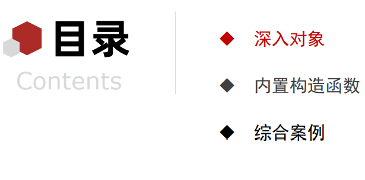
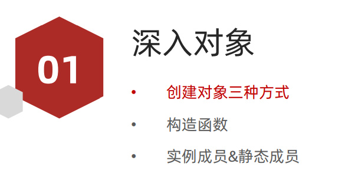
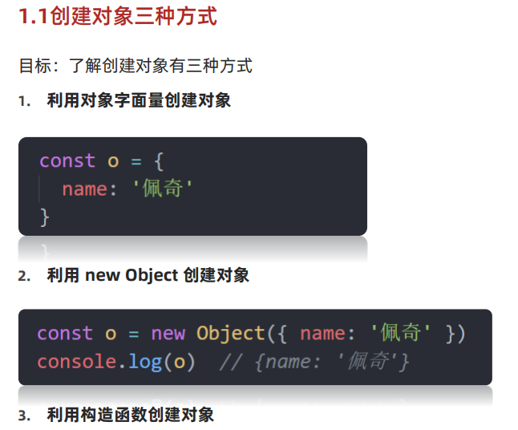

## day2



### 深入对象



#### 1. 创建对象的三种方式



##### 1..1 利用对象字面量创建对象

```js
   <script>
        // 对象：是属性和方法的集合。（集合本身就是无序的）
        // 属性: 描述事物的特性，常用名词
        // 方法：描述事物的行为，常用动词

        // 创建对象的三种方式
        // 1. 利用对象字面量的方式创建对象 {} 
        const obj = {}  // 创建了一个空对象

        const p1 = {
            name:'张三丰',
            age:128,
            sayHi:function(){
                console.log('Hello World')
            }
        }
        // 1. 获取对象的属性
        // 1.1 对象名.属性名
        console.log(p1.name)
        // 1.2 对象名['属性名']
        console.log(p1['name'])

        // 2. 调用对象的方法 加小括号
        // 2.1 对象名.方法()
        p1.sayHi()
        // 2.2 忘掉 
        // p1['sayHi']()
        
    </script>
```

##### 1.2 利用 new Object 创建对象

```js
    <script>
        // 利用 new Object() 创建对象
        const obj = new Object() // 创建了一个空对象
        obj.name = '张三丰'
        obj.age = '128'
        obj.sex = 'female'
        obj.sayHi = function(){
            console.log('Hi~')
        }

        // 可以直接传入要添加的属性
        const p1 = new Object({uname:'周杰伦'})
        console.log(p1)

        // 语法糖  甜甜的 用了就不会再用其他方式了
        const obj = {}  // ===>  const obj = new Object()
        const arr = []  // ===>  const arr = new Array()
    </script>
```

##### 1.3 利用构造函数创建对象

```js
    <script>
        // 思考： 为什么要用构造函数 ？ 


        // 构造函数相当于一个模板
        // function 构造函数名(形参1,形参2,形参3) { // 构造函数的形参与对象的普通属性是一般一致的
        //     this.属性名1 = 形参1; 
        //     this.属性名2 = 形参2; // 属性的值，一般是通过同名的形参来赋值的
        //     this.属性名3 = 形参3;
        //     this.方法名 = function(){
        //     };
        // }
        // 调用
        // const obj = new 构造函数名(实参1，实参2，实参3)

        // // 简记
        // function 构造函数名() {
        //     this.属性 = 值;  // 当前的这个对象的
        //     this.方法 = function() {}
        // }
        // new 构造函数名();

        // 注意: 
        // 1. 构造函数名字首字母要大写
        // 2. 构造函数里 属性和方法前面必须添加 this
        // 2. 构造函数不需要 return 就可以返回结果
        // 3. 我们调用构造函数 必须使用 new

    </script>
```

#### 2. 构造函数

