## day03

### 一：构造函数

#### 1.1 构造函数的问题

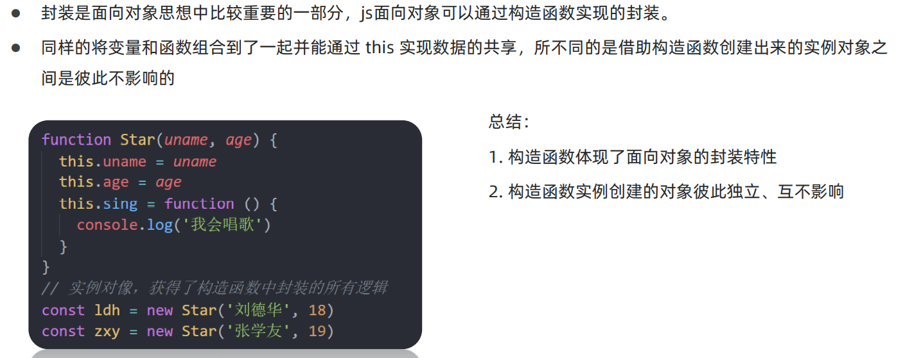

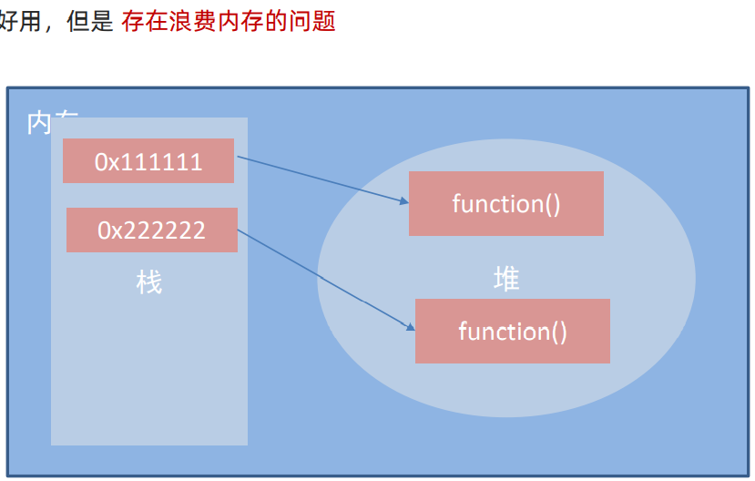

```js
    <script>

        // 存在浪费内存的问题
        // 构造函数里的公共方法： 每个实例化一个对象，就会在堆内存中开辟一个新的空间储存方法.
        function Star(name, age) {
            this.name = name
            this.age = age
            this.sing = function() {
                console.log('唱歌')
            }
        }
        const ldh = new Star('刘德华', 18)
        const zjl = new Star('周杰伦', 18)
        console.log(ldh.sing === zjl.sing)  // false
        console.log(ldh);

        // PS 我们常说的指向 / 指针
        //    表示内存里存的的是地址（指针）（理解为门牌号，房间号），这个地址指向了内存中数据的真实位置.
    </script>
```

#### 1.2 引入原型解决问题

```js
  <script>
        // 1.公共的属性，写在构造函数里面
           function Star(name, age) {
            this.name = name
            this.age = age
            // this.sing = function() {
            //     console.log('唱歌')
            // }
        }
        // 2.公共的方法写在原型对象上，节约了内存
        Star.prototype.sing = function() {
            console.log('唱歌卡死')
        }

        const ldh = new Star('刘德华', 18)
        const zjl = new Star('周杰伦', 14)
        console.log(ldh.sing === zjl.sing) // true
    </script>
```


#### 1.3 总结

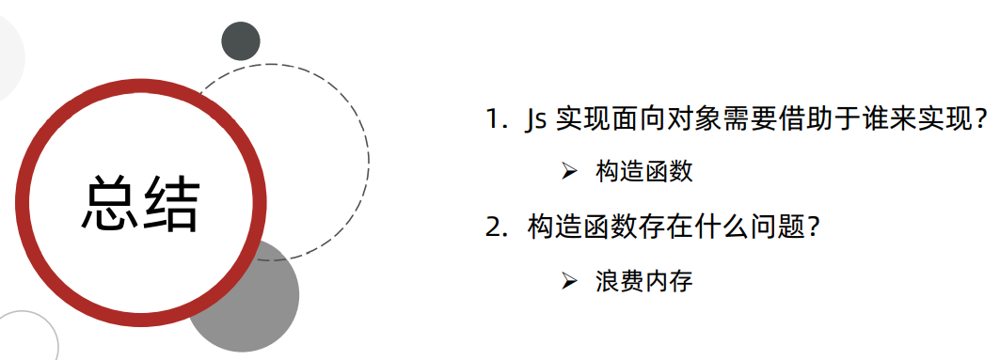

### 二：原型 prototype

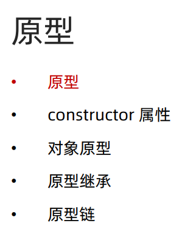

#### 2. 原型

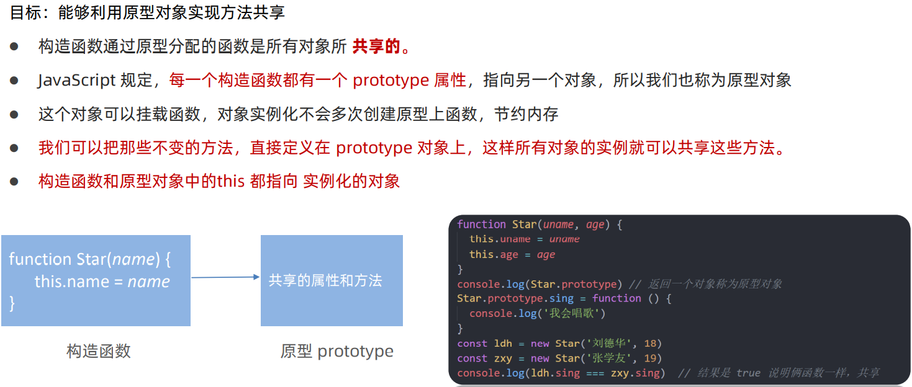

```js
    <script>
        // 原型： 字面意思 原始的模型，原始祖先
        // JS里： 原型就是一个对象，也叫原型对象
        // 原型对象： prototype
        // 1. 所有函数，都有一个prototype属性（显示原型），这个属性是一个指针，指向了原型对象.
        function Person() {}
        // dir : 产看一个对象的所有属性和方法
        console.dir(Person)

        //2. 原型对象默认有一个叫做 的属性， 指向了这个构造函数本身
        console.log(Person.prototype.constructor === Person)

        // Person.prototype 是一个对象

        // 3. 我们可以往这个原型对象上添加属性和方法
        //  所有通过构造函数创建的的实例， 都共享原型对象上包含的属性和方法

        function Star(name, age) {
            // 公共属性，写在函数里
            this.name = name
            this.age = age
        }
        // 公共方法写在原型上，节约内存
        Star.prototype.sing = function() {
            console.log('唱歌卡死')
        }
        // 原型上也可以添加属性
        Star.prototype.cheer = 'Every step count!'

        const ldh = new Star('刘德华', 18)
        const zjl = new Star('周杰伦', 14)
        console.log(ldh.__proto__ === Star.prototype) // true
    </script>
```

!(day03.assets/image-20220811190203809.png)

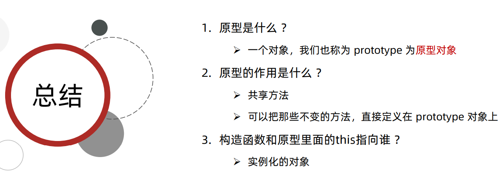

####  2.2 构造函数和原型中的this

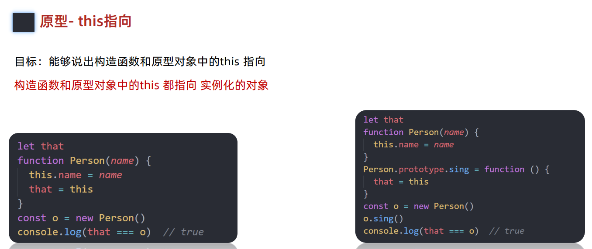

```js
    <script>

        // new的执行机制
        // 1. 在构造函数内创建一个空对象
        // 2. 让this指向这个空对象
        // 3. 执行构造函数里面的代码, 给这个对象添加属性和方法
        // 4. 返回这个对象 (return this)

        let that  // 全局变量
        function Star(name){
            this.name = name
            // that = this  // 执行构造函数的时候, 把this保存起来, 赋值给that
            // console.log(this) 
        }
        Star.prototype.sing = function(){
            console.log('唱歌')
            // console.log(this)
            that = this
        }

        const ldh = new Star('刘德华')
        ldh.sing()  // 谁调用, 指向谁
        console.log(that === ldh) // true

        

        // 结论:
        // 1. 构造函数里面的this, 指向的是实例(对象).

        // 2. 原型对象方法里面的this, 指向的还是实例(对象)

        // ==> 构造函数里的this和原型对象方法里的this, 都指向我们new出来的实例对象.
        
    </script>
```

#### 总结

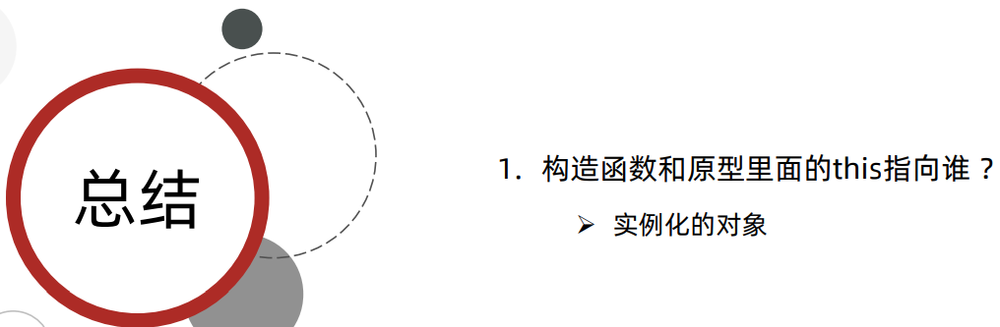

#### 2.3 constructor属性

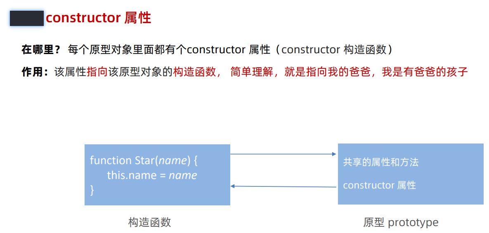

```js
    <script>
        // constructor  构造函数
        function Star(name, age){
            this.name = name 
            this.age = age
        }
        const ldh = new Star('刘德华', 20)

        console.dir(Star)  // 构造函数
        console.log(Star.prototype) // 原型
        

        // !这句背下来: 每个原型(对象)都有一个constructor属性, 指回构造函数本身.
        // 表示我, 我这个原型, 和哪个构造函数相关联, 是哪个构造函数的原型.

        // constructor 在原型上 在Star.prototype上
        console.log(Star.prototype.constructor === Star) // true

        ldh.__proto__ === Star.prototype  // ==> 都指向原型
        
    </script>
```

#### 2.4 constructor 的应用


```js
    <script>
        // ==> 每个原型对象都有一个constructor属性, 指回构造函数本身
        function Star(name, age){
            this.name = name 
            this.age = age
        }

        Star.prototype.sing = function(){
            console.log('唱歌')
        }
        Star.prototype.dance = function(){
            console.log('跳舞')
        }
        console.log(Star.prototype)

        // 直接把对象赋值给Star.prototype
        Star.prototype = {
            // 这个时候,constructor属性丢失了
            // 如果我们直接给原型对象赋值一个对象, 相当于整个替换了原型对象,
            // 这个时候,constructor属性丢失, 也就不知道这个原型是哪个构造函数的原型.
            // 所以,我们可以手动添加一个constructor属性, 指回原来的构造函数
            constructor:Star,
            sing: function(){
                console.log('唱歌')
            },
            dance: function(){
                console.log('跳舞')
            }
        }
       
        console.log(Star.prototype)


        let obj = {a:1, b:2}
        obj.c = 3
        console.log(obj)

        obj = {d: 4}
        console.log(obj)
    </script>
```

#### 总结

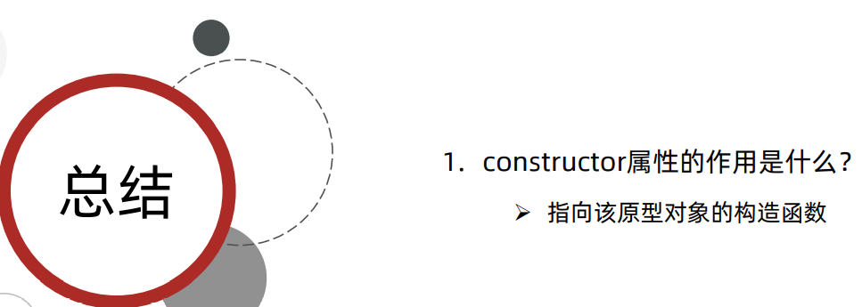

#### 2.5 ——proto——隐式原型

```js
    <script>
        function Star(name, age){
            this.name = name 
            this.age = age
        }

        Star.prototype.sing = function(){
            console.log('唱歌')
        }
        const ldh = new Star('刘德华', 18)
        console.log(ldh)
        // console.log(ldh.sing())

        // 方法属性的查找规则
        // 首先看 ldh 对象本身有没有sing这个方法, 如果有, 就执行这个对象上的sing方法.
        // 如果没有没有, 就会通过__proto__ 去实例的原型上查找. 
        

        // 1. __proto__ 隐式原型  [[prototype]]
        // 实例通过__proto__ 访问(链接)到它的原型对象 
        // 即 
        // ldh.__proto__ === Star.prototype 

        // 背下来:==> 每一个对象都默认有一个__proto__属性, 指向它的构造函数的prototype显示原型.
        // __proto__ 相当于是一个桥梁, 链接, 实例通过它访问原型对象. 


        //====================================================
        function Animal(color){
            this.color = color
        }

        const cat = new Animal('orange')
        console.log(cat.__proto__ === Animal.prototype) // true
        console.log(cat.__proto__)  // 得到的是原型
        console.log(Animal.prototype) // 得到的也是原型

        console.log(Animal.prototype.constructor === Animal)
        console.log(cat.__proto__.constructor === Animal)
         
        // 实例.__proto__ === 构造函数.prototype
    </script>
```

#### 2.6 构造函数-原型-实例之间的关系

```js
   <script>
        // 构造函数, 原型, 实例之间的关系 
        function Person(name){
            this.name = name 
        }
        const person = new Person()

        // 四条线:
        // 1. 构造函数 有一个prototype 属性, 指向原型(对象)
        // 2. 原型对象默认有一个constructor属性, 指向构造函数
        // (构造函数和原型 是相互指向)

        // 3. 构造函数通过 new 创建一个实例
        // 4. 实例通过__proto__访问到原型(对象)

        // 高程四(第八章P250):实例与原型之间有直接的联系(__proto__)，但实例与构造函数之间没有


    </script>
```

#### 2.7 原型链

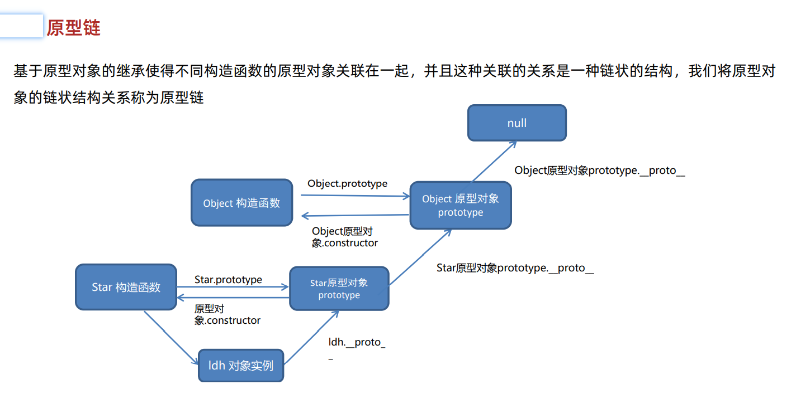

```js
    <script>

        function Person(name){
            this.name = name 
        }
        const person = new Person

        // 原型链
        // 1. Person.prototype也是一个对象, 所以, 它也有__proto__属性. (规则2)
        console.log(Person.prototype) // 原型对象
        // Person.prototype是一个对象, 那么 Person.prototype 这个对象的构造函数是谁呢?
        // Person.prototype这个对象的构造函数 ===> Object()  
        
        // 所有的对象, 都可以理解为是Object()这个构造函数创建的!
        // 所以: Person.prototype 的隐式原型 指向 它的构造函数的显示原型
        console.log(Person.prototype.__proto__ === Object.prototype) 

        // 2. Object.prototype 是什么, 是原型 , 是谁的原型 Object()构造函数的原型
        // 2.1 Object.prototype 原型, 默认有一个constructor属性, 指向构造函数Object
        // 2.2 Object构造函数通过 prototype 访问到这个原型 Object.prototype
        console.log(Person.prototype.__proto__ === Object.prototype) 

        // 也就是说 , 以下两个  都指向了 Object()这个构造函数的原型
        console.log(Object.prototype) 
        console.log(Person.prototype.__proto__)

        // 3. Object是构造函数嘛? 是, 所以Object也有prototype属性  (规则3)
        // Object.prototype 它是Object的原型对象. 所以Object.prototype有__proto__属性 (规则2)
        // 但是 Object.prototype.__proto__ 指向空 
        Object.prototype.__proto__  === null

        // 正常的原型链都会终止于 Object的原型对象. 
        // Object原型 的 原型 是 null
        // 我们说的原型, 可以说是构造函数的原型, 也可以说是实例的原型

        // (Object.prototype) ==> Object的原型
        // Object.prototype.__proto__ 能访问到它Object.prototype的原型 , null
        

        // obj.__proto__  === Object.prototype  obj的原型
        
    </script>
```

### 总结 背下来

```js
    <script>
        
        //==============背下来======================
        // 原型链: 
        // 每个对象通过__proto__属性都能访问到它的原型对象.原型对象也有它的原型对象.
        // 当访问一个对象的属性或方法时, 先在自身中寻找
        // 如果没有, 就会沿着__proto__这条链向上查找, 一直找到最顶层Object.prototype为止.

        // Object.prototype.__proto__ === null
        // ===================================================

        // 数组的原型链
        // arr --> Array.prototype --> Object.prototype --> null
        const arr = [1, 2, 3] 
        // const arr = new Array(1,2,3)

        // 函数的原型链     fn 相当于是 Function(){} 创建的
        const fn = function(){}
        // fn --> Function.prototype  --> Object.prototype --> null


    </script>
```

### 原型链规则

```js
// 语法糖
// const obj = {}   // const obj = new Object()
// const arr = []   // const arr = new Array()

//! 这五条规则, 理解记忆! 背下来

//! 1. 所有的引用类型（对象，数组，函数）， 都具有对象的特性， 可以自由扩展属性。
const obj = {}  // obj.a = 1 
const arr = []  // arr.b = 2
const fn = function(){}  // fn.c = 3

//! 2. 所有的对象， 都有一个__proto__属性(隐式原型)， 属性值是一个普通的对象。
// __proto__也叫作隐式原型  ---> 在浏览器里面 等同于 [[prototype]]
console.log(obj.__proto__)
console.log(arr.__proto__)
console.log(fn.__proto__)

//! 3. 所有的函数， 都有一个prototype属性， 属性值也是一个普通的对象
console.log(fn.prototype) // prototype 显式原型（原型对象） 

//! 4. 所有对象的隐式原型(__proto__)， 指向它的构造函数的显式原型(prototype)
obj.__proto__ === Object.prototype // true
arr.__proto__ === Array.prototype // true
fn.__proto__ === Function.prototype  // true

//! 5. 当试图得到对象的某个属性时， 如果这个对象本身没有这个属性， 那么会去它的__proto__中寻找。
function Star(name, age){
    this.name = name 
    this.age = age
    this.sayHi = function(){
        console.log('Hi~')
    }
}
Star.prototype.sex = '男'
const zjl = new Star('周杰伦', 18)
console.log(zjl)
console.log(zjl.sex)

zjl.__proto__ === Star.prototype // true
```


